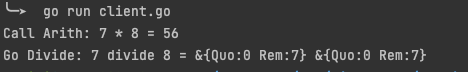
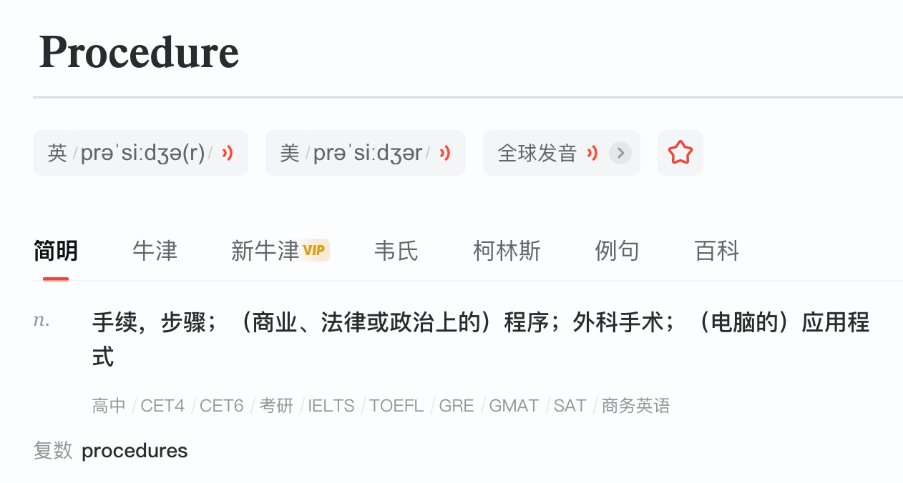
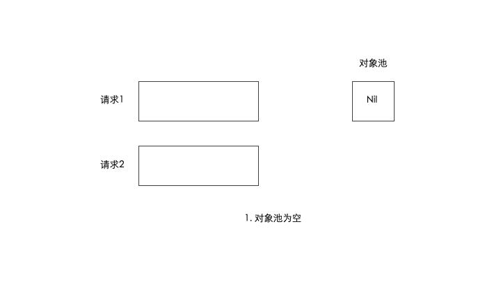
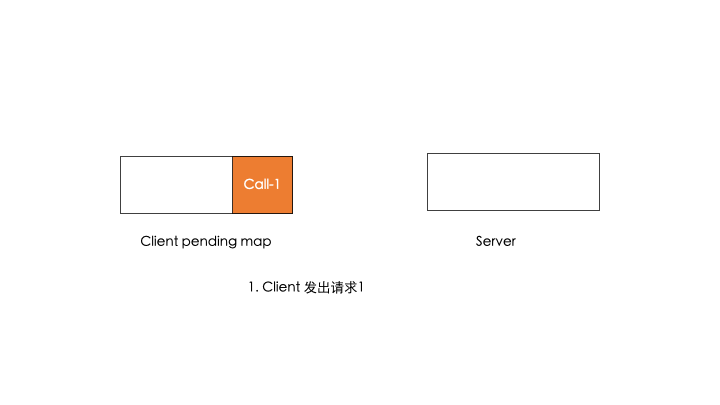

hello 大家好呀，我是小楼，这是系列文《Go底层原理剖析》的第三篇，依旧分析 Http 模块。我们今天来看 Go内置的 RPC。说起 RPC 大家想到的一般是框架，Go 作为编程语言竟然还内置了 RPC，着实让我有些吃鲸。


# 从一个 Demo 入手

为了快速进入状态，我们先搞一个 Demo，当然这个 Demo 是参考 Go 源码 `src/net/rpc/server.go`，做了一丢丢的修改。

- 首先定义请求的入参和出参：

```go
package common

type Args struct {
	A, B int
}

type Quotient struct {
	Quo, Rem int
}
```

- 接着在定义一个对象，并给这个对象写两个方法

```go
type Arith struct{}

func (t *Arith) Multiply(args *common.Args, reply *int) error {
	*reply = args.A * args.B
	return nil
}

func (t *Arith) Divide(args *common.Args, quo *common.Quotient) error {
	if args.B == 0 {
		return errors.New("divide by zero")
	}
	quo.Quo = args.A / args.B
	quo.Rem = args.A % args.B
	return nil
}
```

- 然后起一个 RPC  server：

```go
func main() {
	arith := new(Arith)
	rpc.Register(arith)
	rpc.HandleHTTP()
	l, e := net.Listen("tcp", ":9876")
	if e != nil {
		panic(e)
	}

	go http.Serve(l, nil)

	var wg sync.WaitGroup
	wg.Add(1)
	wg.Wait()
}
```

- 最后初始化 RPC Client，并发起调用：

```go
func main() {
	client, err := rpc.DialHTTP("tcp", "127.0.0.1:9876")
	if err != nil {
		panic(err)
	}

	args := common.Args{A: 7, B: 8}
	var reply int
  // 同步调用
	err = client.Call("Arith.Multiply", &args, &reply)
	if err != nil {
		panic(err)
	}
	fmt.Printf("Call Arith: %d * %d = %d\n", args.A, args.B, reply)

  // 异步调用
	quotient := new(common.Quotient)
	divCall := client.Go("Arith.Divide", args, quotient, nil)
	replyCall := <-divCall.Done

	fmt.Printf("Go Divide: %d divide %d = %+v %+v\n", args.A, args.B, replyCall.Reply, quotient)
}
```

如果不出意外，RPC 调用成功




# 这 RPC 吗

在剖析原理之前，我们先想想什么是 RPC？

RPC 是 Remote Procedure Call 的缩写，一般翻译为远程过程调用，不过我觉得这个翻译有点难懂，啥叫过程？如果查一下 Procedure，就能发现它就是应用程序的意思。




所以翻译过来应该是调用远程程序，说人话就是调用的方法不在本地，不能通过内存寻址找到，只能通过远程通信来调用。

一般来说 RPC 框架存在的意义是让你**调用远程方法像调用本地方法一样方便**，也就是将复杂的编解码、通信过程都封装起来，让代码写起来更简单。

说到这里其实我想吐槽一下，网上经常有文章说，既然有 Http，为什么还要有 RPC？如果你理解 RPC，我相信你不会问出这样的问题，他们是两个维度的东西，RPC 关注的是远程调用的封装，Http 是一种协议，RPC 没有规定通信协议，RPC 也可以使用 Http，这不矛盾。这种问法就好像在问既然有了苹果手机，为什么还要有中国移动？

扯远了，我们回头看一下上述的例子是否符合我们对 RPC 的定义。

- 首先是远程调用，我们是开了一个 Server，监听了9876端口，然后 Client 与之通信，将这两个程序部署在两台机器上，只要网络是通的，照样可以正常工作
- 其次它符合**调用远程方法像调用本地方法一样方便**，代码中没有处理编解码，也没有处理通信，只不过方法名以参数的形式传入，和一般的 RPC 稍有不同，倒是很像 Dubbo 的泛化调用

综上两点，这很 RPC。

下面我将用两段内容分别剖析 Go 内置的 RPC Server 与 Client 的原理，来看看 Go 是如何实现一个 RPC 的。

# RPC Server 原理

## 注册服务

这里的服务指的是一个具有公开方法的对象，比如上面 Demo 中的 `Arith`，只需要调用 Register 就能注册

```go
rpc.Register(arith)
```

注册完成了以下动作：

- 利用反射获取这个对象的类型、类名、值、以及公开方法
- 将其包装为 service 对象，并存在 server 的 serviceMap 中，serviceMap 的 key 默认为类名，比如这里是Arith，也可以调用另一个注册方法 `RegisterName` 来自定义名称

## 注册 Http Handle

这里你可能会问，为啥 RPC 要注册 Http Handle。没错，Go 内置的 RPC 通信是基于 Http 协议的，所以需要注册。只需要一行代码：

```go
rpc.HandleHTTP()
```

它调用的是 Http 的 Handle 方法，也就是 HandleFunc 的底层实现，这块如果不清楚，可以看我之前的文章[《一文读懂 Go Http Server 原理》](https://mp.weixin.qq.com/s/aLiqEuD9T8sERVrfGDSxvw)。

它注册了两个特殊的 Path：`/_goRPC_` 和 `/debug/rpc`，其中有一个是 Debug 专用，当然也可以自定义。

## 逻辑处理

注册时传入了 RPC 的 server 对象，这个对象必须实现 Handler 的 ServeHTTP 接口，也就是 RPC 的处理逻辑入口在这个 ServeHTTP 中：

```go
type Handler interface {
	ServeHTTP(ResponseWriter, *Request)
}
```

我们看 RPC Server 是如何实现这个接口的：

```go
// ServeHTTP implements an http.Handler that answers RPC requests.
func (server *Server) ServeHTTP(w http.ResponseWriter, req *http.Request) {
	// ①
  if req.Method != "CONNECT" {
		w.Header().Set("Content-Type", "text/plain; charset=utf-8")
		w.WriteHeader(http.StatusMethodNotAllowed)
		io.WriteString(w, "405 must CONNECT\n")
		return
	}
  // ②
	conn, _, err := w.(http.Hijacker).Hijack()
	if err != nil {
		log.Print("rpc hijacking ", req.RemoteAddr, ": ", err.Error())
		return
	}
  // ③
	io.WriteString(conn, "HTTP/1.0 "+connected+"\n\n")
	// ④
	server.ServeConn(conn)
}
```

我对这段代码标了号，逐一看：

- ①：限制了请求的 Method 必须是 CONNECT，如果不是则直接返回错误，这么做是为什么？看下 Method 字段的注释就恍然大悟：Go 的 Http Client 是发不出 CONNECT 的请求，也就是 RPC 的 Server 是没办法通过 Go 的 Http Client 访问，限制必须得使用 RPC Client

```go
type Request struct {
	// Method specifies the HTTP method (GET, POST, PUT, etc.).
	// For client requests, an empty string means GET.
	//
	// Go's HTTP client does not support sending a request with
	// the CONNECT method. See the documentation on Transport for
	// details.
	Method string
}
```


- ②：Hijack 是劫持 Http 的连接，劫持后需要手动处理连接的关闭，这个操作是为了复用连接
- ③：先写一行响应：

```go
"HTTP/1.0 200 Connected to Go RPC \n\n"
```

- ④：开始真正的处理，这里段比较长，大致做了如下几点事情：

    - 准备好数据、编解码器
    - 在一个大循环里处理每一个请求，处理流程是：
        - 读出请求，包括要调用的service，参数等
        - 通过反射异步地调用对应的方法
        - 将执行结果编码写回连接

说到这里，代码中有个对象池的设计挺巧妙，这里展开说说。


在高并发下，Server 端的 Request 对象和 Response 对象会频繁地创建，这里用了队列来实现了对象池。以 Request 对象池做个介绍，在 Server 对象中有一个 Request 指针，Request 中有个 next 指针

```go
type Server struct {
	...
	freeReq    *Request
	..
}

type Request struct {
	ServiceMethod string 
	Seq           uint64
	next          *Request
}
```

在读取请求时需要这个对象，如果池中没有对象，则 new 一个出来，有的话就拿到，并将 Server 中的指针指向 next：

```go
func (server *Server) getRequest() *Request {
	server.reqLock.Lock()
	req := server.freeReq
	if req == nil {
		req = new(Request)
	} else {
		server.freeReq = req.next
		*req = Request{}
	}
	server.reqLock.Unlock()
	return req
}
```

请求处理完成时，释放这个对象，插入到链表的头部

```go
func (server *Server) freeRequest(req *Request) {
	server.reqLock.Lock()
	req.next = server.freeReq
	server.freeReq = req
	server.reqLock.Unlock()
}
```

画个图整体感受下：



回到正题，Client 和 Server 之间只有一条连接，如果是异步执行，怎么保证返回的数据是正确的呢？这里先不说，如果一次性说完了，下一节的 Client 就没啥可说的了，你说是吧？


# RPC Client 原理

Client 使用第一步是 New 一个 Client 对象，在这一步，它偷偷起了一个协程，干什么呢？用来读取 Server 端的返回，这也是 Go 惯用的伎俩。

每一次 Client 的调用都被封装为一个 Call 对象，包含了调用的方法、参数、响应、错误、是否完成。

同时 Client 对象有一个 pending map，key 为请求的递增序号，当 Client 发起调用时，将序号自增，并把当前的 Call 对象放到 pending map 中，然后再向连接写入请求。

写入的请求先后分别为 Request 和参数，可以理解为 header 和 body，其中 Request 就包含了 Client 的请求自增序号。

Server 端响应时把这个序号带回去，Client 接收响应时读出返回数据，再去 pending map 里找到对应的请求，通知给对应的阻塞协程。

这不就能把请求和响应串到一起了吗？这一招很多 RPC 框架也是这么玩的。




Client 、Server 流程都走完，但我们忽略了编解码细节，Go RPC 默认使用 gob 编解码器，这里也稍微介绍下 gob。

## gob 编解码

gob 是 Go 实现的一个 Go 亲和的协议，可以简单理解这个协议只能在 Go 中用。Go Client RPC 对编解码接口的定义如下：

```go
type ClientCodec interface {
	WriteRequest(*Request, interface{}) error
	ReadResponseHeader(*Response) error
	ReadResponseBody(interface{}) error

	Close() error
}
```

同理，Server 端也有一个定义：

```go
type ServerCodec interface {
	ReadRequestHeader(*Request) error
	ReadRequestBody(interface{}) error
	WriteResponse(*Response, interface{}) error
  
	Close() error
}
```

gob 是其一个实现，这里只看 Client：

```go
func (c *gobClientCodec) WriteRequest(r *Request, body interface{}) (err error) {
	if err = c.enc.Encode(r); err != nil {
		return
	}
	if err = c.enc.Encode(body); err != nil {
		return
	}
	return c.encBuf.Flush()
}

func (c *gobClientCodec) ReadResponseHeader(r *Response) error {
	return c.dec.Decode(r)
}

func (c *gobClientCodec) ReadResponseBody(body interface{}) error {
	return c.dec.Decode(body)
}
```

追踪到底层就是 Encoder 的 EncodeValue 和 DecodeValue 方法，Encode 的细节我不打算写，因为我也不想看这一块，最终结果就是把结构体编码成了二进制数据，调用 writeMessage。

# 总结

本文介绍了 Go 内置的 RPC Client 和 Server 端原理，能窥探出一点点 RPC 的设计，如果让你实现一个 RPC 是不是有些可以参考呢？

本来草稿中贴了很多代码，但我觉得那样解读很难读下去，于是就删了又删。

不过还有一点是我想写但没有写出来的，本文只讲了 Go 内置 RPC 是什么，怎么实现的，至于它的优缺点，能不能在生产中使用，倒是没有讲，下次写一篇文章专门讲一下，有兴趣可以持续关注，我们下期再见，欢迎转发、收藏、点赞。

# 往期回顾
- [《有趣的 Go HttpClient 超时机制》](https://mp.weixin.qq.com/s/HPzoclfCB3UxLScXm4J83w)
- [《一文读懂 Go Http Server 原理》](https://mp.weixin.qq.com/s/aLiqEuD9T8sERVrfGDSxvw)

> - 搜索关注微信公众号"捉虫大师"，后端技术分享，架构设计、性能优化、源码阅读、问题排查、踩坑实践