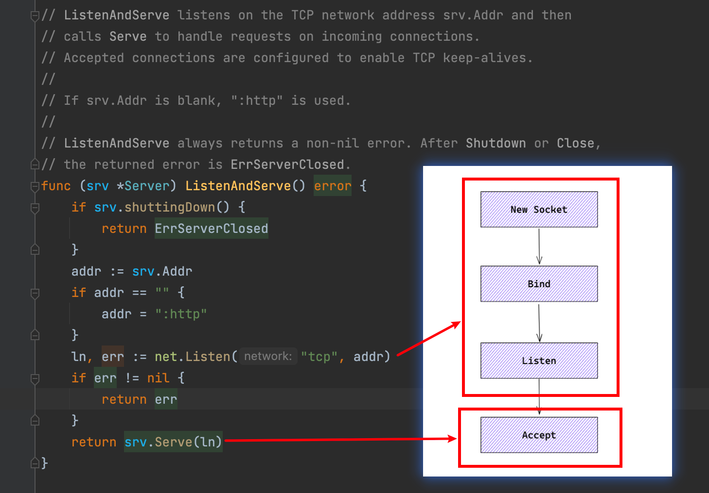

hello大家好呀，我是小楼，这是系列文《Go底层原理剖析》的第二篇，依旧是分析 Http 模块，话不多说，开始。


# 从一个 Demo 入手

俗话说万事开头难，但用 Go 实现一个 Http Server 真不难，简单到什么程度？起一个 Server，并且能响应请求，算上包名、导入的依赖，甚至空行，也就只要 15 行代码：

```go
package main

import (
	"io"
	"net/http"
)

func main() {
	http.HandleFunc("/hello", hello)
	http.ListenAndServe(":81", nil)
}

func hello(response http.ResponseWriter, request *http.Request) {
	io.WriteString(response, "hello world")
}
```

这么简单，能与之一战的恐怕只有 Python 了吧，而且 Go 还能编译成可执行的二进制文件，你说牛啤不牛啤？


# Http Server 如何处理连接？

我们从这一行代码看起

```go
http.ListenAndServe(":81", nil)
```

从命名来看，这个方法干了两件事，监听并且服务，从方法的单一职责上来说，我觉得不ok，一个方法怎么能干两件事？但这是大佬写的代码，就很合理。


第一个参数`Addr`是要监听的地址和端口，第二个参数`Handler`一般是`nil`，它是真正的逻辑处理，但我们通常用第一行代码那样来注册处理器，这代码一看就感觉是把 path 映射到业务逻辑上，我们先大概了解，待会再来看它

```go
http.HandleFunc("/hello", hello)
```

如果了解过一点网络编程基础，就会知道操作系统提供了`bind`、`listen`、`accept`这样的系统调用，我们只要按顺序发起调用，就能组合出一个 Server。

Go 也是利用这些系统调用，把他们都封装在了`ListenAndServe`中。



`Listen` 往下追究就是系统调用，所以我们重点看 `Serve`：


把分支代码收起来，只看主干，发现是一个 for 循环里面在不停地 Accept，而这个 Accept 在没有连接时是阻塞的，当有连接时，起一个新的协程来处理。

# Http Server 如何处理请求的？

## 一些前置工作

处理请求的一行代码是，可以看出是每个连接单开了一个协程处理：

```go
go c.serve(connCtx)
```

这里的 connCtx 代入了当前的 Server 对象：

```go
ctx := context.WithValue(baseCtx, ServerContextKey, srv)
...
connCtx := ctx
```

而且还提供了修改它的 hook 方法 `srv.ConnContext`，可以在每次 Accept 时修改原始的 context

```go
if cc := srv.ConnContext; cc != nil {
	connCtx = cc(connCtx, rw)
	if connCtx == nil {
		panic("ConnContext returned nil")
	}
}
```

它的定义是：

```go
// ConnContext optionally specifies a function that modifies
// the context used for a new connection c. The provided ctx
// is derived from the base context and has a ServerContextKey
// value.
ConnContext func(ctx context.Context, c net.Conn) context.Context
```

但是如果按照我开头给的代码，你是没法修改 `srv.ConnContext` 的，可以改成这样来自定义：

```go
func main() {
	http.HandleFunc("/hello", hello)
	server := http.Server{
		Addr: ":81",
		ConnContext: func(ctx context.Context, c net.Conn) context.Context {
			return context.WithValue(ctx, "hello", "roshi")
		},
	}
	server.ListenAndServe()
}
```

同样的 `c.setState` 也提供了 hook，可采取如上的方法设置，在每次连接状态改变时执行 hook 方法：

```go
c.setState(c.rwc, StateNew, runHooks) // before Serve can return
```

```go
// ConnState specifies an optional callback function that is
// called when a client connection changes state. See the
// ConnState type and associated constants for details.
ConnState func(net.Conn, ConnState)
```

## 开始真正干活

为了能看清楚 Accept 后，serve 方法到底干了什么，我们再简化一下：

```go
func (c *conn) serve(ctx context.Context) {
	...
	for {
		w, err := c.readRequest(ctx)
		...
		serverHandler{c.server}.ServeHTTP(w, w.req)
		...
	}
}
```

serve 也是一个大循环，循环里面主要是读取一个请求，然后将请求交给 Handler 处理。

为什么是一个大循环呢？因为每个 serve 处理的是一个连接，一个连接可以有多次请求。

读请求就显得比较枯燥乏味，按照Http协议，读出URL，header，body等信息。

这里有个细节是在每次读取了一个请求后，还开了一个协程去读下一个请求，也算是做了优化吧。

```go
for {
	w, err := c.readRequest(ctx)
	...

	if requestBodyRemains(req.Body) {
		registerOnHitEOF(req.Body, w.conn.r.startBackgroundRead)
	} else {
		w.conn.r.startBackgroundRead()
	}
	...
}
```

## 请求如何路由？

当读取到一个请求后，便进入这一行代码：

```go
serverHandler{c.server}.ServeHTTP(w, w.req)
```

ServeHTTP 找到我们注册的 Handler 去处理，如果请求的URI 是 `*`或请求 Method 是 `OPTIONS`，则使用globalOptionsHandler，也就是说这类请求不需要我们手动处理，直接就返回了。

对于我们注册的 Handler 也需要去寻找路由，这个路由的规则还是比较简单，主要由如下三条：

- 如果注册了带 host 的路由，则按 host + path 去寻找，如果没注册带 host 的路由，则按 path 寻找
- 路由规则匹配以完全匹配优先，如果注册的路由规则最后一个字符是`/`，则除了完全匹配外，还会以前缀查找

举几个例子来理解一下：

- 带 host 的匹配规则

注册路由为

```go
http.HandleFunc("/hello", hello)
http.HandleFunc("127.0.0.1/hello", hello2)
```

此时如果执行

```go
curl 'http://127.0.0.1:81/hello'
```

则会匹配到 hello2，但如果执行

```go
curl 'http://localhost:81/hello'
```

就匹配的是 hello

- 前缀匹配

如果注册路由为

```go
http.HandleFunc("/hello", hello)
http.HandleFunc("127.0.0.1/hello/", hello2)
```

注意第二个最后还有个`/`，此时如果执行

```go
curl 'http://127.0.0.1:81/hello/roshi'
```

也能匹配到 hello2，怎么样，是不是理解了？

找到路由之后就直接调用我们开头注册的方法，如果我们往 Response 中写入数据，就能返回给客户端，这样一个请求就处理完成了。

# 总结

最后我们回忆下 Go Http Server 的要点：

- 用 Go 起一个 Http Server 非常简单
- Go Http Server 本质是一个大循环，每当有一个新连接时，会起一个新的协程来处理
- 每个连接的处理也是一个大循环，这个循环里做了读取请求、寻找路由、执行逻辑三件大事


感谢能抽空看到这里，如果你能`点赞`、`在看`、`分享`，我会更加感激不尽~