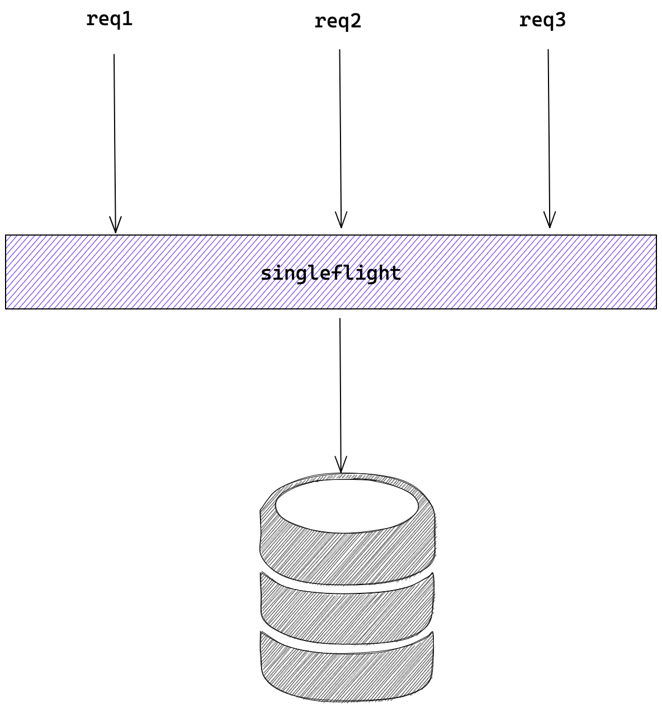
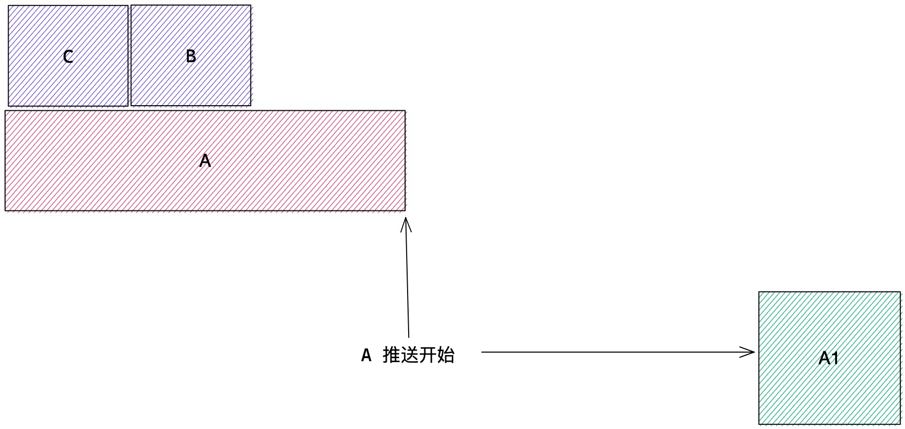
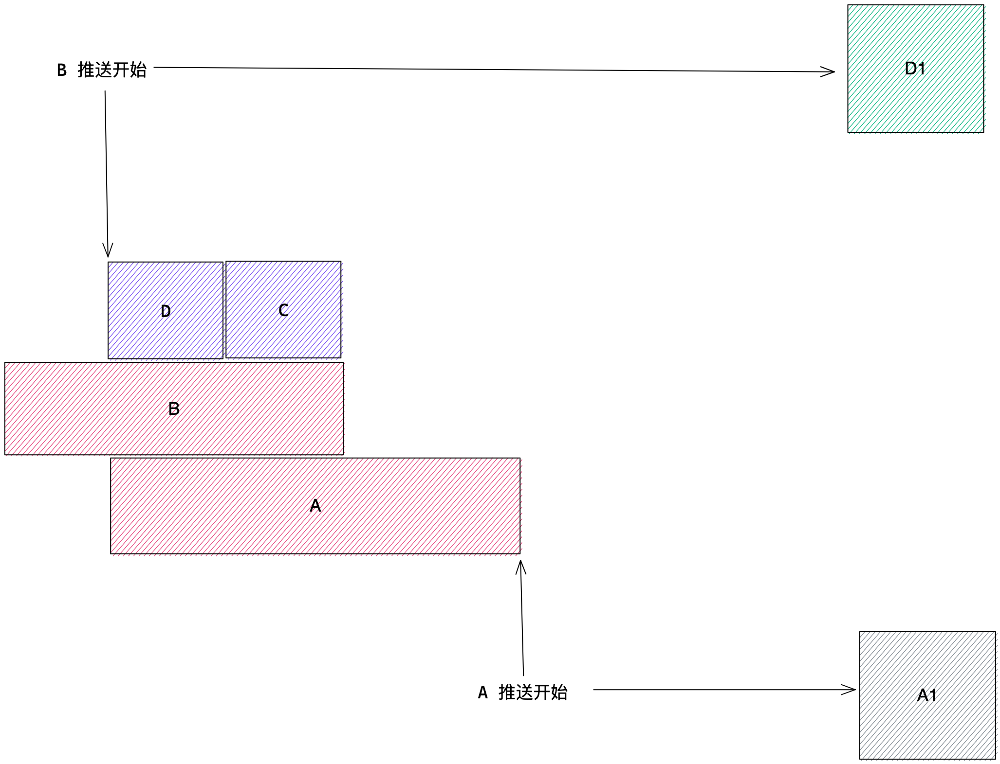

hello，大家好啊，我是小楼。

最近在工作中对 Go 的 singleflight 包做了下增强，解决了一个性能问题，这里记录下，希望对你也有所帮助。

# singleflight 是什么

singleflight 直接翻译为”单（次）飞（行）“，它是对同一种请求的抑制，保证同一时刻相同的请求只有一个在执行，且在它执行期间的相同请求都会 Hold 直到执行完成，这些 hold 的请求也使用这次执行的结果。

举个例子，当程序中有读（如 Redis、MySQL、Http、RPC等）请求，且并发非常高的情况，使用 singleflight 能得到比较好的效果，它限制了同一时刻只有一个请求在执行，也就是并发永远为1。



# singleflight 的原理

最初 singleflight 出现在 groupcache 项目中，这个项目也是 Go 团队所写，后来该包被移到 Go 源码中，在 Go 源码中的版本经过几轮迭代，稍微有点复杂，我们以最原始的源码来讲解原理，更方便地看清本质。

> https://github.com/golang/groupcache/blob/master/singleflight/singleflight.go

singleflight 把每次请求定义为 call，每个 call 对象包含了一个 waitGroup，一个 val，即请求的返回值，一个 err，即请求返回的错误。

```go
type call struct {
	wg  sync.WaitGroup
	val interface{}
	err error
}
```

再定义全局的 Group，包含一个互斥锁 Mutex，一个 key 为 string，value 为 call 的 map。

```go
type Group struct {
	mu sync.Mutex       
	m  map[string]*call
}
```

Group 对象有一个 Do 方法，其第一个参数是 string 类型的 key，这个 key 也就是上面说的 map 的 key，相同的 key 标志着他们是相同的请求，只有相同的请求会被抑制；第二个参数是一个函数 fn，这个函数是真正要执行的函数，例如调用 MySQL；返回值比较好理解，即最终调用的返回值和错误信息。

```go
func (g *Group) Do(key string, fn func() (interface{}, error)) (interface{}, error) {
	// ①
  g.mu.Lock()
	if g.m == nil {
		g.m = make(map[string]*call)
	}
  // ②
	if c, ok := g.m[key]; ok {
		g.mu.Unlock()
		c.wg.Wait()
		return c.val, c.err
	}
  // ③
	c := new(call)
	c.wg.Add(1)
	g.m[key] = c
	g.mu.Unlock()

	c.val, c.err = fn()
	c.wg.Done()

	g.mu.Lock()
	delete(g.m, key)
	g.mu.Unlock()

	return c.val, c.err
}
```

将整个代码分成三块：

- ① 懒加载方式初始化 map；
- ② 如果当前 key 存在，即相同请求正在调用中，就等它完成，完成后直接使用它的 value 和 error；
- ③ 如果当前 key 不存在，即没有相同请求正在调用中，就创建一个 call 对象，并把它放进 map，接着执行 fn 函数，当函数执行完唤醒 waitGroup，并删除 map 相应的 key，返回 value 和 error。

# 读可以抑制，写呢？

我们通过上面的介绍能了解，singleflight 能解决并发读的问题，但我又遇到一个并发写的问题。为了能让大家快速进入状态，先花一点篇幅描述一下遇到的实际问题：

微服务中的注册中心想必大家都有所了解，如果不了解，可以去查查相关概念，或者翻看我以前的文章，老读者应该能发现我写了很多相关的文章。

服务提供方在注册之后，会将变更事件推送到消费方，推送事件的处理流程是：接收到事件，查询组装出最新的数据，然后推送给订阅者。存在两种情况可能会导致短时间内注册请求非常多，推送事件多会影响整个注册中心的性能：

- 接口级注册（类似 Dubbo），每台机器会注册N多次
- 服务并发发布，例如每次发布重启100台机器，那么注册的并发就可能是100

拿到这种问题，第一想到的解法是：合并推送。但，怎么合并呢？

是不是每次推送的时候等一等，等事件都来了再一把推过去就可以了？但等多久呢？什么时候该等呢？粗暴点，每秒钟推送一次，这样就能将一秒内的时间都聚合，但这会影响推送的时效性，显然不符合我们精益求精的要求。

## 直接使用 singleflight，能行吗？

套用上面 singleflight ，在第一个事件推送过程中，其他相同的事件被 Hold 住，等第一个事件推送完成后，这些 Hold 的事件不再执行推送直接返回。

稍微想一下就知道这样是有问题的，假设有三个事件 A、B、C，分别对应到三个版本的数据A1、B1、C1，A 最先到达，在 A 开始推送后但没完成时 B、C 事件到达，A 事件触发推送了 A1 版本的数据，B、C 事件在 A 事件推送完成后，直接丢弃，最终推送到消费者上的数据版本为 A1，但我们肯定期望推送的数据版本为 C1，画个图线感受下：



## 增强一点点 🤏🏻

假设有事件 A、B、C、D 先后到达，A 事件仍然先正常执行推送，在 A 事件推送的时候，B、C、D 事件 Hlod 住，当 A 事件推送完成后，B 事件开始推送，B 事件将把 A 事件推送时期积攒的事件都一起推送掉，即 B、C、D 一次性推送完成。



## 增强代码参考

增强的定义为 WriteGroup，借用 singleflight 原先的实现，具体代码就不必解读了，对照上面的例子应该很好理解。

```go
package singleflight

import (
	"sync"
)

type WriteGroup struct {
	mu    sync.Mutex
	wgs   map[string]*sync.WaitGroup
	group Group
}

func (g *WriteGroup) Do(key string, fn func() error) error {
	g.mu.Lock()
	if g.wgs == nil {
		g.wgs = make(map[string]*sync.WaitGroup)
	}
	wg, ok := g.wgs[key]
	if !ok {
		wg = &sync.WaitGroup{}
		wg.Add(1)
		g.wgs[key] = wg
	}
	g.mu.Unlock()

	if !ok {
		err := fn()

		g.mu.Lock()
		wg.Done()
		delete(g.wgs, key)
		g.mu.Unlock()
		return err
	}

	wg.Wait()
	_, err := g.group.Do(key, func() (interface{}, error) {
		return nil, fn()
	})
	return err
}
```

## 效果如何？

理论上，如果没有并发，事件和以前一样推送，没有合并，当然这也没毛病。当并发大于 2 时，开始发挥威力。在实际的压测上，注册并发 1500 时，合并的事件达到 99.9%，效果相当炸裂！

**最后**感谢能抽空看到这里，如果你能`点赞`、`在看`、`分享`，我会更加感激不尽~