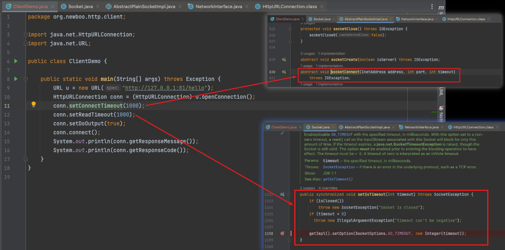
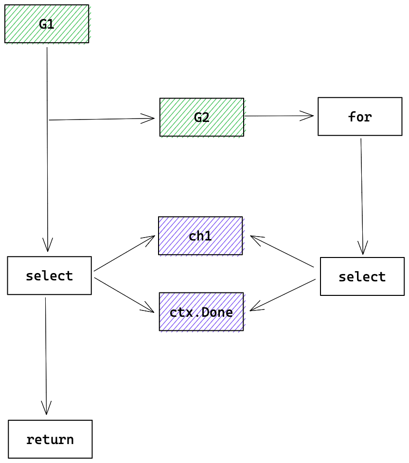

hello，大家好呀，我是既写 Java 又写 Go 的小楼，在写 Go 的过程中经常对比这两种语言的特性，踩了不少坑，也发现了不少有意思的地方，今天就来聊聊 Go 自带的 HttpClient 的超时机制。

# Java HttpClient 超时底层原理

在介绍 Go 的 HttpClient 超时机制之前，我们先看看 Java 是如何实现超时的。

写一个 Java 原生的 HttpClient，设置连接超时、读取超时时间分别对应到底层的方法分别是：



再追溯到 JVM 源码，发现是对系统调用的封装，其实不光是 Java，大部分的编程语言都借助了操作系统提供的超时能力。

然而 Go 的 HttpClient 却提供了另一种超时机制，挺有意思，我们来盘一盘。但在开始之前，我们先了解一下 Go 的 Context。

# Go Context 简介

## Context 是什么？

根据 Go 源码的注释：

> // A Context carries a deadline, a cancellation signal, and other values across
> // API boundaries.
> // Context's methods may be called by multiple goroutines simultaneously.

Context 简单来说是一个可以携带超时时间、取消信号和其他数据的接口，Context 的方法会被多个协程同时调用。

Context 有点类似 Java 的ThreadLocal，可以在线程中传递数据，但又不完全相同，它是显示传递，ThreadLocal 是隐式传递，除了传递数据之外，Context 还能携带超时时间、取消信号。

Context 只是定义了接口，具体的实现在 Go 中提供了几个：

- Background ：空的实现，啥也没做
- TODO：还不知道用什么 Context，先用 TODO 代替，也是啥也没做的空 Context
- cancelCtx：可以取消的 Context
- timerCtx：主动超时的 Context

针对 Context 的三个特性，可以通过 Go 提供的 Context 实现以及源码中的例子来进一步了解下。

## Context 三个特性例子

这部分的例子来源于 Go 的源码，位于 `src/context/example_test.go`

### 携带数据

使用 `context.WithValue` 来携带，使用  `Value` 来取值，源码中的例子如下：

```go
// 来自 src/context/example_test.go
func ExampleWithValue() {
	type favContextKey string

	f := func(ctx context.Context, k favContextKey) {
		if v := ctx.Value(k); v != nil {
			fmt.Println("found value:", v)
			return
		}
		fmt.Println("key not found:", k)
	}

	k := favContextKey("language")
	ctx := context.WithValue(context.Background(), k, "Go")

	f(ctx, k)
	f(ctx, favContextKey("color"))

	// Output:
	// found value: Go
	// key not found: color
}
```

### 取消

先起一个协程执行一个死循环，不停地往 channel 中写数据，同时监听 `ctx.Done()` 的事件

```go
// 来自 src/context/example_test.go
gen := func(ctx context.Context) <-chan int {
		dst := make(chan int)
		n := 1
		go func() {
			for {
				select {
				case <-ctx.Done():
					return // returning not to leak the goroutine
				case dst <- n:
					n++
				}
			}
		}()
		return dst
	}
```

然后通过 `context.WithCancel` 生成一个可取消的 Context，传入 `gen` 方法，直到 `gen` 返回 5 时，调用 `cancel` 取消 `gen` 方法的执行。

```go
// 来自 src/context/example_test.go
ctx, cancel := context.WithCancel(context.Background())
defer cancel() // cancel when we are finished consuming integers

for n := range gen(ctx) {
	fmt.Println(n)
	if n == 5 {
		break
	}
}
// Output:
// 1
// 2
// 3
// 4
// 5
```

这么看起来，可以简单理解为在一个协程的循环中埋入结束标志，另一个协程去设置这个结束标志。

### 超时

有了 cancel 的铺垫，超时就好理解了，cancel 是手动取消，超时是自动取消，只要起一个定时的协程，到时间后执行 cancel 即可。

设置超时时间有2种方式：`context.WithTimeout` 与 `context.WithDeadline`，WithTimeout 是设置一段时间后，WithDeadline 是设置一个截止时间点，WithTimeout 最终也会转换为 WithDeadline。

```go
// 来自 src/context/example_test.go
func ExampleWithTimeout() {
	// Pass a context with a timeout to tell a blocking function that it
	// should abandon its work after the timeout elapses.
	ctx, cancel := context.WithTimeout(context.Background(), shortDuration)
	defer cancel()

	select {
	case <-time.After(1 * time.Second):
		fmt.Println("overslept")
	case <-ctx.Done():
		fmt.Println(ctx.Err()) // prints "context deadline exceeded"
	}

	// Output:
	// context deadline exceeded
}
```

# Go HttpClient 的另一种超时机制

基于 Context 可以设置任意代码段执行的超时机制，就可以设计一种脱离操作系统能力的请求超时能力。

## 超时机制简介

看一下 Go 的 HttpClient 超时配置说明：

```go
	client := http.Client{
		Timeout: 10 * time.Second,
	}
	
	// 来自 src/net/http/client.go
	type Client struct {
	// ... 省略其他字段
	// Timeout specifies a time limit for requests made by this
	// Client. The timeout includes connection time, any
	// redirects, and reading the response body. The timer remains
	// running after Get, Head, Post, or Do return and will
	// interrupt reading of the Response.Body.
	//
	// A Timeout of zero means no timeout.
	//
	// The Client cancels requests to the underlying Transport
	// as if the Request's Context ended.
	//
	// For compatibility, the Client will also use the deprecated
	// CancelRequest method on Transport if found. New
	// RoundTripper implementations should use the Request's Context
	// for cancellation instead of implementing CancelRequest.
	Timeout time.Duration
}
```

翻译一下注释：`Timeout` 包括了连接、redirect、读取数据的时间，定时器会在 Timeout 时间后打断数据的读取，设为0则没有超时限制。

也就是说这个超时是一个请求的**总体超时时间**，而不必再分别去设置连接超时、读取超时等等。

这对于使用者来说可能是一个更好的选择，大部分场景，使用者不必关心到底是哪部分导致的超时，而只是想这个 HTTP 请求整体什么时候能返回。

## 超时机制底层原理

以一个最简单的例子来阐述超时机制的底层原理。

这里我起了一个本地服务，用 Go HttpClient 去请求，超时时间设置为 10 分钟，建议使 Debug 时设置长一点，否则可能超时导致无法走完全流程。

```go
	client := http.Client{
		Timeout: 10 * time.Minute,
	}
	resp, err := client.Get("http://127.0.0.1:81/hello")
```

### 1. 根据 timeout 计算出超时的时间点

```go
// 来自 src/net/http/client.go
deadline = c.deadline()
```

### 2. 设置请求的 cancel

```go
// 来自 src/net/http/client.go
stopTimer, didTimeout := setRequestCancel(req, rt, deadline)
```

这里返回的 stopTimer 就是可以手动 cancel 的方法，didTimeout 是判断是否超时的方法。这两个可以理解为回调方法，调用 stopTimer() 可以手动 cancel，调用 didTimeout() 可以返回是否超时。

设置的主要代码其实就是将请求的 Context 替换为 cancelCtx，后续所有的操作都将携带这个 cancelCtx：

```go
// 来自 src/net/http/client.go
var cancelCtx func()
if oldCtx := req.Context(); timeBeforeContextDeadline(deadline, oldCtx) {
	req.ctx, cancelCtx = context.WithDeadline(oldCtx, deadline)
}
```

同时，再起一个定时器，当超时时间到了之后，将 timedOut 设置为 true，再调用 doCancel()，doCancel() 是调用真正 RoundTripper （代表一个 HTTP 请求事务）的 CancelRequest，也就是取消请求，这个跟实现有关。

```go
// 来自 src/net/http/client.go
timer := time.NewTimer(time.Until(deadline))
var timedOut atomicBool

go func() {
	select {
	case <-initialReqCancel:
		doCancel()
		timer.Stop()
	case <-timer.C:
		timedOut.setTrue()
		doCancel()
	case <-stopTimerCh:
		timer.Stop()
	}
}()
```

Go 默认 RoundTripper CancelRequest 实现是关闭这个连接

```go
// 位于 src/net/http/transport.go
// CancelRequest cancels an in-flight request by closing its connection.
// CancelRequest should only be called after RoundTrip has returned.
func (t *Transport) CancelRequest(req *Request) {
	t.cancelRequest(cancelKey{req}, errRequestCanceled)
}
```

### 3. 获取连接

```go
// 位于 src/net/http/transport.go
for {
	select {
	case <-ctx.Done():
		req.closeBody()
		return nil, ctx.Err()
	default:
	}

	// ...
	pconn, err := t.getConn(treq, cm)
	// ...
}
```

代码的开头监听 ctx.Done，如果超时则直接返回，使用 for 循环主要是为了请求的重试。

后续的 getConn 是阻塞的，代码比较长，挑重点说，先看看有没有空闲连接，如果有则直接返回

```go
// 位于 src/net/http/transport.go
// Queue for idle connection.
if delivered := t.queueForIdleConn(w); delivered {
	// ...
	return pc, nil
}
```

如果没有空闲连接，起个协程去异步建立，建立成功再通知主协程

```go
// 位于 src/net/http/transport.go
// Queue for permission to dial.
t.queueForDial(w)
```

再接着是一个 select 等待连接建立成功、超时或者主动取消，这就实现了在连接过程中的超时

```go
// 位于 src/net/http/transport.go
// Wait for completion or cancellation.
select {
case <-w.ready:
	// ...
	return w.pc, w.err
case <-req.Cancel:
	return nil, errRequestCanceledConn
case <-req.Context().Done():
	return nil, req.Context().Err()
case err := <-cancelc:
	if err == errRequestCanceled {
		err = errRequestCanceledConn
	}
	return nil, err
}
```

### 4. 读写数据

在上一条连接建立的时候，每个链接还偷偷起了两个协程，一个负责往连接中写入数据，另一个负责读数据，他们都监听了相应的 channel。

```go
// 位于 src/net/http/transport.go
go pconn.readLoop()
go pconn.writeLoop()
```

其中 wirteLoop 监听来自主协程的数据，并往连接中写入

```go
// 位于 src/net/http/transport.go
func (pc *persistConn) writeLoop() {
	defer close(pc.writeLoopDone)
	for {
		select {
		case wr := <-pc.writech:
			startBytesWritten := pc.nwrite
			err := wr.req.Request.write(pc.bw, pc.isProxy, wr.req.extra, pc.waitForContinue(wr.continueCh))
			// ... 
			if err != nil {
				pc.close(err)
				return
			}
		case <-pc.closech:
			return
		}
	}
}
```

同理，readLoop 读取响应数据，并写回主协程。读与写的过程中如果超时了，连接将被关闭，报错退出。

## 超时机制小结

Go 的这种请求超时机制，可随时终止请求，可设置整个请求的超时时间。其实现主要依赖协程、channel、select 机制的配合。总结出套路是：

- 主协程生成 cancelCtx，传递给子协程，主协程与子协程之间用 channel 通信
- 主协程 select channel 和 cancelCtx.Done，子协程完成或取消则 return
- 循环任务：子协程起一个循环处理，每次循环开始都 select cancelCtx.Done，如果完成或取消则退出
- 阻塞任务：子协程 select 阻塞任务与 cancelCtx.Done，阻塞任务处理完或取消则退出

> 以循环任务为例



## Java 能实现这种超时机制吗

直接说结论：暂时不行。

首先 Java 的线程太重，像 Go 这样一次请求开了这么多协程，换成线程性能会大打折扣。

其次 Go 的 channel 虽然和 Java 的阻塞队列类似，但 Go 的 select 是多路复用机制，Java 暂时无法实现，即无法监听多个队列是否有数据到达。所以综合来看 Java 暂时无法实现类似机制。

# 总结

本文介绍了 Go 另类且有趣的 HTTP 超时机制，并且分析了底层实现原理，归纳出了这种机制的套路，如果我们写 Go 代码，也可以如此模仿，让代码更 Go。这期是我写的 Go 底层原理第一期，求个 `赞`、`在看`、`分享`，我们下期再见。