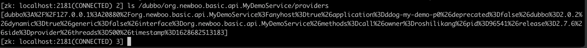
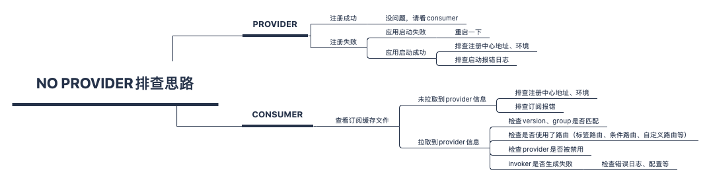

> 不想看字的同学可直接划到底部查看思维导图

# 问题分析

使用过Dubbo的朋友很多都碰到过如下报错：

> No provider available for the service org.newboo.basic.api.MyDemoService from registry 127.0.0.1:2181 on the consumer 127.0.0.1 using the dubbo version 2.7.6. Please check if the providers have been started and registered.

从源码来看这个报错位于

`org.apache.dubbo.rpc.cluster.support.AbstractClusterInvoker#checkInvokers`

```java
protected void checkInvokers(List<Invoker<T>> invokers, Invocation invocation) {
    if (CollectionUtils.isEmpty(invokers)) {
        throw new RpcException(RpcException.NO_INVOKER_AVAILABLE_AFTER_FILTER, "Failed to invoke the method "
                + invocation.getMethodName() + " in the service " + getInterface().getName()
                + ". No provider available for the service " + getDirectory().getConsumerUrl().getServiceKey()
                + " from registry " + getDirectory().getUrl().getAddress()
                + " on the consumer " + NetUtils.getLocalHost()
                + " using the dubbo version " + Version.getVersion()
                + ". Please check if the providers have been started and registered.");
    }
}
```

当配置reference的check=false时调用它的代码位于

`org.apache.dubbo.rpc.cluster.support.FailoverClusterInvoker#doInvoke`

（为true时在启动时校验）

从代码能看出导致这个报错的**直接原因**是：`invokers`为空

此处invoker对应一个provider URL，当没有provider可用时，invokers为空

# 排查思路

这个问题看似简单，但实际情况异常复杂，碰到后无从下手，本文提供一种可行的排查思路。

排查大致分为两条线，provider端和consumer端。

## provider端

出问题第一时间排查provider，因为provider的情况比较少，可以简单地排除一部分情况。

provider出问题只有一种情况：**未注册到注册中心**

所以对应的排查思路是去看provider有没有注册成功：

- 如果有dubbo控制台或者注册中心查询页面，直接查询一下即可
- 如果没有可视化界面，比如zk、etcd可通过相应的客户端连上去查看是否注册成功

以zk为例，可通过 `ls /dubbo/${service}/providers` 查看注册上的provider 



如果provider未注册成功，那么就需要排查，可能的原因有：

- provider未启动成功，启动一下即可
- provider虽然启动了，但注册失败了，查看一下错误日志，对症解决
- 注册中心地址是否写错？环境是否一致？

如果provider已经注册，说明provider没问题，再看consumer。

## consumer端

consumer端排查还需再细分，以是否订阅（拉取）到对应provider信息为界

### 如何查看consumer的订阅信息
consumer订阅信息可从缓存文件中查看，缓存文件默认按如下规则生成：

```
String defaultFilename = System.getProperty("user.home") + "/.dubbo/dubbo-registry-" + url.getApplication() + "-" + url.getAddress().replaceAll(":", "-") + ".cache";
```

例如：

`~/.dubbo/dubbo-registry-ddog-my-demo-c0-127.0.0.1-2181.cache`

有多个注册中心，将有多个缓存文件，文件内容如下：

```xml
#Dubbo Registry Cache
#Wed Aug 11 20:26:15 CST 2021
org.newboo.basic.api.MyDemoService=empty\://127.0.0.1/org.newboo.basic.api.MyDemoService?application\=ddog-my-demo-c0&category\=routers&check\=false&dubbo\=2.0.2&init\=false&interface\=org.newboo.basic.api.MyDemoService&loadbalance\=xxx&methods\=call&owner\=roshilikang&pid\=3084&qos.enable\=true&qos.port\=33333&release\=2.7.6&side\=consumer&sticky\=false&timestamp\=1628684774590 empty\://127.0.0.1/org.newboo.basic.api.MyDemoService?application\=ddog-my-demo-c0&category\=configurators&check\=false&dubbo\=2.0.2&init\=false&interface\=org.newboo.basic.api.MyDemoService&loadbalance\=xxx&methods\=call&owner\=roshilikang&pid\=3084&qos.enable\=true&qos.port\=33333&release\=2.7.6&side\=consumer&sticky\=false&timestamp\=1628684774590 dubbo\://127.0.0.1\:20880/org.newboo.basic.api.MyDemoService?anyhost\=true&application\=ddog-my-demo-p0&deprecated\=false&dubbo\=2.0.2&dynamic\=true&generic\=false&interface\=org.newboo.basic.api.MyDemoService&methods\=call&owner\=roshilikang&pid\=2058&release\=2.7.6&side\=provider&threads\=500&timestamp\=1628684412247
```

搜索文件中是否有对应服务的provider

### 未成功订阅
如果没拿到信息（搜索不到对应的provider），说明订阅存在问题，检查consumer日志是否有报错，注册中心地址，环境等配置是否有问题。

### 成功订阅
比如这个文件，存在

`dubbo\://127.0.0.1\:20880/org.newboo.basic.api.MyDemoService?anyhost\=true&application\=ddog-my-demo-p0&deprecated\=false&dubbo\=2.0.2&dynamic\=true&generic\=false&interface\=org.newboo.basic.api.MyDemoService&methods\=call&owner\=roshilikang&pid\=2058&release\=2.7.6&side\=provider&threads\=500&timestamp\=1628684412247`

说明consumer已经拿到了provider信息

当consumer拿到provider，也不一定就能保证调用不会报No provider，有这么几种情况需要排查

- 检查consumer的group、version是否和provider完全匹配，不匹配会报No provider
- 是否被禁用，搜索缓存文件中是否有该服务对应的override URL，且disabled=true
- consumer是否配置了路由规则，如tag路由，条件路由等，路由规则可能导致No provider

group、version是否匹配，有一个不看代码就知道consumer的version、group配置的小技巧，如果consumer指定了version或group，报错信息如下（group=read，version=1.0）：

> No provider available from registry 127.0.0.1:2181 for service read/org.newboo.basic.api.MyDemoService:1.0 on consumer 127.0.0.1 use dubbo version 2.7.6

service前包含group，用斜线分隔，service后有version用冒号分隔。

以上可覆盖95%的场景，还有一种比较少见：**consumer**生成invoker失败导致invokers为空；

此种情况请仔细检查错误日志，不明的报错需要关注。此处列举一些碰到过的case

1. Dubbo 2.6.x中transport实现了netty和netty4，而在2.6.10版本中，netty transport扩展名字被改为了netty3；如果provider使用dubbo 2.6.10且指定了transport为netty3，低版本的dubbo调用时因为没有实现netty3的扩展而导致invoker生成失败；此时consumer端看起来是拿到了provider的URL，但也会报No provider错误
2. 与1类似，当自定义某些扩展只在provider使用时，provider的一些参数会传递给consumer，让consumer也使用相同扩展，但consumer不一定实现了该扩展，导致invoker生成失败；比如自定义的dispatcher扩展。

> 注：可能你会问为什么provider的参数会传递给consumer？这合理吗？举个例子，如果provider指定序列化协议为json，那consumer是否也要按照provider的序列化协议json来传输数据呢？只能说没有万全的设计

# 总结

跟很多问题排查思路一样，根据已有现象一步步缩小排查范围，最终锁定根本原因。用一副思维导图来总结：


---
> 搜索关注微信公众号"捉虫大师"，后端技术分享，架构设计、性能优化、源码阅读、问题排查、踩坑实践。

