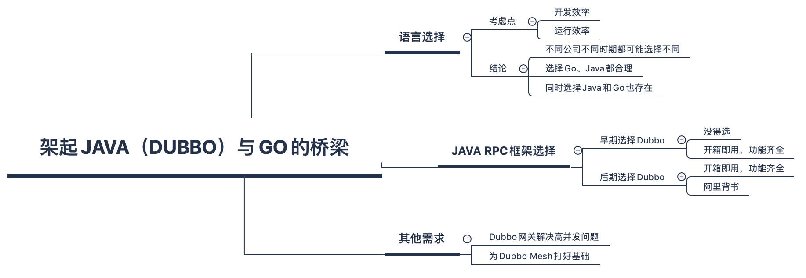

## 先说两句

我常常在散步时思考很多技术上的「为什么问题」，有时一个问题会想很久，直到问题的每一个点都能说服自己时，才算完结。于是想把这些思考记录下来，形成文章，可以当做一个新的系列。这些文章中你可能看不到代码，但能窥探到一些容易被忽视的问题，以及问题更深层次的「为什么」。

今天带来第`1`篇，Dubbo为什么要用Go重写？

---

诞生于阿里巴巴，2011年开源的Dubbo已经走过了10个年头。在2019年，它被用Go重写并开源，如今两年过去，已经从当初的`V1.0.0`版本发展到了`V3.0.0`，截止目前star数3.8K。

有一次同事问我，为什么Dubbo这么"老"的项目还要用Go重写，有什么现实意义吗？

今天就来谈谈我的一些看法。

## 连接过去和未来

我觉得要回答好这个问题，得从Dubbo-go的初衷谈起，github主页上它是这样介绍自己的：

官方给出的中文翻译是

> Apache Dubbo Go 语言实现，架起 Java 和 Golang 之间的桥梁，与 gRPC/Dubbo 生态互联互通，带领 Java 生态享受云原生时代的技术红利。

我再通俗地翻译一下：一个公司或部门内有人用Java版Dubbo，有人用Go，这两者需要通信，于是就有了Dubbo-Go，用来解决通信问题。

所以第一个问题来了，为什么一个公司用了Java，又用了Go？

### 编程语言的抉择

对于编程语言的选择，在商业公司里，我觉得最最主要考虑的点就是**效率**，至于其他的点都是次要。因为商业公司的主要目的就是盈利，不管什么语言，只要能用最低的成本拿到相等的收益就是好语言。

效率又包含了好几个方面：
- 开发效率。开发效率高，项目能早日上线，占领市场，也能节约人力成本
- 运行效率。运行效率高，能省下服务器成本

纵观国内很多商业公司的选择都是如此考虑，比如阿里。

阿里早期是PHP，选择PHP的考量点主要是开发效率，但随着业务的发展，PHP的性能无法支撑，必须得换一个运行效率高的语言。

运行效率高自然想到C/C++，但这两个语言的开发效率低，得在开发效率和运行效率中找到一个平衡点，于是阿里选择了Java。

阿里官方在知乎上回答为什么选择Java时，主要有以下几点考虑：
**性能**、**简单易学**、**生态丰富**、**社区活跃**

把性能放第一位，简单易学、生态丰富、社区活跃其实也都是说的开发效率，正是有了这些优点，开发效率才高。

当阿里巴巴选择Java后，自研了大量的Java中间件，培养了大量的Java人才，所以其他公司在技术选型时，也参考了阿里巴巴，导致越来越多的公司选择了Java。

而选择Go也是如此，一些年轻的公司早期可能是PHP、Python等脚本语言，等发展壮大后，不得不面临和阿里一样的问题：性能问题。

在2012年Go发布了，大家又多了一个选择，Go既有很高的性能，又非常地简单易上手，像字节跳动这类新公司就以Go为主。

所以综合来看，选择Java或者Go都是合理的，存在即合理。

为什么有公司选择了Java，又想用Go呢？

- Go语言相比Java有启动快，编译速度快、占用内存小、擅长高并发（协程）的特性，所以在已经有Java的公司，也会考虑Go，只不过目前这类公司占比不多。
- 某些公司没有强制的技术栈，所以新部门新业务可以摆脱束缚，选择新语言Go来进行开发。

### 小结
综上看来，选择Java或选择Go都合理，一个公司内两者都选择，也有合理之处，虽然占比不多，但还是有Java和Go通信的需求。

### Dubbo在RPC框架中的胜出

公司早期通常是单体服务，在规模达到一定程度，单体应用无法支撑业务发展时，会选择微服务架构，这时就需要一个好用的RPC框架。

能适配Java语言的RPC框架中，Dubbo是国内最早开源，于2011年开源。

而和他类似的竞品如Spring Cloud在2014年开源，微博的Motan在2017年开源，跨语言的gRPC在2015年开源，Thrift 2007年开源。

只有Thrift 比它早，但Thrift只是个RPC框架，Dubbo可是包含了开箱即用的服务治理能力，如服务注册与发现、负载均衡、容错、动态配置等等。

可以说早期Java的RPC框架没得选。

就算到了RPC框架百花齐放的时代，这么多公司的使用加上阿里的背书，Dubbo也有它的一席之地。

### 小结

当一个公司选择了Java编程语言和Dubbo框架（这种选择还是挺多的），后来又想尝试Go，或者一些新业务、新部门想尝试Go时，他们就面临了一个难题，Go如何跟Java的Dubbo通信。

由于Dubbo协议是私有协议，用Go重新实现一遍的代价还是挺大。于是Dubbo-Go应运而生，从这个角度看，Dubbo-Go在连接Java和Go的通信这条路上还是具有相当大的价值的。

## 终结与线程池的斗争

如果使用了Dubbo框架，很多时候需要一个Dubbo网关，关于Dubbo网关可以参考我这篇文章：[《微服务网关演进之路》](https://mp.weixin.qq.com/s/qyD-8ovFoZW_N5eAxEY20w)。

在这篇文章中，详细介绍了一款Dubbo网关的背景、难点、选型、设计、演进以及踩坑经历，其中我花了大篇幅介绍了「与线程池所做的斗争」，在Java中，线程是很宝贵的，但Dubbo网关如果是同步调用，必须一个请求占用一个线程，这就导致并发上不去，而且线程池打满后，会影响其他请求。

所以解决方案要么是隔离线程池，要么改成异步调用。隔离线程池只解决了请求不相互影响，但并发还是上不去，改成异步调用可以完美解决，但是编码实在是太复杂。

而Go的协程可以刚好解决这个问题，Go的协程很轻量，调度效率也更高，所以我们可以用简单的代码写出非常高效率的网关。

举个例子可以直观感受一下，Nginx的性能大家有目共睹，但如果用Java来实现，不知道得堆多少机器才能达到Nginx的性能，但百度在反向代理上使用了Go写的BFE来代替Nginx，可见其性能有多夸张。

关于协程的介绍和原理，可以参考我这篇文章：[《写了一年golang，来聊聊进程、线程与协程》](https://mp.weixin.qq.com/s/Tek6WIiDO6Oj7pitKl3v9Q)。

### 小结

所以在Dubbo网关上，Dubbo-Go也提供了一种新的解法，已经有用于线上的Dubbo-Go网关，开源项目参考`Dubbo-go-pixiu`。

## 为Dubbo Mesh铺路

Service Mesh也渐渐成为了下一代微服务架构，Go在Mesh上也绝对是一个闪亮的明星语言，无论是K8S、Docker等云原生基础设施都采用Go编写，还是Go的开发速度以及协程的高并发能力，都使它成为了Mesh的首选语言。

基于此，Dubbo的Mesh化，Dubbo-Go也为其铺平了道路，但目前Dubbo Mesh还处于小面积阶段，完整落地的方案并没有开源，从这点上来说，如果某公司想走Dubbo Mesh化之路，Dubbo-Go可能也是他们要着重考虑的点之一。

## 总结

说了这么多，该正面回答Dubbo为什么要用Go重写，这个问题的答案还是官方给出的那句话：架起 Java 和 Golang 之间的桥梁。至于为什么要「架起这座桥梁」，有如下几个关键点：

