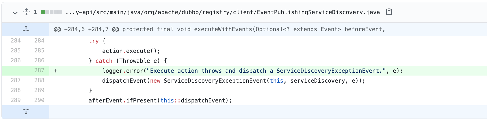

### 背景
本文记录最近一位读者反馈的dubbo 2.7.x中应用级服务发现的问题，关于dubbo应用级服务发现的相关介绍可以参考之前的文章[《dubbo应用级服务发现初体验》](https://mp.weixin.qq.com/s/nM7BFnW-I3A3mmLOPmBJJw)，这里不再赘述。

读者反馈他们在基于dubbo 2.7应用级服务发现开发dubbo网关，根据文章《dubbo应用级服务发现初体验》写了demo调用时报`no provider`的错误。

首先觉得他们挺有想法，把dubbo应用级服务发现搬上生产的公司不多。其次当时写文章时测试并没有遇到问题，但本着帮读者解决问题的态度，还是重新写个demo测试下。

### 问题定位
随手拿了一个平时测试用的dubbo demo工程（注意不是dubbo源码中的demo），发现确实注册不到zookeeper上，接着测试了不同的版本，发现都注册不了，在2.7.5 ~ 2.7.11版本不报错，2.7.12版本会报如下的NPE错误
```
2021-06-16 13:17:31,086 [Dubbo-framework-scheduler-thread-1] ERROR org.apache.dubbo.config.bootstrap.DubboBootstrap (DubboBootstrap.java:1172) -  [DUBBO] refresh metadata and instance failed, dubbo version: 2.7.12, current host: 172.23.233.52
java.lang.NullPointerException
	at org.apache.dubbo.registry.client.metadata.ServiceInstanceMetadataUtils.calInstanceRevision(ServiceInstanceMetadataUtils.java:249)
	at org.apache.dubbo.registry.client.metadata.ServiceInstanceMetadataUtils.lambda$refreshMetadataAndInstance$6(ServiceInstanceMetadataUtils.java:272)
	at java.util.ArrayList.forEach(ArrayList.java:1259)
	at org.apache.dubbo.registry.client.metadata.ServiceInstanceMetadataUtils.refreshMetadataAndInstance(ServiceInstanceMetadataUtils.java:271)
	at org.apache.dubbo.config.bootstrap.DubboBootstrap.lambda$registerServiceInstance$20(DubboBootstrap.java:1170)
	at java.util.concurrent.Executors$RunnableAdapter.call(Executors.java:511)
	at java.util.concurrent.FutureTask.runAndReset(FutureTask.java:308)
	at java.util.concurrent.ScheduledThreadPoolExecutor$ScheduledFutureTask.access$301(ScheduledThreadPoolExecutor.java:180)
	at java.util.concurrent.ScheduledThreadPoolExecutor$ScheduledFutureTask.run(ScheduledThreadPoolExecutor.java:294)
	at java.util.concurrent.ThreadPoolExecutor.runWorker(ThreadPoolExecutor.java:1149)
	at java.util.concurrent.ThreadPoolExecutor$Worker.run(ThreadPoolExecutor.java:624)
	at java.lang.Thread.run(Thread.java:748)
```
推测服务注册时存在问题，跟着这个错误栈debug，很快就定位到问题

直接导致NPE的是位于`org.apache.dubbo.registry.client.AbstractServiceDiscovery#register`

在<=2.7.11版本中
```java
@Override
public final void register(ServiceInstance serviceInstance) throws RuntimeException {
    this.serviceInstance = serviceInstance;
    doRegister(serviceInstance);
}
```

而在2.7.12版本中代码顺序被调整成了

```java
@Override
public final void register(ServiceInstance serviceInstance) throws RuntimeException {
	  doRegister(serviceInstance);
    this.serviceInstance = serviceInstance;
}
```

为什么调整了代码顺序导致了报错？

追踪下来发现NPE的来源是`this.serviceInstance`为null，原先的代码先对其赋值再执行doRegister。调整过后的代码先执行`doRegister`再赋值，然而在执行`diRegister`时抛出异常了，不幸的是这个异常被吃掉了，doRegister的实现如下

```java
@Override
public final void register(ServiceInstance serviceInstance) throws RuntimeException {

    assertDestroyed(REGISTER_ACTION);
    assertInitialized(REGISTER_ACTION);

    executeWithEvents(
            of(new ServiceInstancePreRegisteredEvent(serviceDiscovery, serviceInstance)),
            () -> serviceDiscovery.register(serviceInstance),
            of(new ServiceInstanceRegisteredEvent(serviceDiscovery, serviceInstance))
    );
}
```
而这个`executeWithEvents`会将异常以事件的形式发出去
```java
protected final void executeWithEvents(Optional<? extends Event> beforeEvent,
                                       ThrowableAction action,
                                       Optional<? extends Event> afterEvent) {
    beforeEvent.ifPresent(this::dispatchEvent);
    try {
        action.execute();
    } catch (Throwable e) {
        dispatchEvent(new ServiceDiscoveryExceptionEvent(this, serviceDiscovery, e));
    }
    afterEvent.ifPresent(this::dispatchEvent);
}
```
然而这个事件丢出去之后并没有被处理，也就是说这个异常被吃掉了。这也就是为什么之前的dubbo版本没有抛出异常，也不能注册上服务。

这个异常是什么？

```
java.lang.NoClassDefFoundError: org/apache/curator/x/discovery/ServiceDiscovery
```

其实只是少引入了一个依赖。加入以下以下就能解决这个问题
```xml
<dependency>
    <groupId>org.apache.dubbo</groupId>
    <artifactId>dubbo-registry-zookeeper</artifactId>
    <version>${version}</version>
</dependency>
```

为什么当时写文章时没有遇到这个问题？

恰好本次调试是基于一个demo工程，《dubbo应用级服务发现初体验》文章是直接在dubbo源码中修改demo，源码中已经把依赖都引入了

### 更进一步
其实是个小问题，但对用户来说挺困惑的，为什么没有报错但也没法注册服务？如果不是2.7.12有个附带的报错，可能排查起来更加困难。

于是提了个issue和社区的朋友交流下，得出的结论是2.7.x的应用级服务发现不再维护，3.x会继续维护。

> https://github.com/apache/dubbo/issues/8061

提个issue也是让有问题的用户能搜索到，少走弯路。

顺便也提了个PR，加一行log，方便直观的发现这个问题。



> https://github.com/apache/dubbo/pull/8066

新版本（>=2.7.13）如果有朋友再遇到这个问题，会直接打印出错误，就像这样

```
2021-06-16 16:58:02,210 [main] ERROR org.apache.dubbo.registry.client.EventPublishingServiceDiscovery (EventPublishingServiceDiscovery.java:287) -  [DUBBO] Execute action throws and dispatch a ServiceDiscoveryExceptionEvent, dubbo version: 2.7.12, current host: 172.23.233.52
java.lang.BootstrapMethodError: java.lang.NoClassDefFoundError: org/apache/curator/x/discovery/ServiceDiscovery
	at org.apache.dubbo.registry.zookeeper.ZookeeperServiceDiscovery.doRegister(ZookeeperServiceDiscovery.java:92)
	at org.apache.dubbo.registry.client.AbstractServiceDiscovery.register(AbstractServiceDiscovery.java:33)
	at org.apache.dubbo.registry.client.EventPublishingServiceDiscovery.lambda$register$0(EventPublishingServiceDiscovery.java:159)
	at org.apache.dubbo.registry.client.EventPublishingServiceDiscovery.executeWithEvents(EventPublishingServiceDiscovery.java:285)
	at org.apache.dubbo.registry.client.EventPublishingServiceDiscovery.register(EventPublishingServiceDiscovery.java:157)
	at org.apache.dubbo.config.bootstrap.DubboBootstrap.lambda$doRegisterServiceInstance$21(DubboBootstrap.java:1192)
	at java.util.ArrayList.forEach(ArrayList.java:1259)
  ...
```


既然2.7.x的应用级服务发现不再更新，下次写一篇分析3.0版本的应用级服务发现源码的文章吧~

---
> 搜索关注微信公众号"捉虫大师"，后端技术分享，架构设计、性能优化、源码阅读、问题排查、踩坑实践。

