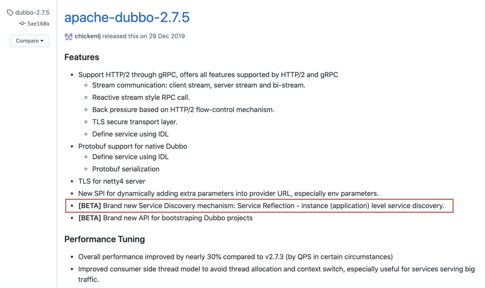
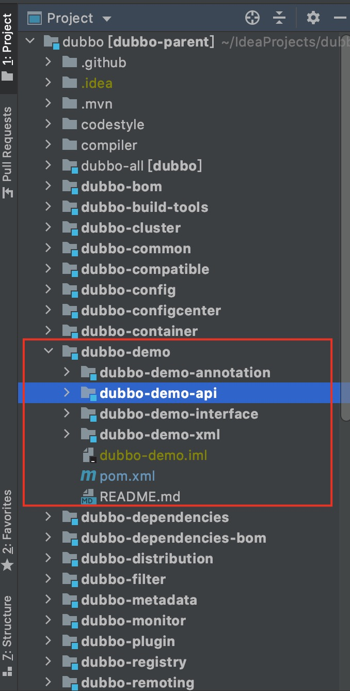
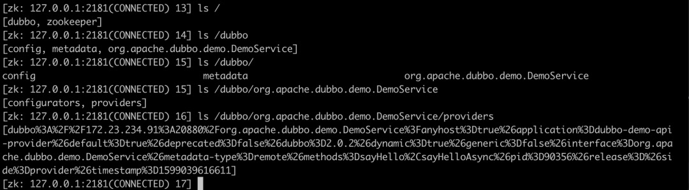
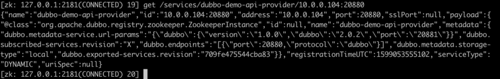

# dubbo应用级服务发现介绍
了解dubbo的朋友知道，dubbo的provider启动时向注册中心注册，consumer从注册中心消费。

目前dubbo往注册中心上注册的数据是接口级，而应用级服务发现是往注册中心上注册实例（ip+port），两者的区别只是注册的粒度不同。

至于为什么会出现应用级服务发现，有如下几点原因

- 与业界主流微服务模型对齐，比如 SpringCloud、Kubernetes Native Service 等
- 减少注册数据，提升性能

# 为什么要写这篇文章

在dubbo**2.7.5**版本中发布了应用级服务发现



官方的release note中只有这么一句话提到，给出的信息就两点：

支持一种新的服务发现粒度：应用级服务发现
尚处于BETA版本
且并没有相关官方文档介绍如何使用。

网上搜索了一些文章，只是一些**方向性、原理性**的介绍，如[《Dubbo 迈出云原生重要一步 - 应用级服务发现解析》](https://mp.weixin.qq.com/s/m26_VnEwLSFIlscyEU_pTg)、《Apache-Dubbo-服务自省架构设计》（非公众号文章，可网上搜索，作者小马哥）。

原理、方向固然重要，但想试用下dubbo的应用级服务发现却不知道如何配置，于是接下来从网上的碎片和源码来搭建一下dubbo的应用级服务发现demo

# 体验应用级服务发现
## 环境搭建

这里介绍下我常用的搭建dubbo源码调试的环境，简单有效。

简单的让dubbo跑起来只要一个zookeeper作为注册中心即可。

使用docker来搭建zk环境：

```
docker pull zookeeper
docker run -p 2181:2181  -d zookeeper:latest
```
dubbo源码调试环境，只需要从github上下载源码

```
git clone https://github.com/apache/dubbo.git
```

使用源码自带的demo即可，dubbo运行方式有很多，注解、api、xml等方式，选择你熟悉的即可，没有本质区别



## 两种服务发现

### 接口级服务发现

dubbo默认就是接口级服务注册，只要找个provider的demo启动就行，启动好我们看一下zk上注册的数据



**/dubbo** 目录下的**config**、**metadata**是2.7之后引入的“三大中心”，这块不在本文讨论范围，暂时忽略

**/dubbo/org.apache.dubbo.demo.DemoService**即是注册上去的服务，下面挂了一个临时节点

> [dubbo%3A%2F%2F172.23.234.91%3A20880%2Forg.apache.dubbo.demo.DemoService%3Fanyhost%3Dtrue%26application%3Ddubbo-demo-api-provider%26default%3Dtrue%26deprecated%3Dfalse%26dubbo%3D2.0.2%26dynamic%3Dtrue%26generic%3Dfalse%26interface%3Dorg.apache.dubbo.demo.DemoService%26metadata-type%3Dremote%26methods%3DsayHello%2CsayHelloAsync%26pid%3D90356%26release%3D%26side%3Dprovider%26timestamp%3D1599039616611]

urldecode一下

> [dubbo://172.23.234.91:20880/org.apache.dubbo.demo.DemoService?anyhost=true&application=dubbo-demo-api-provider&default=true&deprecated=false&dubbo=2.0.2&dynamic=true&generic=false&interface=org.apache.dubbo.demo.DemoService&metadata-type=remote&methods=sayHello,sayHelloAsync&pid=90356&release=&side=provider&timestamp=1599039616611]

可以看到注册上去的是一些元数据，比如ip、port、interface、methods等

### 应用级服务发现

应用级服务发现的配置，在网上能找到的资料很少，这里我也是翻遍了资料，加上自己尝试，得出的配置，除了配置zk地址，还需要开启应用级服务发现：

```
dubbo.registry.parameters[registry-type]=service
```

用代码是这样写

```
RegistryConfig registryConfig = new RegistryConfig("zookeeper://127.0.0.1:2181");
Map<String, String> params = new HashMap<>();
params.put("registry-type", "service");
registryConfig.setParameters(params);
```
provider与consumer都需要这样写，且consumer还需要在reference上配置services，指向provider的applicationName，表示需要消费这个应用

```
ReferenceConfig<DemoService> reference = new ReferenceConfig<>();
reference.setInterface(DemoService.class);
reference.setGeneric("true");
reference.setServices("dubbo-demo-api-provider");

RegistryConfig registryConfig = new RegistryConfig("zookeeper://127.0.0.1:2181");
Map<String, String> params = new HashMap<>();
params.put("registry-type", "service");
registryConfig.setParameters(params);
```

zk上注册的数据变成了在 **/services**下



我们发现在服务维度的注册的元数据不见了，所以此时consumer会先和provider建立连接，再去获取元数据。

# 最后
本文通过实例介绍了dubbo新版本提供的应用级维度服务注册发现能力，也只是和现有其他的微服务发现模型对齐，我们在实际中的运用还需要深入思考。

---

欢迎关注我的公众号


- 原文链接: https://mp.weixin.qq.com/s/nM7BFnW-I3A3mmLOPmBJJw
- 发布时间: 2020.09.02


