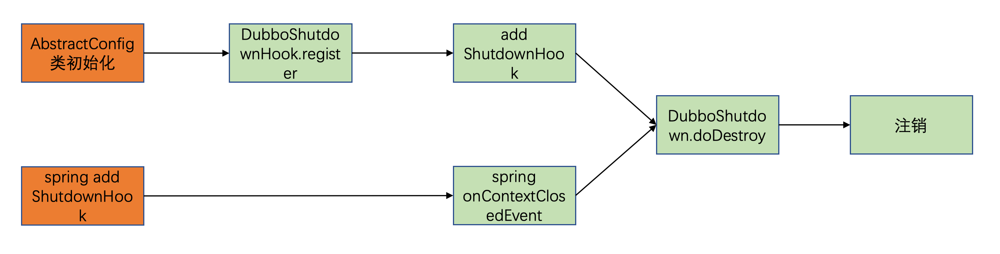
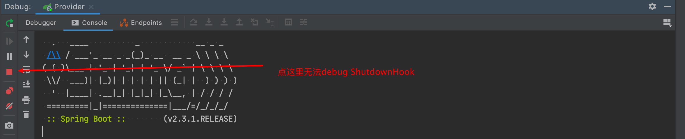
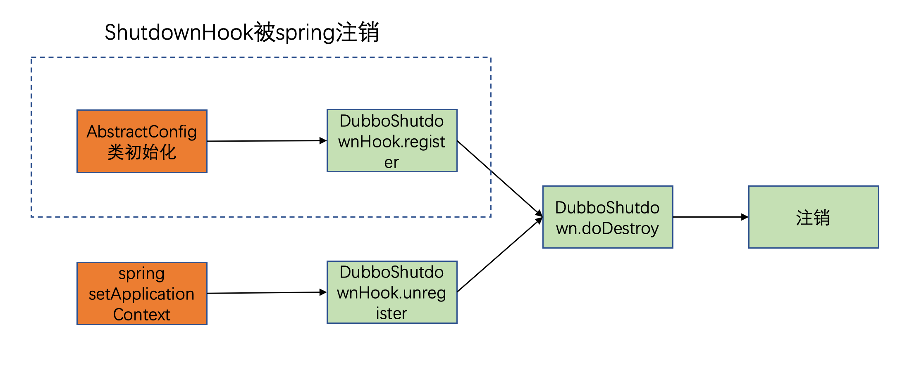
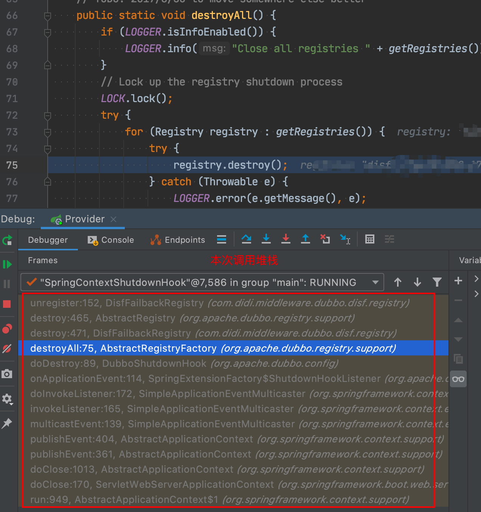
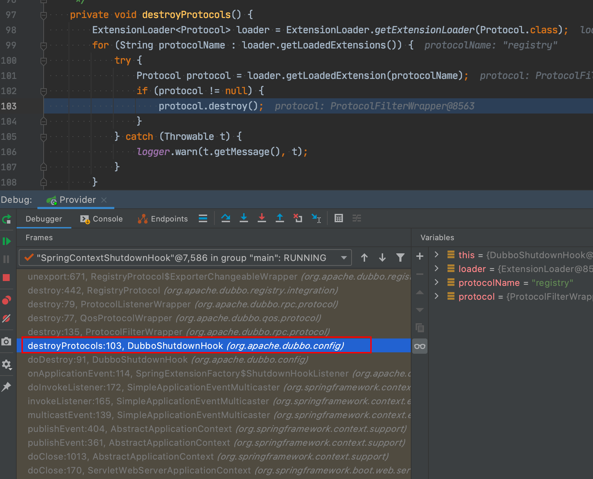
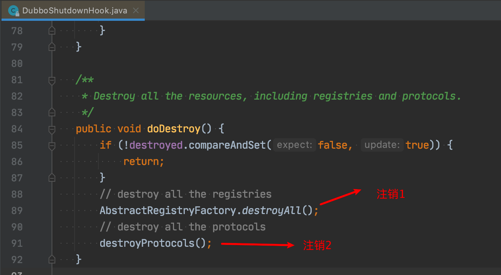
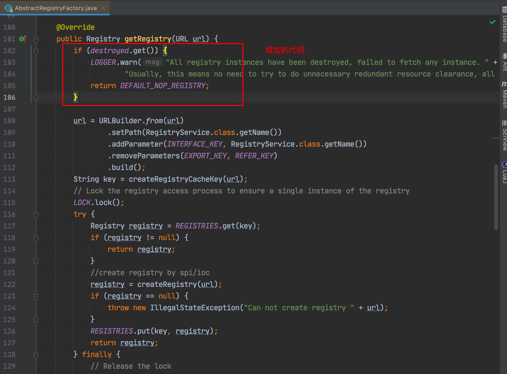

### 背景

我在公司内负责`自研的dubbo注册中心`相关工作，群里经常接到业务方反馈dubbo`接口注销`报错。经排查，确定是同一个接口调用了两次注销接口导致，由于我们的注册中心注销接口不能重复调用，调用第二次会因为实例已经注销而报`实例找不到`的错误。

虽然这个报错仅会打印一条错误日志，不影响业务，但本着 **follow through**的精神，我决定还是一探究竟，更何况重复注销也增加了应用的结束时间，影响了发布回滚速度。

### 问题复现

拿到业务方的dubbo版本，基于开源`2.7.3`内部定制的一个版本，该版本修改主要涉及安全漏洞修复以及一些业务适配，写了个demo跑起来，然后`kill`，发现果然报错了。

为了确定不是内部修改导致的问题，用**开源的2.7.3**版本再次测试，发现还是报错。

同时为了确定这是一个bug，我将dubbo版本修改为**2.7.7**做测试，发现该版本不再报错。

说明了重复注销至少是开源dubbo 2.7.3的一个bug，在更高的2.7.7版本中已经被修复。

于是有了解决方案：**升级dubbo**，但如果这么简单就没有这篇文章了。

1. 内部的dubbo已经做了修改，想升级得把改动merge到新版本，比较费劲
2. 就算升级了内部的dubbo版本，也不可能这么快速推动业务方升级

所以应该首先找到bug是哪里导致的，其次看注册中心的扩展是否可以修复这个问题，如果不能修复，就只能在内部的dubbo版本中修复该问题。

### 问题排查

###### 怀疑ShutdownHook

由于这几天研究过ShutdownHook（见文末《ShutdownHook原理》），第一时间怀疑ShutdownHook可能有问题。

dubbo 2.7.3代码有关ShutdownHook的实现在`DubboShutdownHook类`，顺着代码梳理出如下关系



看到dubbo本身和spring都注册了ShutdownHook，更加怀疑这里是不是ShutdownHook注册重复了。于是debug看看是否是注册重复了，这里给一个小经验，`IntelliIDEA`调试ShutdownHook执行时，要手动`kill`进程才会触发debug，点IDE上的关闭按钮不会触发



在`DubboShutdownHook.doDestroy`打上断点，debug发现只会执行一次，这说明spring和dubbo的ShutdownHook只会注册一次，这是怎么实现的呢？经过很多次测试，发现了dubbo一个很牛逼的设计。

DubboShutdownHook中有`register`和`unregister`方法，分别是注册和注销ShutdownHook，在这两个方法上都打上断点，在程序启动时发现这样一个有趣的执行顺序：



总结一下是dubbo本身注册了ShutdownHook，但如果用到了spring框架，spring框架在初始化时注销了dubbo注册的ShutdownHook，这样就只保留了spring的ShutdownHook，真是秒啊！实现的代码只有这短短几行

```java
public static void addApplicationContext(ApplicationContext context) {
    CONTEXTS.add(context);
    if (context instanceof ConfigurableApplicationContext) {
        ((ConfigurableApplicationContext) context).registerShutdownHook();
        DubboShutdownHook.getDubboShutdownHook().unregister();
    }
    BeanFactoryUtils.addApplicationListener(context, SHUTDOWN_HOOK_LISTENER);
}
```

于是怀疑的ShutdownHook问题被证明没有任何问题了。

###### 从注销堆栈继续排查

能稳定复现的问题一定很好排查，借助IDE的debug来看两次注销的调用堆栈，在注册中心扩展的unregister方法处加断点，可以看到如下两次来源不同的堆栈信息





代码中体现是



也就是说一次ShutdownHook执行，触发了两次注销。

接下来就比较好排查了，一步一步debug，这里解释下

- `AbstractRegistryFactory.destroyAll()`是销毁所有注册中心，销毁时会调研注册中心的注销接口
- `destroyProtocols`是销毁所有的`protocol`，注册中心的protocol在销毁时拿到registry，然后调用了registry的注销接口

那么dubbo 2.7.7是如何避免这个问题的呢？

在dubbo 2.7.7的代码中，注册中心的protocol在销毁时获取注册中心稍微增加了点代码



原来在注册中心被销毁后，destroyed变量被置为true，从而在registry protocol再次获取注册中心时，已经拿不到了原先的注册中心了，拿到的是一个空的注册中心，调用注销，自然没有什么效果。

追溯了下github，这次PR是

> https://github.com/apache/dubbo/pull/5450

这个修复在`2.7.5`就已经修复了

### 总结

- dubbo重复注销问题存在于2.7.0 ~ 2.7.4版本，2.7.5修复，zk注册中心不会报错，可能无法感知，但它确实存在，也会拖慢应用的关闭速度
- 通过追查发现，其实该问题可以在注册中心的扩展中解决，让registry的destroy只能被调用一次
- 遇到无论多小的问题，有空都去钻研下，你会收货一些新知识，比如这次dubbo中ShutdownHook如此巧妙的设计

---
> 关于作者：公众号"捉虫大师"作者，专注后端的中间件开发，关注我，给你推送最纯粹的技术干货

