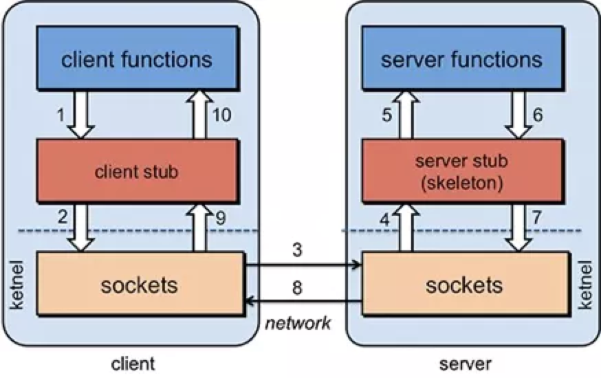
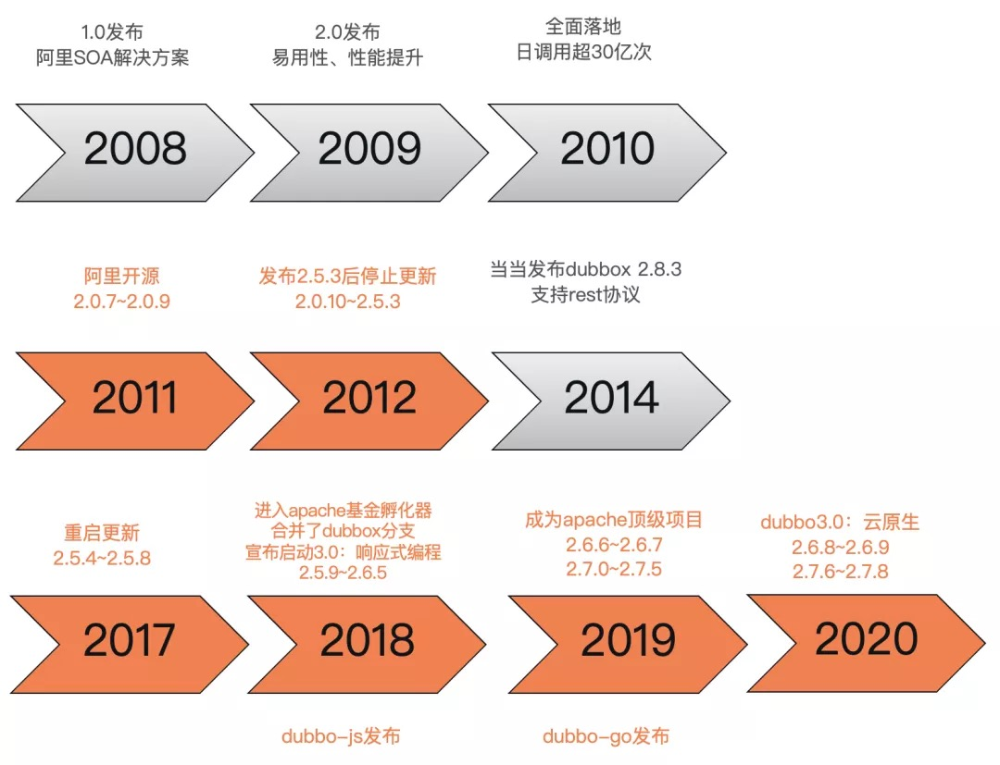
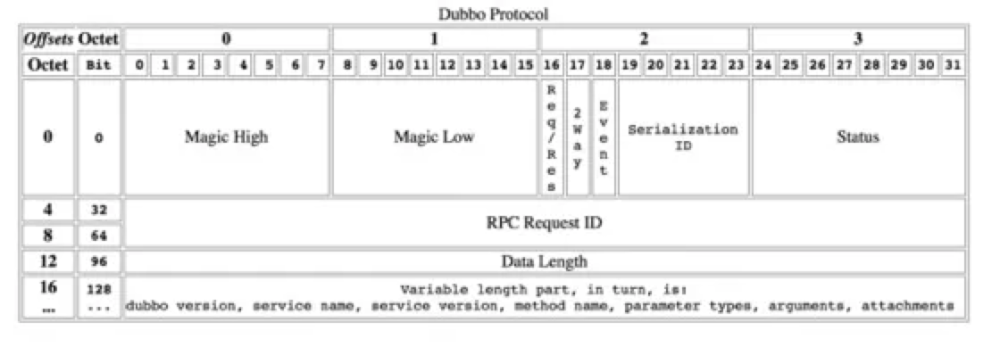
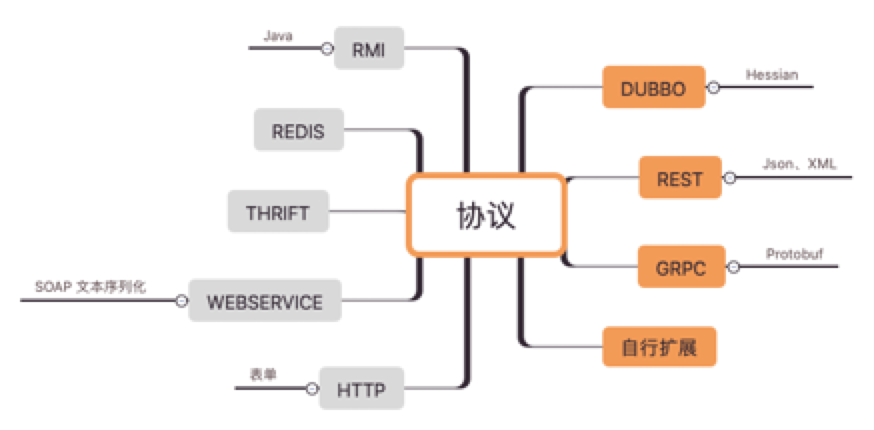
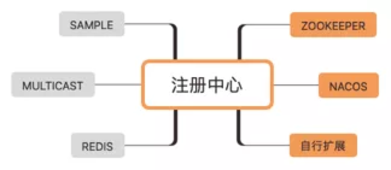
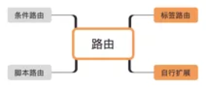
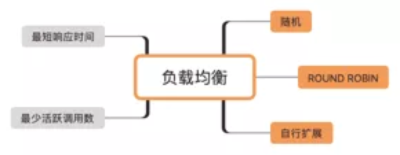
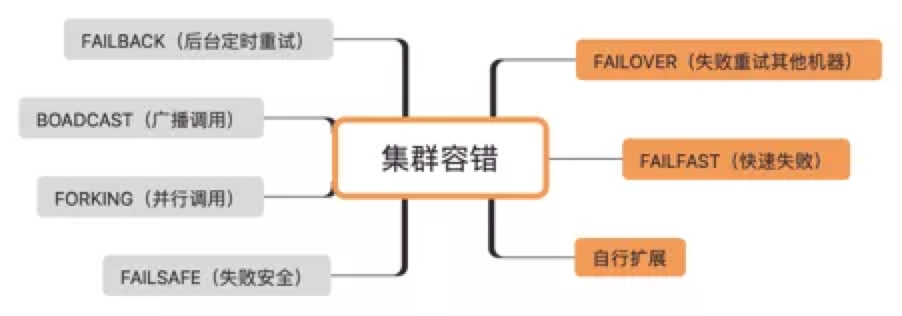
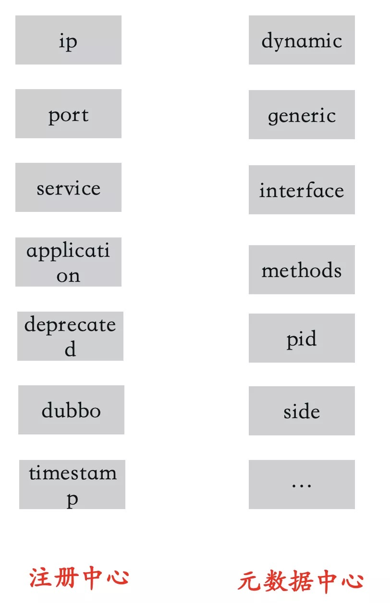
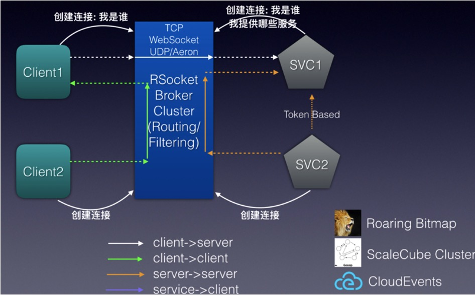

# 背景
在很久以前，网站应用是单体应用的架构，流量小，所有功能、代码都部署在一起，成本低。此时数据库访问框架ORM是关键。

后来流量逐渐增大，单体应用被拆分为互不相干的多个应用，这就是垂直架构，此时加速前端页面开发的Web框架MVC是关键。

再后来，垂直应用越来越大，应用间的交互不可避免，分布式服务框架RPC变成了关键。

# dubbo
RPC，全称Remote Procedure Call，即远程过程调用，一句话描述就是调用远程对象就像调用本地方法一样方便简单。常见的RPC框架有dubbo、grpc、thrift等。


dubbo， |ˈdʌbəʊ| 是一款高性能、轻量级的开源Java RPC框架，它提供了三大核心能力：面向接口的远程方法调用，智能容错和负载均衡，以及服务自动注册和发现。目前使用dubbo的公司非常多。


# 前世今生
dubbo的发展历程可以总结为3个阶段：

- 诞生阿里：dubbo前生2008年在阿里内部诞生，2011年开源，2012年发布2.5.3版本后停止更新
- 当当续命：2014年当当发布dubbox，是基于阿里开源的dubbo 2.5.3版本增加rest协议的dubbo版本
- 重启登顶apache：2017年阿里重启dubbo项目，并于2018年进入apache孵化，2019年成为apache顶级项目，同时也发布了dubbo.js，dubbo-go等多语言dubbo版本，2020年发布3.0往云原生项目发展的战略计划


目前支持的版本主要是2.6.x和2.7.x：

- 2.6.x 主要以 bugfix 和少量 enhancements 为主，因此能完全保证稳定性
- 2.7.x 作为社区的主要开发版本，得到持续更新并增加了大量新 feature 和优化，同时也带来了一些稳定性挑战

### 协议
dubbo原生的协议定义如下：

- 0-15: 魔数，判断是否是dubbo协议
- 16: 判断是请求还是返回
- 17: 判断是否期望返回
- 18: 判断是否为事件消息，如心跳事件
- 19-23: 序列化标志
- 24-31: 标志响应状态（类似http status）
- 32-63: 请求id
- 64-95: 内容长度（字节）
- 96-?: 序列化后的内容（换行符分隔）



dubbo协议的优点是设计紧凑、请求响应的header一致；缺点是无法通过header定位资源，header和body中字段存在冗余，协议无法扩展。

当然同时也支持扩展多种协议，如当当扩展的rest协议，还有最新支持的grpc协议等



说到扩展，可能是dubbo设计的最大亮点，dubbo的扩展基于SPI（Service Provide Interface）设计，可以无侵入代码实现非常多的功能。

### 注册中心

注册中心有如下特点：

- 动态加入，服务提供者通过注册中心动态的把自己暴露给消费者，无需消费者逐个更新配置文件。
- 动态发现服务，消费者可以动态发现新的服务，无需重启生效。
- 统一配置，避免本地配置导致每个服务配置不一致。
- 动态调整，注册中心支持参数动态调整，新参数自动更新到所有相关的服务节点。
- 统一管理，依靠注册中心数据，可以统一管理配置服务节点。dubbo主流的注册中心一般用zookeeper或者nacos，其他还有很多扩展实现。



### 集群
集群包含了路由、负载均衡和集群容错三个内容，从一个例子来看这三方面的差异：

一个dubbo的用户服务，在北京部署了10个，在上海部署了20个。一个杭州的服务消费方发起了一次调用，然后发生了以下的事情:

1. 根据配置的路由规则，如果杭州发起的调用，会路由到比较近的上海的20个provider。
2. 根据配置的随机负载均衡策略，在20个provider中随机选择了一个来调用
3. 假设随机到了第7个provider。结果调用第7个 provider 失败了。根据配置的failover集群容错模式，重试其他服务器。重试了第13个provider，调用成功。
这里1对应了路由，2对应了负载均衡，3对应了集群容错。







### filter

在dubbo的整体设计中，filter是一个很重要的概念，包括dubbo本身的大多数功能，都是基于此扩展点实现的，在每次的调用过程中，filter的拦截都会被执行。filter是一种责任链的设计模式：


常见的filter：监控打点、日志记录、限流降级、鉴权等。

### 三大中心

三大中心指注册中心，元数据中心，配置中心。为什么需要三大中心，可以看一条dubbo注册到注册中心上的数据：

```
/dubbo/org.apache.dubbo.demo.DemoService/providers/dubbo%3A%2F%2F172.23.234.48%3A20880%2Forg.apache.dubbo.demo.DemoService%3Fanyhost%3Dtrue%26application%3Ddubbo-demo-api-provider%26default%3Dtrue%26deprecated%3Dfalse%26dubbo%3D2.0.2%26dynamic%3Dtrue%26generic%3Dfalse%26interface%3Dorg.apache.dubbo.demo.DemoService%26metadata-type%3Dremote%26methods%3DsayHello%2CsayHelloAsync%26pid%3D21563%26release%3D%26side%3Dprovider%26timestamp%3D1600336623852
```

可以看出数据量很大，这还是接口级的数据，当接口数量越来越多，注册中心的压力越来越大，变更推送的数据越来越多。


所以，我们需要元数据中心和配置中心来减轻注册中心的压力。不经常变化的数据可以放在元数据中心。上述注册数据拆分之后：



```
/dubbo/org.apache.dubbo.demo.DemoService/providers/dubbo%3A%2F%2F172.23.234.48%3A20880%2Forg.apache.dubbo.demo.DemoService%3Fapplication%3Ddubbo-demo-api-provider%26deprecated%3Dfalse%26dubbo%3D2.0.2%26timestamp%3D1600336144382
```

配置中心也是如此，如果没有配置中心需要全量将变更的url推送下去，有了配置中心只需要推送变更的配置即可。

### 泛化调用

我们常见的dubbo调用方式是引入provider定义的接口jar包，但如果没有这个jar包，能否发起调用？当然是可以，也确实有这样的场景，比如服务测试平台，dubbo服务网关等。只要知道接口名，参数等信息即可发起调用。


# 未来发展

dubbo当时的未来规划其实走了个曲线，并不是一步到现在的云原生方向。2019年想走的方向是响应式编程（或者叫反应式编程）。IO密集型的应用，通常线程池是限制吞吐的重要因素之一，假设consumer线程池为100，provider接口响应时间为500ms，consumer的qps上限为 (1000 / 500) x 100 = 200。响应式编程就是解决这个问题。

响应式编程（reactive programming）是一种基于数据流（data stream）和变化传递（propagation of change）的声明式（declarative）的编程范式。RSocket 是一个支持 reactive-stream 语义的开源网络通信协议，它将 reactive 语义的复杂逻辑封装了起来，使得上层可以方便实现网络程序。Dubbo 在 3.0.0-SNAPSHOT 版本里基于 RSocket 对响应式编程提供了支持，用户可以在请求参数和返回值里使用Mono和Flux类型的对象。



但到了2020年，随着云原生概念的兴起和大厂纷纷地落地，dubbo是否也可以朝这个方向发展呢？

云原生是基于容器、服务网格、微服务、不可变基础设施和声明式API构建的可弹性扩展的应用，基于自动化技术构建具备高容错性、易管理和便于观察的松耦合系统，构建一个统一的开源云技术生态，能和云厂商提供的服务解耦。

dubbo的服务级注册发现，与k8s容器编排的应用级服务发现相违背，dubbo是“重sdk”，与易管理相违背。

所以在最新的版本中支持了应用级的服务发现，原先是这样的一个接口：

```
/dubbo/org.apache.dubbo.demo.DemoService/providers/dubbo%3A%2F%2F172.23.234.48%3A20880%2Forg.apache.dubbo.demo.DemoService%3Fapplication%3Ddubbo-demo-api-provider%26deprecated%3Dfalse%26dubbo%3D2.0.2%26timestamp%3D1600336144382
```

使用应用级服务发现注册到注册中心上是这样

```
/services/dubbo-demo-api-provider/172.23.234.48:20880
```

而重sdk，未来可能会被mesh改善，据说阿里内部已经有dubbo mesh落地的业务线了。


---

欢迎关注我的公众号


- 原文链接: https://mp.weixin.qq.com/s/hXddvr6tMdgSVln97mHBKw
- 发布时间: 2021.01.30