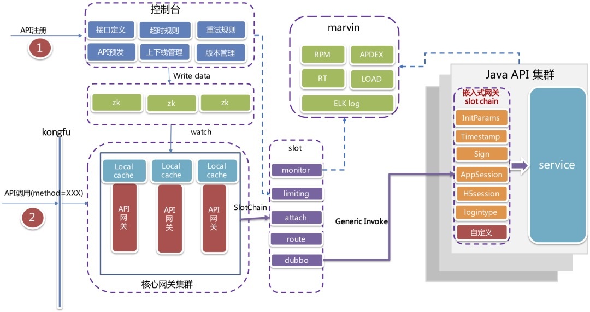
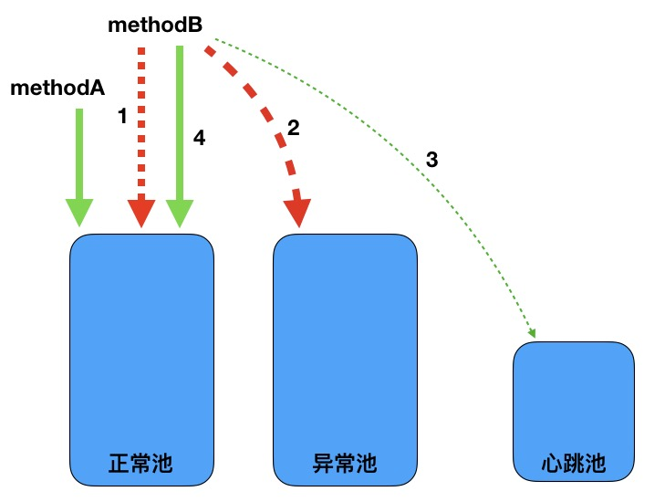
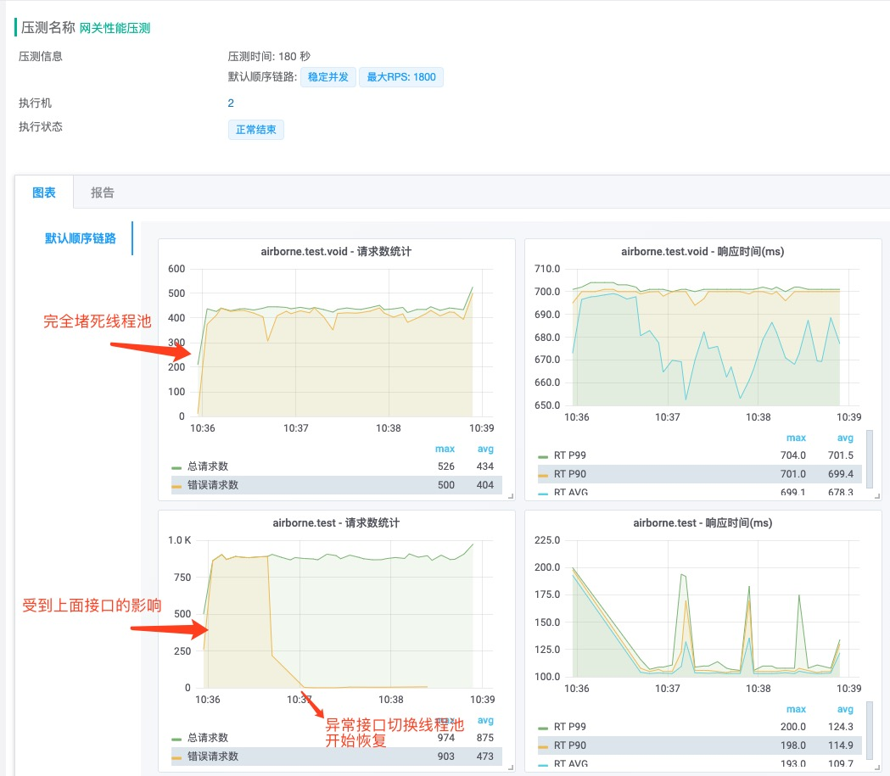
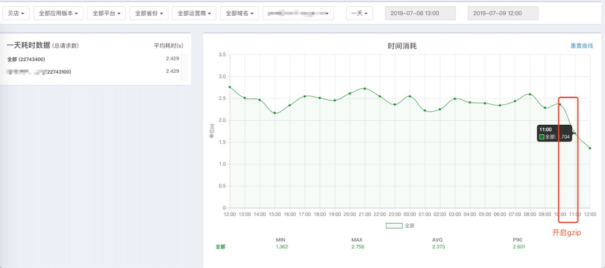
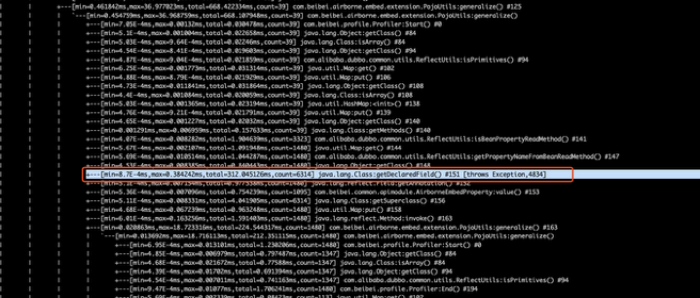

# 背景
随着公司业务的飞速发展，基于php的模块化架构难以支持未来业务的发展：

- php模块化架远远落后于行业主流架构（微服务–>云原生），而php生态的服务治理开源组件匮乏，研发投入过大
- 杭州php人才匮乏，导致新鲜血液招聘困难
- 基于php的多进程架构难以支撑电商高并发业务场景

尽管很早我们就做了会员、商品、交易的服务化，但流量入口还是php主站，php实际上仍是一个单体应用，单体应用无需网关。当全站java化之后，单体应用将被拆分为微服务，自然需要一个网关来负责统一流量入口、鉴权、安全防护、业务统一处理等。

在2019年3月，我们发起了代号为`诺曼底`的全站java化项目，将微服务网关项目命名为`airborne101`，第101空降师（101st Airborne Division (Air Assault)）是美国陆军的一支空中突击部队，创建时是一支空降部队，在二战期间，该师首先参加了诺曼底战役。

# 难点
简单来说网关就是个web应用，接收转发http请求。它的难点在于需要用少量机器支撑起全站的流量，方便快速地支持业务的发展且足够稳定。总结起来就是如下三点：

- 高吞吐
- 扩展性
- 稳定性

# 选型
网关技术选型考虑主要考虑两点：

- 选择什么开发语言
- 自研or开源

按语言分类，主要考虑如下三类：

- 基于nginx openresty开发的网关，其开发语言为lua，如kong、apisix、orange等
- 基于java实现的网关，如zuul、soul等
- 其他语言的实现，如基于go实现的tyk等

公司的rpc框架为dubbo，首选已经实现了dubbo客户端的语言，像openrestry虽然性能非常优秀，但其开发语言为lua，没有现成的java客户端，如果自研lua的客户端需要完成协议的编解码、路由、负载均衡等等一系列功能，工程浩大。go虽然有dubbo的客户端，但目前还不够成熟，且go语言在公司运用不多，配套设施不够齐全（如监控、发布等系统）。故我们选择使用java来实现。

选择开源需要对开源代码进行熟悉，测试，定制，可能还会存在未知的bug。网关的逻辑并不复杂，与其选择开源，不如自研，更加能hold住。

# 设计
参考开源的java网关实现以及如上难点，我们有如下设计与技术选型

- dubbo调用：dubbo泛化调用，无需引入业务方的jar包对dubbo接口发起调用
- 高吞吐：基于spring-webflux的响应式编程
- 扩展性：责任链模式开发，易于扩展
- 稳定性：将网关拆分为核心网关与嵌入式网关，核心网关只负责接口管理、协议转换、路由转发，变更少则足够稳定；嵌入式网关负责处理业务相关逻辑，更容易根据不同业务进行扩展开发
- 接口动态变更：基于zk保存并推送接口配置的变更信息

# 演进

## 线程池隔离

初期为了快速上线，网关在调用后端dubbo服务时采用同步的方式，即将请求放在线程池中同步阻塞直到请求完成或者超时。这就导致了一个很致命的问题，假设集群中有一些接口响应慢，如果请求量稍微大一点，占满了网关的线程池，则正常的请求也会被拒绝。

我们的解决手段有两个，一是`物理隔离`，将网关按业务的重要程度划分，如分为普通集群与交易集群，交易集群只处理交易相关的接口，这样交易与非交易就不会互相影响。但这样在同一个集群中仍然会相互影响，如慢的交易请求影响正常的交易请求。此时我们实现了一个`线程池隔离`机制。

线程池隔离机制将原先的dubbo线程池拆分为三个：正常线程池、异常线程池、心跳线程池。正常请求走正常线程池、慢请求走异常线程池，快慢请求不相互影响。还需要一个心跳线程池，因为当异常线程池满之后，慢请求可能无法正常处理，如果此时有两个或以上的慢请求，当其中一个恢复时无法被拉回正常线程池。所以需要心跳线程池定时检测异常线程池中的请求是否已经恢复。

1. methodB超时次数达到阈值
2. methodB被移入异常池执行逻辑
3. methodB拿小部分流量放入心跳池执行心跳检测
4. methodB心跳检测成功，恢复到正常池执行

看一个例子：

测试两个接口airborne.test.void与airborne.test，让airborne.test.void变慢并堵死线程池，airborne.test也受到影响，随后网关将airborne.test.void放入异常线程池执行，airborne.test恢复正常。

## 异步dubbo调用

上述的物理隔离与线程池隔离帮我们度过了2019年的双十一，但其仍然存在吞吐率上不去的问题，内存压力与线程切换的开销导致线程池大小不可能无限大，所以网关的吞吐率受限于后端接口的响应时间。

经过压测，网关的dubbo线程池设置为600（正常）+600（异常）+20（心跳）时，压测50至500ms的接口响应时，可达400-2000rps。

如果dubbo的同步调用改为异步调用，则可避免该问题。在dubbo 2.7之前dubbo底层返回`Future`，需要轮询获取结果，对异步编程支持的不够友好，dubbo 2.7之后返回`CompletableFuture`，很方便地可以执行回调，且与spring-webflux结合地很好。在dubbo请求响应时驱动网关处理返回结果，不用一直占用一个线程。由于网关只发起调用，所以只要dubbo 2.7与公司所用的2.6.6协议兼容即可，升级成本比较小。

经过压测，dubbo异步调用版本的网关吞吐率不再受后端接口响应时间影响，稳定在单机（4C8G）5000rps。自从升级到异步调用后，集团只需要个位数的机器就能抗起全站的接口流量，且没有接口相互影响的烦恼（线程池隔离就废弃了）。

## 嵌入式网关升级
前面说了为了稳定性将网关拆分为核心网关与嵌入式网关，嵌入式网关实际上就是一个jar包，需要业务方引入，前期好处很多，但后期出现一个问题就是版本无法统一，升级困难。

需要经常升级嵌入式网关主要有如下几点情况：

- 嵌入式网关功能升级、bug修复
- 新业务接入
- 业务扩展

第一点必须要升级才能解决，不过后期也会逐渐稳定，频率较低。第二点最频繁，新业务接入需要增加新业务的逻辑与配置文件，第三点可以忽略，嵌入式网关提供的扩展能力可以让业务方自己实现扩展，无需升级。

针对第二点，我们重构了代码，让新业务接入无需修改代码，将其配置化，并且将配置与嵌入式网关逻辑分开，使用grade动态引入配置文件，达到无需业务方感知就能添加新业务的效果。

当然如果嵌入式网关不是作为一个jar包被业务方引入，而是作为一个类似service mesh中的`sidecar`，或许这个问题就能更好的被解决。

## 一些踩过的小坑

### dubbo泛化调用的内存泄露问题

这可能是网关上线以来遇到的最大的问题，具体可以查看这篇文章：《一次漫长的dubbo网关内存泄露排查经历》

### dubbo线程池导致接口rt变长

刚开始时设置网关的dubbo调用线程池为动态大小加一个缓冲队列，如核心线程数为500，最大线程数为800，缓冲队列为5000。在压测时会发现接口可以正常返回，但接口rt很高。其原因是当线程占满500后，不会立马扩容，而是将请求放入缓冲队列中等待，自然接口rt变长。解决办法是不用伸缩的线程池而使用一个固定大小的线程池，处理不了的请求快速失败。

### gzip未开启

刚从php切换到java网关时，没有注意php上的nginx还开启了gzip，导致服务端监控看到接口响应时间很短，但客户端监控到页面打开时间变长。

### 嵌入式网关性能调优

嵌入式网关需要通过反射序列化和反序列化对象，当返回结果嵌套很深，数据量很大时，序列化耗时非常严重，通过`arthas`的trace命令可发现是序列化时反射耗性能严重

解决办法是通过一个LRU cache缓存反射过程中的对象。

# 总结

公司的微服务网关上线以来服务了全站所有java接口流量，至今未发生线上故障。异步化达到了业界的及格水平，仍有许多需要完善和演进的地方需要我们努力。

---

