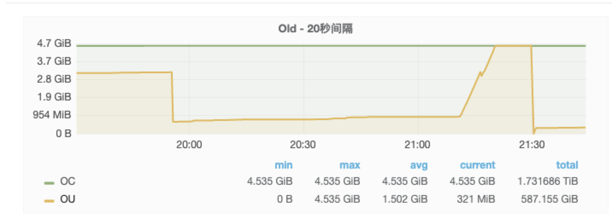

# 背景介绍

在微服务架构中，不同的微服务有不同的网络地址，而客户端则是通过统一的地址进行调用，在客户端与服务端之间需要有一个通信的桥梁，这就产生了微服务网关。微服务网关可以连接客户端与微服务，提供统一的认证方式，管理接口的生命周期，做更好的负载均衡、熔断限流，提供方便的监控，提供统一的风控入口。

今天要介绍的主角是dubbo微服务网关，来自公司内部自研的提供http协议到dubbo协议转换的微服务网关，跟本文相关的就是它的核心点：dubbo泛化调用。dubbo官网对泛化调用的描述为

“泛化接口调用方式主要用于客户端没有 API 接口及模型类元的情况，参数及返回值中的所有 POJO 均用map表示，通常用于框架集成。“

dubbo最常见的调用方式是引入服务提供方定义的jar包，用于描述接口，但如果是网关引入所有的dubbo提供者的jar包就很不现实，况且如果需要新增接口就需要重新发布网关，所以需要使用泛化调用来解决这个问题，官网提供的示例代码截图如下：

# 问题描述
  
这款网关上线以来一直运行稳定，直到某一天出现了问题，频繁full GC，cpu上涨，错误率飙升，然而接口的调用量并没有上涨。立马重启机器，并且保留了一份内存dump文件，分析了一周没有结论，最近又出现了一次，情形类似。

# 问题排查
  
- 从内存dump文件查起
从监控上基本能断定是内存问题，那就分析一下当初dump出来的内存文件，使用eclipse的mat插件分析

RegistryDirectory对象多达7000多个，直接定位为RegistryDirectory可能存在内存泄露。再跟进一下这个对象的持有者

发现是com.alibaba.dubbo.remoting.zookeeper.curator.CuratorZookeeperClient$CuratorWatcherImpl，搜索一下该类的对象

这个对象也非常多。到这里就去查看dubbo的源码（本文dubbo源码基于2.6.6）。首先查找com.alibaba.dubbo.remoting.zookeeper.curator.CuratorZookeeperClient$CuratorWatcherImpl创建的地方

只有一个地方创建，接着跟进addChildListener

只有在订阅zookeeper的节点时会调用，继续查找订阅zookeeper的地方，发现有两处

- 一处是ReferenceConfig的createProxy会调用RegistryProtocol的doRefer，进而订阅zookeeper；

- 另一处是FailbackRegistry中会有一个线程不停地对订阅失败的path进行重试，在zk重新连接时会recover。

首先怀疑第二处

dubbo应用在与zookeeper断开连接重新连上的时候会recover，recover里面执行的就是重新订阅zookeeper。这很好模拟，线下打断点测试一下在zookeeper端开重连的时候是否会重新生成CuratorWatcherImpl对象。结果当然是没有生成，因为dubbo应用会缓存CuratorWatcherImpl对象，对于相同的URL订阅，返回的都是相同的CuratorWatcherImpl对象，并不会重新生成。

- 从网络寻求答案

换个思路重新开始，去网上看看又没人遇到相同的问题，网上搜了一下，发现了 https://github.com/apache/dubbo/issues/376 跟我的问题几乎一样，难道是发布导致的问题？但经过几次对比否决了，因为平时发布都没事，偏偏这时候出事？而且两次爆发时网卡流量并不高。

否决了这个issue后又发现了一个issue， https://github.com/apache/dubbo/issues/4587

但这个很快又被否决了，因为这里他的主要问题是reference未缓存，在dubbo的文档中针对这个是有提及的

出问题的dubbo网关是对reference做了缓存（以interface+version+group+timeout作为key，timeout是为了能动态调整接口的超时时间），理论上不会重复生成reference

- “守株待兔“

问题真的陷入僵局，好在看到了这么一篇文章，《netty堆外内存泄露排查盛宴》（点击原文查看），作者在面对无法排查的问题时，在线上植入一段监控代码来协助定位问题。于是在想能不能也植入一段代码，看看这么多订阅到底是什么。通过对dubbo的源码翻看，找到这么一个可以获取订阅的点

ZookeeperRegistry中有个zkListeners存储了订阅了哪些URL，如果能检测这个字段是不是就可以了？简单点，定时检测并打印日志。通过反射来获取这个变量

代码改好，测试一下，放到线上一台机器守株待兔。经过一下午，终于抓到了

发现其中一个service，被重复订阅了很多次，而且订阅的URL只有timestamp不一样，且只有一个服务会这样，怀疑跟服务本身有关，查看该服务，发现其没有provider

难道没有provider的服务会出现重复订阅？线下复现试试，使用网关去调用一个没有provider的服务（省略复现过程），果然问题出现了！问题能复现就很好排查了，打断点根据调用栈就能找到订阅的地方

在生成referenceConfig时会初始化proxy，如果初始化过就会忽略，问题就在createProxy

如果check=true，且provider不存在，createProxy就会抛异常，createProxy底层去订阅了zookeeper，缓存了RegistryDirectory对象，如果不停订阅，内存就会被撑爆，看下这个报错在那几天是否很多

好像也不是很多，单机加起来几百次，为什么会产生这么多RegistryDirectory对象，通过调试发现

每次订阅的URL是生成的，也就是timestamp不同，且会被塞入urls这个变量缓存起来，然后循环这个urls进行refer（即订阅），也就是说第一次urls中有1个URL需要订阅，第二次就成了2，第三次是3，也就是高斯计算的那个1+2+3+4+...+100的问题，请求100次会产生5050个RegistryDirectory对象。

解决办法很简单，将check=true改为check=false。

# 总结
  
- 这个是dubbo的bug，在2.7.5版本中已经将订阅的URL中的timestamp去掉了，只会对一个URL订阅一次，issue即之前提到的https://github.com/apache/dubbo/issues/4587，但当时这个issue并没有解决我们的疑问；
- 泛化调用时将reference的check设置为false，否则可能会出现内存泄露；普通调用（xml配置）则无影响，因为check=true如果没有provider应用会启动失败；
- 问题排查难易程度：通过监控、代码、日志直接定位的问题 < 可稳定复现的问题 < 不可稳定复现的问题（偶尔出现） < 不可复现的问题（只出现一次），本文的问题属于不可稳定复现的问题。

---

- 原文链接: https://mp.weixin.qq.com/s/_hon_kgQfV-xwBR8Hfa9dA
- 发布时间: 2020.04.23