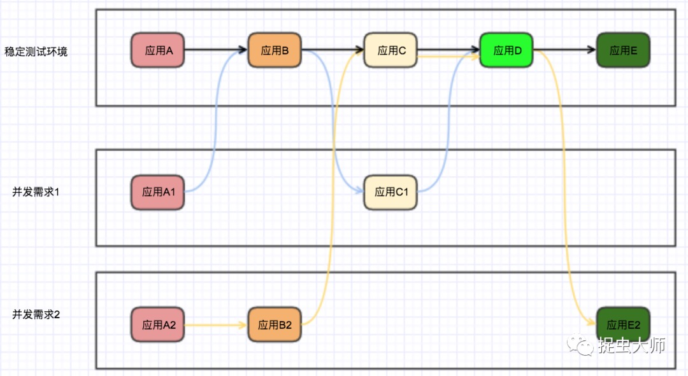
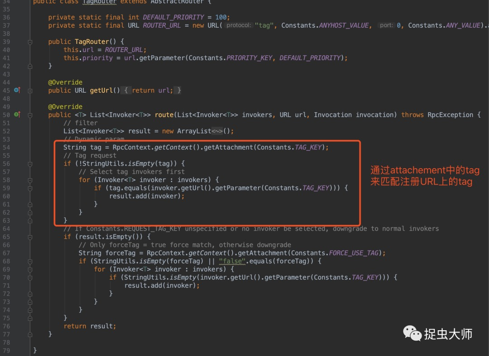
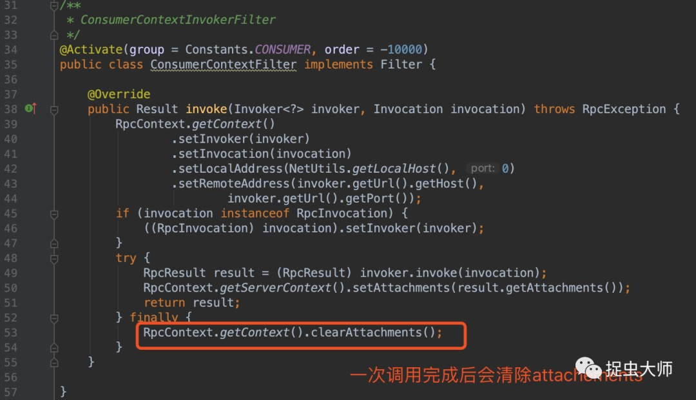
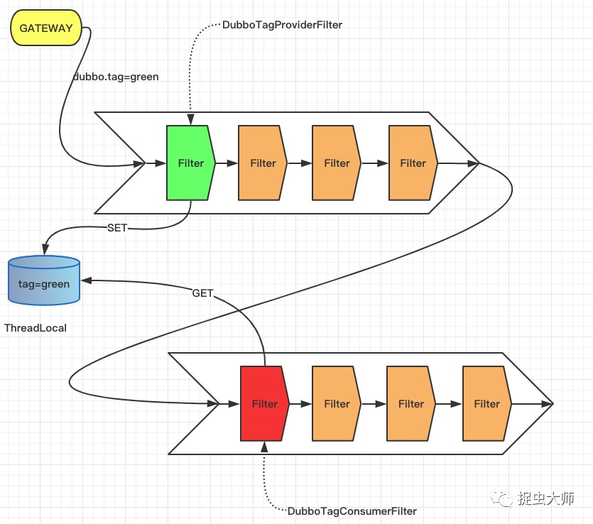
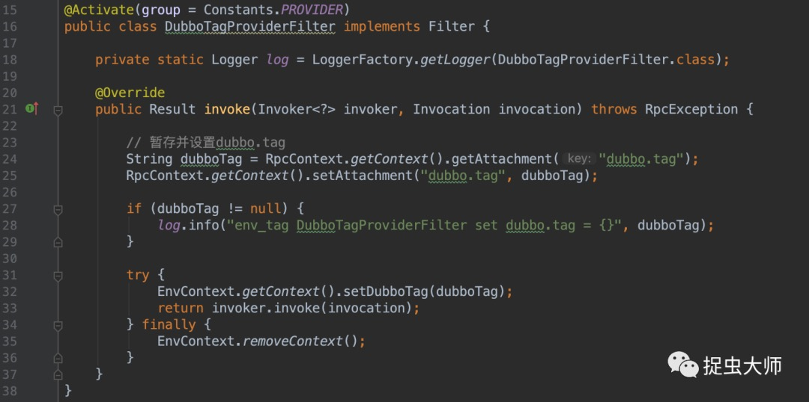
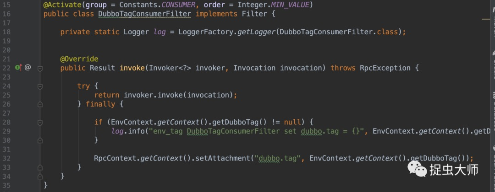

# 标签路由简介
在开发测试中我们通常会遇到多项目并行开发测试，假设应用ABCDE均为dubbo应用，需求1修改了应用A、C代码，需求2修改了应用A、B、E代码，此时如果并行测试，需求1可能会调用到需求2修改的代码上，造成测试混乱。

常见的解决方法有如下几种：

- 每个项目单独部署一整套系统，注册中心也单独部署，优点是实现简单，缺点是机器资源占用太多；
- 在消费方应用中通过硬编码或者配置文件的方式指定调用的接口机器ip和端口，优点也是实现简单，缺点是依赖配置复杂。此方案在简单的依赖中可以使用，但在依赖复杂的环境中较难实施；
- 通过逻辑上的分组将请求正确的路由，优点是逻辑清晰机器资源占用少，缺点是实现困难。此方案也正是本文需要探讨的方案。

如果使用的是dubbo，那么在dubbo 2.6.6版本之后提供了一个标签路由（tag router）功能来解决此问题。标签路由通过将某一个或多个服务的提供者划分到同一个分组，约束流量只在指定分组中流转，从而实现流量隔离的目的，可以作为蓝绿发布、灰度发布等场景的能力基础。

对于provider端，可以通过静态或动态的方式对服务进行打标签，静态打标可以在JVM的启动参数上增加-Ddubbo.provider.tag={env_tag}来实现，动态打标则是直接修改provider在注册中心上的地址实现，我们对provider采取静态打标即可。对于consumer端，请求标签的作用域为每一次 invocation，使用attachment来传递请求标签，注意保存在 attachment 中的值将会在一次完整的远程调用中持续传递，得益于这样的特性，我们只需要在起始调用时，通过一行代码的设置，达到标签的持续传递。目前仅仅支持硬编码的方式设置dubbo.tag。注意到 RpcContext 是线程绑定的，优雅的使用 TagRouter 特性，建议通过 servlet 过滤器(在 web 环境下)，或者定制的 SPI 过滤器设置 dubbo.tag。

从代码上看它的实现非常简单，核心代码就这么几行：

它与dubbo的version、group机制有什么区别？dubbo的version与group是静态的路由，如果URL中带了不匹配的version，在上图代码中的invokers就根本不存在该服务提供者；而tag路由是动态的，就算带了不匹配的tag，也是会放在invokers中，每次调用时都执行一次路由逻辑。

# 标签路由降级约定

- consumer dubbo.tag=tag1 时优先选择标记了tag=tag1的provider。若集群中不存在与请求标记对应的服务，默认将降级请求 tag为空的provider；如果要改变这种默认行为，即找不到匹配tag1的provider返回异常，需设置request.tag.force=true；
- consumer dubbo.tag未设置时，只会匹配tag为空的provider。即使集群中存在可用的服务，若tag不匹配也就无法调用，这与约定1不同，携带标签的请求可以降级访问到无标签的服务，但不携带标签/携带其他种类标签的请求永远无法访问到其他标签的服务。

# 标签路由的“bug”

经过测试发现，consumer端的dubbo.tag通过dubbo的attachment 携带给provider端，但是 attachment有一个特点是在dubbo请求完成会把attachment中保存的值清空，也就是说consumer第一次dubbo请求会带dubbo.tag，第二次请求不会带。

# 基于dubbo标签路由打造并行测试环境

翻看了标签路由在github上的PR（点击阅读原文可查看），能看出作者也是知道这个问题的，而且提出建议通过servlet 过滤器(在web环境下)，或者定制的 SPI 过滤器设置 dubbo.tag。由此我们想到利用dubbo的SPI机制扩展filter来填充attachment，在provider接收到请求时将dubbo.tag存起来，每次发起调用时再将tag塞回attachment。

还是以开头的例子，两个项目同时测试，则需要两个tag，需求1定义tag为green，需求2定义tag为red
- 首先需要一套部署ABCD的稳定环境，即没有打tag的环境，其次再创建新的应用A、C，并打上tag=green，创建新应用A、B、E并打上tag=red，让稳定环境与新创建的机器都注册到一个注册中心；
- 其次在请求发起处将tag塞入attachements，这一步通常是网关或者调用工具来完成；
- provider端接收到请求将请求中的tag存在ThreadLocal（EnvContext）中；

- 第一次调用将执行tag路由选择，当调用完成并执行完ConsumerContextFilter之后再将tag塞回attachements，以便将tag传递给下一次调用；

- 最后本次调用完毕，DubboTagProviderFilter会清除存储的tag信息，不污染下一次请求

---

> 关于作者：专注后端的中间件开发，公众号"捉虫大师"作者，关注我，给你最纯粹的技术干货

- 原文链接: https://mp.weixin.qq.com/s/QpaSOj9Ca_wlQLT_4vOWWA
- 发布时间: 2020.04.12

