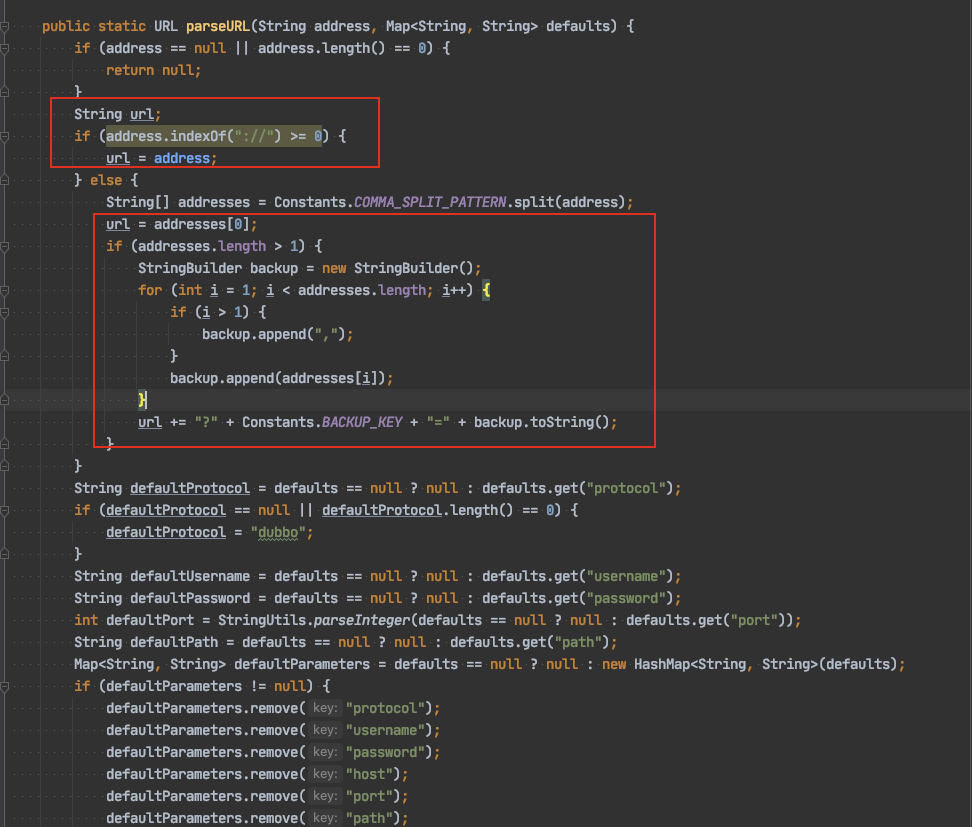
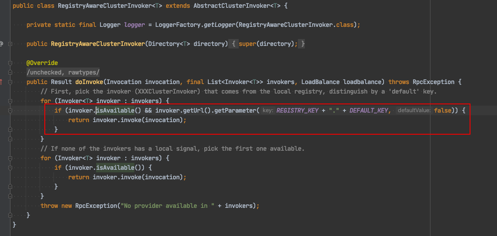
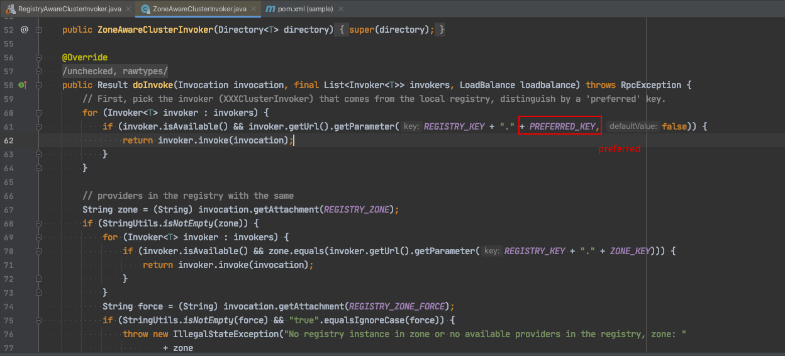

### 你会正确配置backup地址吗？

在配置dubbo注册中心时，一般会这样写

```
dubbo.registry.protocol=zookeeper
dubbo.registry.address=127.0.0.1:2181
```

也会简单地写成

```
dubbo.registry.address=zookeeper://127.0.0.1:2181
```

当zookeeper地址不止一个，需要配置backup地址时，会这样写

```
dubbo.registry.protocol=zookeeper
dubbo.registry.address=127.0.0.1:2181,127.0.0.1:2182
```

这时候如果你简写成这样

```
dubbo.registry.address=zookeeper://127.0.0.1:2181,127.0.0.1:2182
```

那就启动报错了~看下报错日志

```
java.lang.IllegalStateException: Failed to receive INITIALIZED event from zookeeper, pls. check if url zookeeper://127.0.0.1:2181,127.0.0.1:2182/org.apache.dubbo.metadata.report.MetadataReport?client=&dubbo.config-center.root-path=/ is correct
```

为什么会这样？



从源码上能看出，当address中包含`://`时就认为address配置的是一个`URL`，此时如果要配置backup地址必须在URL参数中指定backup参数才行；

```
dubbo.registry.address=zookeeper://127.0.0.1:2181?backup=127.0.0.1:2182
```

但当address中不包含`://`时，dubbo认为你配置的第一个地址是主，逗号后的地址都是backup。

### 多注册中心有什么猫腻？

多注册中心可以这样配置

```
dubbo.registries.zk1.address=zookeeper://127.0.0.1:2181
dubbo.registries.zk2.address=disf://127.0.0.1:2182
```

这样配置dubbo的默认行为是`双注册`，`都消费`。

双注册不用说，就是会将服务注册到这两个注册中心上去，应用`启动耗时增加`。

都消费指的是针对每个provider，consumer都会和它建立连接，消费时按注册中心顺序挑选一个可用的invoker进行调用，也就是说将两个注册中心中提供的服务merge起来进行调用。假设这两个注册中心提供了相同的服务，consumer会和每个provider建立`2条长链接`。

### 设置默认消费注册中心怎么这么难？

接上条，如果消费了两个注册中心，两个注册中心都提供了相同的服务，我想设置个默认消费的注册中心怎么设置呢？一般是这么设置

```
dubbo.registries.zk1.default=true
```

但是经过实践你会发现，有可能不生效，追一下源码



可以看到当注册中心带了`default`是会被优先选中的，但为什么有时候这么配置又不行呢？

这是因为dubbo的版本问题，上图是`2.7.3`版本的代码，到`2.7.5`以后`RegistryAwareClusterInvoker`被换成了`ZoneAwareClusterInvoker`，看下这个类



`default`参数被换成了`preferred`，所以我们的配置需要改成

```
dubbo.registries.zookeeper.preferred=true
```

如果不放心，可以两个配置都加上，以防万一。

---

> 关于作者：专注后端的中间件开发，公众号"捉虫大师"作者，关注我，给你最纯粹的技术干货


- 原文链接: https://mp.weixin.qq.com/s/C32EYc9VWGXDgjJe5S6Ayw
- 发布时间: 2021.03.15