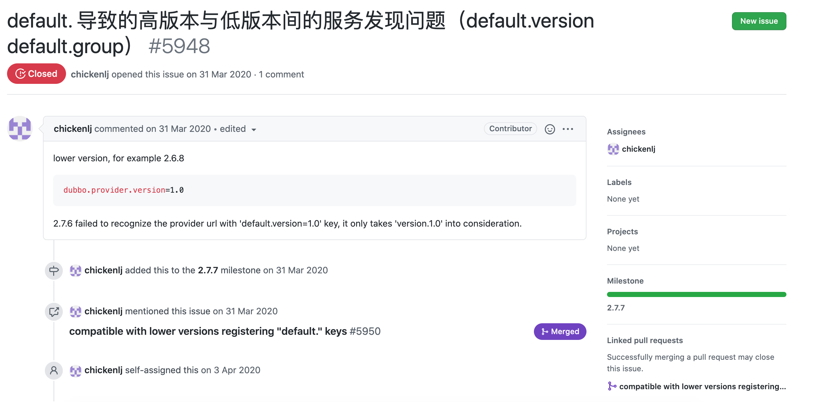
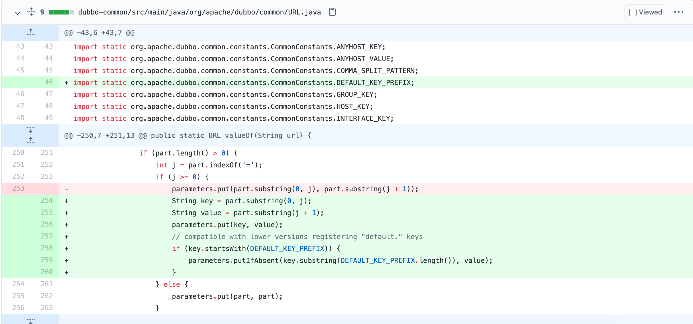

上周遇到个关于升级dubbo 2.6 到2.7的兼容性问题，差点造成线上故障，这里记录下，也给大家提个醒。

### 问题回放

有一个接口的提供方（dubbo 2.6.6）这么配置接口的版本号

```xml
<dubbo:provider version="1.0.0"/>
```

消费方（也是dubbo 2.6.6）的reference这么配置

```xml
<dubbo:reference id="sampleService" version="1.0.0" check="false" interface="com.newboo.basic.api.SampleService"/>
```

然后升级`消费方的dubbo版本`，经过一通操作将消费者升级到dubbo 2.7.3，预发测试时发现调用报`No provider`，还好是在测试时发现，不然后果不堪设想

```xml
No provider available from registry 127.0.0.1:2181
```

### 根因分析

查看注册到注册中心的URL是这样

`dubbo://10.0.0.6:20880/com.newboo.basic.api.SampleService?anyhost=true&application=ddog-provider-this-two&bind.ip=10.0.0.6&bind.port=20880&default.version=1.0.0&dubbo=2.0.2&generic=false&interface=com.newboo.basic.api.SampleService&methods=getByUid&owner=roshilikang&pid=82799&qos.accept.foreign.ip=true&qos.enable=true&side=provider&timestamp=1616848403414`

可以看到它没有`version`字段，取而代之的是`default.version`字段

看一下dubbo中匹配version这个逻辑，位置在`org.apache.dubbo.common.utils.UrlUtils`类的`isMatch`方法，摘出重点部分

```java
String consumerGroup = consumerUrl.getParameter(GROUP_KEY);
String consumerVersion = consumerUrl.getParameter(VERSION_KEY);
String consumerClassifier = consumerUrl.getParameter(CLASSIFIER_KEY, ANY_VALUE);

String providerGroup = providerUrl.getParameter(GROUP_KEY);
String providerVersion = providerUrl.getParameter(VERSION_KEY);
String providerClassifier = providerUrl.getParameter(CLASSIFIER_KEY, ANY_VALUE);
return (ANY_VALUE.equals(consumerGroup) || StringUtils.isEquals(consumerGroup, providerGroup) || StringUtils.isContains(consumerGroup, providerGroup))
        && (ANY_VALUE.equals(consumerVersion) || StringUtils.isEquals(consumerVersion, providerVersion))
        && (consumerClassifier == null || ANY_VALUE.equals(consumerClassifier) || StringUtils.isEquals(consumerClassifier, providerClassifier));
```

逻辑很简单，就是provider和consumer URL上的`version`字段得匹配上，提供者没有`version`字段，只有`default.version`字段，很显然调用时报错。

但之前2.6.6是没有问题的，为什么？看了下2.6.6的实现，代码也是一样，但点进`providerUrl.getParameter(VERSION_KEY);`，发现它的实现不简单

```
public String getParameter(String key) {
    String value = parameters.get(key);
    if (value == null || value.length() == 0) {
        value = parameters.get(Constants.DEFAULT_KEY_PREFIX + key);
    }
    return value;
}
```

先取key对应的值，取不到时，再加个前缀`default.`取一次，也就是说`version`和`default.version`两者只要有一个有值即可（version优先）。

反观2.7.3的实现就非常耿直

```java
public String getParameter(String key) {
    return parameters.get(key);
}
```

所以，这就直接导致了2.7.3调用2.6.6的default.version接口报错，类似的group也存在这个问题，甚至还有一些如timeout等参数都可能会失效。

这个问题还是比较明显，应该有人遇到，搜索了一下github，果然让我找到了相关的issue



来自：`https://github.com/apache/dubbo/issues/5948`

这个issue有一个相关联的修复，说是2.7.7已经修复了这个问题，于是我测试了一下2.7.7，很遗憾，还是报错，看了下修复代码



和2.6.6的兼容不一样，这里修复是在 `URL` 类的 `valueOf` 方法中添加兼容逻辑，修复者想的是所有注册中心上的URL字符串最终得经过这个方法才能成为URL对象，才能为dubbo所用。

想法是没错，但通过调试发现`并不是每个URL对象都来自valueOf方法`，2.7.7中订阅时对提供者的URL进行处理的是`URLStrParser`类的`parseEncodedStr`方法，所以这个修复就是无效的了。

---

> 关于作者：专注后端的中间件开发，公众号"捉虫大师"作者，关注我，给你最纯粹的技术干货

