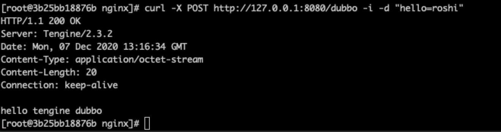
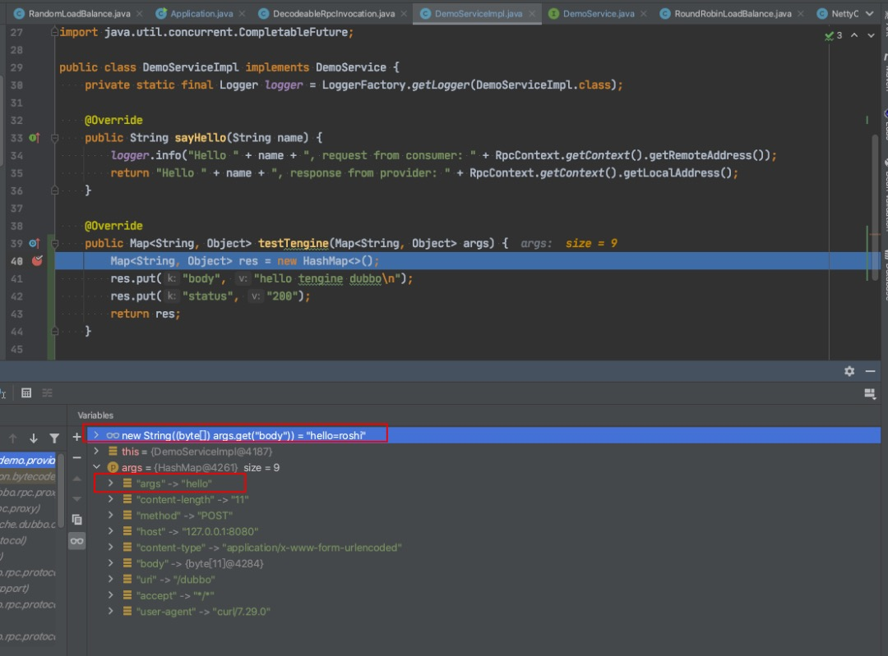
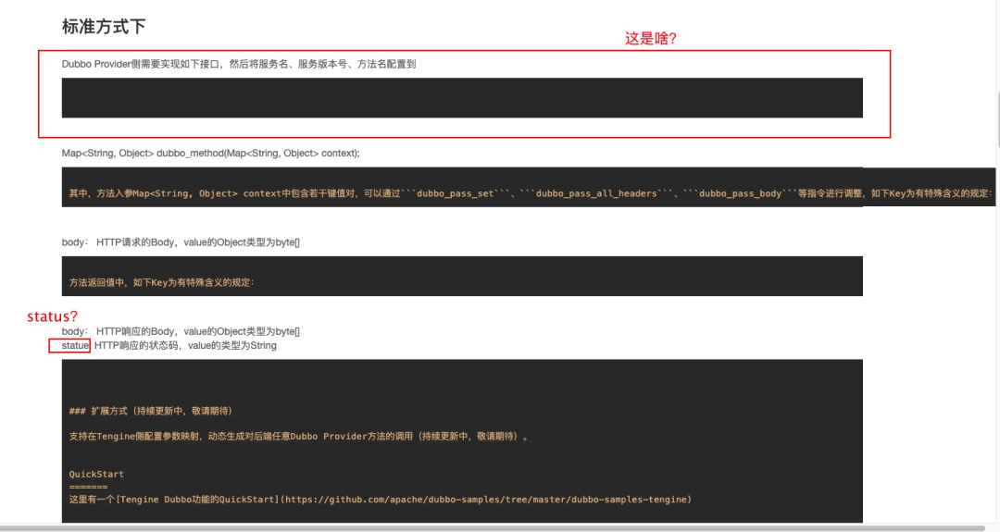

# 背景

- `Tengine`是阿里巴巴基于Nginx开发并开源的Web服务器，它继承了Nginx所有的功能和特性，并在其基础上做了大量的扩展和增强，其中像动态模块加载，四层负载均衡，reuseport支持等能力，都逐渐被Nginx官方吸收引用。Tengine在开源以后大受欢迎，成为了Nginx最好的替代品之一，官方网站（http://tengine.taobao.org/）。

- `Dubbo`是阿里巴巴开源的一款高性能、轻量级的开源Java RPC框架，它提供了三大核心能力：面向接口的远程方法调用，智能容错和负载均衡，以及服务自动注册和发现。

2019年9月，Tengine 2.3.2版本发布了`dubbo_pass`模块，支持HTTP协议到Dubbo协议的转换。Release页面如下：

`https://github.com/alibaba/tengine/releases/tag/2.3.2`

# 意义
[《Gateway技术革命 - Tengine开源Dubbo功能》](https://mp.weixin.qq.com/s/NoJlPG4yxwTfpdr8WaS7oA)对Tengine支持Dubbo协议的意义讲的比较清楚，总结有如下几点：
- 架构优化：减少一层转发，降低系统复杂度；
- 性能优势：文中给出数据，“Tengine直接支持Dubbo的架构在CPU消耗和RT上的表现在不同场景下，有28%-73%不等的性能优势”

# 实测

### Tengine环境搭建

这里我用centos的基础镜像搭了一套Tengine环境，简单说明一下步骤：

- 进入容器，创建工作目录
```
mkdir -p /home/roshi && cd /home/roshi/
```
- 下载相关源码并解压
```
wget https://github.com/alibaba/tengine/archive/2.3.2.zip
unzip 2.3.2.zip && cd tengine-2.3.2/

wget https://ftp.pcre.org/pub/pcre/pcre-8.43.tar.gz
tar xvf pcre-8.43.tar.gz

wget https://www.openssl.org/source/openssl-1.0.2s.tar.gz
tar xvf openssl-1.0.2s.tar.gz

wget http://www.zlib.net/zlib-1.2.11.tar.gz
tar xvf zlib-1.2.11.tar.gz
```
- 安装相关依赖
```
yum install gcc
yum install gcc-c++
yum -y install gcc automake autoconf libtool make
```
- 编译
```
./configure --add-module=./modules/mod_dubbo --add-module=./modules/ngx_multi_upstream_module --add-module=./modules/mod_config --with-pcre=./pcre-8.43/ --with-openssl=./openssl-1.0.2s/ --with-zlib=./zlib-1.2.11
make && make install
```
- 启动
```
/usr/local/nginx/sbin/nginx
```

### Dubbo例子

这里要提一下之前在[《dubbo应用级服务发现初体验》](../dubbo应用级服务发现初体验/dubbo应用级服务发现初体验.md)中提到的快速搭建Dubbo调试环境的方法：

- git clone https://github.com/apache/dubbo.git
- 使用/dubbo-demo目录下的例子，本文使用/dubbo-demo/dubbo-demo-api-provider下的例子

由于Tengine有限制，接口的出参和入参必须是`Map<String, Object>`，所以需要对例子进行修改：

- DemoService
```
public interface DemoService {

    String sayHello(String name);

    default Map<String, Object> testTengine(Map<String, Object> args) {
        return null;
    }

    default CompletableFuture<String> sayHelloAsync(String name) {
        return CompletableFuture.completedFuture(sayHello(name));
    }
}
```
- DemoServiceImpl.java
```
public class DemoServiceImpl implements DemoService {
    private static final Logger logger = LoggerFactory.getLogger(DemoServiceImpl.class);

    @Override
    public String sayHello(String name) {
        logger.info("Hello " + name + ", request from consumer: " + RpcContext.getContext().getRemoteAddress());
        return "Hello " + name + ", response from provider: " + RpcContext.getContext().getLocalAddress();
    }

    @Override
    public Map<String, Object> testTengine(Map<String, Object> args) {
        Map<String, Object> res = new HashMap<>();
        res.put("body", "hello tengine dubbo\n");
        res.put("status", "200");
        System.out.println("testTengine");
        return res;
    }

    @Override
    public CompletableFuture<String> sayHelloAsync(String name) {
        return null;
    }

}
```
为了更好的测试多个provider的情况，可以用同一份代码，在不同的端口起多个服务。

### 修改Tengine配置
- vi /usr/local/nginx/conf/nginx.conf
```
worker_processes  1;

events {
    worker_connections  1024;
}

http {
    include       mime.types;
    default_type  application/octet-stream;

    sendfile        on;

    server {
        listen       8080;
        server_name  localhost;

        #pass the Dubbo to Dubbo Provider server listening on 127.0.0.1:20880
        location / {
            dubbo_pass_all_headers on;
            # dubbo_pass_set args $args;
            dubbo_pass_set args hello;
            dubbo_pass_set uri $uri;
            dubbo_pass_set method $request_method;

            dubbo_pass org.apache.dubbo.demo.DemoService 0.0.0 testTengine dubbo_backend;
        }
    }


    #pass the Dubbo to Dubbo Provider server listening on 127.0.0.1:20880
    upstream dubbo_backend {
        multi 1;
        server host.docker.internal:20880;
        server host.docker.internal:20881;
    }
}
```
- 修改配置后reload配置，使其生效
```
/usr/local/nginx/sbin/nginx -s reload
```

### 测试

使用如下命令测试

```
curl -X POST http://127.0.0.1:8080/dubbo -i -d "hello=roshi"
```



看一下传参情况



### 总结

经过测试，总结以下几点：

- 接口的出参入参固定为Map<String, Object>，否则会报错
- 使用body传参，到Dubbo侧是byte[]，还需要解析
- 可以控制返回的body和http状态码，其中返回的body可以是String，也可以是byte[]类型，状态码是String类型
- 具备Tengine原生的负载均衡算法
- 具备故障摘除，Tegine与Dubbo Provider会建立长连接，断开则摘除
- 未实现version、group分组功能，文档中的version实测没有任何效果

# 最后
正如[《Gateway技术革命 - Tengine开源Dubbo功能》](https://mp.weixin.qq.com/s/NoJlPG4yxwTfpdr8WaS7oA)文中所说，Tengine只是完成了作为Dubbo Consumer的协议支持，像服务发现、自定义接口、服务分组、容错降级等其他功能暂未实现，暂时还离生产有些距离。

最后吐槽一下Tengine官网的文档



# 参考
- 官方文档 http://tengine.taobao.org/document_cn/ngx_http_dubbo_module_cn.html
- 官方例子 https://github.com/apache/dubbo-samples/tree/master/dubbo-samples-tengine

---


> 关于作者：专注后端的中间件开发，公众号"捉虫大师"作者，关注我，给你朴实无华的技术干货


- 原文链接: https://mp.weixin.qq.com/s/-bA3cGDSwFa63aq0s8AUFA
- 发布时间: 2020.12.10