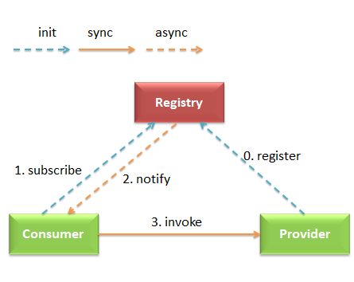
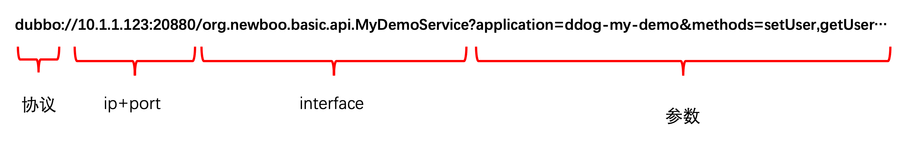
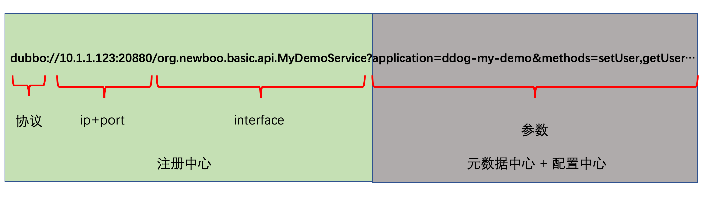
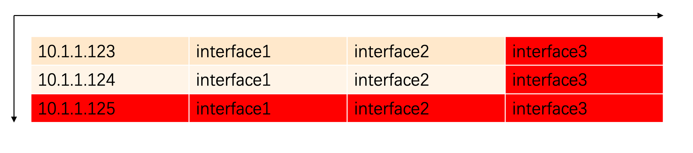
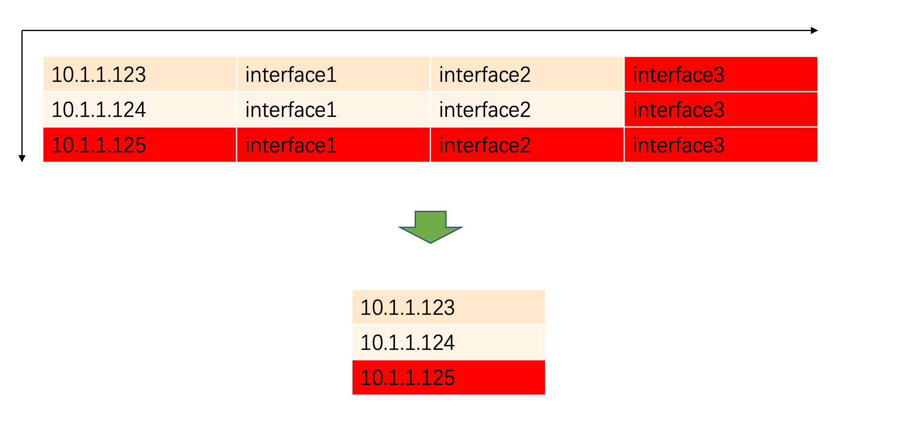
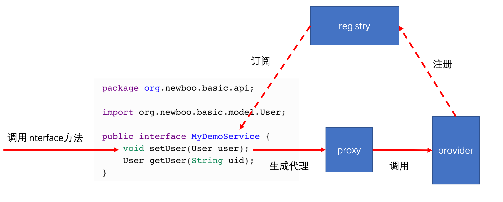
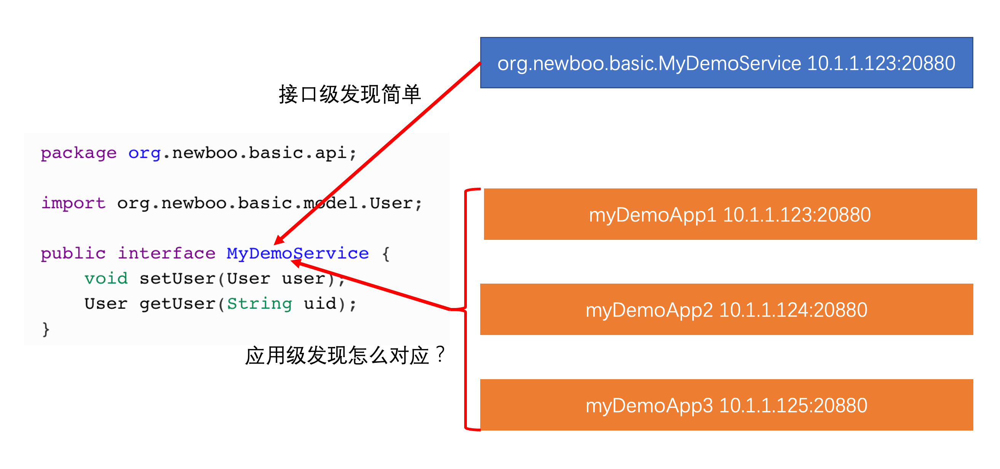
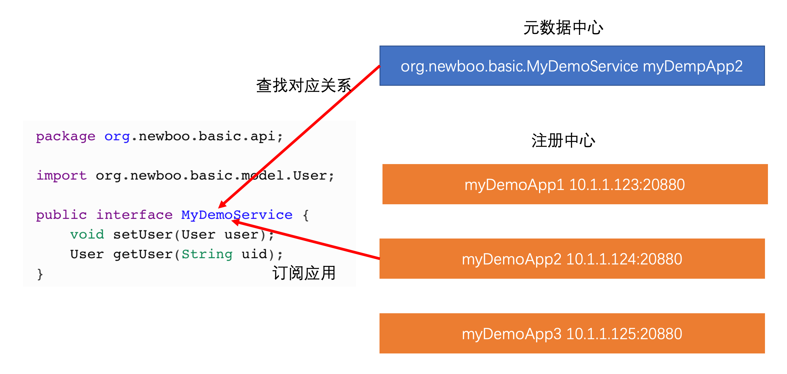

dubbo 是一款开源的 RPC 框架，主要有3个角色： **提供者（provider）**、**消费者（consumer）** 、**注册中心（registry）**



提供者启动时向注册中心注册服务地址，消费者启动时订阅服务，并通过获取到的提供者地址发起调用，当提供者地址变更时，通过注册中心向消费者推送变更。这就是 dubbo 主要的工作流程。

在2.7.5之前，dubbo 只支持接口级服务发现模型，>=2.7.5的版本提供了接口级与应用级两种服务发现模型，3.0之后的版本应用级服务发现更是非常重要的一个功能。

本文将从为什么需要引入应用级服务发现，dubbo 实现应用级服务发现的难点以及dubbo3 是如何解决这些问题这三个部分进行讲解。

开始前，我们先了解下 dubbo 最初提供的接口级服务发现是怎样的。

### 接口级服务发现长啥样？

dubbo 服务的注册发现是以**接口**为最小粒度的，在 dubbo 中将其抽象为一个**URL**，大概长这样：

> dubbo://10.1.1.123:20880/org.newboo.basic.api.MyDemoService?anyhost=true&application=ddog-my-demo&deprecated=false&dubbo=2.0.2&dynamic=true&generic=false&interface=org.newboo.basic.api.MyDemoService&methods=setUser,getUser&owner=roshilikang&release=2.7.6&side=provider&threads=500

看着很乱？捋一捋：



- **协议**代表提供服务的协议，如果注册了 grpc 服务，这里就是 **grpc://**

- **ip**、**port** 代表是哪台机器的哪个端口提供服务
- **interface** 代表了注册的接口名，它直接对应到代码中需要暴露服务的 interface，如下：

```java
package org.newboo.basic.api;

import org.newboo.basic.model.User;

public interface MyDemoService {
    void setUser(User user);
    User getUser(String uid);
}
```
- **参数**代表了服务的一些参数，可能是元数据，也可能是配置信息

> 细心的你一定发现了，一个 interface 可以包含多个 dubbo 接口，所以把它称为接口级服务发现有些不妥，应该是**服务级服务发现**，但服务的定义比较模糊，可能会被误认为是应用，甚至后面介绍的 dubbo 应用级服务发现使用的关键字也是 **service**，所以我们用接口级这个更加易懂的概念来代替。

### 接口级服务发现有什么问题？

#### **数据太多** 

无论是存储还是变更推送压力都可能遇到瓶颈，数据多表现在这两个方面：

- 注册的单条数据太大

这个问题好解决：**拆！**

dubbo 在 2.7 之后的版本支持了**元数据中心**与**配置中心**，对于URL的参数进行分类存储。持久不变的（如application、method等）参数存储到元数据中心中，可能在运行时变化（timeout、tag）的存储到配置中心中



- 注册数据条数太多



无论是增加一台机器还是增加一个接口，其增长都是线性的，这个问题比单条数据大更严重。

当抹去注册信息中的 interface 信息，这样数据量就大大减少



#### 非主流

只用过 dubbo 的同学可能觉得这很主流。

但从服务发现的角度来看：

无论是用的最多的服务注册发现系统 **DNS**，又或者是 **SpringCloud** 体系、**K8S** 体系，都是以应用为维度进行服务注册发现的，只有和这些体系对齐，才能更好地与之进行打通。

在我了解的范围里，目前只有 **dubbo**、**SOFARPC**、**HSF** 三个阿里系的 RPC 框架支持了接口级的服务发现。

### 接口级服务发现如何使用

provider端暴露服务：

```xml
<dubbo:registry address="zookeeper://127.0.0.1:2181"/>

<dubbo:service interface="org.newboo.basic.api.MyDemoService" ref="myNewbooDemoService"/>
```

consumer端引用服务：

```xml
<dubbo:registry address="zookeeper://127.0.0.1:2181"/>

<dubbo:reference id="myNewbooDemoService" interface="org.newboo.basic.api.MyDemoService"/>
```



本地调用远程的方法时，只需要配置一个 **reference**，然后直接使用 interface 来调用，我们不必去实现这个 interaface，dubbo 自动帮我们生成了一个代理进行 RPC 调用，屏蔽了通信的细节，让我们有种**像调用本地方法一样调用远程方法的感觉**，这也是 dubbo 的优势。

从这里我们能看出为什么 dubbo 要设计成接口级服务发现，因为要为每一个 interface 生成一个代理，就必须定位到该 interface 对应服务暴露的服务地址，为了方便，dubbo 就这么设计了。

### 如果要实现应用级服务发现你会怎么做？

如果让我来设计应用级服务发现，注册不必多说，按应用名注册即可。

> 但这里有个隐藏问题是应用名的唯一性，应用名必须得很好的管理起来，否则重复、随意改动都可能导致服务发现失效

至于订阅，在目前 dubbo 机制下，必须得告诉消费者消费的每个接口是属于哪个应用，这样才能定位到接口部署在哪里。

### 难点是什么

实现 dubbo 应用级服务发现，难点在于

- 兼容性，除了服务发现，其他改动点尽量少，且能兼容接口级到应用级的过渡
- 接口到应用的部署关系，在接口级服务发现中，是不需要关心接口部署在哪个应用上的，但换做应用级，必须得知道这点，但这点就增加了开发者的使用难度，有没有方案尽量屏蔽细节？



### dubbo3 是如何解决这些问题的？

#### 兼容性

保留接口级服务发现，且默认采取双注册方式，可配置使用哪种服务发现模型，如下配置使用应用级服务发现

```xml
<dubbo:registry address="zookeeper://127.0.0.1:2181?registry-type=service"/>
```

>居然使用了**service**这个关键字😅

#### 如何查找接口对应的应用

- 方案1：手动配置，实现简单，架构简单，但用户使用成本高，这种方式 dubbo3 已支持

```xml
<dubbo:service services="ddog-my-demo-p0" interface="org.newboo.basic.api.MyDemoService" ref="myNewbooDemoService"/>
```

- 方案2：服务自省

名词有点高大上，但道理很简单，让 dubbo 自己去匹配，提供者注册的时候把接口和应用名的映射关系存储起来，消费者消费时根据接口名获取到部署的应用名，再去做服务发现。

数据存储在哪里？显然元数据中心非常合适。该方案用户使用起来和之前接口级没有任何不同，但需要增加一个元数据中心，架构变得复杂。

且有一个问题是，如果接口在多个应用下部署了，dubbo 查找的策略是都去订阅，这可能在某些场景下不太合适。



### 最后

本文从接口级服务发现讲到应用级服务发现，包含了为什么 dubbo 设计成接口级服务发现，接口级服务发现有什么痛点？基于 dubbo 现状如何设计应用级服务发现，应用级服务发现实现有什么难点等等问题进行解答，相信看完的小伙伴一定有所收获。

---

> 搜索关注微信公众号"捉虫大师"，后端技术分享，架构设计、性能优化、源码阅读、问题排查、踩坑实践。

