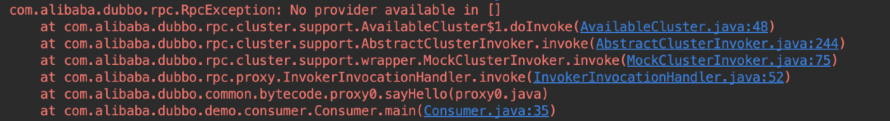
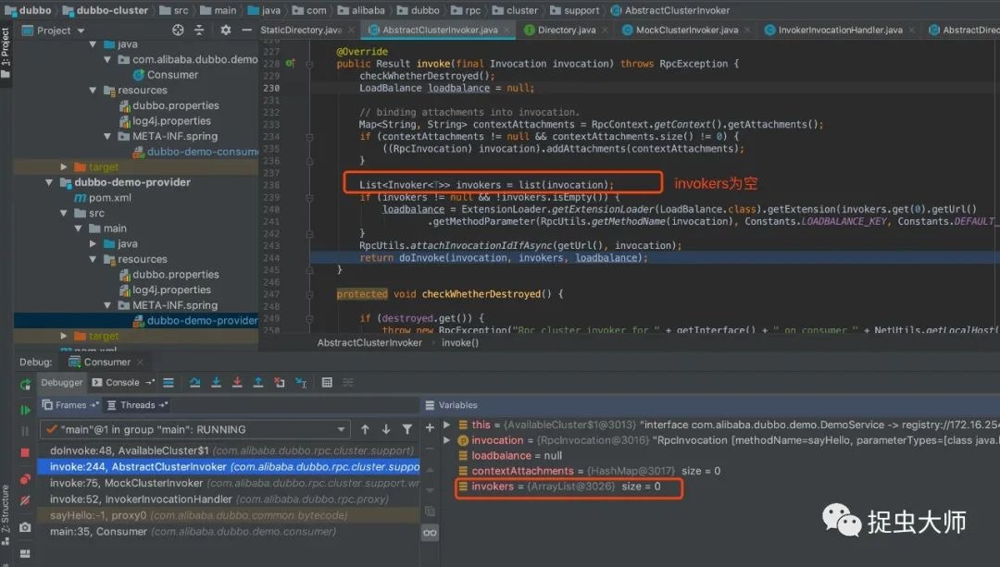
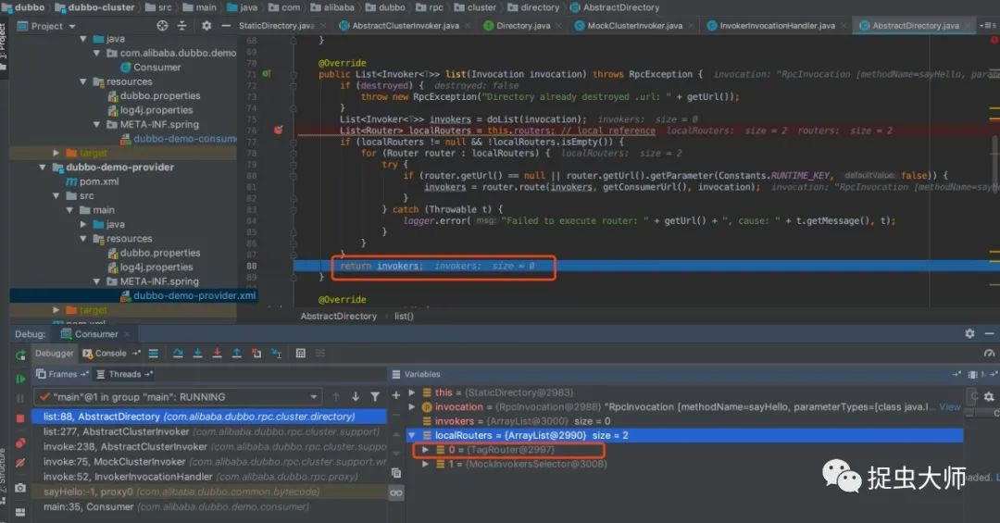
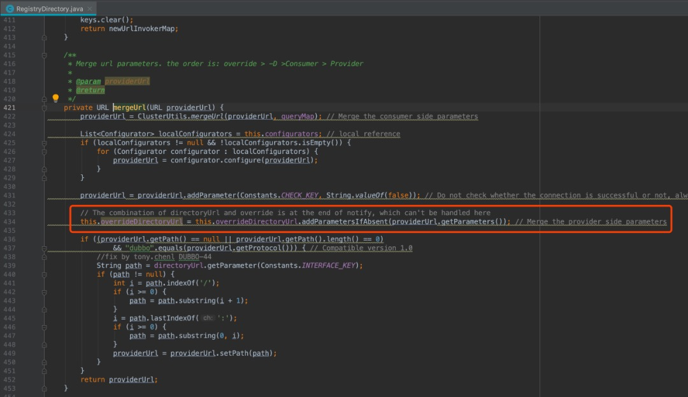

# 背景介绍
今天的主角是标签路由和dubbo的多注册中心。标签路由在之前的文章[《以为是青铜，没想到是王者的dubbo标签路由》](../以为是青铜，没想到是王者的dubbo标签路由/以为是青铜，没想到是王者的dubbo标签路由.md)中已经详细介绍过，多注册中心是dubbo可以使用多个注册中心来提供或者消费服务，利用多注册中心的特性可以搭建多机房。然而很不幸，当多注册中心遇上标签路由，却产生了一个bug

# bug复现
在复现bug前需要介绍一下dubbo的版本，dubbo社区目前主力维护的有 2.6.x 和 2.7.x 两大版本，其中

- 2.6.x 主要以 bugfix 和少量 enhancements 为主，因此能完全保证稳定性
- 2.7.x 作为社区的主要开发版本，得到持续更新并增加了大量新 feature 和优化
- 2.6.x 版本的包名为 com.alibaba.dubbo，2.7.x 的包名为 com.apache.dubbo，不仅包名不同，两个版本之间还存在着大量的不兼容，网上有一篇关于携程升级dubbo 2.7.x的踩坑文章（点击阅读原文可查看），总结一句话就是2.6.x升级到2.7.x没有想象中的那么简单。

本文要介绍的bug来源于2.6.x版本，下面开始复现。

- 下载dubbo源码并切换到2.6.x分支
- 使用源码中的例子dubbo/dubbo-demo/dubbo-demo-provider和dubbo/dubbo-demo/dubbo-demo-consumer
- 修改consumer与provider的注册中心配置，都连上两个不同的zk注册中心（什么注册中心不重要，也可以是别的，如nacos）
- 启动两个provider，第一个provider直接启动，第二个provider修改一下监听端口，并且打上tag（-Ddubbo.provider.tag=lkxiaolou）
- 启动consumer消费，发现报错

按照对dubbo的认知来说，如果两个provider，其中一个带了tag，另一个不带，不带tag时请求则会路由到不带tag的provider上去，为什么会报错呢？

# bug分析

从异常堆栈能看出是抛出异常的是AvailableCluster，dubbo的cluster即集群容错机制，总结一下2.6.x中内置的集群容错机制

- FailoverCluster: 失败自动切换，依次调用每个provider，有成功才返回
- FailFastCluster: 快速失败，失败直接抛出异常
- FailsafeCluster: 安全失败，失败不抛出异常，而是返回空结果
- FailbackCluster: 失败不抛出异常，返回空结果，并在后台等一会再次尝试调用
- ForkingCluster: 并行调用，可设置并发数，只要有一个成功即返回结果
- AvailableCluster: 调用前检查provider是否可用，全部不可用抛出 “No provider available in []” 异常
- BroadcastCluster: 串行调用所有provider，只要有一个异常就抛出异常，否则返回最后一次调用的结果
- MergeableCluster: 根据配置并行调用多个接口，返回合并后的结果，合并策略可以配置

有一点需要明确的是集群容错是需要显示的配置才生效，否则只会使用默认策略failover。

代码和配置中并没有指定使用AvailableCluster，但是从异常堆栈中却看到错误由它抛出，比较奇怪。对于这种可稳定复现的bug，调试最方便也最快。

首先断点打在异常抛出的位置，看调用栈，判断调用从哪里过来 

然后根据堆栈反推

这里invokers为空，肯定有问题，跟进去 

在走完了tagRouter的逻辑后，invokers就空了，另一个主角“标签路由”登场了 注意到，这里的两个invokers，其实是对注册中心的调用，而且都带上了tag 

再去看一下AvailableCluster在dubbo源码中有没有被使用，果然找到了，也是和注册中心有关，在多注册中心时使用了AvailableCluster 

经过一番源码的研究，发现dubbo在消费多注册中心时，会去看哪个注册中心是否可用，只用可用的注册中心，把对注册中心可用性判断也包装成了一次调用，即invoker，理论上没啥问题，但是问题出在它竟然带上了tag，tag从何而来？经过几次断点调试，发现它来自这里 

即注册中心的Directory的URL会把每个provider的URL上的参数都合并过来，注释上也写的很清楚，参数配置有一套覆盖优先级，override优先级最高，override即在注册中心上的覆盖配置，如权重就可以通过override来配置，consumer次之，如调用的超时时间以consumer为准，provider最低，为默认配置。所以只要有一个provider带上了tag就会被合并到注册中心的URL上。

总结一下bug产生的原因：

1. dubbo在消费多注册中心时使用AvailableCluster包装对注册中心可用性的判断
2. dubbo对注册中心的调用invoker，合并了来自所有provider的参数
3. 对注册中心可用性判断的调用也经过了tag路由，不带tag的调用过滤了所有带tag的注册中心
4. 找不到可用的注册中心，报错

# bug解决

去github上提个issue，有回复说2.7.x版本已经修复了该问题，升级2.7.x谈何容易。修复这个bug有两条路可走：第一，注册中心的invoker不要合并来自所有provider的参数，这条实现起来比较困难，因为它的逻辑和dubbo调用的逻辑混在一起，无法区分；第二可以让注册中心的调用不经过路由。这也是2.7.x的修复逻辑，dubbo 2.6.x会强制初始化两个路由，而2.7.x是靠传入参数来控制路由策略，初始化注册中心的StaticDirectory时就不初始化路由规则。

2.7.x版本使用了ZoneAwareCluster来代替2.6.x多注册中心的AvailableCluster，正是前面提到的多机房建设，它可以将注册中心用zone来标记隔离，每次调用时，选择和注册中心同一个zone里面的provider来调用，起到“就近调用“的作用。

---

> 关于作者：专注后端的中间件开发，公众号"捉虫大师"作者，关注我，给你朴实无华的技术干货

- 原文链接: https://mp.weixin.qq.com/s/6TS3YhU27dYEXO4fVbvTEA
- 发布时间: 2020.04.18

