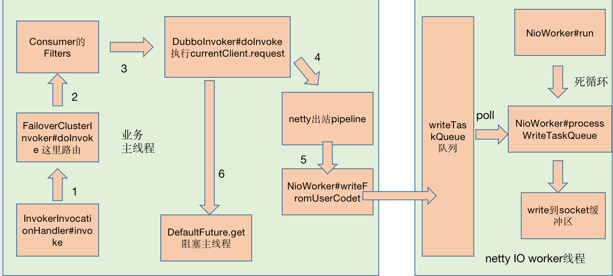
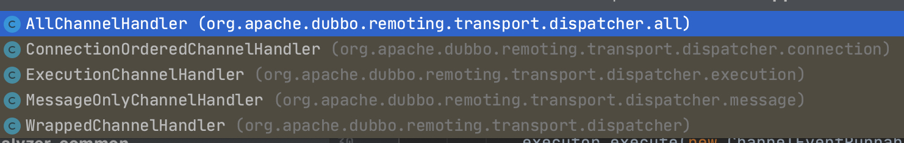
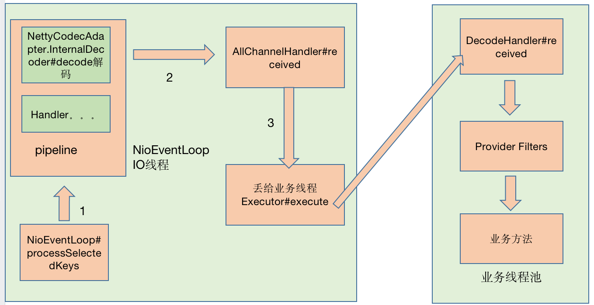
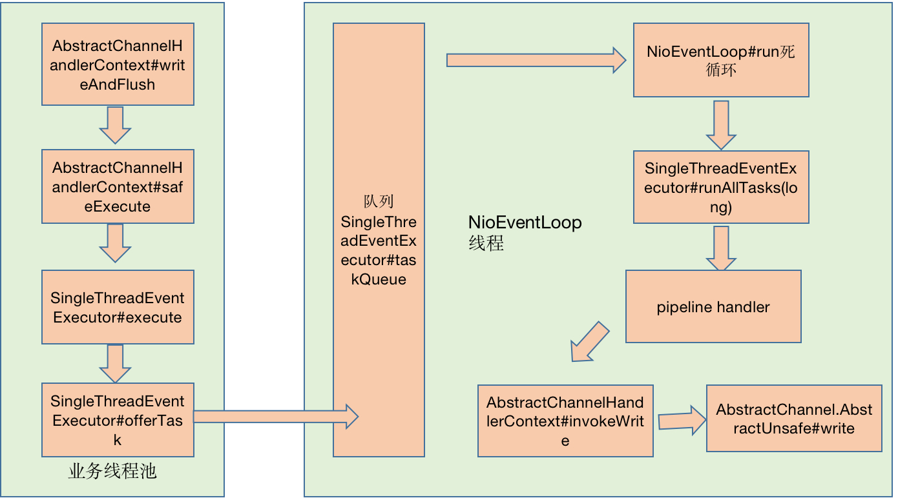
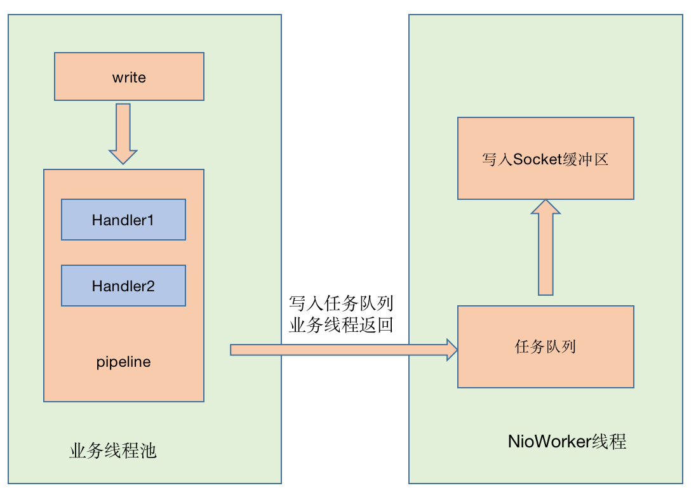
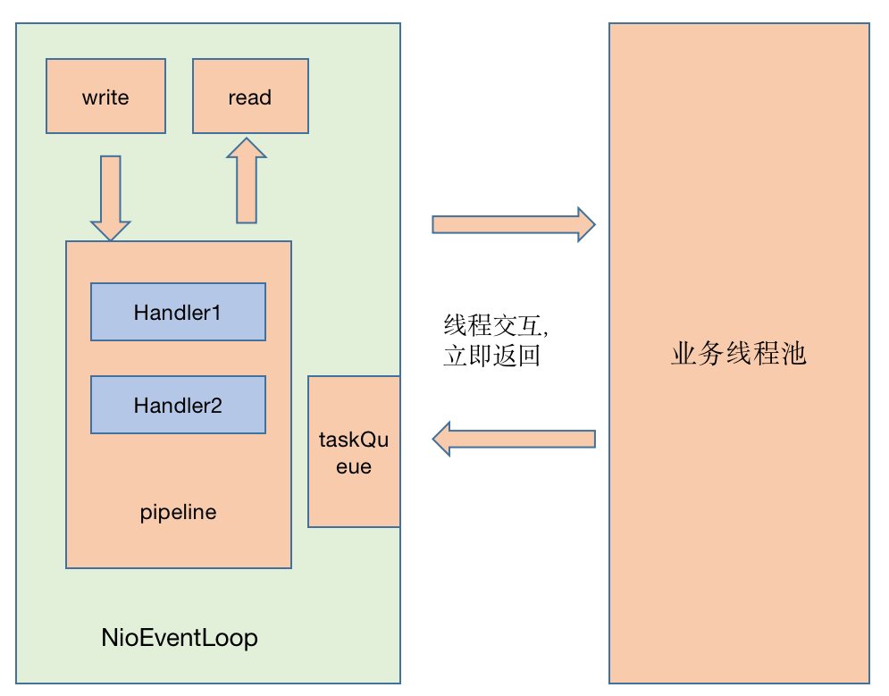
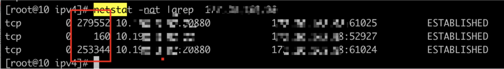

hello，大家好呀，我是小楼！

今天给大家带来一篇关于Dubbo IO交互的文章，本文是一位同事写的文章，用有趣的文字把枯燥的知识点写出来，通俗易懂，非常有意思，所以迫不及待找作者授权然后分享给大家：

---

### 一些有趣的问题

Dubbo是一个优秀的RPC框架，其中有错综复杂复杂的线程模型，本篇文章笔者从自己浅薄的认知中，来剖析Dubbo的整个IO过程。在开始之前，我们先来看如下几个问题：

- 业务方法执行之后，数据包就发出去了吗？
- netty3和netty4在线程模型上有什么区别？
- 数据包到了操作系统socket buffer，经历了什么？
- Provider打出的log耗时很小，而Consumer端却超时了，怎么可以排查到问题？
- 数据包在物理层是一根管道就直接发过去吗？
- Consumer 业务线程await在Condition上，在哪个时机被唤醒？
- ……

接下来笔者将用Dubbo2.5.3 作为Consumer，2.7.3作为Provider来讲述整个交互过程，笔者站在数据包视角，用第一人称来讲述，系好安全带，我们出发咯。

### 有意思的旅行

#### 1、Dubbo2.5.3 Consumer端发起请求

我是一个数据包，出生在一个叫Dubbo2.5.3 Consumer的小镇，我的使命是是传递信息，同时也喜欢出门旅行。

某一天，我即将被发送出去，据说是要去一个叫Dubbo 2.7.3 Provider的地方。

这一天，业务线程发起发起方法调用，在`FailoverClusterInvoker#doInvoke`我选择了一个Provider，然后经过各种Consumer Filter，再经过Netty3的pipeline，最后通过`NioWorker#scheduleWriteIfNecessary`方法，我来到了NioWorker的writeTaskQueue队列中。

当我回头看主线程时，发现他在DefaultFuture中的Condition等待，我不知道他在等什么，也不知道他要等多久。

我在writeTaskQueue队列排了一会队，看到netty3 IO worker线程在永不停歇的执行run方法，大家都称这个为死循环。

最后，我很幸运，`NioWorker#processWriteTaskQueue`选择了我，我被写到操作系统的Socket缓冲区，我在缓冲区等待，反正时间充足，我回味一下今天的旅行，期间我辗转了两个旅行团，分别叫主线程和netty3 IO worker线程，嗯，两个旅行团服务都不错，效率很高。

索性我把今天的见闻记录下来，绘制成一张图，当然不重要的地方我就忽略了。

#### 2、操作系统发送数据包

我在操作系统socket缓冲区，经过了很多神奇的事情。

  1. 在一个叫传输层的地方给我追加上了目标端口号、源端口号

  2. 在一个叫网络层的地方给我追加上了目标IP、源IP，同时通过目标IP与掩码做与运算，找到“下一跳”的IP

  3. 在一个叫数据链路层的地方通过ARP协议给我追加上了“下一跳”的目标MAC地址、源MAC地址

最有意思的是，我们坐的都是一段一段缆车，每换一个缆车，就要修改目标MAC地址、源MAC地址，后来问了同行的数据包小伙伴，这个模式叫“下一跳”，一跳一跳的跳过去。这里有很多数据包，体型大的单独一个缆车，体型小的几个挤一个缆车，还有一个可怕的事情，体型再大一点，要分拆做多个缆车（虽然这对我们数据包没啥问题），这个叫拆包和粘包。期间我们经过交换机、路由器，这些地方玩起来很Happy。

当然也有不愉快的事情，就是拥堵，目的地缆车满了，来不及被拉走，只能等待咯。

#### 3、在Provider端的经历

好不容易，我来到了目的地，我坐上了一个叫“零拷贝”号的快艇，迅速到了netty4，netty4果然富丽堂皇，经过`NioEventLoop#processSelectedKeys`，再经过pipeline中的各种入站handler，我来到了AllChannelHandler的线程池，当然我有很多选择，但是我随便选了一个目的地，这里会经历解码、一系列的Filter，才会来的目的地“业务方法”，`NettyCodecAdapter#InternalDecoder`解码器很厉害，他可以处理拆包和粘包。

在AllChannelHandler的线程池中我会停留一会，于是我也画了一张图，记录旅程。

自此，我的旅行结束，新的故事将由新的数据包续写。

#### 4、Provider端产生了新的数据包

我是一个数据包，出生在一个叫Dubbo2.7.3 Provider的小镇，我的使命是去唤醒命中注定的线程，接下来我会开始一段旅行，去一个叫Dubbo2.5.3 Consumer的地方。

在Provider业务方法执行之后
- 由业务线程经过`io.netty.channel.AbstractChannelHandlerContext#writeAndFlush`
- 再经过`io.netty.util.concurrent.SingleThreadEventExecutor#execute` 执行addTask
- 将任务放入队列`io.netty.util.concurrent.SingleThreadEventExecutor#taskQueue`
- 我便跟随着`io.netty.channel.AbstractChannelHandlerContext$WriteTask`等待NioEventLoop发车，等待的过程中，我记录了走过的脚步。

在这里，我看到NioEventLoop是一个死循环，不停地从任务队列取任务，执行任务`AbstractChannelHandlerContext.WriteAndFlushTask`，然后指引我们到socket缓冲区等候，永不知疲倦，我似乎领略到他身上有一种倔强的、追求极致的匠人精神。  

经过`io.netty.channel.AbstractChannel.AbstractUnsafe#write`，我到达了操作系统socket缓冲区。在操作系统层面和大多数数据包一样，也是做缆车达到目的地。

#### 5、到达dubbo 2.5.3 Consumer端

到达dubbo 2.5.3 Consumer端，我在操作系统socket缓冲区等了一会，同样是坐了“零拷贝”号快艇，到达了真正的目的地dubbo 2.5.3 Consumer，在这里我发现，`NioWorker#run`是一个死循环，然后执行`NioWorker#processSelectedKeys`，通过`NioWorker#read`方式读出来，我就到达了AllChannelHandler的线程池，这是一个业务线程池。

我在这里等待一会，等任务被调度，我看见`com.alibaba.dubbo.remoting.exchange.support.DefaultFuture#doReceived`被执行了，同时Condition的signal被执行了。我在远处看到了一个被阻塞线程被唤醒，我似乎明白，因为我的到来，唤醒了一个沉睡的线程，我想这应该是我生命的意义。

至此，我的使命也完成了，本次旅程结束。

### 总结netty3和netty4的线程模型

我们根据两个数据包的自述，来总结一下netty3和netty4的线程模型。

#### 1、netty3写过程

#### 2、Netty4的读写过程

> 说明：这里没有netty3的读过程，netty3读过程和netty4相同，pipeline是由IO线程执行。

总结：netty3与netty4线程模型的区别在于写过程，netty3中pipeline由业务线程执行，而netty4无论读写，pipeline统一由IO线程执行。

netty4中ChannelPipeline中的Handler链统一由I/O线程串行调度，无论是读还是写操作，netty3中的write操作时由业务线程处理Handler链。netty4中可以降低线程之间的上下文切换带来的时间消耗，但是netty3中业务线程可以并发执行Handler链。如果有一些耗时的Handler操作会导致netty4的效率低下，但是可以考虑将这些耗时操作放在业务线程最先执行，不放在Handler里处理。由于业务线程可以并发执行，同样也可以提高效率。

### 一些疑难问题排查

有遇到一些比较典型的疑难问题，例如当Provider答应的didi.log耗时正常，而Consumer端超时了，此时有如下排查方向，didi.log的Filter其实处于非常里层，往往不能反映真实的业务方法执行情况。

1. Provider除了业务方向执行外，序列化也有可能是耗时的，所以可以用arthas监控最外侧方法org.apache.dubbo.remoting.transport.DecodeHandler#received，排除业务方法耗时高的问题

2. Provider中数据包写入是否耗时，监控io.netty.channel.AbstractChannelHandlerContext#invokeWrite方法

3. 通过netstat 也能查看当前tcp socket的一些信息，比如Recv-Q, Send-Q，Recv-Q是已经到了接受缓冲区，但是还没被应用代码读走的数据。Send-Q是已经到了发送缓冲区，但是对方还没有回复Ack的数据。这两种数据正常一般不会堆积，如果堆积了，可能就有问题了。

4. 看Consumer NioWorker#processSelectedKeys （dubbo2.5.3）方法是否耗时高。

5. 直到最终整个链路的所有细节……问题肯定是可以解决的。

### 尾声

在整个交互过程中，笔者省略线程栈调用的一些细节和源代码的细节，例如序列化与反序列化，dubbo怎么读出完整的数据包的，业务方法执行前那些Filter是怎么排序和分布的，netty的Reactor模式是如何实现的。这些都是非常有趣的问题……