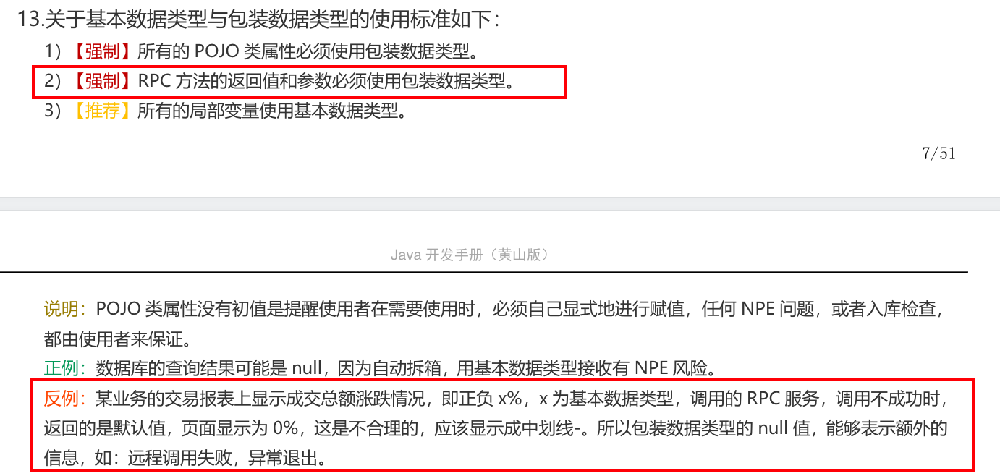
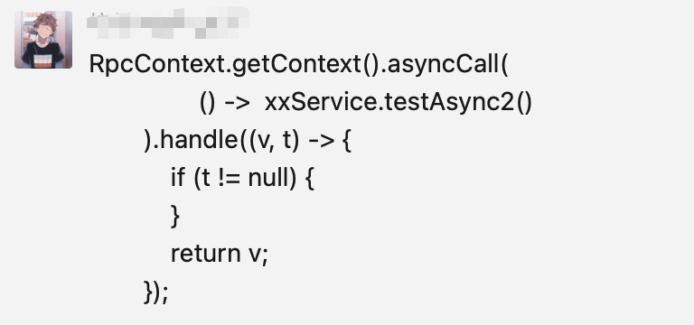
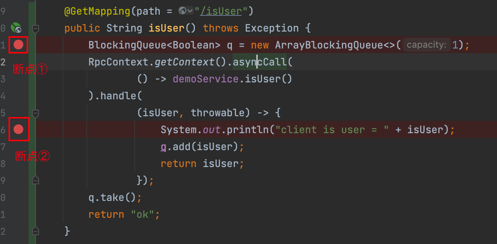
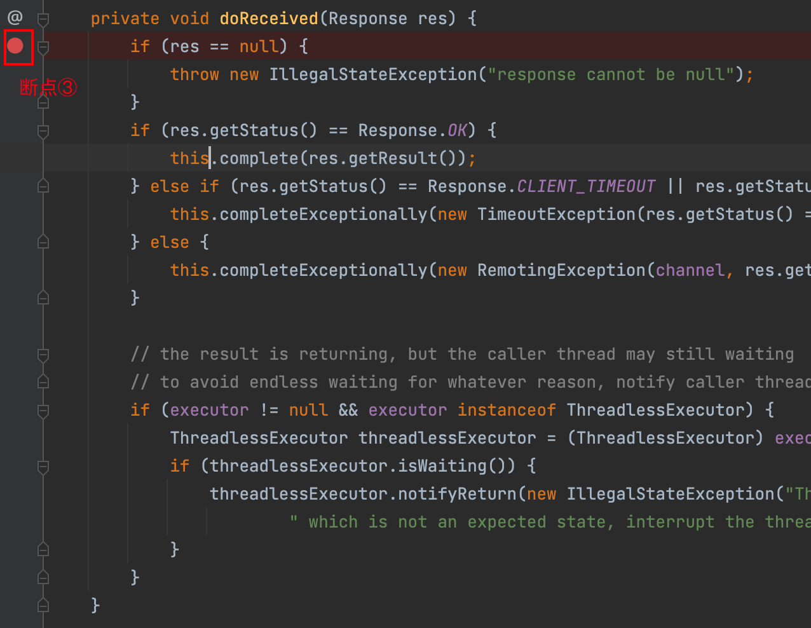
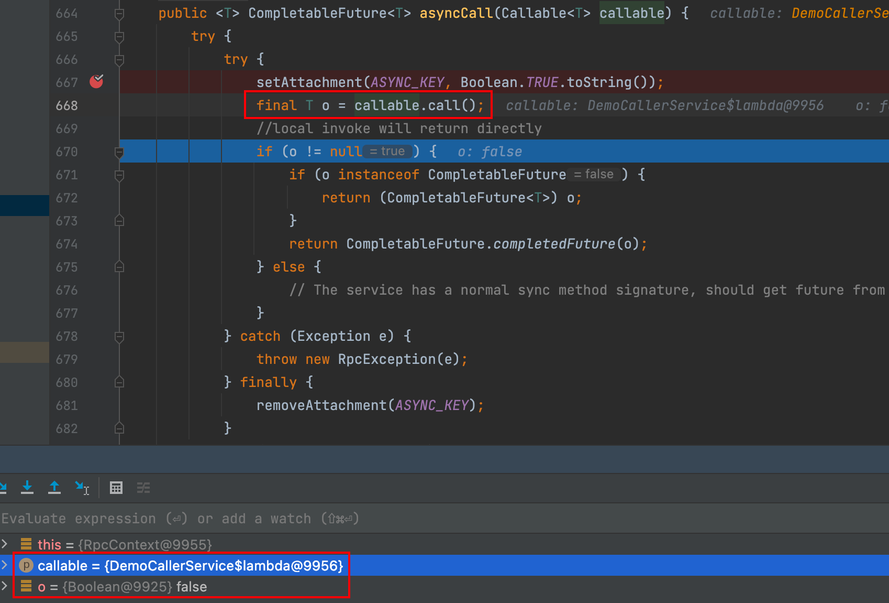
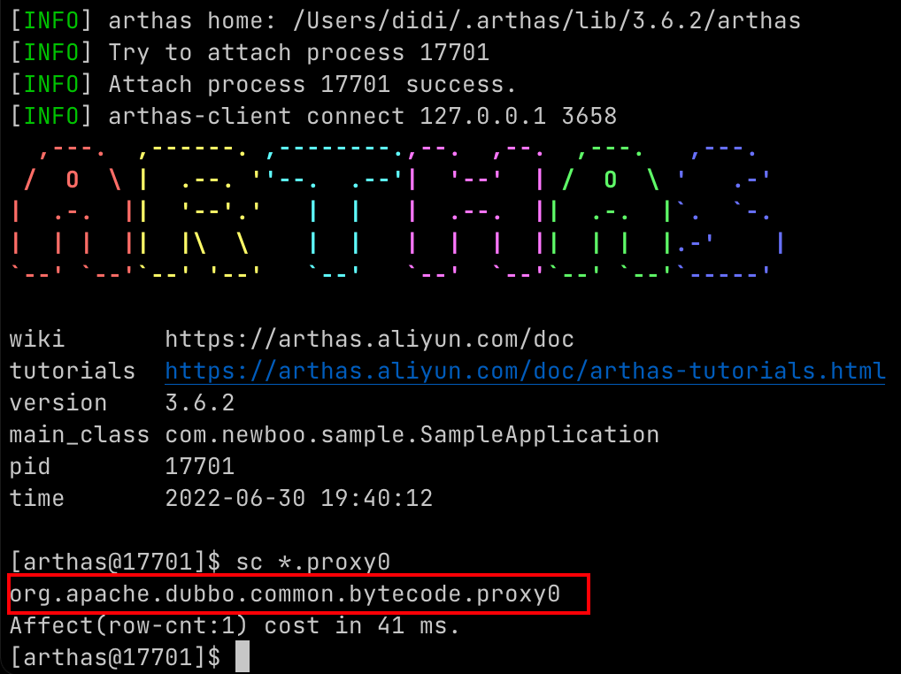
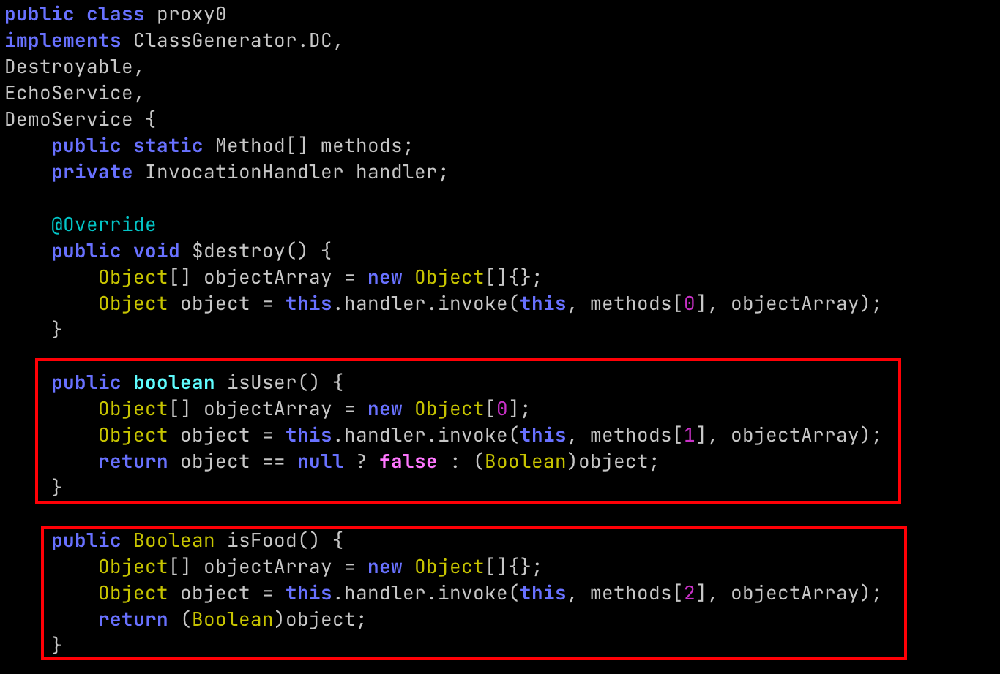
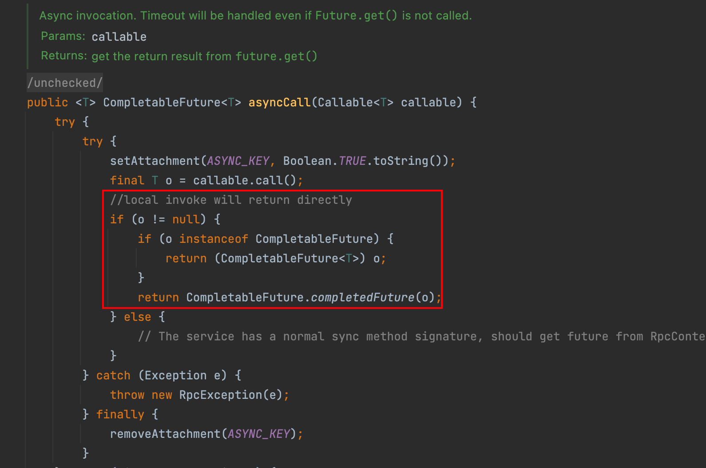

hello，大家好呀，我是小楼。

最近一个技术群有同学at我，问我是否熟悉Dubbo，这我熟啊~


他说遇到了一个Dubbo异步调用的问题，怀疑是个BUG，提到BUG我可就不困了，说不定可以水，哦不...写一篇文章。


### 问题复现

遇到问题，尤其不是自己遇到的，必须要复现出来才好排查，截一个当时的聊天记录：


他的问题原话是：
> 今天发现一个问题 有一个dubbo接口返回类型是boolean， 把接口从同步改成异步 server 端返回true 消费端却返回false，把boolean改成Boolean就能正常返回结果 有碰到过这个问题吗

注意几个重点：
- 接口返回类型是boolean
- 同步改为异步调用返回的boolean和预期不符合
- boolean基本类型改成包装类型Boolean就能正常返回

听到这个描述，我的第一反应是这个返回结果定义为boolean肯定有问题！

《Java开发手册》中就强调了RPC接口返回最好不要使用基本类型，而要使用包装类型：



但这个是业务编码规范，如果RPC框架不能使用boolean作为返回值，岂不是个BUG？而且他强调了是同步改为异步调用才出现这种情况，说明同步没问题，有可能是异步调用的锅。

于是我顺口问了Dubbo的版本，说不定是某个版本的BUG。得到回复，是2.7.4版本的Dubbo。

于是我拉了个工程准备复现这个问题。

哎，等等~

Dubbo异步调用的写法可多了，于是我又问了下他是怎么写的。



知道怎么写的就好办了，写个Demo先：

1. 定义Dubbo接口，一个返回boolean，一个返回Boolean

```java
public interface DemoService {
    boolean isUser();
    Boolean isFood();
}
```

2. 实现Provider，为了简单，都返回true，并且打了日志

```java
@Service
public class DemoServiceImpl implements DemoService {

    @Override
    public boolean isUser() {
        System.out.println("server is user : true");
        return true;
    }

    @Override
    public Boolean isFood() {
        System.out.println("server is food : true");
        return true;
    }
}
```

3. 实现Consumer，为了方便调用，实现了一个Controller，为了防止本机调用，injvm设置为false，这里是经验，injvm调用逻辑和远程调用区别挺大，为了防止干扰，统一远程调用。

```java
@RestController
public class DemoCallerService {

    @Reference(injvm = false, check = false)
    private DemoService demoService;

    @GetMapping(path = "/isUser")
    public String isUser() throws Exception {
        BlockingQueue<Boolean> q = new ArrayBlockingQueue<>(1);
        RpcContext.getContext().asyncCall(
                () -> demoService.isUser()
        ).handle(
                (isUser, throwable) -> {
                    System.out.println("client is user = " + isUser);
                    q.add(isUser);
                    return isUser;
                });
        q.take();
        return "ok";
    }

    @GetMapping(path = "/isFood")
    public String isFood() throws Exception {
        BlockingQueue<Boolean> q = new ArrayBlockingQueue<>(1);
        RpcContext.getContext().asyncCall(
                () -> demoService.isFood()
        ).handle(
                (isFood, throwable) -> {
                    System.out.println("client is food = " + isFood);
                    q.add(isFood);
                    return isFood;
                });
        q.take();
        return "ok";
    }
}
```

4. 启动一个Provider，再启动一个Consumer进行测试，果然和提问的同学表现一致：

- 先调用`isUser`（返回boolean），控制台打印：

```
// client ...
client is user = false
// server ...
server is user : true
```

- 再调用`isFood`（返回Boolean），控制台打印：

```
// client ...
client is food = true
// server ...
server is food : true
```

### 问题排查

1. Debug

先猜测一下是哪里的问题，server端返回true，应该问题不大，可能是client端哪里转换出错了。但这都是猜想，我们直接从client端接受到的数据开始，如果接收的数据没问题，肯定就是后续处理出了点小差错。

如果你非常熟悉Dubbo的调用过程，直接知道大概在这里

`com.alibaba.dubbo.remoting.exchange.support.DefaultFuture#doReceived`

如果你不熟悉，那就比较困难了，推荐读一下之前的文章[《我是一个Dubbo数据包...》](https://mp.weixin.qq.com/s/vXwMQirPMejCnXQufAqQFg)，知道得越多，干活就越快。

我们打3个断点：




- 断点①为了证明我们的请求进来了
- 断点②为了证明进了回调
- 断点③为了能从接受到数据包的初始位置开始排查

按照我们的想法，执行顺序应该是①、③、②，但是这里很奇怪，`并没有按照我们的预期执行，而是先执行①，再执行②，最后执行③！`

这是为什么？`对于排查问题中的这些没有符合预期的蛛丝马迹，要特别留心，很可能就是一个突破点`。

于是我们对`asyncCall`这个方法进行跟踪：



发现这里callable调用call返回了false，然后false不为null且不是CompletableFuture的实例，于是直接调用了`CompletableFuture.completedFuture(o)`。

看到这里估计有部分小伙伴发现了问题，正常情况下，Dubbo的异步调用，执行调用后，不会立马得到结果，只会拿到一个null或者一个CompletableFuture，然后在回调方法中等待server端的返回。

这里的逻辑是如果返回的结果不为null且不为CompletableFuture的实例就直接将CompletableFuture设置为完成，立马执行回调。

暂且不管这个逻辑。

我们先看为什么会返回false。这里的callable是Dubbo生成的一个代理类，其实就是封装了调用Provider的逻辑，有没有办法看看他封装的逻辑呢？有！用arthas。

2. arthas

我们下载安装一个arthas，可以参考如下文档：

> https://arthas.aliyun.com/doc/quick-start.html

attach到我们的Consumer进程上，执行`sc`命令（查看已加载的类）查看所有生成的代理类，由于我们的Demo就生成了一个，所以看起来很清晰

```
sc *.proxy0
```



再使用`jad`命令反编译已加载的类：

```
jad org.apache.dubbo.common.bytecode.proxy0
```



看到这里估计小伙伴们又揭开了一层疑惑，`this.handler.invoke`就是去调用Provider，由于这里是异步调用，必然返回的是null，所以返回值定义为boolean的方法返回了`false`。

看到这里，估计小伙伴们对《Java开发手册》里的规范有了更深的理解，这里的处理成false也是无奈之举，不然难道返回true？属于信息丢失了，无法区分是调用的返回还是其他异常情况。

我们再回头看`asyncCall`：



圈出来的这段代码令人深思，尤其是最后一行，为啥直接将CompletableFuture设置为完成？

从这个方法的名字能看出它是执行异步调用，但这里有行注释：

```
//local invoke will return directly
```

首先这个注释的格式上下不一，`//`之后讲道理是需要一个空格的，我觉得这里提个PR改下代码格式肯定能被接受~

其次local invoke，我理解应该是injvm这种调用，为啥要特殊处理？这个处理直接就导致了返回基本类型的接口在异步调用时必然会返回false的BUG。

我们测试一下injvm的调用，将demo中injvm参数改为true，Consumer和Provider都在一个进程中，果然和注释说的一样：

```
server is user : true
client is user = true
```

### 如何修复

我觉得这应该算是Dubbo的一个BUG，虽然这种写法不提倡，但作为一款RPC框架，这个错误还是不应该。

修复的办法就是在injvm分支这里加上判断，如果是injvm调用还是保持现状，如果不是injvm调用，直接忽略，走最后的return逻辑：

```
public <T> CompletableFuture<T> asyncCall(Callable<T> callable) {
    try {
        try {
            setAttachment(ASYNC_KEY, Boolean.TRUE.toString());
            final T o = callable.call();
            //local invoke will return directly
            if (o != null) {
                if (o instanceof CompletableFuture) {
                    return (CompletableFuture<T>) o;
                }
                if (injvm()) { // 伪代码
                    return CompletableFuture.completedFuture(o);
                }
            } else {
                // The service has a normal sync method signature, should get future from RpcContext.
            }
        } catch (Exception e) {
            throw new RpcException(e);
        } finally {
            removeAttachment(ASYNC_KEY);
        }
    } catch (final RpcException e) {
        // ....
    }
    return ((CompletableFuture<T>) getContext().getFuture());
}
```

### 最后

排查过程中还搜索了github，但没有什么发现，说明这个BUG遇到的人很少，可能是大家用异步调用本来就很少，再加上返回基本类型就更少，所以也不奇怪。

而且最新的代码这个BUG也还存在，所以你懂我意思吧？这也是个提交PR的好机会~

不过话说回来，我们写代码最好还是遵循规范，这些都是前人为我们总结的最佳实践，如果不按规范来，可能就会有意想不到的问题。

当然遇到问题也不要慌，代码就在那躺着，工具也多，还怕搞不定吗？

最后，感谢群里小伙伴提供素材，感谢大家的阅读，如果能动动小手帮我点个`赞`和`在看`就更好了。我们下期再见~

对了，标题为什么叫《再送你一次》？因为之前送过呀~

- [《发现一个开源项目优化点，点进来就是你的了》](https://mp.weixin.qq.com/s/IJOFhLezjMgZc_v5p2MP5A)