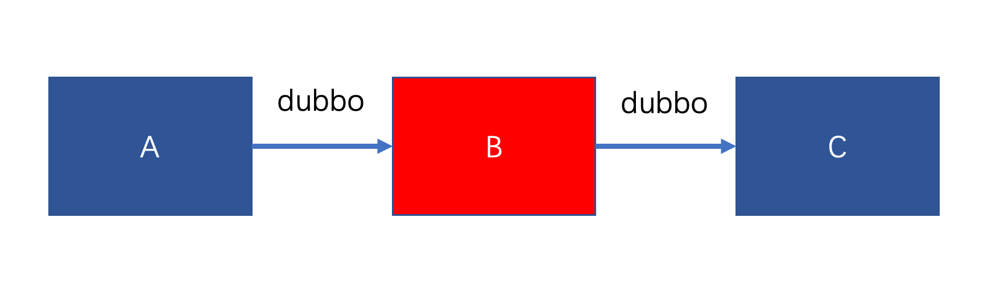
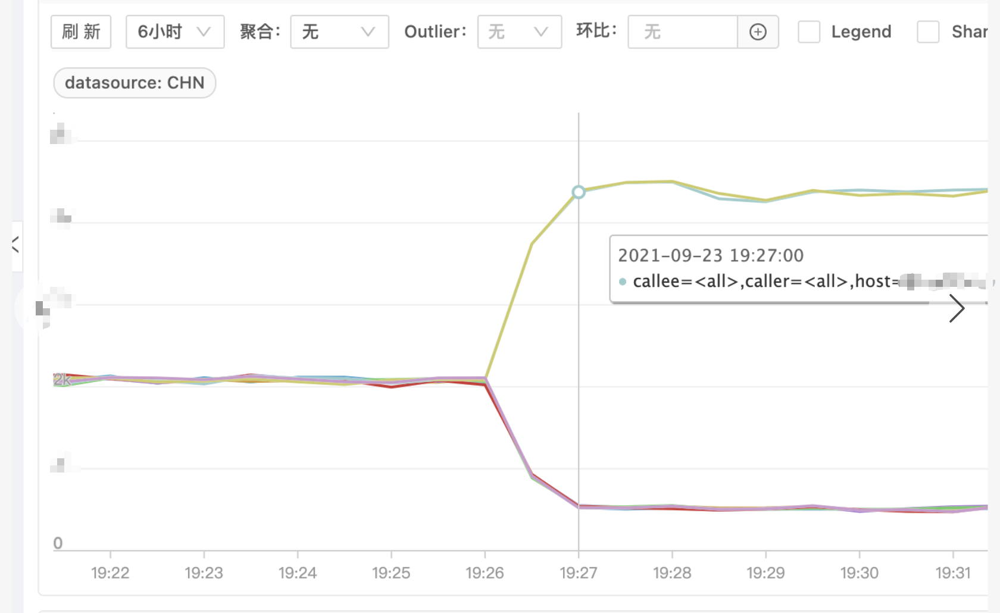
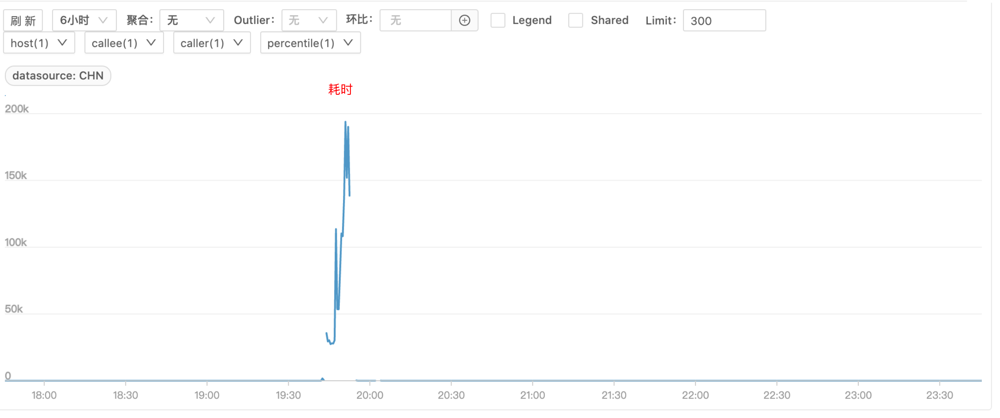
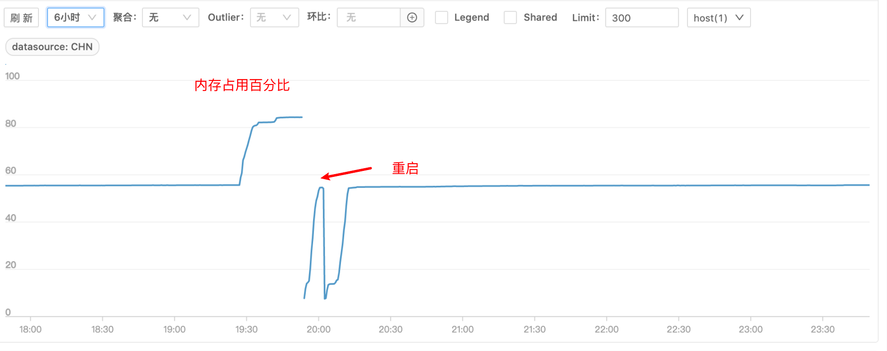
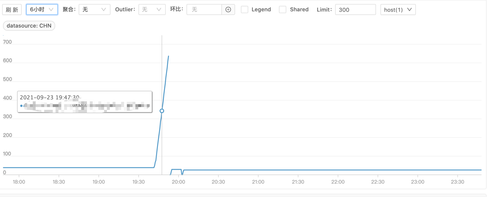
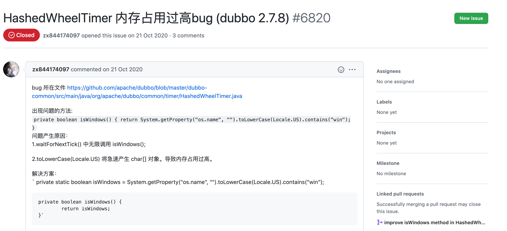
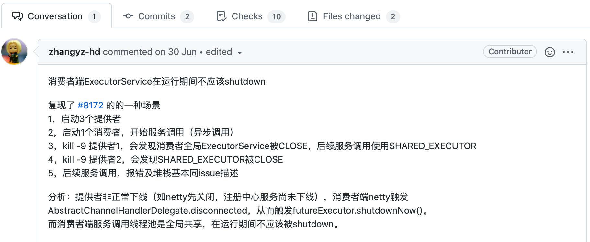
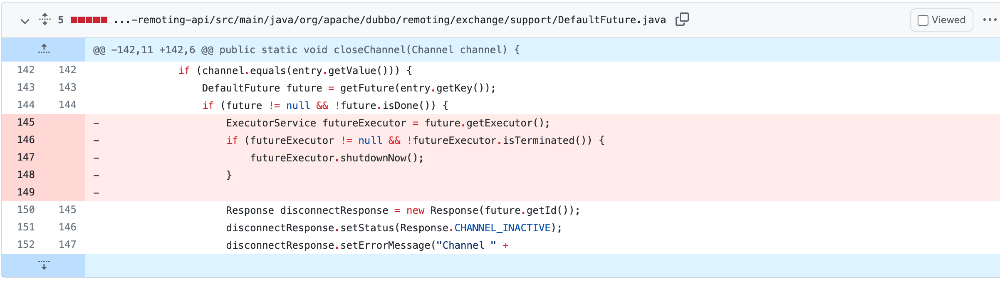
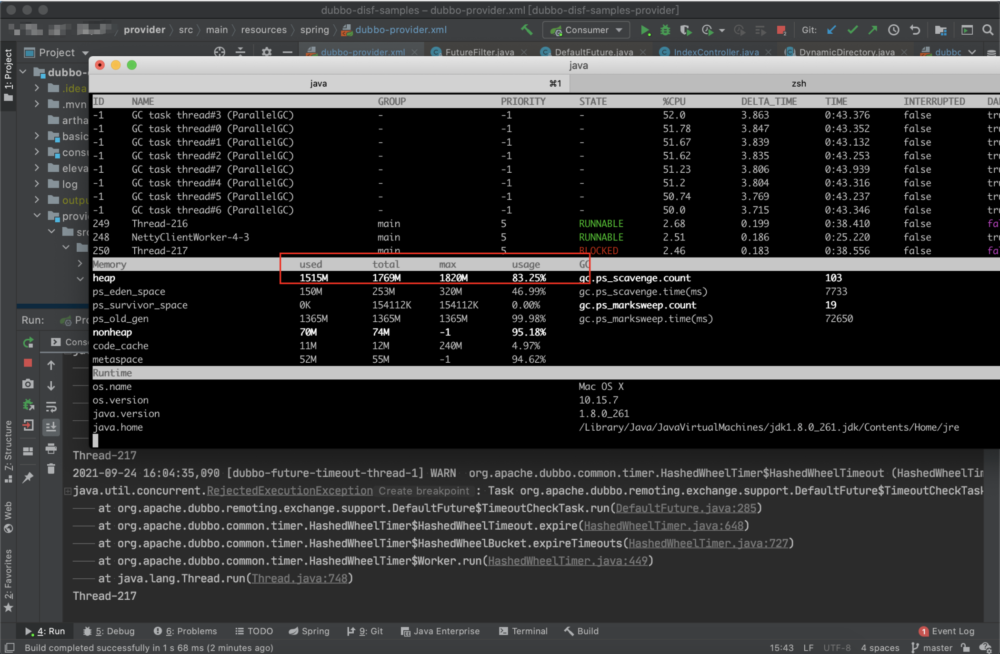

> 本文已收录 https://github.com/lkxiaolou/lkxiaolou 欢迎star。搜索关注微信公众号"捉虫大师"，后端技术分享，架构设计、性能优化、源码阅读、问题排查、踩坑实践。

### 背景

最近某天的深夜，刚洗完澡就接到业务方打来电话，说他们的 dubbo 服务出故障了，要我协助排查一下。

电话里，询问了他们几点

- 是线上有损故障吗？——是
- 止损了吗？——止损了
- 有保留现场吗？——没有

于是我打开电脑，连上 VPN 看问题。为了便于理解，架构简化如下



只需要关注 A、B、C 三个服务，他们之间调用都是 dubbo 调用。

发生故障时 B 服务有几台机器完全夯死，处理不了请求，剩余正常机器请求量激增，耗时增加，如下图（图一请求量、图二耗时）





### 问题排查

由于现场已被破坏，只能先看监控和日志

- 监控

除了上述监控外，翻看了 B 服务 CPU 和内存等基础监控，发现故障的几台机器内存上涨比较多，都达到了 80% 的水平线，且 CPU 消耗也变多



这时比较怀疑内存问题，于是看了下 JVM 的 fullGC 监控



果然 fullGC 时间上涨很多，基本可以断定是内存泄漏导致服务不可用了。但为什么会内存泄漏，还无法看出端倪。

- 日志

申请机器权限，查看日志，发现了一条很奇怪的 WARN 日志

```
[dubbo-future-timeout-thread-1] WARN org.apache.dubbo.common.timer.HashedWheelTimer$HashedWheelTimeout
(HashedWheelTimer.java:651) 
-  [DUBBO] An exception was thrown by TimerTask., dubbo version: 2.7.12, current host: xxx.xxx.xxx.xxx
java.util.concurrent.RejectedExecutionException: 
Task org.apache.dubbo.remoting.exchange.support.DefaultFuture$TimeoutCheckTask$$Lambda$674/1067077932@13762d5a 
rejected from java.util.concurrent.ThreadPoolExecutor@7a9f0e84[Terminated, pool size = 0, 
active threads = 0, queued tasks = 0, completed tasks = 21]
```

可以看出业务方使用的是**2.7.12**版本的 dubbo

拿这个日志去 dubbo 的 github 仓库搜了一下，找到了如下这个 issue：

> https://github.com/apache/dubbo/issues/6820



但很快排除了该问题，因为在 2.7.12 版本中已经是修复过的代码了。

继续又找到了这两个 issue：

> https://github.com/apache/dubbo/issues/8172
>
> https://github.com/apache/dubbo/pull/8188

从报错和版本上来看，完全符合，但没有提及内存问题，先不管内存问题，看看是否可以按照 **#8188** 这个 issue 复现



issue中也说的比较清楚如何复现，于是我搭了这样三个服务来复现，刚开始还没有复现。通过修复代码来反推



删除代码部分是有问题，但我们复现却难以进入这块，怎么才能进入呢？

这里一个 feature 代表一个请求，只有当请求没有完成时才会进入，这就好办了，让 provider 一直不返回，肯定可以实现，于是在provider 端测试代码加入

```java
Thread.sleep(Integer.MAX_VALUE);
```

经过测试果然复现了，如 issue 所说，当 kill -9 掉第一个 provider 时，消费者全局 ExecutorService 被关闭，当 kill -9 第二个 provider 时，SHARED_EXECUTOR 也被关闭。

那么这个线程池是用来干什么的呢？

它在 **HashedWheelTimer** 中被用来检测 consumer 发出的请求是否超时。

HashedWheelTimer 是 dubbo 实现的一种时间轮检测请求是否超时的算法，具体这里不再展开，改天可以详细写一篇 dubbo 中时间轮算法。

当请求发出后，如果可以正常返回还好，但如果超过设定的超时时间还未返回，则需要这个线程池的任务来检测，对已经超时的任务进行打断。

如下代码为提交任务，当这个线程池被关闭后，提交任务就会抛出异常，超时也就无法检测。

```java
public void expire() {
    if (!compareAndSetState(ST_INIT, ST_EXPIRED)) {
        return;
    }
    try {
        task.run(this);
    } catch (Throwable t) {
        if (logger.isWarnEnabled()) {
            logger.warn("An exception was thrown by " + TimerTask.class.getSimpleName() + '.', t);
        }
    }
}
```

到这里恍然大悟：如果请求一直发送，不超时，那是不是有可能撑爆内存？于是我又模拟了一下，并且开了 3 个线程一直请求  provider，果然复现出内存被撑爆的场景，而当不触发这个问题时，内存是一直稳定在一个低水平上。



> 这里我用的 arthas 来看的内存变化，非常方便

### 得出结论

在本地复现后，于是跟业务方求证一下，这个问题复现还是比较苛刻的，首先得是**异步调用**，其次 **provider 需要非正常下线**，最后 **provider 需要有阻塞**，即请求一直不返回。

异步调用得到业务方的确认，provider 非正常下线，这个比较常见，物理机的故障导致的容器漂移就会出现这个情况，最后 provider 有阻塞这点也得到业务方的确认，确实 C 服务有一台机器在那个时间点附近僵死，无法处理请求，但进程又是存活的。

所以这个问题是 dubbo 2.7.12 的 bug 导致。翻看了下这个 bug 是 2.7.10 引入， 2.7.13 修复。

### 复盘

差不多花了1天的时间来定位和复现，还算顺利，运气也比较好，没怎么走弯路，但这中间也需要有些地方需要引起重视。

- 止损的同时最好能保留现场，如本次如果在重启前 dump 下内存或摘除流量保留机器现场，可能会帮助加速定位问题。如配置 OOM 时自动 dump 内存等其他手段。这也是本起事故中不足的点
- 服务的可观测性非常重要，不管是日志、监控或其他，都要齐全。基本的如日志、出口、进口请求监控、机器指标（内存、CPU、网络等）、JVM 监控（线程池、GC 等）。这点做的还可以，基本该有的都有
- 开源产品，可从关键日志去网络查找，极大概率你遇到的问题大家也遇到过。这也是这次幸运的点，少走了很多弯路
---
