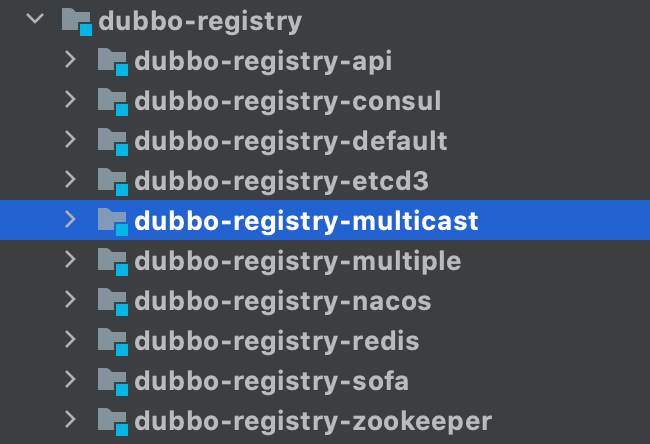
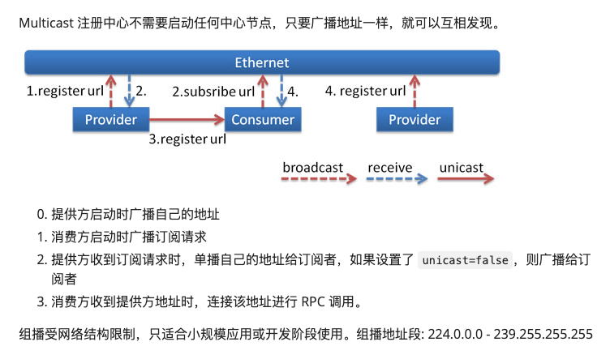
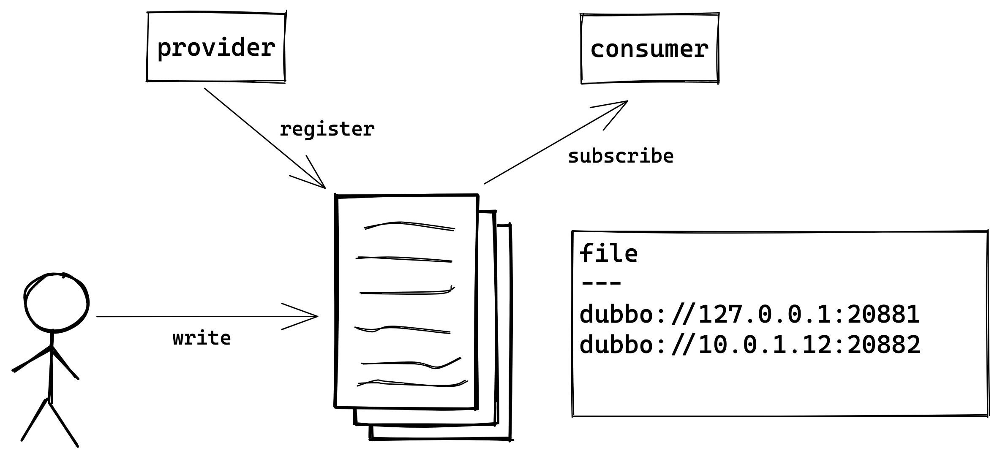
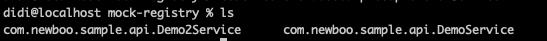
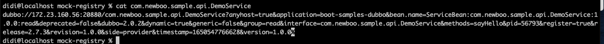
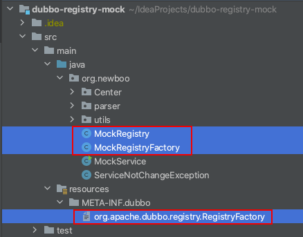
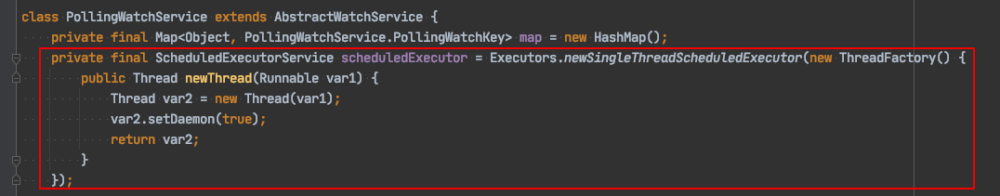
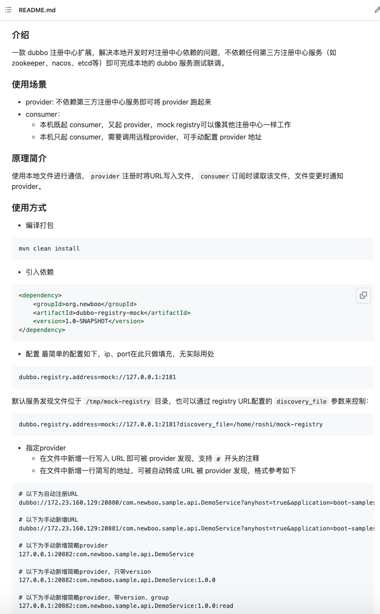

hello大家好呀，我是小楼。

作为一名基础组件开发，服务好每一位业务开发同学是我们的义务（KPI）。

客服群里经常有业务开发同学丢来一段代码、一个报错，而我们，当然要微笑服务，耐心解答。


有的问题，凭借多年踩坑经验，一眼就能看出；有的问题，看一眼代码也能知道原因，但有的问题，还真就光凭看是看不出来的，这时，只能下载代码，本地跑跑看了。

熟悉我的朋友都知道，我从事dubbo相关开（客）发（服）工作多年，所以我就来讲一个dubbo问题排查过程中的有趣的事。

通常遇到看不能解决的问题时，先git拉取代码，再导入IDEA，找到main方法点击启动，一顿操作下来，不出意外，肯定会有点小错误，比如这条：

> Socket error occurred: localhost/127.0.0.1:2181: Connection refused

看到2181端口就知道这是本地没有装zookeeper（下文简称zk），问题不大，docker直接拉一个zk镜像，起个容器就完事。

随着这样的习惯日积月累，低配的Mac上相继跑了etcd、redis、mysql等等容器，重要的是还打开了N个IDEA窗口。

每当启动一个新的项目时，风扇呼呼地直接将IDEA卡死。

这时，我陷入了思考，能不能少跑点程序？

etcd、redis、mysql暂时搞不定，但dubbo的注册中心我熟啊！柿子当然要挑软的捏。

### 需求梳理

在开干之前，得先梳理一下需求，于是我脑子闪现出无数个在本地测试时遇到的与dubbo注册中心有关问题的瞬间，但仔细一捋，无外乎两种：

- 作为provider：最最最主要的就是不要阻断应用启动
- 作为consumer：
  - 不要阻断应用启动
  - 可以发现并调用本地的provider
  - 可以调用远程的provider
  - 可以手动指定调用任意provider

除了这两个功能上的需求，还得解决我们最初的问题：**不要依赖第三方服务**（如zk）。

### 调研

由于一开始就想到了利用dubbo注册中心扩展来实现这个功能，为了不重复造轮子，翻了一下dubbo源码，看看是否已经有相应的实现：




发现除了dubbo-registry-multicast之外都是依赖了第三方服务，所以这个multicast是啥呢？dubbo官方文档说的很清楚：




乍一看很符合我们的需求，但仔细一想，还是有几点不满足：

1. 不一定能发现远程的provider，如果大家代码都是用的zk，而你把代码拉下来注册中心改成multicast是没法发现远程的服务的；
2. 没法手动指定调用任意provider。

### 产品设计

服务发现得有个载体，要么通过第三方组件、要么通过网络。但我们忽略了，在本地，磁盘也可以作为一个载体。

provider注册向磁盘文件写入，consumer订阅即读取磁盘文件，当磁盘文件有变更时通知consumer，大概是这么个样子：




这样设计有什么好处呢？

- 不依赖其他服务，只是文件的读写，不会阻塞应用启动
- consumer和provider都在本地时，可以像其他注册中心（如zk、nacos等）一样工作，对开发者完全透明
- 可以手动修改、指定调用任意provider

唯一的缺点是，无法发现远程的provider，但我们可以手动指定，也算是没有大碍。

我们以dubbo 2.7.x版本的接口级服务发现来设计我们的产品，因为这个版本使用的最多。

首先要考虑的是如何去组织服务发现文件，由于是接口级服务发现，我们就按服务名来作为文件名，每个服务一个文件：




其次每个文件的内容怎么组织？最简单的就是将dubbo注册的URL直接写入文件，每行一个URL，就像这样：



但你可能发现了问题，这dubbo的URL有点长啊~如果让我手动指定，岂不是很难做到？

这个问题好解决，我们实现一个简写版本的URL，比如有一行这样简写，就将它还原为一个可用的URL。

> 127.0.0.1:20880

### 代码实现

在实现之前首先要了解的是dubbo注册中心扩展是如何编写的，这块直接看官方文档：

> https://dubbo.apache.org/zh/docs/v2.7/dev/impls/registry/

虽然我觉得看完了文档你也不一定能实现一个dubbo注册中心扩展，但别慌，先往下看，说不定看完了本文你也能自己写一个。

先看一下代码结构：




- 项目命名为：dubbo-registry-mock，和dubbo源码中的命名风格保持一致
- MockRegistry是注册中心的核心实现
- MockRegistryFactory是mock registry的工厂，dubbo会通过这个类来创建MockRegistry
- org.apache.dubbo.registry.RegistryFactory这个文件是指定MockRegistryFactory该如何加载，即dubbo的SPI发现文件

dubbo的注册中心配置只需要改成：

> dubbo.registry.address=mock://127.0.0.1:2181

这里起作用的只有`mock`，ip、port并不重要，只是占个位置。

当dubbo应用启动时，读取到配置的mock，会查找resources/META-INF.dubbo下的org.apache.dubbo.registry.RegistryFactory文件，这里它的内容为：

```xml
mock=org.newboo.MockRegistryFactory
```

于是去new出一个MockRegistryFactory。

> 注：newboo.org是我曾经注册的一个域名，用来放博客，不过后来没有续费，现在我的测试代码中经常会出现这个包名。

MockRegistryFactory也很简单，直接new一个MockRegistry：

```java
public class MockRegistryFactory extends AbstractRegistryFactory {

    @Override
    protected Registry createRegistry(URL url) {
        return new MockRegistry(url);
    }
}
```

最后看核心的实现MockRegistry类：

```java
public MockRegistry(URL url) {
    super(url);
    String basePath = DISCOVERY_DEFAULT_DIR;
    if (StringUtils.isNotEmpty(url.getParameter(DISCOVERY_FILE_DIR_KEY))) {
        basePath = url.getParameter(DISCOVERY_FILE_DIR_KEY);
    }

    mockService = new MockService(basePath);

    ScheduledExecutorService scheduledExecutorService = Executors.newScheduledThreadPool(1, new NamedThreadFactory("file_scan", true));
    scheduledExecutorService.scheduleWithFixedDelay(new SubscribeScan(), 1000L, 5000, TimeUnit.MILLISECONDS);
}
```

这个构造方法，做了3件事情：

- 获取basePath，也就是服务发现的文件夹基础路径，有个默认值，也可以根据url的参数进行调整，如：

```xml
dubbo.registry.address=mock://127.0.0.1:2181?discovery_file=/tmp/mock-registry2
```

- new一个MockService，承载了核心的服务发现逻辑，后面再说
- 启动一个定时任务，每隔5秒去扫描一次文件，看文件是否有变化，如果有变化则通知consumer，详细后面也会说

MockRegistry继承自FailbackRegistry，只需要实现它的`doRegister`、`doUnregister`、`doSubscribe`、`doUnsubscribe`、`isAvailable`几个方法即可。

其中`isAvailable`是判断注册中心是否可用，我们直接返回true即可。

`doUnsubscribe`是取消订阅，这里也啥都不用干，剩下3个方法我们将逻辑封装在MockService：

```java
@Override
public void doRegister(URL url) {
    try {
        mockService.writeUrl(url);
    } catch (Throwable e) {
        throw new RpcException("Failed to register " + url, e);
    }
}

@Override
public void doUnregister(URL url) {
    try {
        mockService.removeUrl(url);
    } catch (Throwable e) {
        throw new RpcException("Failed to unregister " + url, e);
    }
}

@Override
public void doSubscribe(URL url, NotifyListener listener) {
    try {
        List<URL> urls = mockService.getUrls(url.getServiceInterface());
        listener.notify(urls);
    } catch (ServiceNotChangeException ignored) {
    } catch (Throwable e) {
        throw new RpcException("Failed to subscribe " + url, e);
    }
}
```

`writeUrl`直接获取到文件名，往文件中append新的一行URL即可：

```java
public void writeUrl(URL url) throws IOException {
    String fileName = pathCenter.getServicePath(url.getServiceInterface());

    // 写入文件
    String line = url.toFullString();
    FileUtil.appendLine(fileName, line);
}
```

`removeUrl`先读取文件，把要注销的URL删除，再把剩余内容覆盖写回文件即可：

```java
public void removeUrl(URL url) throws IOException {
    String fileName = pathCenter.getServicePath(url.getServiceInterface());
    String line = url.toFullString();

    List<String> lines = FileUtil.readLines(fileName);
    lines = LinesUtil.removeLine(lines, line);

    FileUtil.writeLines(fileName, lines);
}
```

`getUrls`去扫描文件，如果文件有变更，就把读取到的最新的URL格式化后返回，之所以要格式化是因为可能会有简写的URL（见上文），文件是否有变更直接根据文件的最后更新时间来判断，精确到毫秒，本地测试也够用了：

```java
 public List<URL> getUrls(String service) throws Exception {
    if (!scan(service)) {
        throw new ServiceNotChangeException();
    }

    String fileName = pathCenter.getServicePath(service);
    List<String> lines = FileUtil.readLines(fileName);
    List<URL> urls = new ArrayList<>(lines.size());
    for (String line : lines) {
        if (!LinesUtil.isSkipLine(line)) {
            urls.add(format(line));
        }
    }
    return urls;
}
```

其中scan如果返回false，说明文件没有变更，直接忽略本次扫描。

最后一个SubscribeScan只需要把已经订阅的接口拿出来，执行一次doSubscribe即可：

```java
public class SubscribeScan implements Runnable {
    @Override
    public void run() {
        try {
            // 已经订阅的url
            Map<URL, Set<NotifyListener>> subscribeds = getSubscribed();
            if (subscribeds == null || subscribeds.isEmpty()) {
                return;
            }

            for (Map.Entry<URL, Set<NotifyListener>> entry : subscribeds.entrySet()) {
                for (NotifyListener listener : entry.getValue()) {
                    doSubscribe(entry.getKey(), listener);
                }
            }
        } catch (Throwable t) {
            // ignore
        }
    }
}
```

看到这里可能有的同学问，为啥要轮询，不用WatchService监听文件的变更呢？我写的时候也查了一下，并且debug了一下，发现WatchService的真实实现是PollingWatchService，而且它也是采用轮询来实现的，不信可以打开这个类看看



感觉和自己写没啥差别，所以我就自己写了。

完整代码已经上传到了github：

> https://github.com/lkxiaolou/dubbo-registry-mock

为了让这个项目看起来更饱满一点，还写了一个README：




### 最后

如果你耐心看完了本文，且对dubbo有所了解，我相信你已经能自己写一个dubbo注册中心扩展。

如果你也经常在本地做测试，也可以用我写的这个mock registry来试试，当然代码和想法都有改进的地方，如果你有更好的想法也可以和我交流。

最后，这应该是劳动节前的最后一篇文章，写文不易，来点正向反馈，点赞+在看+分享，我会写得更有劲~我们下期再见。