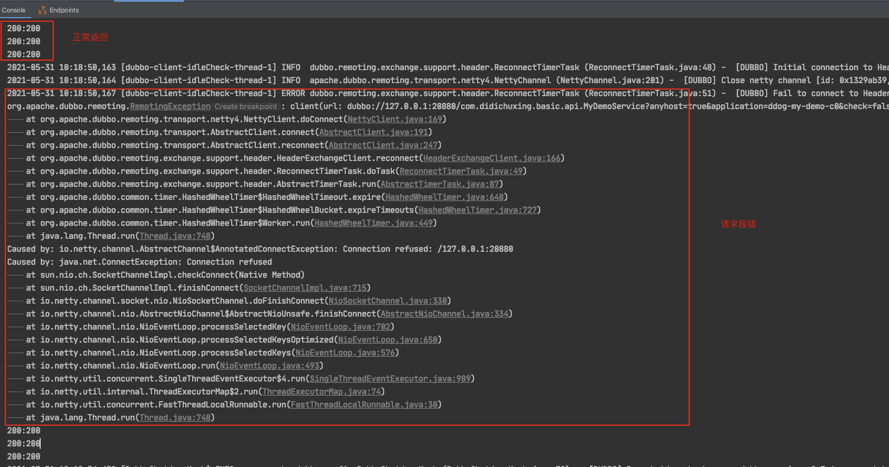
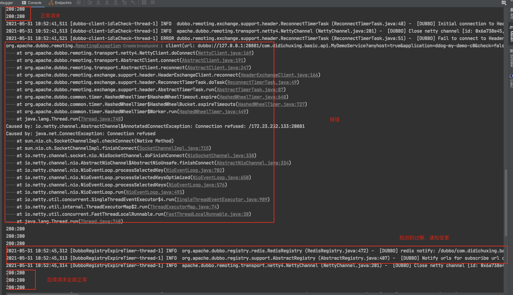

## 一
在之前的文章《redis在微服务领域的贡献》中，从一次面试经历中了解了redis可以在微服务中玩的这么溜，同时也从源码角度分析了dubbo的redis注册中心。最后得出了dubbo的redis注册中心不能用于生产的结论，其中原因有如下两点：

- 使用了keys命令，会阻塞单线程的redis，keys执行期间，其他命令都得排队
- 没有心跳检测这个功能，我测试了provider被kill -9杀死后，consumer是无法感知的。但从实现上来看是想通过存储的过期时间来判断服务是否可用，即需要对比url对应的value与当前的时间，如果过期应被剔除，但这部分貌似没有实现完整

后来翻看了最新的代码发现第一点已经改善，使用`scan`代替了`keys`，可以简单理解为`keys`一次查询了redis中所有的key，`scan`是分页查询了key，阻塞时间被打散。

在服务数量不是特别多时，可以正常运行了，那么第二点还是没有解。于是在想是否可以优化一下贡献给社区呢？于是说干就干。

## 二

#### 先验证，步骤如下：

- 使用redis注册中心，启动2个provider，再启动1个consumer进行消费
- 对其中1个provider进行`kill -9`
- 观察consumer会发现consumer请求会有部分成功、部分报错，并且一直有报错，不会恢复，也就是意外宕机（未执行注销逻辑，kill -9可模拟）的provider不会从redis注册中心上摘除



为什么需要启动2个provider？因为dubbo在注册中心推送时有一个保护机制，当推送provider列表为空时会忽略本次推送，毕竟不更新provider总比provider没了要好吧。

#### 分析求解
注意到redis注册中心保存的数据是hash结构，且key为url，value为过期时间
```
127.0.0.1:6379> hgetall /dubbo/com.newboo.sample.api.DemoService/providers
1) "dubbo://172.23.233.142:20881/com.newboo.sample.api.DemoService?anyhost=true&application=boot-samples-dubbo&deprecated=false&dubbo=2.0.2&dynamic=true&generic=false&interface=com.newboo.sample.api.DemoService&metadata-type=remote&methods=sayHello&pid=19807&release=2.7.8&side=provider&timestamp=1621857955355"
2) "1621858734778"
```
那么就好办了，能否定时把过期的数据删了，并通知给consumer？

又看了一眼代码，发现居然这个想法已经实现了，在启动redis注册中心时，起了一个线程，每隔 `1/2` 过期时间进行扫描
```java
this.expirePeriod = url.getParameter(SESSION_TIMEOUT_KEY, DEFAULT_SESSION_TIMEOUT);
this.expireFuture = expireExecutor.scheduleWithFixedDelay(() -> {
    try {
        deferExpired(); // Extend the expiration time
    } catch (Throwable t) { // Defensive fault tolerance
        logger.error("Unexpected exception occur at defer expire time, cause: " + t.getMessage(), t);
    }
}, expirePeriod / 2, expirePeriod / 2, TimeUnit.MILLISECONDS);
```
每次扫描时
- 将注册的服务进行"续约"，这部分暂时不关心
- 如果是admin，进行过期注册信息的清理并通知

```java
private void deferExpired() {
    for (URL url : new HashSet<>(getRegistered())) {
        if (url.getParameter(DYNAMIC_KEY, true)) {
            String key = toCategoryPath(url);
            if (redisClient.hset(key, url.toFullString(), String.valueOf(System.currentTimeMillis() + expirePeriod)) == 1) {
                redisClient.publish(key, REGISTER);
            }
        }
    }

    if (admin) {
        clean();
    }
}
```
这里admin什么时候为true？

在订阅时如果订阅了`*`结尾的服务，则admin置为true，可能是dubbo控制台
```
@Override
public void doSubscribe(final URL url, final NotifyListener listener) {
    ...
    try {
        if (service.endsWith(ANY_VALUE)) {
            admin = true;
            ...
    } catch (Throwable t) {
        ...
    }
}
```
而且在以前的代码的clean方法上中有这样一行注释
```
// The monitoring center is responsible for deleting outdated dirty data
```
说明admin为true时可能是monitoring center？

无论如何，在生产中，很少有公司会用开源的monitoring center或者控制台，大都进行改造或者自研。

而且这种系统也没法保证稳定性，万一挂了，岂不是很容易搞出故障。


何不在consumer侧进行服务探活呢？

刚好订阅和变更推送时都会去redis取一次最新数据，刚好provider续期时会发布事件，如果
- 将这个数据缓存下来
- 每隔 1/2 过期时间去检查数据是否已经过期
- 如果过期则去redis取一次最新的数据进行检查（防止续期事件丢失）
- 如果真的过期了，就认为这个provider不健康



思路比较简单，10分钟便写出了个demo，用上文的验证方法进行验证，果然好使


## 三
好久没有给社区贡献过源码了，于是就这样简单的提上去了，过了两天收到了评论

`Would you please add some ut cases to verify this PR?`

`UT`？哦，原来是`unit test`，忘了开源社区的玩法了，只相信测试代码，于是我去补了单元测试。

别说测试可比代码难多了，注册中心的通知机制还是异步回调，更难测试。想了个巧妙的方法来测试，自定义通知回调，将回调的内容保存在一个map中，然后主线程写个循环去检查。

模拟服务被`kill -9`使用反射拿到注册的服务，并把他移除掉，让不再续期。

办法总比困难多。

又过了两天，收到评论

`please comment in English`

emmm，忘了，要用英文，改完又过了两天，收到评论

`Is it possible for expireCache to go leaking for it's never cleared?`

`expireCache`是用来缓存url和过期时间的map，只管往里塞，忘记清理了，会导致内存泄漏。于是我又加上了清理逻辑。

这里面还有个插曲，当天大概21-22点之间，我把这个内存泄漏的bug修复了，并写了单元测试，测试方法还是像之前那样，通知后主线程循环检查。本地测试没问题后就提交到github了，当时github上编译失败了，我也没多想，毕竟dubbo这个项目太大了，经常编译失败。

神奇的是当天晚上回去做梦梦到我写的单元测试可能少写了个`break`导致运行测试时，没有及时跳出，所以本地编译成功，github编译失败（超时）了。

第二天，早上来看，真的少写了个`break`！！！


又过了2天，收到评论

`Also, I don't see where expireCache is used inside doNotify.`

emm，看到这个，我感觉他们没有看懂代码，于是回复了下

`expireCache mark which service may be down and call doNotity to fetch latest data from redis`

最后过了几天终于这个PR被merge了。


## 四

通过这件事明白了几点：

- 写文章好处多多
- 给社区贡献代码用英文，单元测试要覆盖，考虑要周全
- 潜意识真的很厉害


附这次PR的链接：

`https://github.com/apache/dubbo/pull/7929`

---

> 搜索关注微信公众号"捉虫大师"，后端技术分享，架构设计、性能优化、源码阅读、问题排查、踩坑实践。


