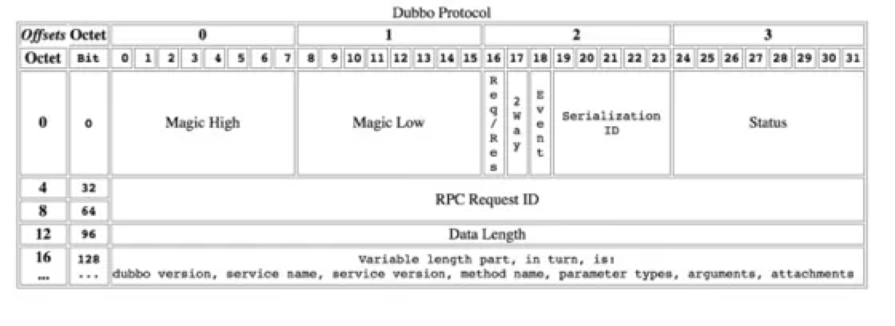

### 协议
`协议`通俗易懂地解释就是通信双方需要遵循的约定。

我们了解的常见的网络传输协议有tcp、udp、http等。再到我们常用的基础组件，一般来说client端与server端也有相应的协议，如redis、mysql、zookeeper等都是各自约定的私有协议，同样今天标题中的dubbo协议也是一种私有协议，他们都是应用层协议，基于tcp或udp设计。

通常应用层协议都是基于tcp和udp，可靠传输通常使用tcp，如大多数的基础组件，如redis、mysql。只有能容忍丢失且需要很高的性能时使用udp协议，比如metric上报等场景。

这里介绍几种基于tcp的应用协议。

### redis协议
redis协议足够简单，所以先介绍一下。redis协议基于tcp设计，客户端和服务器发送的命令一律使用`\r\n`（CRLF）结尾。他的格式如下
```
*<参数数量> CRLF
$<参数1 字节数量> CRLF
<参数1的数据> CRLF
...
$<参数n 字节数量> CRLF
<参数n的数据> CRLF
```
举个例子，client向server端发送命令 `set mykey myvalue`
```
*3 CRLF
$3 CRLF
SET CRLF
$5 CRLF
mykey CRLF
$7 CRLF
myvalue CRLF
```
也就是 `*3\r\n$3\r\nSET\r\n$5\r\nmykey\r\n$7\r\nmyvalue\r\n`

关于redis协议更详细信息可以看这个链接：

`http://redisdoc.com/topic/protocol.html`

### http协议
http协议是我们最常见的协议，它的请求报文格式是由三部分组成：
- 请求行：包括method、url、version，由空格分隔，\r\n结尾
- 请求头：多行，每行是key:value的格式，以\r\n结尾
- 请求体：请求头与请求体直接由一个空白行分隔，请求体的长度在请求头中由`content-length`给出

redis和http协议的处理方式截然不同。他们都是基于tcp，而tcp协议传输的数据是流式的，通俗地说就是它就像水流，不断地发送字节，tcp保证不重复，不丢包。而接收端要拿到想要的数据必须得从流式的数据中“判断出数据包的边界”，这就是tcp的`粘包`问题，解决它通常有三种方法：

1. 发送固定长度的消息
2. 使用特殊标记区分消息间隔
3. 将消息的尺寸和消息一起发送

redis协议使用了第2种，http和接下来要介绍的dubbo协议使用了第3种，固定长度的消息比较理想，在实际中很少遇到。

### dubbo协议
由于dubbo支持的协议很多，本文提到的`dubbo协议`特指dubbo框架的默认协议，也就是dubbo的私有协议。它的格式如下：

- 0-15: 魔数，判断是否是dubbo协议
- 16: 判断是请求还是返回
- 17: 判断是否期望返回
- 18: 判断是否为事件消息，如心跳事件
- 19-23: 序列化标志
- 24-31: 标志响应状态（类似http status）
- 32-63: 请求id
- 64-95: 内容长度（字节）
- 96-?: 序列化后的内容（换行符分隔）



### 常用的attachments在dubbo协议的哪里？

dubbo的attachments，我们通常将他类比为http协议的header，可以携带一些`隐式`的参数信息（不用编码到请求对象中），如压测标志等。从他的类型
```java
private Map<String, String> attachments;
```
基本可以推断出attachments存在于dubbo协议的96字节之后的内容中，因为前面头的根本放不下这个map。
从dubbo的实现中可以看出，dubbo的一个请求被封装为一个`DecodeableRpcInvocation`对象，里面包含了`methodName`、`parameterTypes`、`arguments`、`attachments`等，将该对象序列化后填入dubbo协议的96字节后的内容中发送出去。

使用时，consumer端：
```
RpcContext.getContext().setAttachment("hello", "from_consumer");
```
provider端：
```
RpcContext.getContext().getAttachment("hello");
```

这里能看出dubbo协议相比较http协议来说设计的还是有所欠缺的，想要拿到一些隐式参数，或者想要知道请求发往哪里，必须得把请求体解析出来才可以，这也是dubbo协议往mesh方向发展的一个绊脚石。

### dubbo协议支持在返回值中带回attachments吗？
consumer端向provider端发送请求可以在头部携带隐式参数，那么返回时也可以从provider端带回到consumer端吗？

比如provider回传给consumer它自身的处理耗时，consumer计算出请求的响应时间，两者相减即可得到网络耗时，此时provider端最好是将耗时放在attachments中隐式地传回。

dubbo的协议是请求和回复都是相同格式，理论上consumer可以带隐式参数到provider端，则provider端肯定也可以回传。

从dubbo的返回对象`DecodeableRpcResult`中可以看到是存在`attachments`的，但从实际的测试来看，2.7.x版本是不支持的，但2.6.x（>=2.6.3）版本是支持的。
provider端设置：
```
RpcContext.getServerContext().setAttachment("hello", "from_provider");
```
consumer端获取：
```
RpcContext.getServerContext().getAttachment("hello")
```
github上相关的issue链接如下：

`https://github.com/apache/dubbo/pull/1843`

### 协议和序列化有什么区别？
我们可能会经常听到这样的说法，dubbo除了dubbo协议外还支持rest、thrift、grpc等协议，也支持hessian、json序列化。协议与序列化是什么关系？

通过刚刚介绍的dubbo协议格式或许就能明白，dubbo协议是如上的格式包含了头和内容，其中96字节之后的内容是序列化后的内容，默认使用hessian2序列化，也可以修改为fastjson、gson、jdk等。只需要配置即可修改协议

```xml
<dubbo:protocol name="dubbo" serialization="fastjson"/>
```

如果非要做个类比的话，就是你不仅可以通过http协议传输json格式的数据，也可以传输xml格式的数据。http就是协议，json和xml就是序列化。

### 最后
dubbo协议的设计虽然有所欠缺，但依然不能阻止它成为dubbo使用最广泛的协议。

---

> 关于作者：专注后端的中间件开发，公众号"捉虫大师"作者，关注我，给你朴实无华的技术干货


- 原文链接: https://mp.weixin.qq.com/s/l5F-lJSuuhXerI88e7_U9Q
- 发布时间: 2021.02.22

