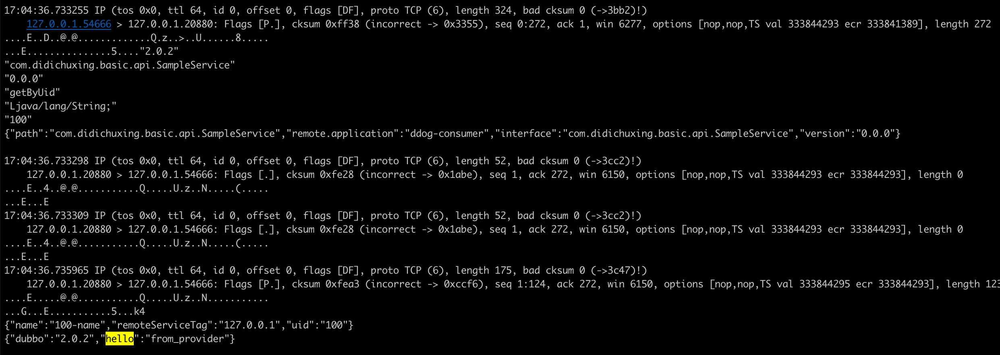
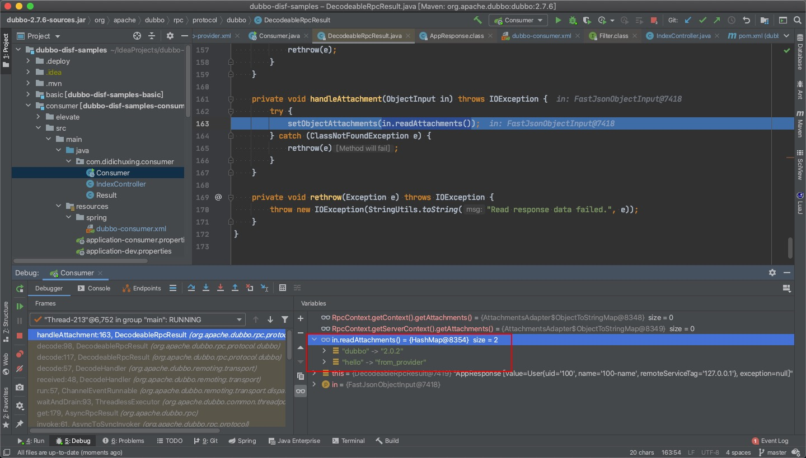
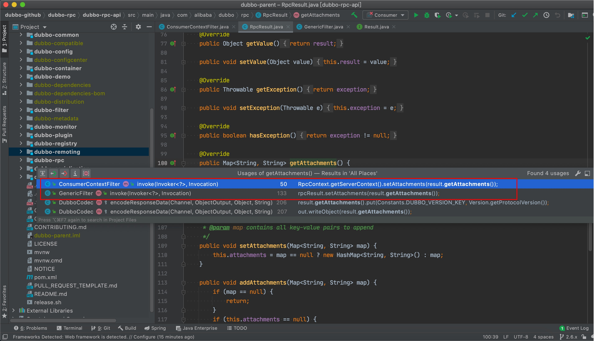
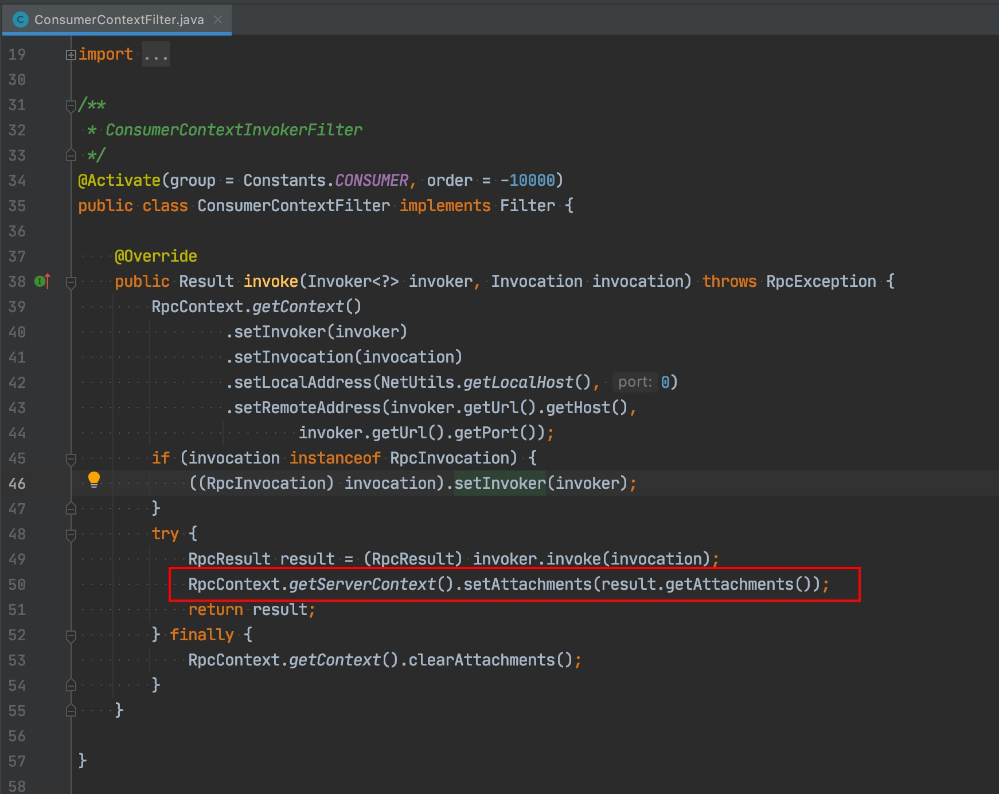
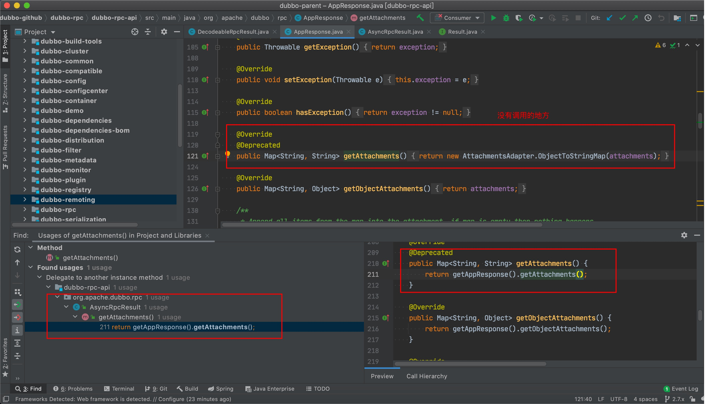
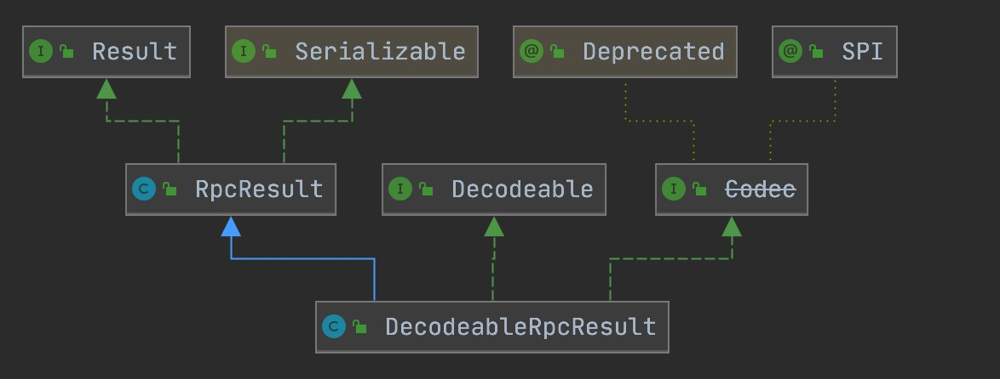
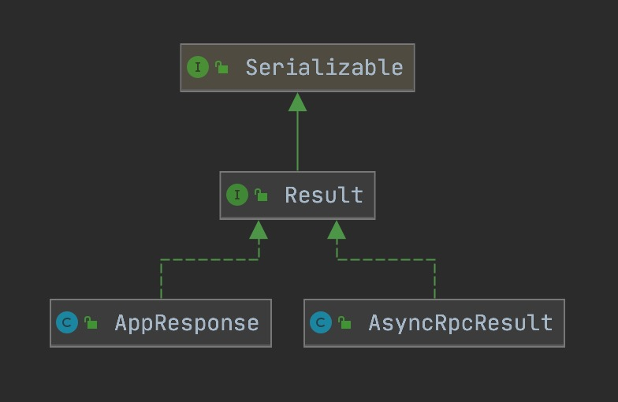
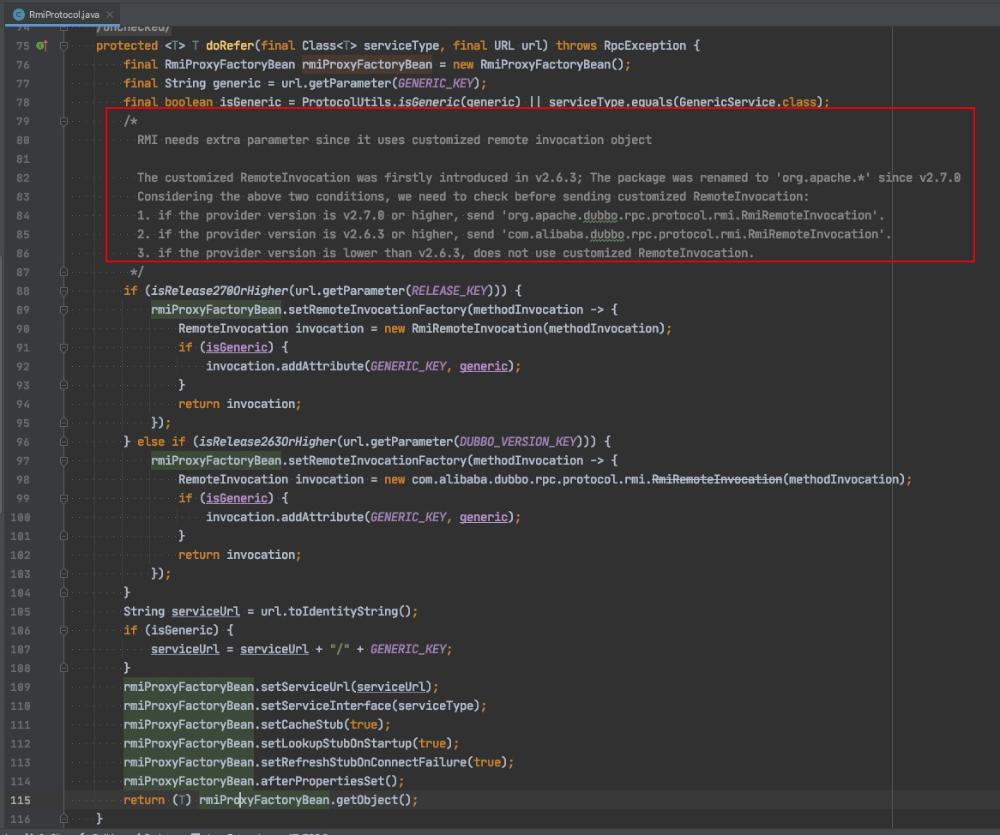
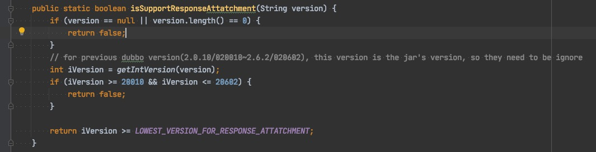

在[《聊聊dubbo协议》](../聊聊dubbo协议/聊聊dubbo协议.md)中介绍了attachments在consumer和provider间的传递情况，有个疑问没有给出答案。

为什么2.7.x版本的dubbo不支持provider端向consumer端回传隐式参数呢？今天的续集将揭晓答案。

### 抓包确定是provider没发还是consumer丢掉

> 以下测试基于dubbo 2.7.6版本

在provider端加入下面的代码
```
RpcContext.getServerContext().setAttachment("hello", "from_provider");
```
运行provider，并用consumer不断地调用，同时进行抓包

```
sudo tcpdump -i any -vv -A -n port 20880
```
可以看到provider端将我们的参数回传了回去，说明是consumer端将数据“弄丢了”



### 分析2.6.x与2.7.x代码的差别
consumer在收到provider的请求返回时，处理流程如下：

`DecodeableRpcResult`->`decode`->`case DubboCodec.RESPONSE_VALUE_WITH_ATTACHMENTS->handleAttachment`



断点调试能看到，在`DecodeableRpcResult`中是存在隐式参数的。

看下2.6.x的实现




RpcResultt的attachments通过filter塞到RpcContext中去，这样我们就能拿到隐式参数了。

而在2.7.x中，Result的attachments没有被使用到



虽然参数传了过来，但consumer端没有将它放入RpcContext中，就没法使用。

### 为什么2.7.x不处理呢？

在2.6.x中，dubbo的请求返回对象只有RpcResult



而在2.7.x中，RpcResult没了，新增了AsyncRpcResult和AppResponse，AppResponse是真实的返回数据，它的attachments是存在隐式参数的，但它会被包装在AsyncRpcResult中，invoke拿到的是AsyncRpcResult，此时从AppResponse中解出数据时丢了attachments。



2.7.x中有一个重要的提升是对异步的支持更加友好，这里对RpcResult的重构应该就是丢失隐式参数的原因。

### dubbo协议如何处理协议的兼容的？
从`RmiProtocol`类中能看到dubbo针对`2.7.0`、`2.6.3`两个边界进行了版本兼容

版本信息从哪里来呢？从代码中看到，从provider的url中获取参数`release`（优先）、`dubbo`来判断provider的dubbo版本，

`dubbo://127.0.0.1:20880/com.newbooo.basic.api.SampleService?anyhost=true&application=ddog-provider&deprecated=false&dubbo=2.0.2&dynamic=true&generic=false&interface=com.newbooo.basic.api.SampleService&methods=getByUid&owner=roshilikang&pid=96150&release=2.7.6&retries=7&side=provider&timestamp=1614235399505`

这里面有些历史原因，看dubbo 2.6.x的源码会发现，在2.6.3版本之前，url中dubbo参数代表的是dubbo的版本，而在2.6.3及以后的版本中，dubbo参数代表的是dubbo协议的版本。



- `[2.5.3, 2.6.3)`版本中，dubbo版本与dubbo协议没有分开，都是用url上的dubbo参数，值是对应的版本号，取值范围是 `>=2.0.0 && <=2.6.2`
- `[2.6.3, 2.7.0)`版本，无法从provider注册的url上看出dubbo版本，dubbo协议版本是从url的dubbo参数获取，固定为`2.0.2`
- `2.7.0`之后的版本，dubbo版本在provider的url release参数上，dubbo协议版本在dubbo参数上，目前还是2.0.2

### 最后
通过这次分析知道了2.7.x的dubbo为什么provider不能带回隐式参数了，这应该是个bug。

---
> 关于作者：专注后端的中间件开发，公众号"捉虫大师"作者，关注我，给你最纯粹的技术干货


- 原文链接：https://mp.weixin.qq.com/s/x5iNm9Ex3Frha7q94mdAmw
- 发布时间: 2021.02.27
