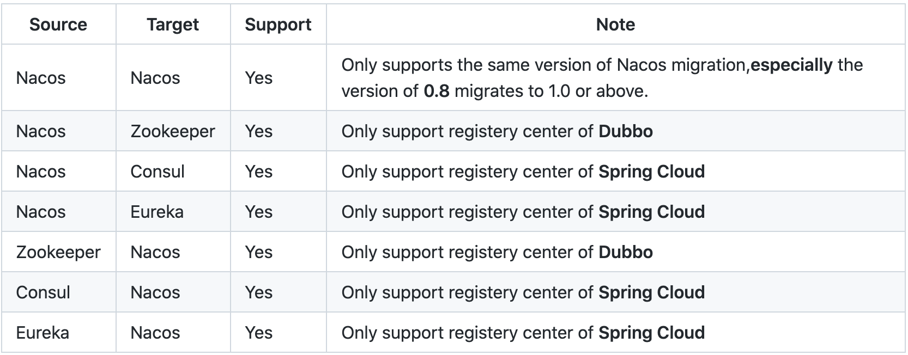
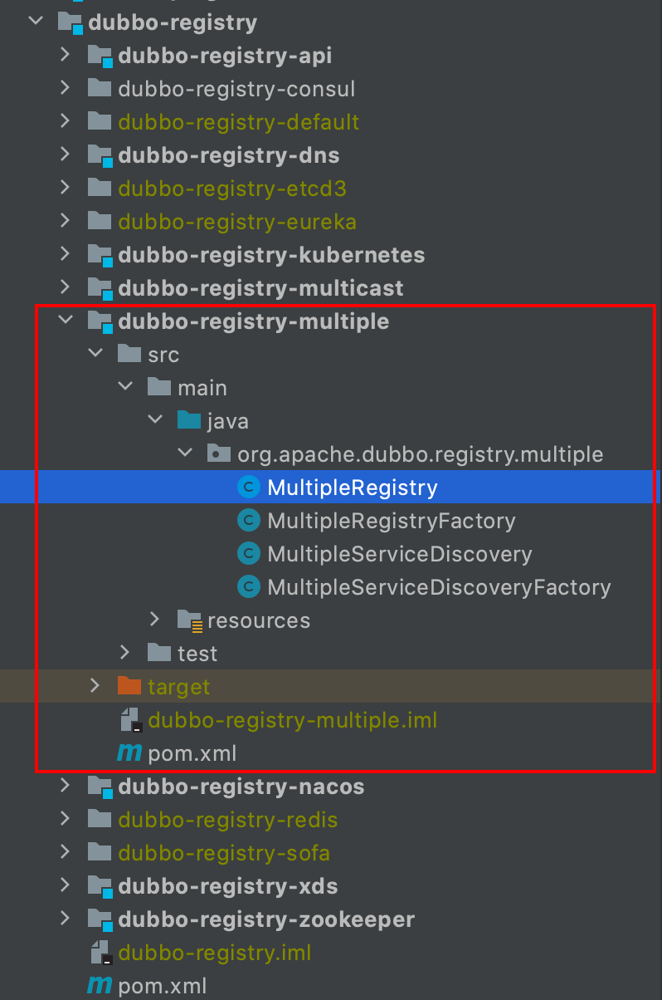
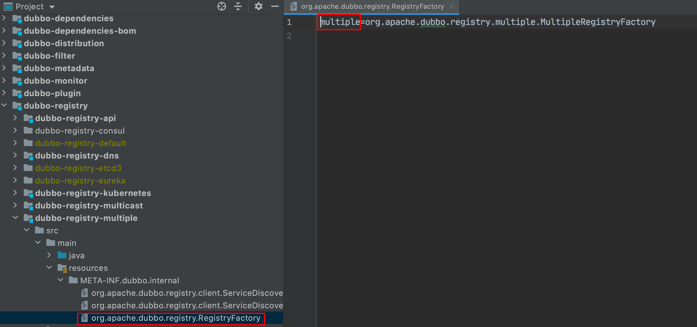
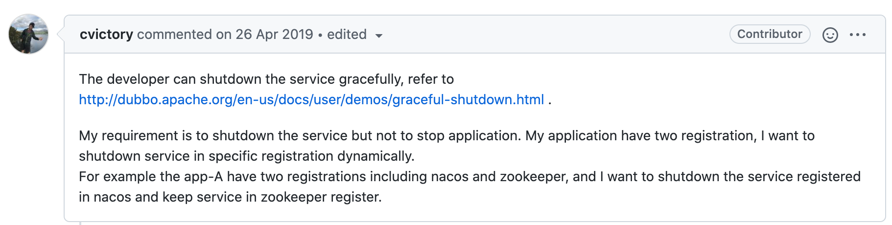
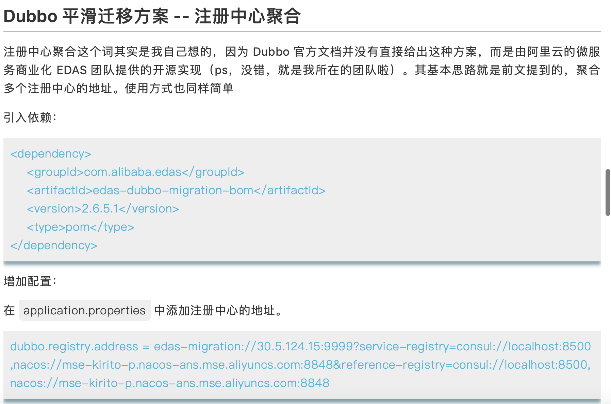

今天想和大家聊聊Dubbo源码中实现的一个注册中心扩展。它很特殊，也帮我解决了一个困扰已久的问题，刚刚在生产中用了，效果很好，迫不及待想分享给大家。

Dubbo的扩展性非常灵活，可以无侵入源码加载自定义扩展。能扩展协议、序列化方式、注册中心、线程池、过滤器、负载均衡策略、路由策略、动态代理等等，甚至「扩展本身」也可以扩展。


在介绍今天的这个注册中心扩展之前，先抛出一个问题，大家思考一下。

### 如何低成本迁移注册中心？

有时出于各种目的需要迁移Dubbo的注册中心，或因为觉得Nacos比较香，想从Zookeeper迁移到Nacos，或因前段时间曝出Consul禁止在中国境内使用。

迁移注册中心的方案大致有两种：

- 方案一：使用Dubbo提供的多注册中心能力，Provider先进行双注册，Consumer逐步迁移消费新注册中心，最后下线老注册中心。该方案的缺点是修改时有上下游依赖关系。

- 方案二：使用一个同步工具把老注册中心的数据同步到新注册中心，Consumer逐步迁移到新注册中心，最后下线老注册中心。同步工具有开源的Nacos-sync，我之前的文章[《zookeeper到nacos的迁移实践》](https://mp.weixin.qq.com/s/8XdbLrlzHhofiC089AMb1Q)就提到了这个方案。这个方案的缺点是架构变得复杂，需要解决同步数据的顺序性、一致性、同步组件的高可用等问题。

> Nacos-sync 参考 https://github.com/nacos-group/nacos-sync
>


我们从「业务方成本」和「基础架构成本」两个角度考虑一下这两个方案：

业务方成本我们以每次业务方修改并上线代码为1个单位，基础架构成本以增加一个新服务端组件为2个单位，从复杂度上来说基础架构成本远远高于业务方修改并上线代码，但这里我们认为只是2倍关系，做过基础组件开发的同学肯定感同身受，推动别人改代码比自己埋头写代码要难。

我们统计下上述方案中，迁移一对Consumer和Provider总共需要的成本是多少：

- 方案一：Provider双注册+1；Consumer消费新注册中心+1；Provider下线旧注册中心+1；总成本为3
- 方案二：同步组件+2；Consumer消费新注册中心+1；Provider下线旧注册中心+1；总成本为4

有没有成本更低的方案？

首先我们不考虑引入同步组件，其次Provider和Consumer能否不修改就能解决？我觉得理论上肯定可以解决，因为Java的字节码是可以动态修改的，肯定能达到这个目的，但这样的复杂度和风险会非常高。

退一步能否每个应用**只修改发布一次**就完成迁移？

Dubbo配置多注册中心可以参考这篇文章[《几个你不知道的dubbo注册中心细节》](https://mp.weixin.qq.com/s/C32EYc9VWGXDgjJe5S6Ayw)，你会发现多注册中心是通过配置文件配置的，如下

```xml
dubbo.registries.zk1.address=zookeeper://127.0.0.1:2181
dubbo.registries.zk2.address=zookeeper://127.0.0.1:2182
```

只修改一次代码，就必须把这个配置变成动态的，有点难，但不是做不到，可在应用启动时远程加载配置，或者采取替换配置文件的方式来达到目的。

但这只解决了部分问题，还有两个问题需要解决：

- Dubbo注册、订阅都发生在应用启动时，应用启动后就没法修改了。也不是完全不能，如果采用了api的方式接入Dubbo可以通过改代码来实现，但几乎这种方式不会被采用；
- Dubbo消费没法动态切换，多注册中心消费时，Dubbo默认的行为是挑第一个可用的注册中心进行调用，无法主动地进行切换；如果实现了主动切换还有个好处是稳定性提高了很多，万一新注册中心出现问题还可以及时切回去。

这里针对第二点的消费逻辑做一点简单说明，老版本（<2.7.5）逻辑比较简单粗暴，代码位于`RegistryAwareClusterInvoker`：

1. 挑选第一个可用的注册中心进行调用

新版本（>=2.7.5）则稍微丰富一点，代码位于`ZoneAwareClusterInvoker`：

1. 挑选一个可用且带`preferred`偏好配置的注册中心进行调用，注意这个偏好配置不同版本key还不一样，有点坑
2. 如果都不符合1，则挑选同一个分区且可用的注册中心进行调用，分区也是通过参数配置，这个主要是为了跨机房的就近访问
3. 如果1、2都不符合，通过一个负载均衡算法挑选出一个可用的注册中心进行调用
4. 如果1、2、3都不合法，则挑选一个可用的注册中心
5. 如果上述都不符合，则使用第一个注册中心进行调用

可以看出新版本功能很丰富，但它是有版本要求的，而且控制的key也变来变去，甚至去搜一下也有Bug存在，所以如果是单一稳定的高版本是可以通过这个来做，但大部分还是达不到这个要求。

很长一段时间以来，我都没有想到一个好的办法来解决这个问题，甚至我们公司内部有直接修改Dubbo源码来实现动态切换消费的能力，但这种入侵修改无法持续，直到有一天浏览Dubbo源码时，无意间看到了**MultipleRegistry**，仿佛发现了新大陆，用醍醐灌顶来形容一点不为过。

### MultipleRegistry，有点意思！

MultipleRegistry是Dubbo 2.7.2引入的一个注册中心扩展，**注册中心扩展**圈起来，要考！意味着这个扩展可以在任何>=2.7.0版本上运行，稍微改改也能在2.7以下的版本使用



这究竟是个什么注册中心的扩展呢？

实际上这个扩展并不是一个实际的注册中心的扩展，而是一个**包装**，它本身不提供服务注册发现的能力，它只是把其他注册中心聚合起来的一个空壳。

为什么这个「空壳」这么厉害呢？下面我们就来分析分析源码。

由于刚好手上有3.0.0版本的源码，所以接下来的源码分析基于Dubbo 3.0.0版本，也不用担心版本问题，这个扩展自从2.7.2引入之后几乎没有大的改动，只有Bugfix，所以什么版本基本都差不多。只分析接口级服务发现，应用级的暂时不分析，原理类似。

不过在讲源码之前，还得说说Dubbo注册中心插件的运行原理，否则源码可能看不懂，我们以开发一个注册中心扩展为例：

1. Dubbo注册中心扩展需实现RegistryService和RegistryFactory接口

```java
public interface RegistryService {

    void register(URL url);

    void unregister(URL url);

    void subscribe(URL url, NotifyListener listener);

    void unsubscribe(URL url, NotifyListener listener);

    List<URL> lookup(URL url);
}
```

这里的五个接口分别是注册、注销、订阅、取消订阅、查询，在Dubbo应用启动时会调用这些接口。

都比较好理解，需要提一下subscribe接口。

subscribe传入了一个NotifyListener参数，可以理解为一个回调，当监听的的URL发生变化时，调用这个NotifyListener通知Dubbo。

```java
public interface NotifyListener {
    void notify(List<URL> urls);
}
```

NotifyListener也是个接口，只有一个notify方法，这个方法传入的参数是所消费的URL的所有Provider列表。

```java
@SPI("dubbo")
public interface RegistryFactory {
    @Adaptive({"protocol"})
    Registry getRegistry(URL url);
}
```
RegistryFactory是描述了如何创建Registry扩展的工厂类，URL就是配置中
```xml
zookeeper://127.0.0.1:2181
```

2. 还需要遵守Dubbo SPI的加载规则扩展才能被正确加载



这些内容官方文档中说的比较清楚，如果有疑问可以看看Dubbo的官方文档说明。

简单介绍到此结束，接下来重点介绍**MultipleRegistry**。


首先看初始化，代码只挑出重点，在初始化**MultipleRegistry**时，分别对注册和订阅的注册中心进行初始化，这些注册中心来自MultipleRegistry的URL配置，URL上的key分别为`service-registry`、`reference-registry`，实际测试下来URL的参数中带奇怪的字符会导致编译不通过，不过这并不是重点，基本的还是可用，而且也不一定要采用这种配置。

```java
public MultipleRegistry(URL url, boolean initServiceRegistry, boolean initReferenceRegistry) {
    ...
    Map<String, Registry> registryMap = new HashMap<>();
    // 初始化注册的注册中心
    if (initServiceRegistry) {
        initServiceRegistry(url, registryMap);
    }
    // 初始化订阅的注册中心
    if (initReferenceRegistry) {
        initReferenceRegistry(url, registryMap);
    }
    ...
}
```

我们再看注册和订阅：

注册比较简单，只需要对刚刚初始化的serviceRegistries都进行注册即可

```java
 public void register(URL url) {
    super.register(url);
    for (Registry registry : serviceRegistries.values()) {
        registry.register(url);
    }
}
```

订阅时也是针对referenceRegistries的每个注册中心都订阅，但这里有个不同的点是NotifyListener的妙用。

```java
 public void subscribe(URL url, NotifyListener listener) {
    MultipleNotifyListenerWrapper multipleNotifyListenerWrapper = new MultipleNotifyListenerWrapper(listener);
    multipleNotifyListenerMap.put(listener, multipleNotifyListenerWrapper);
    for (Registry registry : referenceRegistries.values()) {
        SingleNotifyListener singleNotifyListener = new SingleNotifyListener(multipleNotifyListenerWrapper, registry);
        multipleNotifyListenerWrapper.putRegistryMap(registry.getUrl(), singleNotifyListener);
        registry.subscribe(url, singleNotifyListener);
    }
    super.subscribe(url, multipleNotifyListenerWrapper);
}
```

先用MultipleNotifyListenerWrapper把最原始的NotifyListener包装起来，NotifyListener传给每个被包装的注册中心。MultipleNotifyListenerWrapper和SingleNotifyListener分别是什么？

MultipleNotifyListenerWrapper将原始的NotifyListener进行包装，且持有SingleNotifyListener的引用，它提供了一个方法`notifySourceListener`的方法，将持有的SingleNotifyListener中上次变更的URL列表进行merge后调用最原始的NotifyListener.notify()

```java
protected class MultipleNotifyListenerWrapper implements NotifyListener {

    Map<URL, SingleNotifyListener> registryMap = new ConcurrentHashMap<URL, SingleNotifyListener>(4);
    NotifyListener sourceNotifyListener;
    ...

    public synchronized void notifySourceListener() {
        List<URL> notifyURLs = new ArrayList<URL>();
        URL emptyURL = null;
        for (SingleNotifyListener singleNotifyListener : registryMap.values()) {
            List<URL> tmpUrls = singleNotifyListener.getUrlList();
            if (CollectionUtils.isEmpty(tmpUrls)) {
                continue;
            }
            // empty protocol
            if (tmpUrls.size() == 1
                    && tmpUrls.get(0) != null
                    && EMPTY_PROTOCOL.equals(tmpUrls.get(0).getProtocol())) {
                // if only one empty
                if (emptyURL == null) {
                    emptyURL = tmpUrls.get(0);
                }
                continue;
            }
            notifyURLs.addAll(tmpUrls);
        }
        // if no notify URL, add empty protocol URL
        if (emptyURL != null && notifyURLs.isEmpty()) {
            notifyURLs.add(emptyURL);
        }
        this.notify(notifyURLs);
    }
    ...
}
```

再看SingleNotifyListener，它的notify去调用MultipleNotifyListenerWrapper的notifySourceListener

```java
class SingleNotifyListener implements NotifyListener {

    MultipleNotifyListenerWrapper multipleNotifyListenerWrapper;
    Registry registry;
    volatile List<URL> urlList;

    @Override
    public synchronized void notify(List<URL> urls) {
        this.urlList = urls;
        if (multipleNotifyListenerWrapper != null) {
            this.multipleNotifyListenerWrapper.notifySourceListener();
        }
    }
    ...
}
```

仔细思考我们发现：

- MultipleNotifyListenerWrapper是个注册中心扩展的包装，它本身是没有通知能力的，只能借助的真实注册中心扩展的通知能力
- SingleNotifyListener是真实的注册中心的通知回调，由它去调用MultipleNotifyListenerWrapper的notifySourceListener，调用前可将数据进行merge

如果你仔细读完上面的文章你会发现，这不就是包装了一下注册中心扩展吗？就这？哪里醍醐灌顶了？


不着急，我们先扒一扒作者为什么写这样一个扩展，他的初衷是想解决什么问题？

> 参考这个issue：https://github.com/apache/dubbo/issues/3932



作者说：我们可以在程序运行时下线（注销）服务，如果有个Dubbo服务同时注册了Zookeeper和Nacos，而我只想注销其中一个注册中心，MultipleRegistry就可以解决这种场景。

作者的初衷很简单，但当我看到这个实现时，灵光乍现，感觉这个实现如果稍微改一改，简直就是一个**Dubbo多注册中心迁移神器**。

### Dubbo多注册中心迁移神器

Dubbo多注册中心迁移神器具有什么样的特性？

- 可以动态（远程配置）地注册到一个或多个注册中心，且在程序不重启的情况下可以动态调整
- 可以动态（远程配置）地消费某一个或多个注册中心，同样可以在程序不重启的情况下可以动态调整
- 消费有兜底逻辑，比如配置了消费Zookeeper，但Zookeeper上可能只有A服务，B服务不存在，那么调用B服务时可以用其他注册中心的Provider来兜底，这就保证了注册中心迁移过程中没用上下游的依赖

如果上面说的能够领会到，这些需求实现起来就很简单：

- 启动时，Provider和Consumer都分别监听对应的配置项，按需注册和消费，目前MultipleRegistry已经实现
- Dubbo应用运行中，配置项变更事件驱动
  - Provider：触发一个重新注册、注销的事件，根据最新的配置项将需要注册的注册中心再注册一遍，需要注销的注册中心注销
  - Consumer：触发重新进行订阅和取消订阅，
- 消费兜底逻辑，将MultipleNotifyListenerWrapper中的notifySourceListener的merge逻辑进行重写，可以实现有线消费、无对应Provider兜底消费。当然如果配置变更也需要触发一次notify

按照这个思路，我已经实现了一个版本在线上跑了起来！不过耦合了公司内部的配置中心。

如果想不耦合，可以采用Dubbo SPI扩展的方式来扩展「读取监听配置变更部分」，扩展中的扩展，有点骚~

这篇文章有点长，最后来回顾一下讲了啥：

首先文章从一个Dubbo注册中心迁移成本的问题讲起，现有的方案成本都是比较高，一直苦苦找寻更低成本、兼容性更强的方案。终于在一次浏览Dubbo源码过程中发现了MultipleRegistry源码，经过研究发现只需要经过稍微的修改就能符合我们对完美动态注册中心的定义。

在我写这篇文章的时候，又试图搜索了一下Dubbo动态注册中心，发现了「Kirito的技术分享」的一篇文章[《平滑迁移 Dubbo 服务的思考》](https://mp.weixin.qq.com/s/MRgo8J14LgyBCusynHqL3A)提到了阿里云的一个产品的实现和上文提到的方案类似。



如果刚好你也有这个需求，可以用上文的思路实现看看，并不复杂，是不是感觉赚了一个亿。