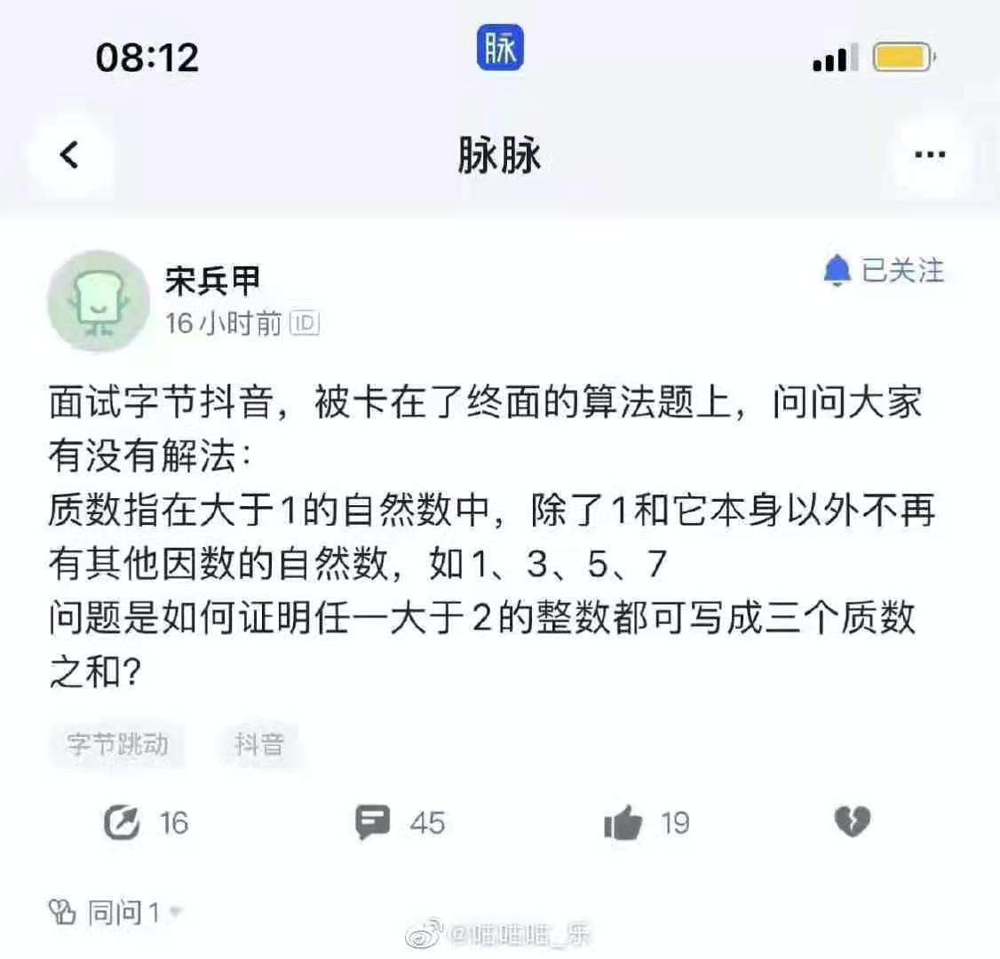
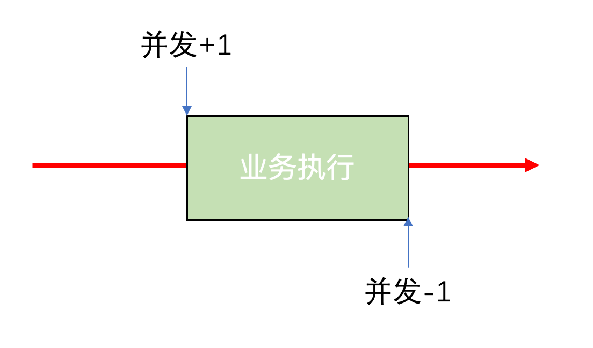
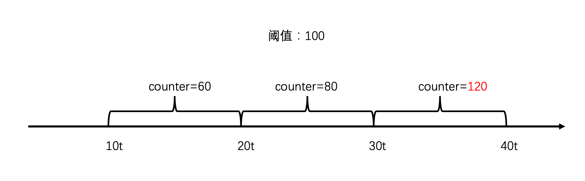
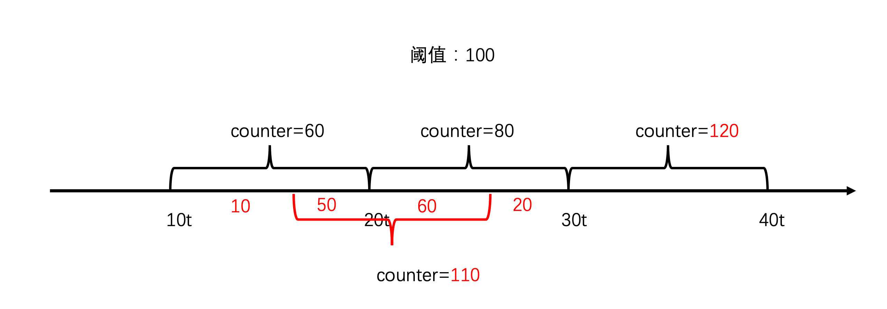
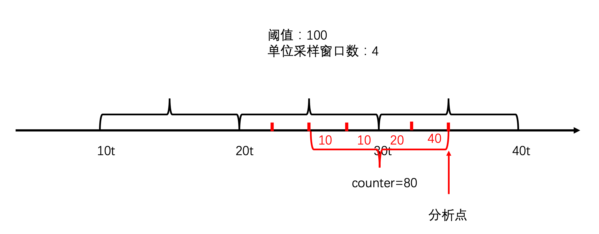
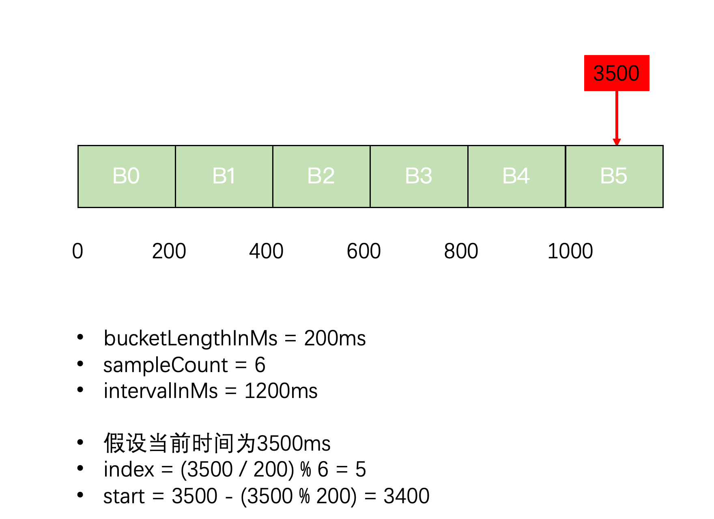
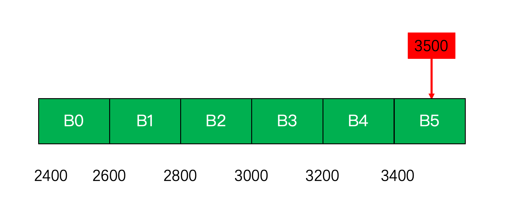

要说现在工程师最重要的能力，我觉得工程能力要排第一。

就算现在大厂面试经常要手撕算法，也是更偏向考查代码工程实现的能力，之前在群里看到这样的图片，就觉得很离谱。



## 算法与工程实现

在 Sentinel-Go 中，一个很核心的算法是流控（限流）算法。

流控可能每个人都听过，但真要手写一个，还是有些困难。为什么流控算法难写？以我的感觉是算法和工程实现上存在一定差异，虽然算法好理解，但却没法照着实现。

举个例子，令牌桶算法很好理解，只需给定一个桶，以恒定的速率往桶内放令牌，满了则丢弃，执行任务前先去桶里拿令牌，只有拿到令牌才可以执行，否则拒绝。

如果实现令牌桶，按道理应该用一个单独线程（或进程）往桶里放令牌，业务线程去桶里取，但真要这么实现，怎么保证这个单独线程能稳定执行，万一挂了岂不是很危险？

所以工程实现上和算法原本肯定存在一定的差异，这也是为什么需要深入源码的一个原因。

## 滑动时间窗口的演进

通常来说，流控的度量是按每秒的请求数，也就是 QPS

> QPS：query per second，指每秒查询数，当然他的意义已经泛化了，不再特指查询，可以泛指所有请求。如果非要区分，TPS 指每秒事务数，即写入数，或 RPS，每秒请求数，本文不分这么细，统计叫QPS。

当然也有按并发数来度量，并发数的流控就非常简单

### 并发数流控

并发是一个瞬时概念，它跟时间没有关系。和进程中的线程数、协程数一样，每次取的时候只能拿到一个瞬间的快照，但可能很快就变化了。

并发数怎么定义？可以近似认为进入业务代码开始就算一个并发，执行完这个并发就消失。



这样说来，实现就非常简单了，只需要定义一个全局变量，责任链开始时对这个变量原子增1，并获取当前并发数的一个快照，判断并发数是否超限，如果超限则直接阻断，执行完了别忘了原子减1即可，由于太过简单，就不需要放代码了。

### 固定时间窗口

参考并发数流控，当需要度量 QPS 时，是否也可以利用这样的思想呢？

由于 QPS 有时间的度量，第一直觉是和并发数一样弄个变量，再起个单独线程每隔 1s 重置这个变量。

但单独线程始终不放心，需要稍微改一下。

如果系统有一个起始时间，每次请求时，获取当前时间，两者之差，就能算出当前处于哪个时间窗口，这个时间窗口单独计数即可。



如果稍微思考下，你会发现问题不简单，如下图，10t 到20t 只有60个请求，20t到30t之间只有80个请求，但有可能16t到26t之间有110个请求，这就很有可能把系统打垮。



### 滑动时间窗口

为了解决上面的问题，工程师想出了一个好办法：别固定时间窗口，以当前时间往前推算窗口


但问题又来了，这该怎么实现呢？

### 滑动时间窗口工程实现

在工程实现上，可以将时间划分为细小的采样窗口，缓存一段时间的采样窗口，这样每当请求来的时候，只需要往前拿一段时间的采样窗口，然后求和就能拿到总的请求数。



## Sentinel-Go 滑动时间窗口的实现

> 前方代码高能预警~

Sentinel-Go 是基于 `LeapArray` 实现的滑动窗口，其数据结构如下

```go
type LeapArray struct {
	bucketLengthInMs uint32 // bucket大小
	sampleCount      uint32 // bucket数量
	intervalInMs     uint32 // 窗口总大小
	array            *AtomicBucketWrapArray // bucket数组
	updateLock mutex // 更新锁
}

type AtomicBucketWrapArray struct {
	base unsafe.Pointer // 数组的起始地址
	length int // 长度，不能改变
	data   []*BucketWrap // 真正bucket的数据
}

type BucketWrap struct {
	BucketStart uint64 // bucket起始时间
	Value atomic.Value // bucket数据结构，例如 MetricBucket
}

type MetricBucket struct {
	counter        [base.MetricEventTotal]int64 // 计数数组，可放不同类型
	minRt          int64 // 最小RT
	maxConcurrency int32 // 最大并发数
}
```
再看下是如何写入指标的，例如当流程正常通过时
```go
// ①
sn.AddCount(base.MetricEventPass, int64(count))

// ②
func (bla *BucketLeapArray) AddCount(event base.MetricEvent, count int64) {
	bla.addCountWithTime(util.CurrentTimeMillis(), event, count)
}

// ③
func (bla *BucketLeapArray) addCountWithTime(now uint64, event base.MetricEvent, count int64) {
	b := bla.currentBucketWithTime(now)
	if b == nil {
		return
	}
	b.Add(event, count)
}

// ④
func (mb *MetricBucket) Add(event base.MetricEvent, count int64) {
	if event >= base.MetricEventTotal || event < 0 {
		logging.Error(errors.Errorf("Unknown metric event: %v", event), "")
		return
	}
	if event == base.MetricEventRt {
		mb.AddRt(count)
		return
	}
	mb.addCount(event, count)
}

// ⑤
func (mb *MetricBucket) addCount(event base.MetricEvent, count int64) {
	atomic.AddInt64(&mb.counter[event], count)
}
```

取到相应的 bucket，然后写入相应 event 的 count，对 RT 会特殊处理，因为有一个最小 RT 需要处理。

重点看是如何取到相应的 bucket 的：

```go
func (bla *BucketLeapArray) currentBucketWithTime(now uint64) *MetricBucket {
	// ①根据当前时间取bucket
	curBucket, err := bla.data.currentBucketOfTime(now, bla)
	...
	b, ok := mb.(*MetricBucket)
	if !ok {
		...
		return nil
	}
	return b
}

func (la *LeapArray) currentBucketOfTime(now uint64, bg BucketGenerator) (*BucketWrap, error) {
	...
	// ②计算index = (now / bucketLengthInMs) % LeapArray.array.length
	idx := la.calculateTimeIdx(now)
	// ③计算bucket开始时间 = now - (now % bucketLengthInMs)
	bucketStart := calculateStartTime(now, la.bucketLengthInMs)

	for { 
		old := la.array.get(idx)
		if old == nil { // ④未使用，直接返回
			newWrap := &BucketWrap{
				BucketStart: bucketStart,
				Value:       atomic.Value{},
			}
			newWrap.Value.Store(bg.NewEmptyBucket())
			if la.array.compareAndSet(idx, nil, newWrap) {
				return newWrap, nil
			} else {
				runtime.Gosched()
			}
		} else if bucketStart == atomic.LoadUint64(&old.BucketStart) { // ⑤刚好取到是当前bucket，返回
			return old, nil
		} else if bucketStart > atomic.LoadUint64(&old.BucketStart) { // ⑥取到了旧的bucket，重置使用
			if la.updateLock.TryLock() {
				old = bg.ResetBucketTo(old, bucketStart)
				la.updateLock.Unlock()
				return old, nil
			} else {
				runtime.Gosched()
			}
		} else if bucketStart < atomic.LoadUint64(&old.BucketStart) { // ⑦取到了比当前还新的bucket，总共只有一个bucket时，并发情况可能会出现这种情况，其他情况不可能，直接报错
			if la.sampleCount == 1 {
				return old, nil
			}
			
			return nil, errors.New(fmt.Sprintf("Provided time timeMillis=%d is already behind old.BucketStart=%d.", bucketStart, old.BucketStart))
		}
	}
}
```
举个直观的例子，看如何拿到 bucket：



- 假设 B2 取出来是 nil，则 new 一个 bucket 通过 compareAndSet 写入，保证线程安全，如果别别的线程先写入，这里会执行失败，调用 runtime.Gosched()，让出时间片，进入下一次循环
- 假设取出 B2 的开始时间是3400，与计算的相同，则直接使用
- 假设取出的 B2 的开始时间小于 3400，说明这个 bucket 太旧了，需要覆盖，使用更新锁来更新，保证线程安全，如果拿不到锁，也让出时间片，进入下一次循环
- 假设取出 B2 的开始时间大于3400，说明已经有其他线程更新了，而 bucketLengthInMs 通常远远大于锁的获取时间，所以这里只考虑只有一个 bucket 的情况直接返回，其他情况报错

回到 QPS 计算：
```go
qps := stat.InboundNode().GetQPS(base.MetricEventPass)
```
该方法会先计算一个起始时间范围
```go
func (m *SlidingWindowMetric) getBucketStartRange(timeMs uint64) (start, end uint64) {
	curBucketStartTime := calculateStartTime(timeMs, m.real.BucketLengthInMs())
	end = curBucketStartTime
	start = end - uint64(m.intervalInMs) + uint64(m.real.BucketLengthInMs())
	return
}
```

例如当前时间为3500，则计算出
- end = 3400
- start = 3400 - 1200  + 200 = 2400



然后遍历所有 bucket，把在这个范围内的 bucket 都拿出来，计算 QPS，只需要相加即可。

### 最后

本节从滑动窗口流控算法的工程实现演进到 Sentinel-Go 里滑动窗口的实现，从 Sentinel-Go 的实现上看到，还得考虑内存的使用，并发控制等等，如果完全写出来，还是非常不容易的。

《Sentinel-Go源码系列》已经写了三篇，只介绍了两个知识点：责任链模式、滑动窗口限流，后续还有对象池等，但这其实和 Sentinel-Go 关系不是很大，到时候单独成文，就不放在本系列里了。

本文算是一个结束，与其说是结束，不如说是一个开始。