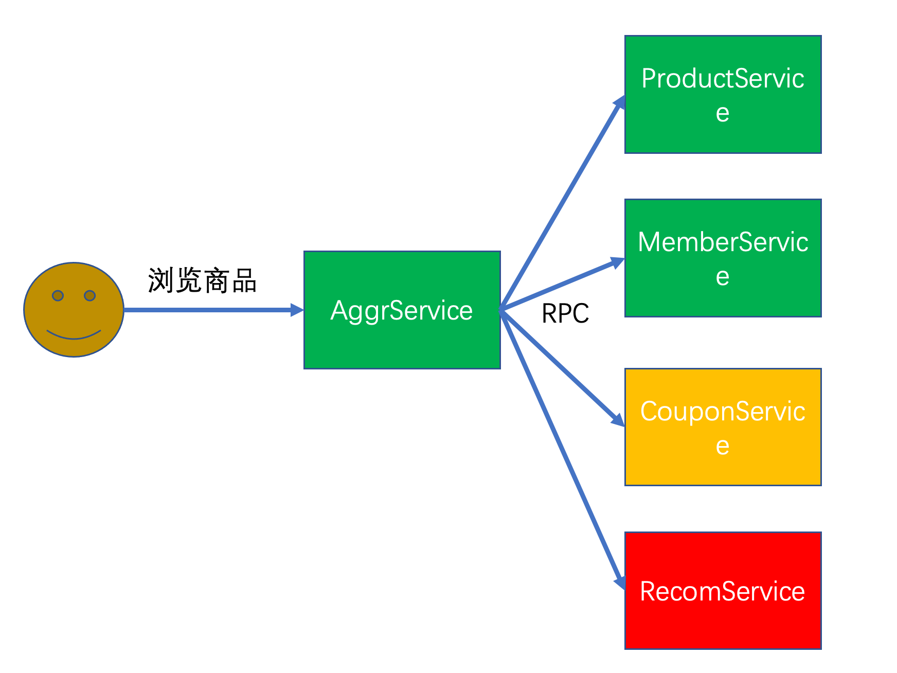
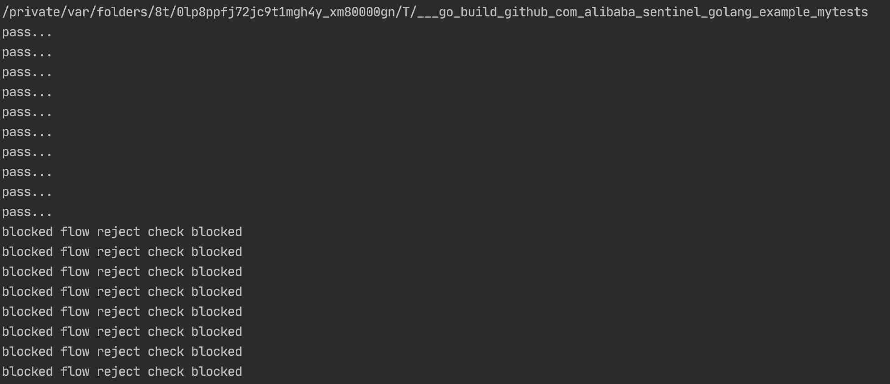

大家好呀，打算写一个 Go 语言组件源码分析系列，一是为了能学习下 Go 语言，看下别人是怎么写 Go 的，二是也掌握一个组件。

本次选择了 Sentinel-Go，一是对 Java 版本的 Sentinel 算是有一些了解，也在生产上落地过，二是感觉他的代码应该不会太复杂（仅仅是感觉），三是在云原生越来越热的趋势下，用 Go 实现的限流降级容错应该是比较通用的。

源码阅读本身是枯燥的，我尽量用容易理解的语言来描述，希望大家也多支持我的文章，点个`赞`、`在看`和`关注`就是对我最大的支持。

---

### 背景

#### Sentinel 简介

> 随着微服务的流行，服务和服务之间的稳定性变得越来越重要。Sentinel 是面向分布式服务架构的流量控制组件，主要以流量为切入点，从流量控制、熔断降级、系统自适应保护等多个维度来帮助您保障微服务的稳定性。

Sentinel 是阿里2018年开源的项目，最初是 Java 版本，截止目前有 17.6k 的star，项目地址为

> https://github.com/alibaba/Sentinel/

2020年又开源了 Go 的版本，目的是朝云原生方向演进，截止目前 1.7k star，项目地址为

> https://github.com/alibaba/sentinel-golang

#### Sentinel 的作用

在上面简介中也说了，Sentinel 是微服务时代保障稳定的神兵利器

举个例子：电商系统中用户浏览商品详情页，通常会通过 RPC 调用多个微服务，查询商品信息的同时还会查询用户的信息，也会展示优惠信息，通常下拉列表还会展示推荐，广告等信息，如下图



如果流量较大时，CouponService 容量不足，或者某种原因导致 RecomService 不可用，此时 AggrService 会被拖死，导致商品详情服务不可用，但仔细想想这些服务不是那么重要，可以进行限流或者直接降级（不再调用），总比直接服务不用要好吧

又或者流量实在太高，ProductService 也顶不住了，那是否可以采取限流措施，保住部分用户的请求时正常的，也比全部不可用要好

这些问题，Sentinel 都能解决

#### Sentinel 提供的能力

Sentinel 将要保护的对象（可以是某个服务或一段代码）抽象为资源，通过动态下发的规则，对资源进行

- 流量控制
- 熔断降级

针对这两个主要功能又有很多的玩法，比如限流是针对QPS还是并发数，控制的效果是直接拒绝还是排队等等。

当然 Sentinel 也提供一个开箱即用的 Dashboard，可扩展配中心进行下发规则，展示监控指标，调用关系链等等

### 快速开始

#### 源码阅读环境准备

- fork 源码到自己仓库，便于增加注释
- 拉取源码到本地

`git clone git@github.com:lkxiaolou/sentinel-golang.git`

- 导入 IDE，由于我既要写 Java 又要写 Go，所以用 IntelliJ IDEA 比较方便，只要装一个 Go plugin 就可以了
- 导入后，一般 IDE 会自动下载依赖，如果没有自动下载，试试执行（ Go 安装就不说了）

`go mod download`

#### 目录结构介绍

- sentinel-golang
  - api：对外暴露的接口
  - core：核心实现
  - example：使用例子
  - exporter：Prometheus的exporter
  - ext：扩展接口，主要是动态规则配置中心扩展接口
  - logging：日志模块
  - pkg：第三方插件的实现，比如各个组件适用 Sentinel 的 adapter，以及 Sentinel 对接各种第三方配置中心的扩展实现
  - tests：测试类代码，包括单元测试、benchmark
  - util：工具类

#### 样例跑通

在 /example 目录下新建 mytests 目录，并创建一个 quick_start.go 文件，按照官网给出的例子，先用最简单的默认方式初始化

```go
if err := sentinel.InitDefault(); err != nil {
	// 初始化失败
	panic(err.Error())
}
```

再用写死的方式加载规则

```go
// 资源名
resource := "test-resource"

// 加载流控规则，写死
_, err := flow.LoadRules([]*flow.Rule{
	{
		Resource: resource,
		// Threshold + StatIntervalInMs 可组合出多长时间限制通过多少请求，这里相当于限制为 10 qps
		Threshold: 10,
		StatIntervalInMs: 1000,
		// 暂时不用关注这些参数
		TokenCalculateStrategy: flow.Direct,
		ControlBehavior: flow.Reject,
	},
})
```

最后写测试代码

```go
// 修改这个看看效果吧
currency := 100

for i := 0; i < currency; i++ {
	go func() {
		e, b := sentinel.Entry(resource, sentinel.WithTrafficType(base.Inbound))
		if b != nil {
			// 被流控
			fmt.Printf("blocked %s \n", b.BlockMsg())
		} else {
			// 通过
			fmt.Println("pass...")
			// 通过后必须调用Exit
			e.Exit()
		}
	}()
}
```

这里限制了 10 qps，我们用 100 个协程并发测试跑一下，刚好通过10个请求



测试代码已上传到我的仓库

> https://github.com/lkxiaolou/sentinel-golang/tree/master/example/mytests

### 总结

本文介绍了 Sentinel 的和它能解决的问题，以及源码阅读的一些准备工作，并跑通了一个最简单的例子，见识到了 Sentinel 限流的效果，本文先到这里，我们下一节见。

---
> 搜索关注微信公众号"捉虫大师"，后端技术分享，架构设计、性能优化、源码阅读、问题排查、踩坑实践。

