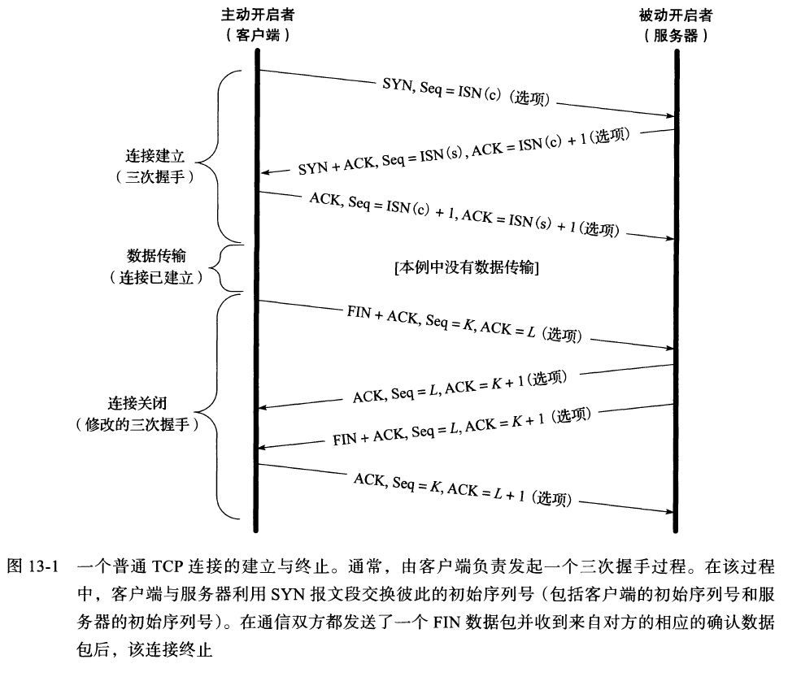
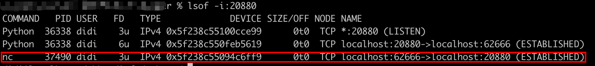
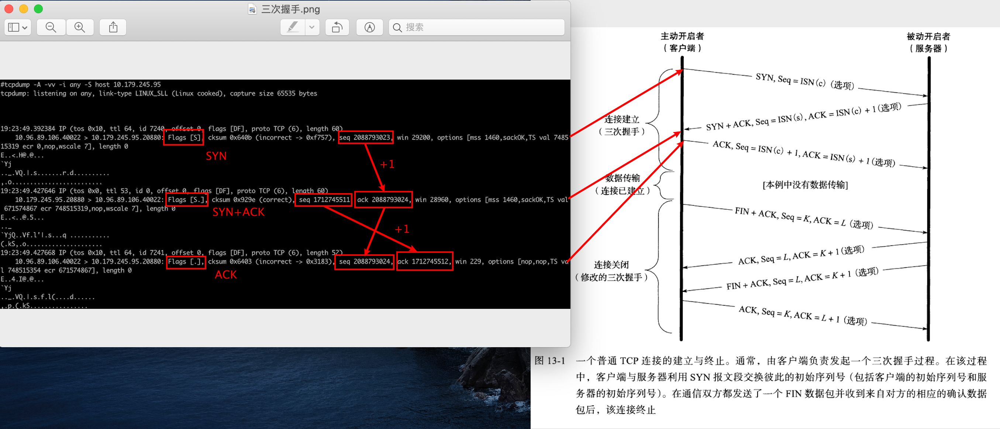
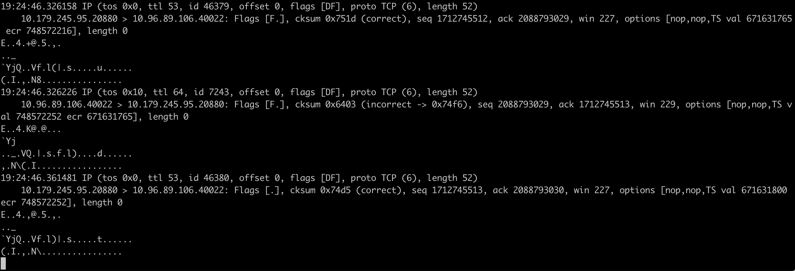
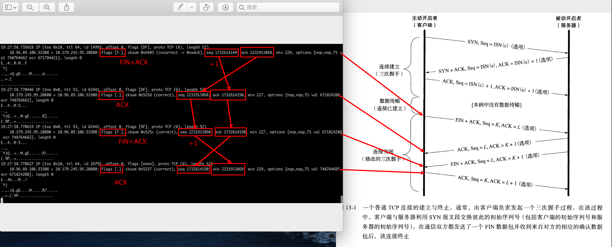
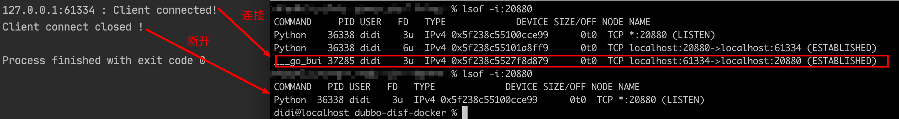
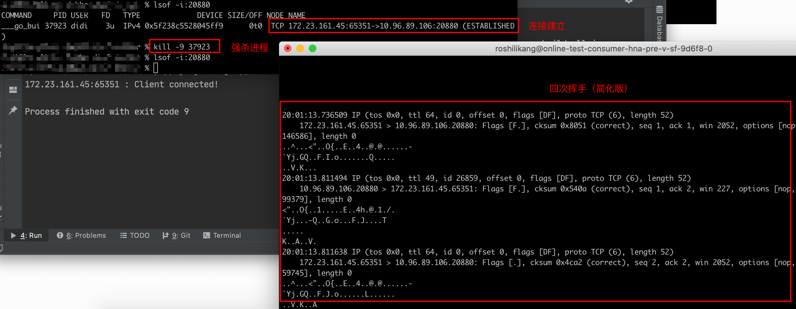
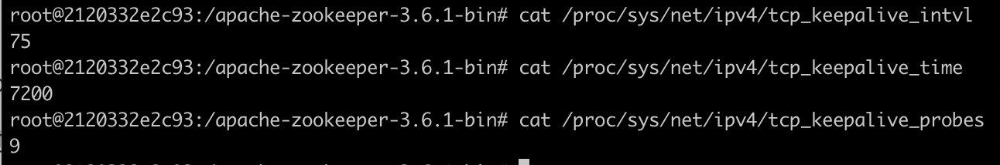
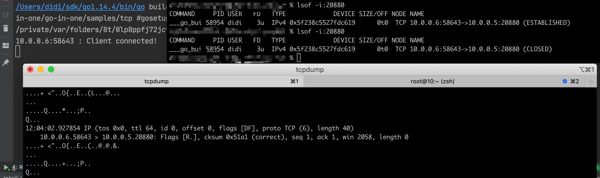
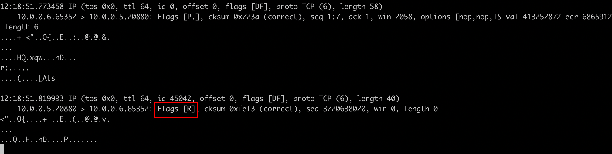

# 前言

看到这个标题你可能会说，TCP 连接的建立与断开，这个我熟，不就是三次握手与四次挥手嘛。且慢，脑海中可以先尝试回答这几个问题：

- 四次挥手是谁发起的？
- 如果断电/断网了连接会断开吗？
- 什么情况下没有四次挥手连接也会断开？

这不是面试，而是遇到了实际问题，至于是什么问题，容我先卖个关子，本文也不会解答，后面会有一篇专门的文章来说遇到的问题是啥，所以在讲实际问题之前，先弄懂理论。

# 正常断开

我们由浅入深，先了解正常情况下 TCP 连接是如何断开的，下图为 TCP 三次握手与四次挥手的经典图（来自《TCP/IP详解卷1》）



在我们的电脑上，可以使用 **python 的 SimpleHTTPServer ** 来快速起一个 http 服务（http 也是基于 TCP 协议），比如这样：

> python -m SimpleHTTPServer 20880

再通过 **nc** 或 **telnet** 这两个命令来创建 TCP 连接，比如我测试使用 nc 来创建连接

> nc -v ip port

`Connection to ip port [tcp/*] succeeded!` 表示连接成功


我们如何观察这个连接呢？可以通过 **netstat** 或 **lsof**  来查看这条"连接"，这里我使用 **lsof**（mac 与 Linux 系统的 netstat 命令不太一样，使用起来有点别扭 ）

> lsof -i:20880



无论是客户端还是服务端都会占用一个端口，不过服务端端口是固定的，客户端端口是随机的。

如果我们想看 TCP 连接和断开时`握手`与`挥手`的 TCP 报文怎么查看呢？可以使用 **tcpdump** 命令

## 三次握手

> tcpdump -A -vv -i any -S host 10.179.245.95

为了方便查看，和上面的经典图放在了一起



这里的参数需要提一下的是 `-S`，如果不加 `-S` 参数看到的第三次握手的`ack=1`，与书上的理论不太一样，其实这里只是 **tcpdump** 简化了展示，想看实际值需要加 `-S`

这里的 `Flags [S]/[S.]/[.]` 

-  [S] 代表 SYN
- [.] 代表 ACK，[S.] 就是 SYN + ACK

## 四次挥手

命令与抓三次握手相同，我们抓到如下挥手数据



- [F] 代表 FIN

这张图有点奇怪，四次挥手居然变成了三次，这其实是 TCP 协议的实现问题，如果第二次与第三次挥手之间没有数据发送，那么被动断开连接的一方就可能会把第二次的 ACK 与 第三次的 FIN 合并为一次挥手。

当然我也抓到过正常的四次挥手，大概长这样



# 异常断开

上面铺垫了这么多，现在开始进入正题。

## TCP 连接断开是谁发起的

我们来思考一个问题：TCP 连接的断开是谁发起的？程序本身还是操作系统？

我们来看一段非常简单的 TCP 连接创建与断开的代码

```go
tcpAddr, _ := net.ResolveTCPAddr("tcp", "127.0.0.1:20880")
conn, err := net.DialTCP("tcp", nil, tcpAddr)
if err != nil {
	fmt.Println("Client connect error ! " + err.Error())
	return
}

defer func() {
	err := conn.Close()
	fmt.Println("Client connect closed !")
	if err != nil {
		fmt.Println(err)
	}
}()

fmt.Println(conn.LocalAddr().String() + " : Client connected!")
time.Sleep(10 * time.Second)
```

运行后，效果如下，也符合我们预期：当程序打印 `Client connected!` 时，能看到连接，当打印 `Client connect closed!` 时，连接断开



如果我们在连接断开前使用 `kill -9` 强杀进程呢？（这里我用了两台电脑来测试）



我们发现 `conn.Close()` 并没有执行，但四次挥手还是发生了！

查阅资料发现如下结论：

**a、b 两个正常连接的对端进程。假如 b 进程没有调用 close 就异常终止，那么发送 FIN 包是内核 OS 代劳**

## 断电/断网时的连接是怎样断开的

我们通过上面的实验发现就算进程异常终止，操作系统也会帮忙发起四次挥手

但如果是断电或断网的情况下，操作系统就无法代劳了，这时会怎样呢？为了便于测试，这里用两台电脑，client 连接 server，断开 server 的网络来模拟断网断电情况。

可以肯定的是**断网，断电后，连接不会立即断开**，那么后续连接是否会断开呢？我们分成下面几种情况来看

### 断网时有数据传输

断网时如果有数据发送，由于收不到 ACK，所以会重试，但并不会无限重试下去，达到一定的重发次数之后，如果仍然没有任何确认应答返回，就会判断为网络或者对端主机发生了异常，强制关闭连接。此时的关闭是直接关闭，而没有挥手（数据都发不出去，还挥啥手），Linux 下的设置为

>最小重传时间是200ms
>最大重传时间是120s
>重传次数为15

### 断电/断网时没有数据传输

断网时如果没有数据传输，还得看 TCP 连接的 KeepAlive 是否打开，关于 TCP 的 KeepAlive 简介如下：

- TCP KeepAlive 是一种在不影响数据流内容的情况下探测对方的方式，采用 `保活计时器`实现，当计时器被触发时，一端发送保活报文，另一端接收到报文后发送 ACK 响应
- 它并不是 TCP 的规范，但大部分的实现都提供了这一机制
- 该机制存在争议，有的人保活机制应该在应用程序中实现

#### 开启KeepAlive

操作系统中有这么几个参数控制 KeepAlive 的配置：

- Keepalive_time：空闲时间，即多长时间连接没有发送数据时开始 KeepAlive 检测
- Keepalive_intvl：发送间隔时间，即上述代码的设置
- Keepalive_probs：最多发送多少个检测数据包

在 Linux 上可以通过如下文件查看

```
cat /proc/sys/net/ipv4/tcp_keepalive_time
cat /proc/sys/net/ipv4/tcp_keepalive_intvl
cat /proc/sys/net/ipv4/tcp_keepalive_probes
```



如果按照这个默认值来看，得2小时没有数据传输，KeepAlive 才开始工作！

而在 Go 中只有两个参数可以设置：

```go
conn.SetKeepAlive(true)
conn.SetKeepAlivePeriod(5 * time.Second)
```

其中第二个 SetKeepAlivePeriod 源码是这样的：

```go
func setKeepAlivePeriod(fd *netFD, d time.Duration) error {
	// The kernel expects seconds so round to next highest second.
	secs := int(roundDurationUp(d, time.Second))
	if err := fd.pfd.SetsockoptInt(syscall.IPPROTO_TCP, sysTCP_KEEPINTVL, secs); err != nil {
		return wrapSyscallError("setsockopt", err)
	}
	err := fd.pfd.SetsockoptInt(syscall.IPPROTO_TCP, syscall.TCP_KEEPALIVE, secs)
	runtime.KeepAlive(fd)
	return wrapSyscallError("setsockopt", err)
}
```

SetKeepAlivePeriod 的参数同时设置了 tcp_keepalive_intvl 和 tcp_keepalive_time，tcp_keepalive_probes 没法设置

做个简单测试：client 开启 KeepAlive 连接 server 后，什么数据都不发送，把server 的网断掉，可以看到 KeepAlive 心跳包，一段时间后连接被置为 CLOSED 状态



#### 关闭KeepAlive

关闭 KeepAlive 后，如果没有数据传输，连接永远不会断开

### 断电/断网后 server 重启再恢复

再思考一个场景，如果 client 与 server 建立连接后，没有数据传输，断掉 server 端的网络，这时如果把 server 程序重启一下，再恢复网络，那这条连接还能用吗？

如果 server 重启后，client 还是不发数据，那这条连接看起来还是可用的，因为他们根本不知道对方是个什么情况，但如果此时 client 发送一点数据给 server，你会发现 server 会发送一个 RST 给client，然后 client 就断开连接了



# 总结

除了正常情况之外，本文从 TCP 连接断开的角度结合实验给出了一些结论：

- TCP 连接断开的`挥手`，在进程崩溃时，会由操作系统内核代劳
- 当 TCP 连接建立后，如果某一方断电或断网，如果此时刚好正在发送数据，TCP 数据包发送失败后会重试，重试达到上限时也会断开连接
- 当 TCP 连接建立后，如果某一方断电或断网，且这条连接没有数据传输时
  - 如果开启了 KeepAlive 则会在一定心跳检测后断开连接，这个默认检测时间大概2个多小时，比较久
  - 如果未开启 KeepAlive 则连接永远存在
- 如果一方发送 RST 包给另一方，也是会强制对方断开连接的