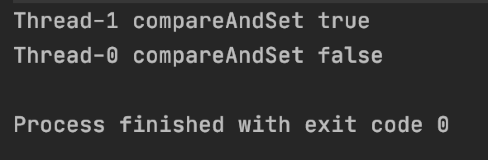
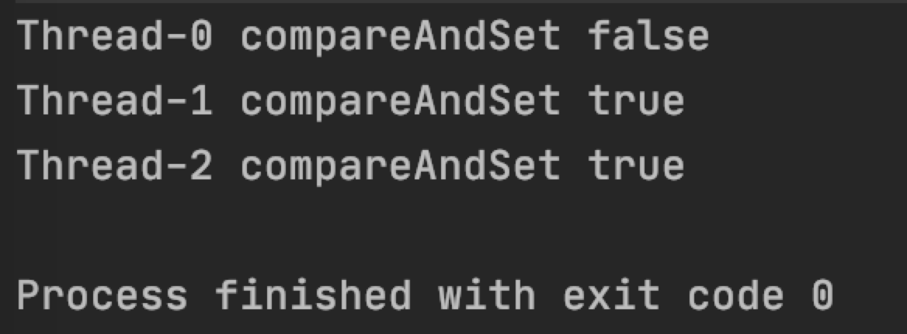
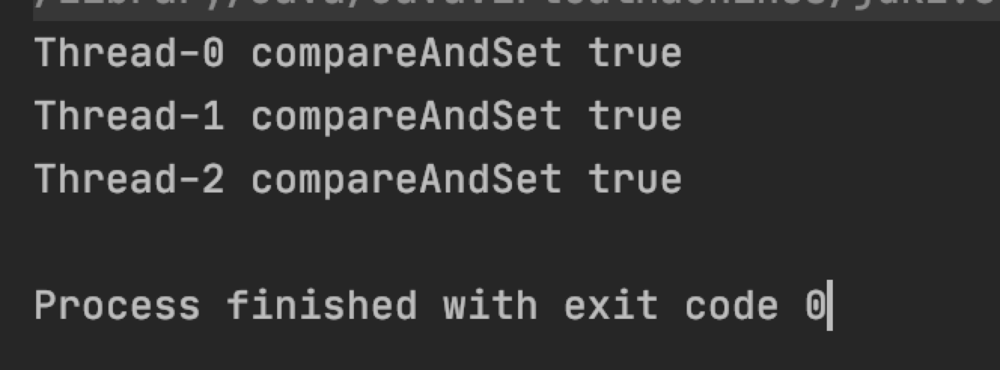
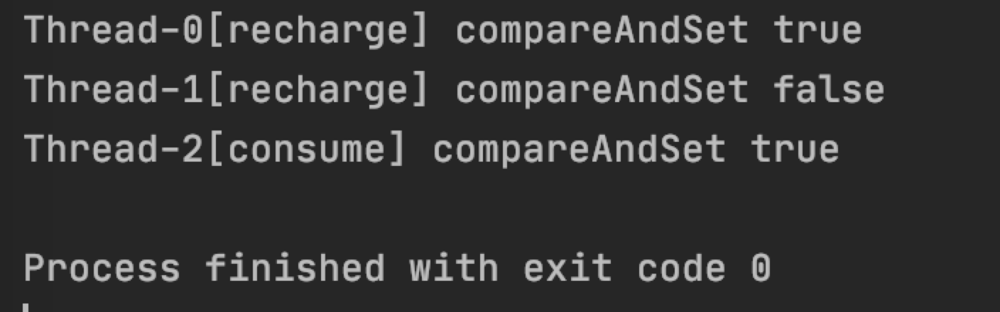

# 什么是ABA问题
但凡对Java有一点深入就会知道 CAS，即 compareAndSwap。在Java中使用 Unsafe 类提供的native方法可以直接操作内存，其中就有对compareAndSwap的实现。

```java
public final native boolean compareAndSwapObject(Object var1, long var2, Object var4, Object var5);
```

这里的 var1 指的是 当前对象，var2 是当前对象中 var1 的某个属性的偏移量，var4 是偏移量 var2 对应的属性的期望值，var5 是要交换的值，当对象的属性是期望值时，交互成功，否则交换失败，这是一个原子操作，只有一个线程会成功。所以它也是很多Java的线程安全实现的前提。

举个例子AtomicInteger count的初始值为 5，有两个线程期望将其设置为 10；此时两个线程都调用compareAndSet（底层也是compareAndSwapObject）

```java
public static void main(String[] args) {
    final AtomicInteger count = new AtomicInteger(5);

    for (int i = 0; i < 2; i++) {
        Thread thread = new Thread(() -> {
            try {
                Thread.sleep(10);
            } catch (Exception ignore) {
            }
            boolean re = count.compareAndSet(5, 10);
            System.out.println(Thread.currentThread().getName() + " compareAndSet " + re);
        });
        thread.start();
    }
}
```
会如我们所愿，只有一个线程会成功。



这时如果再有一个线程将10设为5

```java
public static void main(String[] args) {
    final AtomicInteger count = new AtomicInteger(5);

    for (int i = 0; i < 2; i++) {
        Thread thread = new Thread(() -> {
            try {
                Thread.sleep(10);
            } catch (Exception ignore) {
            }
            boolean re = count.compareAndSet(5, 10);
            System.out.println(Thread.currentThread().getName() + " compareAndSet " + re);
        });
        thread.start();
    }

    Thread thread = new Thread(() -> {
        try {
            Thread.sleep(10);
        } catch (Exception ignore) {
        }
        boolean re = count.compareAndSet(10, 5);
        System.out.println(Thread.currentThread().getName() + " compareAndSet " + re);
    });
    thread.start();
}
```
你可能会看到这样的结果：



正常吗？正常，也不正常。说正常是按照我们的理解它就可能是这样的结果，但多执行几次你会发现还可能有这样的结果：



我们期望的5设置为10只有一个线程会成功结果成功了两个，好比给用户充值，余额5块，充值到10块，手快点了两次，同时也用这个账户来支付了一笔5块钱的订单，期望的是充值只有一笔成功，支付可以成功，按照后一种结果相当于充值了2次5块钱。这就是CAS中的ABA问题。

# AtomicStampedReference 如何解决ABA问题

如何解决？思路很简单，每次compareAndSwap后给数据的版本号加1，下次compareAndSwap的时候不仅比较数据，也比较版本号，值相同，版本号不同也不能执行成功。Java中提供了AtomicStampedReference来解决该问题

```java
public static void main(String[] args) {
    final AtomicStampedReference<Integer> count = new AtomicStampedReference<>(5, 1);

    for (int i = 0; i < 2; i++) {
        Thread thread = new Thread(() -> {
            try {
                Thread.sleep(10);
            } catch (Exception ignore) {
            }

            boolean re = count.compareAndSet(5, 10, 1, 2);
            System.out.println(Thread.currentThread().getName() + "[recharge] compareAndSet " + re);
        });
        thread.start();
    }

    Thread thread = new Thread(() -> {
        try {
            Thread.sleep(10);
        } catch (Exception ignore) {
        }
        boolean re = count.compareAndSet(10, 5, count.getStamp(), count.getStamp() + 1);
        System.out.println(Thread.currentThread().getName() + "[consume] compareAndSet " + re);
    });
    thread.start();
}
```


这就能保证充值只有一次能成功了。那么它是如何每次都让版本号更新的？

AtomicStampedReference 内部维护了一个 Pair的数据结构，用volatile修饰，保证可见性，用于打包数据对象和版本号

```java
private static class Pair<T> {
    final T reference;
    final int stamp;
    private Pair(T reference, int stamp) {
        this.reference = reference;
        this.stamp = stamp;
    }
}
```
它的compareAndSet方法如下

```java
public boolean compareAndSet(V   expectedReference,
                             V   newReference,
                             int expectedStamp,
                             int newStamp) {
    Pair<V> current = pair;
    return
        expectedReference == current.reference &&
        expectedStamp == current.stamp &&
        ((newReference == current.reference &&
          newStamp == current.stamp) ||
         casPair(current, Pair.of(newReference, newStamp)));
}
```

- 首先判断传入的参数是否符合 Pair 的预期，从数据和版本号两个方面来判断，有一个不符合就打回；
- 如果传入的参数与Pair中的一样，直接返回true，不用更新；
- 使用casPair来比较交换当前的Pair与传入参数构成的Pair；
- casPair又调用compareAndSwapObject来交互Pair属性。

```java
private boolean casPair(Pair<V> cmp, Pair<V> val) {
    return UNSAFE.compareAndSwapObject(this, pairOffset, cmp, val);
}
```

所以简单来说，AtomicStampedReference是通过加版本号来解决CAS的ABA问题。至于怎么加版本号，因为compareAndSwapObject只能对比交互一个对象，所以只需要将数据和版本号打包到一个对象里就解决问题了。

同样Java中提供了AtomicMarkableReference，与 AtomicStampedReference 原理类似，只不过 AtomicMarkableReference 将版本号换成了一个 bool 值，只关心数据是否“被修改过”，而 AtomicStampedReference 可以关心数据被修改了多少次。

---

> 关于作者：专注后端的中间件开发，公众号"捉虫大师"作者，关注我，给你朴实无华的技术干货


- 原文链接: https://mp.weixin.qq.com/s/riBsXBrIjkOLe7SCtbX8vQ
- 发布时间: 2020.05.13


