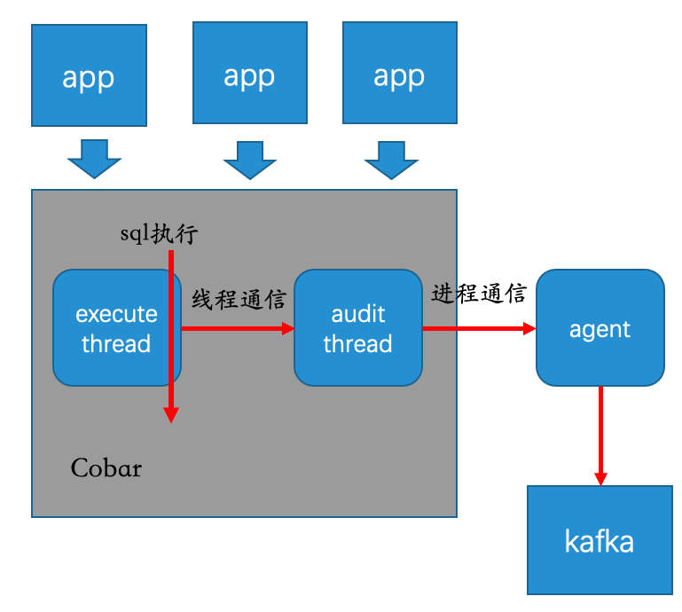
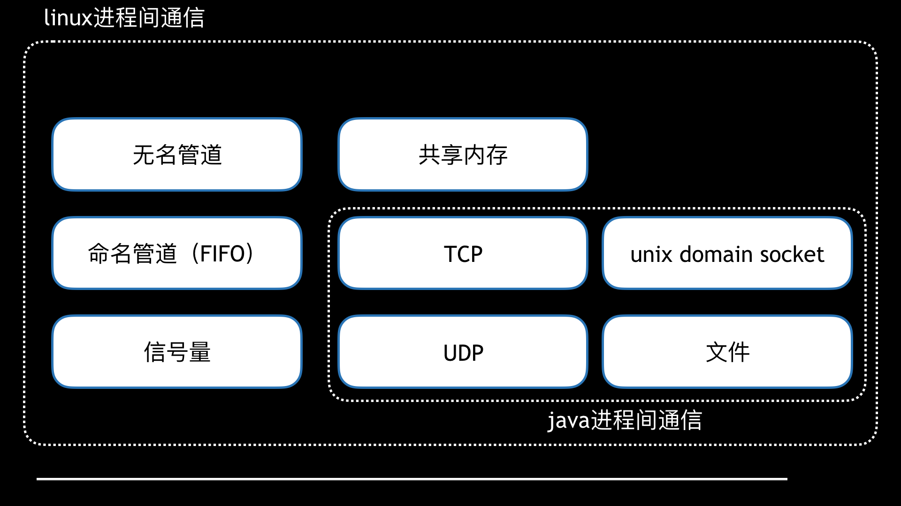
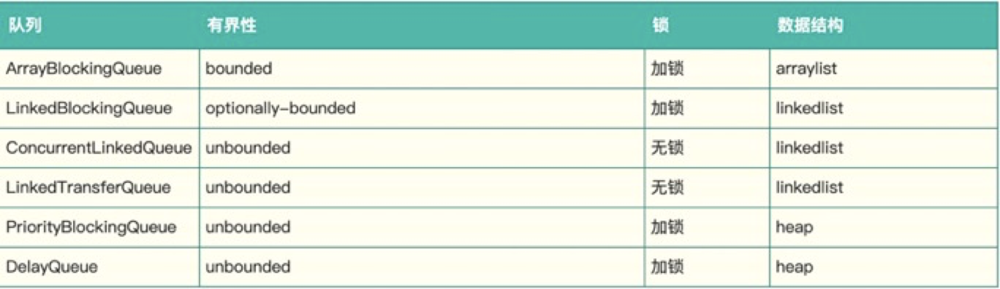
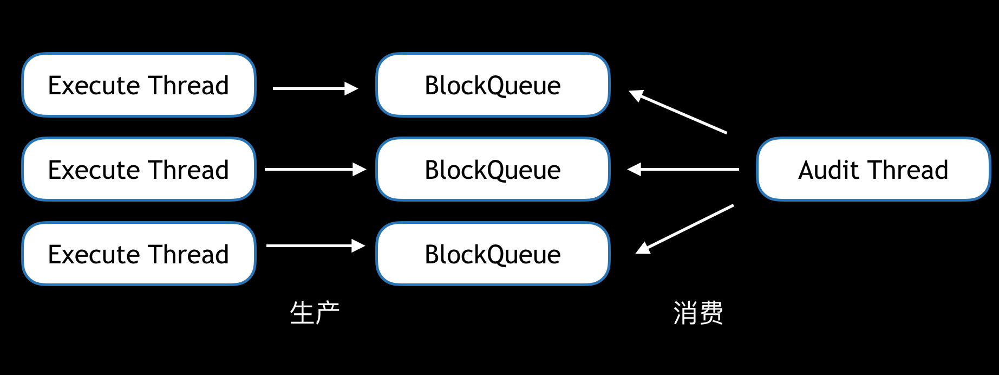
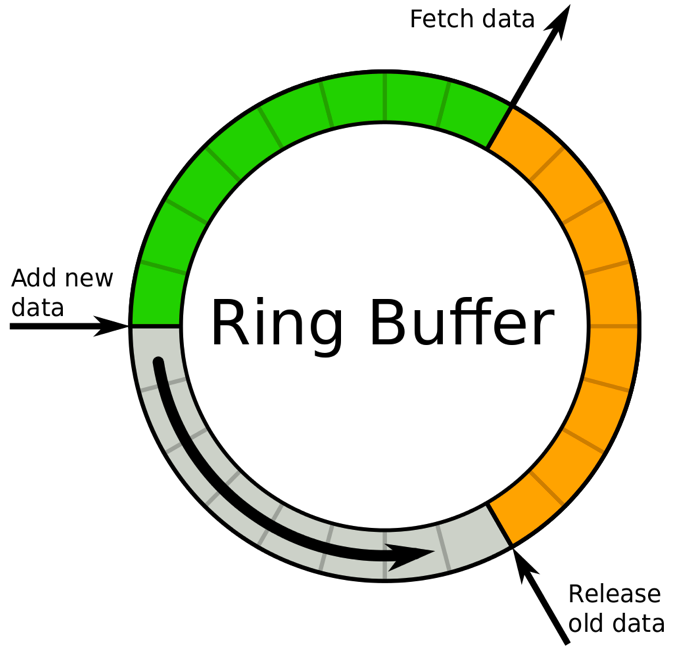
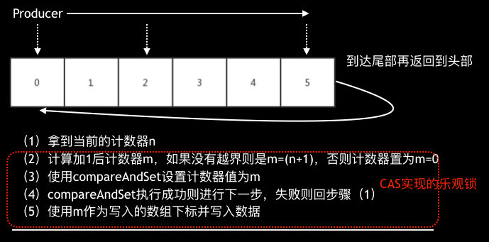
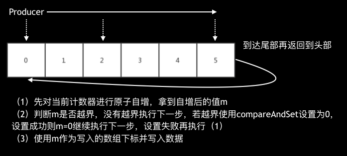
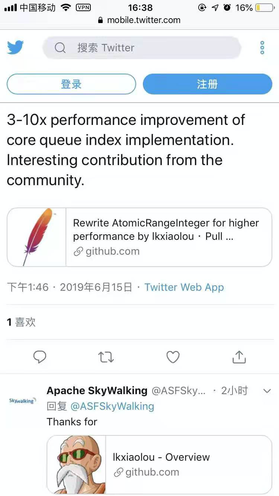

## 背景介绍

### Cobar简介

Cobar 是阿里开源的一款数据库中间件产品。

在业务高速增长的情况下，数据库往往成为整个业务系统的瓶颈，数据库中间件的出现就是为了解决数据库瓶颈而产生的一种中间层产品。

在软件工程中，没有什么问题是加一层中间层解决不了的，如果有，再加一层。

一款proxy类型（本文不讨论client SDK类型的数据库中间件）的数据库中间件具备以下能力：

- 支持数据库的透明代理，做到用户无感知
- 能够水平、垂直拆分数据库和表，横向扩展数据库的容量和性能
- 读和写的分离，降低主库压力
- 复用数据库连接，降低数据库的连接消耗
- 能够检测数据库集群的各种故障，做到快速failover
- 足够稳定可靠，性能足够好

而本文的主角Cobar除了读写分离外其他特性都支持的很好，而且基于Cobar开发读写分离的特性并不是一件很难的事。

### SQL审计

笔者有幸也曾在公司内的Cobar上做过定制开发，开发的功能是SQL审计。

从数据库产品的运营角度看，统计分析执行过的SQL是一个必要的功能；从安全角度看，信息泄露、异常SQL也需要被审计。

SQl审计需要审计哪些信息？通过调研，大致确定要采集执行的SQL、执行时间、来源host、返回行数等几个维度。

SQL审计的需求很简单，但就算是一个很简单的需求放在数据库中间件的高并发、低延迟，单机QPS可达几万到十几万的场景下都需要谨慎考虑，严格测试。

举个例子，获取操作系统时间，在Java中直接调用 `System.currentTimeMillis();` 就可以，但在Cobar中如果这么获取时间，就会导致性能损耗非常严重（怎么解决？去Cobar的github仓库上看看代码吧）。

## 技术方案

### 大方向

经调研，SQL审计实现的方向大致有两种

- 一种是比较容易想到的直接修改Cobar代码，在需要收集信息的地方埋点
- 另一种是阿里云数据库提供的方案，通过抓取数据库的通信流量进行分析。

考虑到技术的复杂度，我们选择了较为简单的第一种实现方式。

SQL审计在Cobar中属于“锦上添花”的需求，不能因为这个功能导致Cobar性能下降，更不能导致Cobar不可用，所以必须遵循以下两点：

- 性能尽可能接近无SQL审计版本
- 无论如何不能造成Cobar不可用

对于性能的损耗，没有度量就没法优化，于是使用`sysbench`（一种数据库基准测试工具）来对现在版本的Cobar进行压测。

Cobar部署在4C8G的机器上，mysql部署在性能足够好的物理机上，压出了`5.5w/s`的基准，后续的版本都和这个数值进行比对。

由于采取了侵入Cobar代码的方式，想对Cobar造成影响最小，就需要保持代码最小的修改，于是采取了agent的方案。

这样可以保持代码的最小修改，只需要打点采集并传输给agent，向远端传输审计信息的逻辑就只需要在agent中处理即可，向远端传输信息几乎在一开始就确定了用kafka，这样也能保持Cobar不引入新的第三方依赖，保持代码的干净（要知道Cobar的第三方依赖只有log4j），让kafka和Cobar保持在两个JVM中，更是一种隔离。于是有了下图的架构初稿

通过上图梳理出了两个关键技术点：线程通信和进程通信。

进程通信容易理解，为什么这里还涉及线程通信？

首先Cobar的execute线程是执行SQL的主线程，如果在这个线程中去进行进程通信，那性能肯定被消耗的体无完肤。于是只能丢给审计线程去做，这样对Cobar的性能影响最小。

### 进程间通信

先说进程间的通信，这块稍微简单点，我们只需要罗列出可用的进程间通信方式，然后对比优缺点，选择一个合适的使用即可

首先Cobar是Java编写，于是我们框定了范围：TCP、UDP、UnixDomainSocket、文件。

经过调研，UnixDomainSocket与平台相关性太强，且没有官方的实现，只有第三方的实现（如junixsocket），测试下来，不同linux的版本支持都不一致，所以这里直接排除。

写文件会导致高IO，甚至有写满磁盘的风险，毕竟在如此高的并发之下，遂排除。

最终在TCP和UDP中选择，考虑性能UDP比TCP好，且TCP还得自己解决`粘包`问题，于是我们选择了UDP。其实想想，SQL审计需求类似日志收集、metric上报，许多日志收集、metric上报都是采取UDP的方式。

### 线程间通信

如果说进程间通信`拍拍脑袋`就能决定，是因为他并不直接影响Cobar，他是审计线程与agent进程间的通信。然而线程间的通信则直接决定了对Cobar的性能影响，必须谨慎。

线程间通信必须通过一个`中间的缓冲buffer`来中转，我们对这个buffer有如下要求

- 有界，无界就可能会导致内存溢出
- 投递不能阻塞，阻塞会导致夯住主线程，极大影响Cobar性能
- 可以无序，为了保证Cobar可用性，甚至可以在极端情况下丢失一些数据
- 线程安全，高并发下如果线程不安全，数据就会错乱
- 高性能

#### Java内置队列

Java中内置的队列可以充当这个buffer

有界的只有ArrayBlockingQueue和LinkedBlockingQueue，然而他们都是加锁的，直觉告诉我，他的性能不会太好。

想到Java中CurrentHashMap和LongAdder都是通过分段来解决锁冲突的，于是打算使用多个ArrayBlockingQueue来构造这个buffer

实测下来，只达到了4.7w/s，性能损失约10%

#### Disruptor

Java内置的队列属于有锁队列，那么有没有不加锁且有界的队列呢？搜索后发现了一款开源的无锁队列实现`Disruptor`，大量的产品如Log4j2等都使用了Disruptor。它是一种环形的数据结构，使用了Java中的`CAS`代替了锁，且有许多细节上的性能优化，导致他的性能非常强悍。

但很可惜的是，在测试时发现当Disruptor的buffer写满之后，再写就会阻塞，这和我们的需求不符合，如果主线程发生阻塞将是灾难性的，于是放弃。

#### SkyWalking的RingBuffer

刚好当时组内同学在研究`SkyWalking`，SkyWalking是一款开源的应用性能监控系统，包括指标监控，分布式追踪，分布式系统性能诊断。

他的原理是利用Java的字节码修改技术在调用处插入埋点，采集信息上报。和Cobar的采集上报过程类似。

那么他的RingBuffer是如何实现的呢？其实非常简单，缓冲区就是一个数组，每次投递时获取一个没有写入数据的数组下标即可，在多线程下只要保证获取的下标不会被两个线程同时获取即可。数据的写入速度快慢就看这个下标获取是否高效即可，如下图：

获取数组下标和Disruptor类似也是使用了CAS，但他实现非常简单，甚至有点粗糙，但他可以在写满时选择是阻塞、覆盖或是忽略，我们选择覆盖这个策略，在极端情况下丢掉老数据来换取Cobar的可用性。我们测试了一下使用多个SkyWalking的RingBuffer的场景，结果只有`3w/s`，损失45%性能。

于是我们对这个Ringbuffer进行了一些优化

这个优化主要是将CAS换成incrementAndGet，这样就能利用到JDK8对incrementAndGet的优化，在JDK8之前，incrementAndGet底层也是CAS，但在JDK8之后，incrementAndGet使用了`fetch-and-add`(CPU指令)，性能要强劲很多。这块具体的介绍和代码可以参考[《一种极致性能的缓冲队列》](https://mp.weixin.qq.com/s/hmtx8BnUDp1onCJ99rdQ9g)。

除了这个主要的优化外，还参考Disruptor进行对SkyWalking进行了`缓存行填充`优化，最后达到了`5.4w/s`，性能损失仅仅1.8%，非常给力，于是使用了这个版本的Ringbuffer作为Cobar SQL审计的缓存区。

优化后的Ringbuffer也回馈给了SkyWalking社区，SkyWalking作者赞赏这是一个“intersting contribution”。

## 总结

Cobar的SQL审计在上线后稳定支撑了公司所有Cobar集群，是承载最高QPS的系统之一。

回头来看对性能的极致追求可能或许过于"偏执"，创造的收益在旁人眼里看来并没有那么大，加一台机器就能搞定的事情非要搞这么复杂。但这份“偏执”却是我们对技术最初的追求，生活不止眼前的苟且，还有诗和远方。

---
> 关于作者：专注后端的中间件开发，公众号"捉虫大师"作者，关注我，给你朴实无华的技术干货

- 原文链接：https://mp.weixin.qq.com/s/OEuZIfbKba8sq_rect809w
- 发布时间: 2021.03.21