Cobar 虽然是一款“古老”的数据库中间件，但目前不少公司仍然在用它，且它包含了不少有意思的算法和实现，今天就来分享 Cobar 提出的一种在分库场景下对 Order By / Limit 的优化。

> 原算法描述参考： https://github.com/alibaba/cobar/blob/master/doc/cobarSolution.ppt

### 背景

Cobar 最重要的功能就是分库分表，通常读取性能瓶颈可以通过增加从库或缓存来解决。

但写入性能在 MySQL 上只能通过分库分表来提升。

当我们把数据分布到不同的数据库上时，再查询时如果是单条数据只要找到这条数据对应的库即可，但如果是多条数据，可能分布在不同的库上时，Cobar 就需要先查询，再聚合。
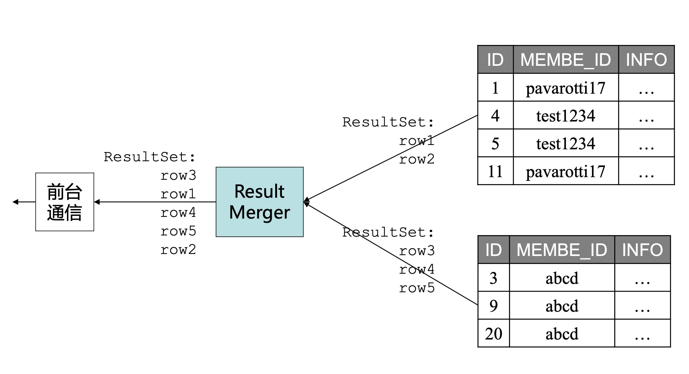

来个具体例子：

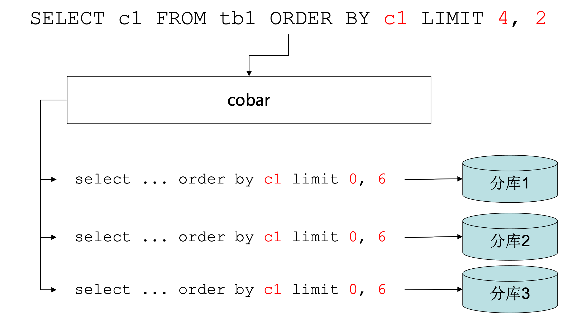

如果我们要查询 `tb1` 表的 `c1` 字段，且取 `c1` 正序的下标（从0开始）为4、5的数据。假设分了三个库，我们为了取到正确数据，需要去这三个分库都取下标0-5的数据，假设取到如下数据：

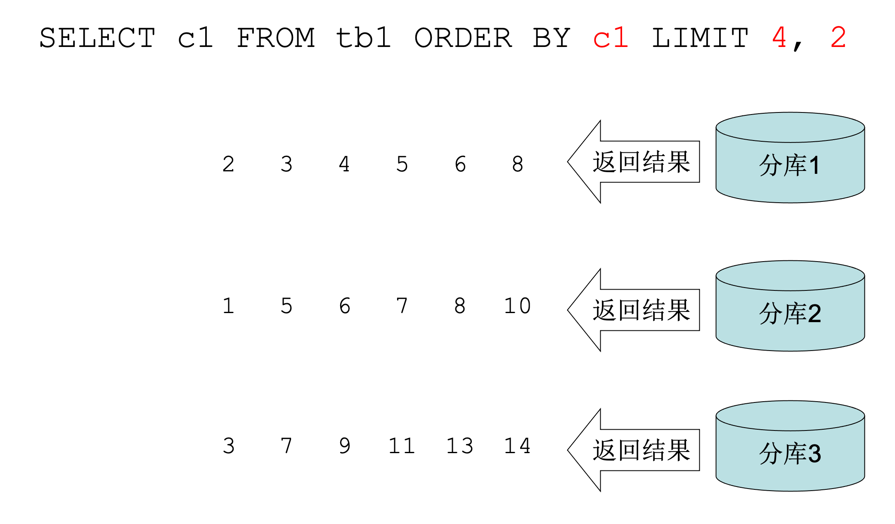

 取到3堆已排序的数据，对这3堆数据从小开始丢弃0、1、2、3号数据，保留第4、5号数据即是我们需要的。

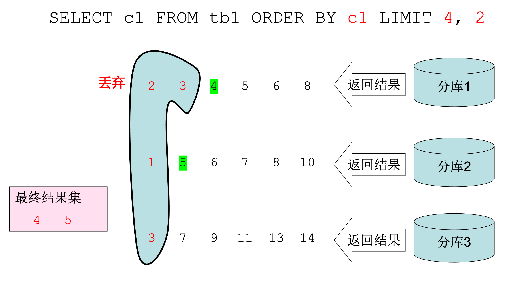

这个算法看起来没啥问题，但如果数据量稍微变化一下，比如：

`select c1 from tb1 order by c1 limit 9999999, 4`

如果还按照上述的方法来做，首先得去每个分库查询 0 - 10000003的数据，然后再合并丢弃0-9999998号数据。

相当于丢弃了大约不分库时3倍的数据。这多少显得有点浪费了。

### 算法优化

- Step1：将这条语句拆分成3条语句发给3个分库：

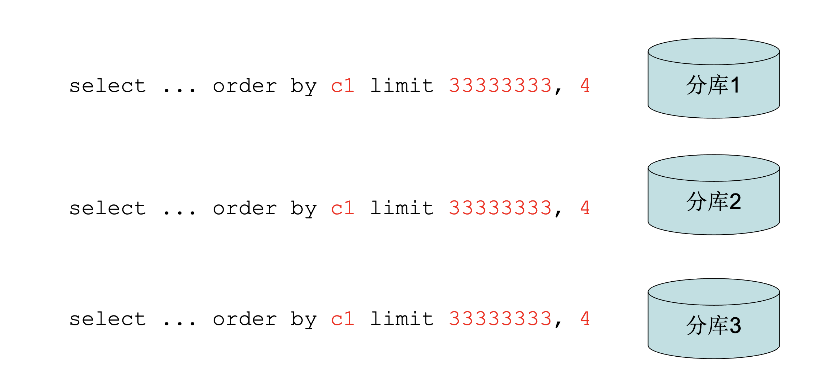

- Step2：找出查询结果的最大和最小值，这里假设最小值为3，最大值为11

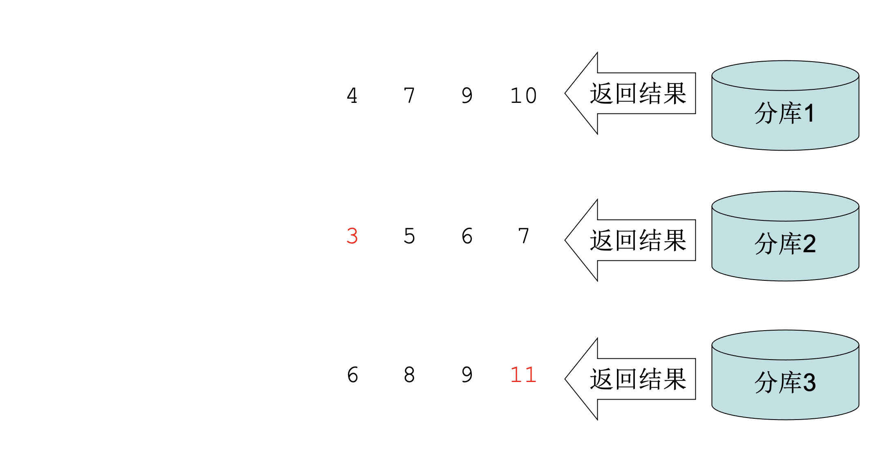

- Step3：以最小值和最大值为条件再次查询

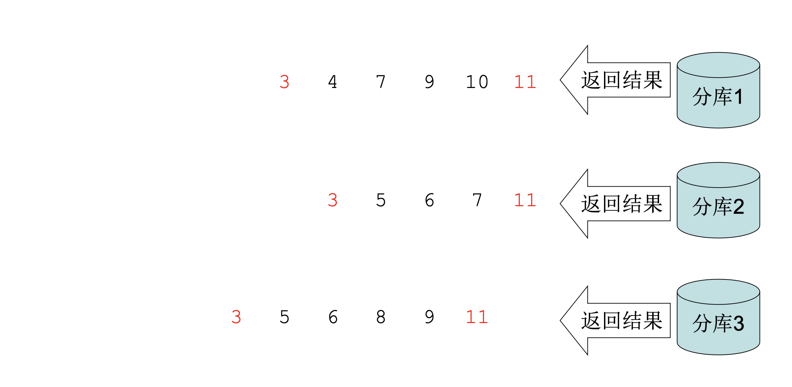

假设我们取得的数据如图，那么我们是不是很容易推断出这些结果之前还有多少数据？

- Step4：反查出每一个返回结果的 offset，这里我们就能推断出分库1在最小值之前还有3333332条数据，分库2在最小值之前还有3333333条数据，分库3在最小值之前还有3333331条数据

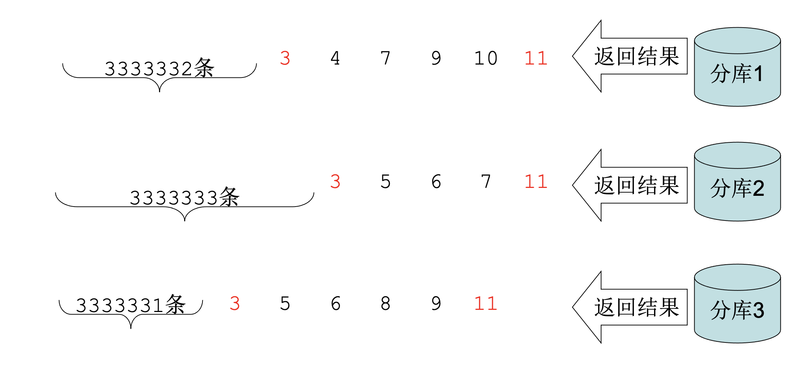

这时，我们就可以丢弃合并后的0-9999998号数据了，分库1、2、3将最小值之前的数据都丢弃共丢弃了0-9999995号数据，再丢弃3个最小值3刚好够到了9999998，所以9999999号数据开始依次是4、5、5、6

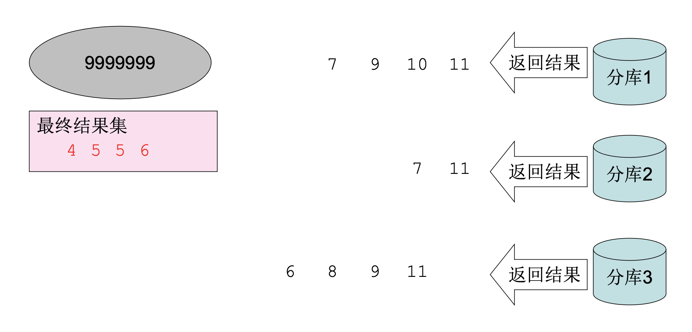

### 算法分析

#### 效率

以上例来说明，未优化前：

- 1次查询，查询的数据总量大约 3kw，丢弃9999999条数据

优化后：

- 第1次查询，查询数据总量约 1kw
- 第2次查询，数据总量17
- 丢弃3条数据

从这个例子可以看出，查询的数据量大大减少，需要计算丢弃的量也大大减少

#### 非理想情况

可能大家能看出来，上述例子是非常理想的情况，如果数据没这么“理想”，结局又是怎样？

- Step4 中反查的最小值之前不够丢弃怎么办，比如：

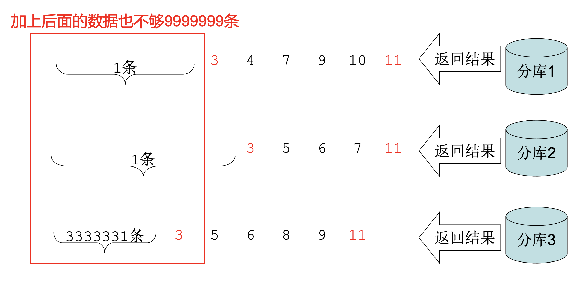

- Step4 中反查的最小值之前的数据比需要丢弃的数据多怎么办？

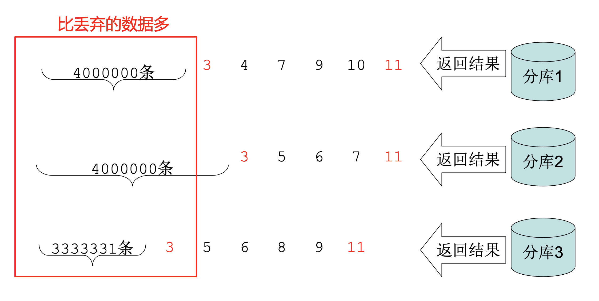

可以看出，如果是这两种情况，这种算法就没法再次生效了。

#### 优化的前提

根据上述两种情况来看，可以总结出该算法生效的前提是：

**数据（排序字段）在各个分库上的分布要均匀**

其实可以做个极端的假设，比如只有第一个分库上有数据，其他数据库没有数据，那么这个算法就失效了

### 总结

这么来看，这个算法是不是很废？确实比较废，就连 Cobar 中也没有使用。

但在某些场景下还是有比较大的提升的，分库的数据大部分时候是按字段进行取模，所以可以认为几乎是`分布均匀`的，此时如果 Order By / Limit 是比较`深度翻页`的数据，可以采取此策略，但也要进行兜底，如果返回的数据不满足条件，继续退化为最初的算法，所以单次效率可能不高，但从统计值上来看其效率可能是更高的。