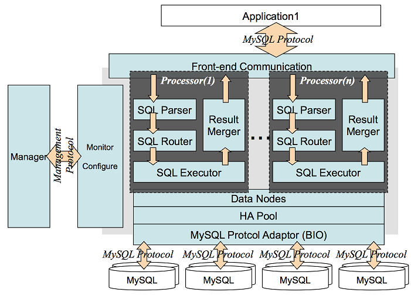
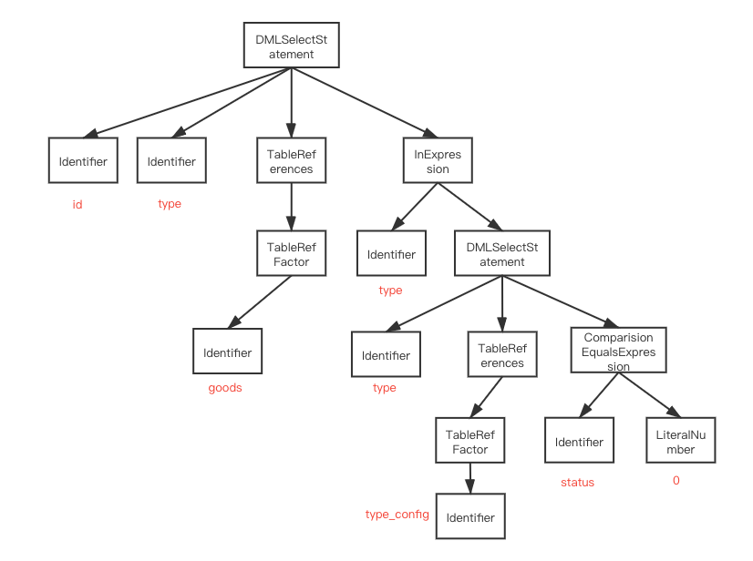
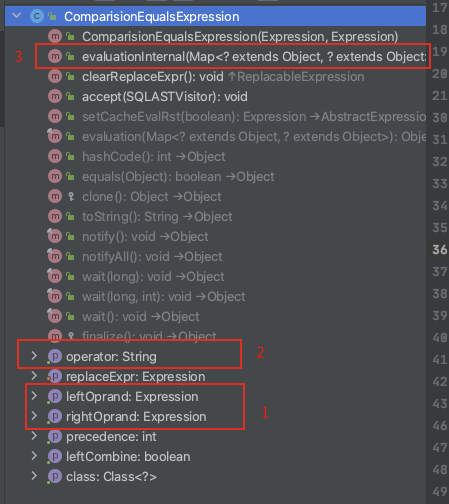
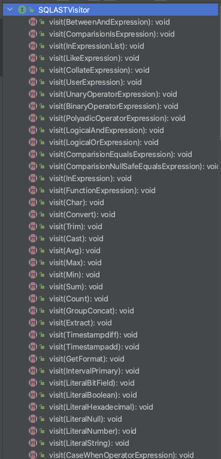

> 本文已收录 https://github.com/lkxiaolou/lkxiaolou 欢迎star。

# 背景

## Cobar
`Cobar`是阿里开源的数据库中间件，关于它的介绍这里不再赘述，可以参考之前的文章[《Cobar SQL审计的设计与实现》](https://mp.weixin.qq.com/s/OEuZIfbKba8sq_rect809w)

## SQL
`SQL`是一种领域语言（编程语言），常用于关系型数据库，方便管理结构化数据。数据库执行SQL时先对SQL进行词法分析、语法分析、语义分析生成抽象语法树（Abstract Syntax Tree，简称`AST`），再被优化器处理生成执行计划，由执行引擎执行。

## SQL Parser
将SQL解析为AST的解析器叫`SQL Parser`，开发这个解析器通常有两种方式：
- 通过工具自动生成
  - 优点：简单易于实现
  - 缺点：性能不佳，二次开发困难
- 手工编写
  - 优点：性能好，代码清晰易于扩展
  - 缺点：对开发人员要求高，需要了解编译原理
  
Cobar中也实现了SQL Parser，它在Cobar中的位置可以从它的架构图中看到

SQL Parser之后是SQL Router，可以推断出SQL Parser解析出AST的目的是为了分库分表的路由功能。

Cobar的SQL Parser也经历了三个版本的迭代，本质是性能考虑：

1. 第一版：基于JavaCC生成SQL parser，性能较差，优化不方便
1. 第二版：仿照ANTLR生成的parser结构手写，中间对象过多
1. 第三版：基于LL(2)识别器手写

本文不对SQL Parser做过多的介绍，有兴趣可以参考这篇文章 [《比开源快30倍的自研SQL Parser设计与实践》](https://mp.weixin.qq.com/s/q86lPDWMM4NeIkQ4ilMwGg) ，这篇文章我也仔细阅读了几遍，附上总结的脑图：
> https://github.com/lkxiaolou/reading/tree/main/xmind


# Cobar AST
Cobar中的SQL Parser将SQL解析为AST，为了直观感受，先举个例子：

> select id,type from goods as g where type in (select type from type_config where status = 0)

经过Cobar SQL Parser后，生成了如下AST对象：



这个AST的根节点就是select语句，然后每个属性都是叶子节点，叶子节点的属性再分出叶子节点。可能有点绕，需要从代码层面感受。

AST的Node定义如下，这里只有个accept方法，是为了遍历这棵树，暂时不管，后面会说到：
```java
public interface ASTNode {
    void accept(SQLASTVisitor visitor);
}
```
实现这个ASTNode主要有这几个：
- SQLStatement：SQL语句，比如select、update、insert等语句，体现在上图的DMLSelectStatement
- Expression：表达式，比如and、or、比较等语句，体现在InExpression、ComparisionEqualsExpression、LiteralNumber、Identifier
- TableReference：table相关语句，体现在TableReferences、TableRefFactor

以ComparisionEqualsExpression的实现为例



其中1是比较的左右表达式，2是判断符，这里是“=”，3是计算该表达式。

> evaluationInternal如何实现？其实表达式被结构化和穷举之后这个问题变得简单，比如这里只需要取左右的数值，进行是否相等的比较即可。

## AST操作
有了如上对AST的了解，接下来看对AST的操作，最基本的是遍历，利用ASTNode的accept，需要实现`SQLASTVisitor`接口，这个SQLASTVisitor定义如下：



其实是利用了java的多态，对每种ASTNode都定义了visit方法，遍历时不同对象对应到不同方法上。

比如`MySQLOutputASTVisitor`可以遍历AST，将AST还原为SQL输出，只需要这样：

```sql
SQLStatement stmt = SQLParserDelegate.parse(sql);
StringBuilder s = new StringBuilder();
stmt.accept(new MySQLOutputASTVisitor(s));
System.out.println(s.toString());
```
这样执行会输出
> SELECT id, type FROM goods AS G WHERE type IN (SELECT type FROM type_config WHERE status = 0)

SQLParserDelegate.parse(sql)解析出来为DMLSelectStatement对象，它的visit方法实现如下：
```java
@Override
public void accept(SQLASTVisitor visitor) {
    visitor.visit(this);
}
```
再看MySQLOutputASTVisitor的visit(DMLSelectStatement node)实现：
代码比较长，这里就不贴了，总体思路是遇到叶子节点就直接按格式存入StringBuilder中，否则继续调用相应节点的accept继续遍历，是一种深度遍历的思想。

我们可以参考MySQLOutputASTVisitor编写符合自己需求的遍历器。

## AST的应用

### 分库分表
Cobar中利用AST可以获取table名、列名、比较的值进行分库分表，这也是Cobar最重要的功能。

### SQL特征生成
除此之外，我了解的AST还可以对原始SQL生成SQL特征，比如原始SQL是这样：

> select id, name, age from user as u where age >= 20

或者是

> select id, name, age from user as u where age >= 30

都可以被归一化为

> select id, name, age from user as u where age >= ?

在进行SQL慢查询或其他的统计、针对SQL进行限流时非常有用。

### 危险SQL拦截
线上写了一条没有where条件的update或delete，这时可以利用AST进行表达式计算，对没有where条件和where条件恒为true的SQL进行拦截。

# 最后
本文从SQL AST的来源、结构、遍历原理、应用等方面进行介绍，相信看完文章会对SQL AST有了初步的了解，如果想进一步了解可以参考Cobar项目中的单元测试进行实际的演示感受。

---

> 搜索关注微信公众号"捉虫大师"，后端技术分享，架构设计、性能优化、源码阅读、问题排查、踩坑实践。

