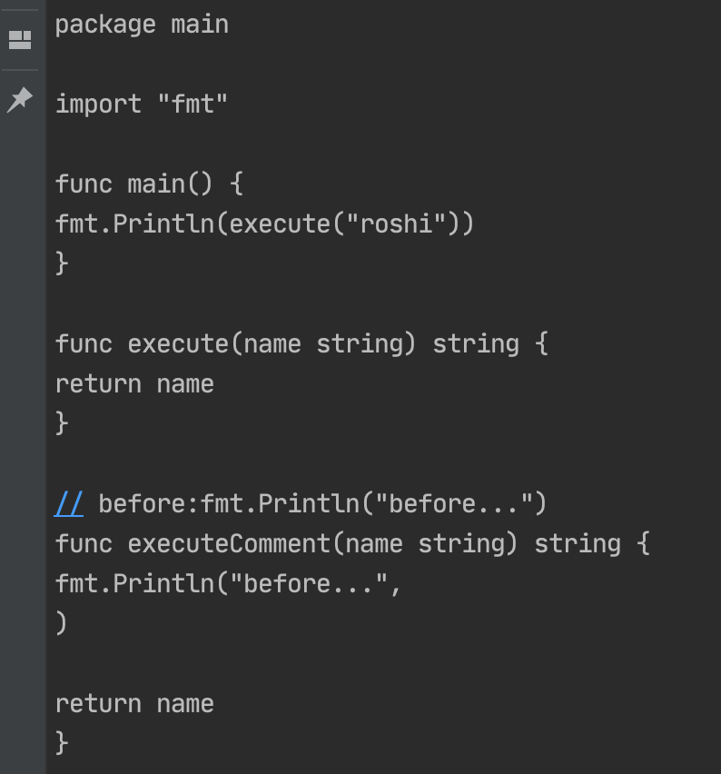

hello~大家好，我是小楼，今天分享的话题是`Go是否能实现AOP?`

### 背景

写Java的同学来写Go就特别喜欢将两者进行对比，就经常看到技术群里讨论，比如Go能不能实现Java那样的AOP啊？Go写个事务好麻烦啊，有没有Spring那样的@Transactional注解啊？

遇到这样的问题我通常会回复：没有、实现不了、再见。


直到看了《Go语言底层原理剖析》这本书，开始了一轮认真地探索。

### Java是如何实现AOP的

AOP概念第一次是在若干年前学Java时看的一本书《Spring实战》中看到的，它指的是一种面向切面编程的思想。注意它只是一种思想，具体怎么实现，你看着办。

AOP能在你代码的前后织入代码，这就能做很多有意思的事情了，比如统一的日志打印、监控埋点，事务的开关，缓存等等。

可以分享一个我当年学习AOP时的笔记片段：


在Java中的实现方式可以是`JDK动态代理`和`字节码增强技术`。

JDK动态代理是在运行时动态地生成了一个代理类，JVM通过加载这个代理类再实例化来实现AOP的能力。

字节码增强技术可以多唠叨两句，当年学Java时第一章就说Java的特点是「一次编译，到处运行」。

但当我们真正在工作中这个特性用处大吗？好像并不大，生产中都使用了同一种服务器，只编译了一次，也都只在这个系统运行。做到一次编译，到处运行的技术底座是JVM，JVM可以加载字节码并运行，这个字节码是平台无关的一种二进制中间码。

似乎这个设定带来了一些其他的好处。在JVM加载字节码时，字节码有一次被修改的机会，但这个字节码的修改比较复杂，好在有现成的库可用，如ASM、Javassist等。

至于像ASM这样的库是如何修改字节码的，我还真就去问了Alibaba Dragonwell的一位朋友，他回答ASM是基于Java字节码规范所做的「硬改」，但做了一些抽象，总体来说还是比较枯燥的。

由于这不是本文重点，所以只是提一下，如果想更详细地了解可自行网上搜索。

### Go能否实现AOP？

之前用「扁鹊三连」的方式回复Go不能实现AOP的基础其实就是我对Java实现AOP的思考，因为Go没有虚拟机一说，也没有中间码，直接源码编译为可执行文件，可执行文件基本没法修改，所以做不了。

但真就如此吗？我搜索了一番。

#### 运行时拦截

还真就在Github找到了一个能实现类似AOP功能的库`gohook`（当然也有类似的其他库）：

> https://github.com/brahma-adshonor/gohook

看这个项目的介绍：


运行时动态地hook Go的方法，也就是可以在方法前插入一些逻辑。它是怎么做到的？


通过反射找到方法的地址（指针），然后插入一段代码，执行完后再执行原方法。听起来很牛X，但它下面有个Notes：


使用有一些限制，更重要的是没有完全测试，不建议生产使用。这种不可靠的方式也就不尝试了。

#### AST修改源码

这种方式就是我在看《Go语言底层原理剖析》第一章看到的，其实我之前的文章也有写过关于AST的，[《Cobar源码分析之AST》](https://mp.weixin.qq.com/s/xp0hlRemUjlzoNmzv5lPlQ)。

AST即抽象语法树，可以认为所有的高级编程语言都可以抽象为一种语法树，即对代码进行结构化的抽象，这种抽象可以让我们更加简单地分析甚至操作源码。

Go在编译时大概分为词法与语法分析、类型检查、通用 SSA 生成和最后的机器代码生成这几个阶段。

其中词法与语法分析之后，生成一个AST树，在Go中我们能调用Go提供的API很轻易地生成AST：

```go
fset := token.NewFileSet()
// 这里file就是一个AST对象
file, err := parser.ParseFile(fset, "aop.go", nil, parser.ParseComments)
```

比如这里我的aop.go文件是这样的：

```go
package main

import "fmt"

func main() {
	fmt.Println(execute("roshi"))
}

func execute(name string) string {
	return name
}
```

想看生成的AST长什么样，可调用下面的方法：

```go
ast.Print(fset, file)
```

由于篇幅太长，我截个图感受下即可：


当然也有一些开源的可视化工具，但我觉得大可不必，想看的话Debug看下`file`的结构。

至于Go AST结构的介绍，也不是本文的重点，而且AST中的类型很多很多，我建议如果你想看的话直接Debug来看，对照源码比较清晰。

我们这里就实现一个简单的，在execute方法执行之前添加一条打印`before`的语句，接上述代码：

```go
const before = "fmt.Println(\"before\")"
...

exprInsert, err := parser.ParseExpr(before)
if err != nil {
	panic(err)
}

decls := make([]ast.Decl, 0, len(file.Decls))

for _, decl := range file.Decls {
	fd, ok := decl.(*ast.FuncDecl)
	if ok {
		if fd.Name.Name == "execute" {
			stats := make([]ast.Stmt, 0, len(fd.Body.List)+1)
			stats = append(stats, &ast.ExprStmt{
				X: exprInsert,
			})
			stats = append(stats, fd.Body.List...)
			fd.Body.List = stats
			decls = append(decls, fd)
			continue
		} else {
			decls = append(decls, decl)
		}
	} else {
		decls = append(decls, decl)
	}
}

file.Decls = decls
```

这里AST就被我们修改了，虽然我们是写死了针对execute方法，但总归是迈出了第一步。

再把AST转换为源码输出，Go也提供了API：

```go
var cfg printer.Config
var buf bytes.Buffer

cfg.Fprint(&buf, fset, file)

fmt.Printf(buf.String())
```

输出效果如下：


看到这里，我猜你应该有和我相同的想法，这玩意是不是可以用来格式化代码？

没错，Go自带的格式化代码工具gofmt的原理就是如此。

当我们写完代码时，可以执行gofmt对代码进行格式化：

> gofmt test.go

这相比于其他语言方便很多，终于有个官方的代码格式了，甚至你可以在IDEA中安装一个file watchers插件，监听文件变更，当文件有变化时自动执行 gofmt 来格式化代码。


看到这里你可能觉得太简单了，我查了下资料，AST中还能拿到注释，这就厉害了，我们可以把注释当注解来玩，比如我加了 `// before:` 的注释，自动把这个注释后的代码添加到方法之前去。

```go
// before:fmt.Println("before...")
func executeComment(name string) string {
	return name
}
```

修改AST代码如下，为了篇幅，省略了打印代码：

```go
cmap := ast.NewCommentMap(fset, file, file.Comments)

for _, decl := range file.Decls {
	fd, ok := decl.(*ast.FuncDecl)
	if ok {
		if cs, ok := cmap[fd]; ok {
			for _, cg := range cs {
				for _, c := range cg.List {
					if strings.HasPrefix(c.Text, "// before:") {
						txt := strings.TrimPrefix(c.Text, "// before:")
						ei, err := parser.ParseExpr(txt)
						if err == nil {
							stats := make([]ast.Stmt, 0, len(fd.Body.List)+1)
							stats = append(stats, &ast.ExprStmt{
								X: ei,
							})
							stats = append(stats, fd.Body.List...)
							fd.Body.List = stats
							decls = append(decls, fd)
							continue
						}
					}
				}
			}
		} else {
			decls = append(decls, decl)
		}
	} else {
		decls = append(decls, decl)
	}
}

file.Decls = decls
```

跑一下看看：



虽然又是硬编码，但这不重要，又不是不能用~


但你发现，这样实现AOP有个缺点，必须在编译期对代码进行一次重新生成，理论上来说，所有高级编程语言都可以这么操作。

但这不是说毫无用处，比如这篇文章[《每个 gopher 都需要了解的 Go AST》](https://mp.weixin.qq.com/s/pCcNtUykXAwb-BN_prPGpA)就给了我们一个实际的案例：


### 最后

写到最后，我又在思考另一个问题，为什么Go的使用者没有AOP的需求呢？反倒是写Java的同学会想到AOP。

我觉得可能还是Go太年轻了，Java之所以要用AOP，很大的原因是代码已经堆积如山，没法修改，历史包袱沉重，最小代价实现需求是首选，所以会选择AOP这种技术。

反观Go还年轻，大多数项目属于造轮子期间，需要AOP的地方早就在代码中提前埋伏好了。我相信随着发展，一定也会出现一个生产可用Go AOP框架。

至于现在问我，Go能否实现AOP，我还是回答：没有、实现不了、再见。

对了，本文的完整测试代码这里可以看到：

> https://github.com/lkxiaolou/all-in-one/tree/master/go-in-one/samples/tree

感谢大家，如果有点收获，点个`在看`、`赞`、`关注`吧，我们下期再见。