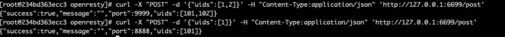

# OpenResty介绍
> OpenResty通过汇聚各种设计精良的 Nginx模块（主要由 OpenResty 团队自主开发），从而将 Nginx 有效地变成一个强大的通用 Web 应用平台。这样，Web 开发人员和系统工程师可以使用 Lua 脚本语言调动 Nginx 支持的各种 C 以及 Lua 模块，快速构造出足以胜任 10K 乃至 1000K 以上单机并发连接的高性能 Web 应用系统。OpenResty的目标是让你的Web服务直接跑在 Nginx 服务内部，充分利用 Nginx 的非阻塞 I/O 模型，不仅仅对 HTTP 客户端请求,甚至于对远程后端诸如 MySQL、PostgreSQL、Memcached 以及 Redis 等都进行一致的高性能响应。

# OpenResty安装
可参考 `http://openresty.org/en/linux-packages.html`

以centos为例：

- wget https://openresty.org/package/centos/openresty.repo
- mv openresty.repo /etc/yum.repos.d/
- yum check-update
- yum install openresty

# hello world程序
- mkdir -p /home/roshi/opensty/conf /home/roshi/opensty/logs
- 写个输出”hello world“的配置
```
worker_processes  1;
error_log logs/error.log;
events {
    worker_connections 1024;
}

http {
    server {
        listen 6699;
        location / {
            default_type text/html;


            content_by_lua_block {
                ngx.say("HelloWorld")
            }
        }
    }
}
```
- 运行
用上述的安装方式，nginx会安装在`/usr/local/openresty`目录，执行
```
/usr/local/openresty/nginx/sbin/nginx -p /home/roshi/openresty -c /home/roshi/openresty/conf/nginx.conf
```
- 测试
```
curl http://127.0.0.1:6699
```


# 处理流程
OpenResty处理一个请求，它的处理流程参考如下图


# 实战

nginx最常用的是反向代理功能，例如通过URL上的特征将同一个域名下的请求按照规则分发给不同的后端集群，举个例子：

`http://example.com/user/1`和`http://example.com/product/1`

是同个域名下的两个请求，他们分别对应用户与商品，后端提供服务的集群很可能是拆分的，这种情况使用nginx就可以很容易地分流；

但如果这个分流的特征不在header或者URL上，比如在post请求的body体中，nginx原生就没法支持，此时可以借助OpenResty的lua脚本来实现。

我就遇到过这样一个需求，同样的请求需要路由到不同的集群处理，但特征无法通过header或者URL来区分，因为在前期的设计中，不需要区分；这个请求可以处理单个的请求，也可以处理批量的情况，现在批量的请求性能不如人意，需要一个新集群来处理，抽象为以下请求

```
curl -X "POST" -d '{"uids":[1,2]}' -H "Content-Type:application/json" 'http://127.0.0.1:6699/post'
```

期望分离当body体中uids是多个和单个的请求，当uids只有1个uid时请求路由到后端A，uids中uid数量大于1时路由到后端B

在之前的nginx.conf基础上修改

```
worker_processes  1;
error_log logs/error.log info;
events {
    worker_connections 1024;
}

http {
   upstream single.uid {
       server host.docker.internal:8888;
   }
   upstream multiple.uids {
       server host.docker.internal:9999;
   }

    server {
        listen 6699;
        location / {
            default_type application/json;
            # default upstream
            set $upstream_name 'multiple.uids';

            rewrite_by_lua_block {

                cjson = require 'cjson.safe'
                ngx.req.read_body()
                local body = ngx.req.get_body_data()
                if body then
                    ngx.log(ngx.INFO, "body=" .. body)
                    local data = cjson.decode(body)

                    if data and type(data) == "table" then
                        local count = 0
                        for k,v in pairs(data["uids"]) do
                            count = count + 1
                        end

                        ngx.log(ngx.INFO, "count = " .. count)

                        if count == 1 then
                            ngx.var.upstream_name = "single.uid"
                        end
                    end
                end
            }
            proxy_pass http://$upstream_name;
        }
    }
}
```
- 第二行将日志级别调整为info，方便调试观察
- 定义两个upstream，对应不同的后端，由于我的openresty在docker容器中，后端服务在物理机中，所有这里使用了host.docker.internal代替后端ip
- 使用rewrite_by_lua_block（可以对照上文中的处理流程图）
- 使用cjson来解析body，判断uids中的数量，这段都是lua代码，注意lua代码和nginx配置的语法是不一样的，lua中获取nginx的变量使用ngx.var.upstream_name

后端代码这里也贴一下，使用golang编写，用到了echo框架

```go
package main

import (
   "github.com/labstack/echo/v4"
   "github.com/labstack/echo/v4/middleware"
   "os"
   "strconv"
)

type Response struct {
   Success bool `json:"success"`
   Message string `json:"message"`
   Port int `json:"port"`
   Uids []int `json:"uids"`
}

type Request struct {
   Uids []int `json:"uids"`
}

var port = 8888

func main() {

   e := echo.New()
   e.Use(middleware.Logger())
   e.Use(middleware.Recover())

   e.POST("/post", post)

   if len(os.Args) >= 2 {
      p, err := strconv.Atoi(os.Args[1])
      if err == nil {
         port = p
      }
   }
   e.Logger.Fatal(e.Start(":"+strconv.Itoa(port)))
}

func post(c echo.Context) error {
   req := Request{}
   err := c.Bind(&req)
   if err != nil {
      c.JSON(500, Response{
         Success: false,
         Port: port,
         Message: "bind body error",
      })
      return err
   }
   response := Response{
      Success: true,
      Port: port,
   }
   for _, uid := range req.Uids {
      response.Uids = append(response.Uids, uid + 100)
   }
   c.JSON(200, response)
   return nil
}
```
分别监听在8888和9999端口，运行后，请求6699端口（nginx监听）观察


同时，在日志`/home/roshi/openresty/logs/error.log`中也能看到


# 最后
本文从安装，基本原理上简单介绍了OpenResty，并从一个实际的例子展示了OpenResty的能力，希望看完的你也能入门OpenResty。

---
> 搜索关注微信公众号"捉虫大师"，后端技术分享，架构设计、性能优化、源码阅读、问题排查、踩坑实践。

