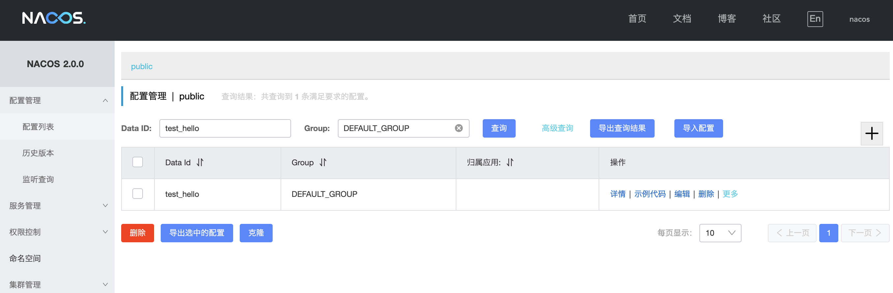
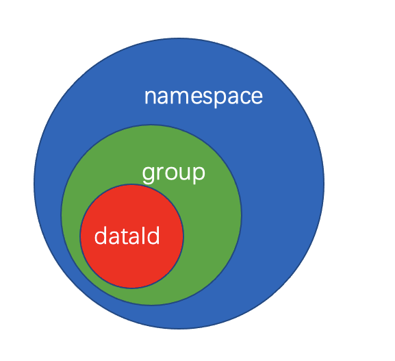
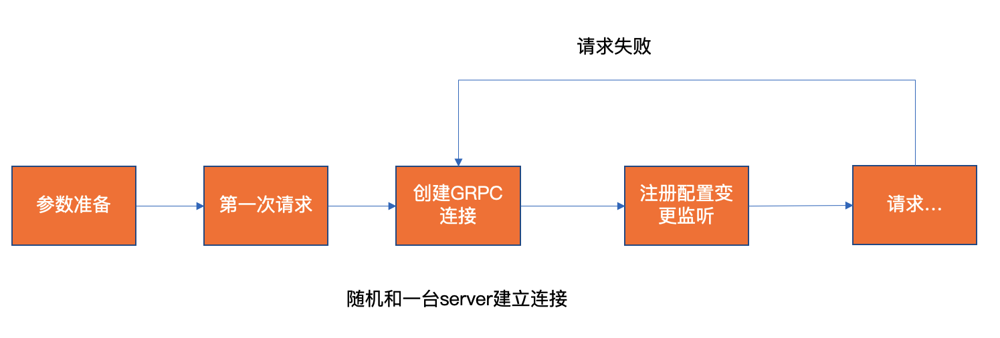
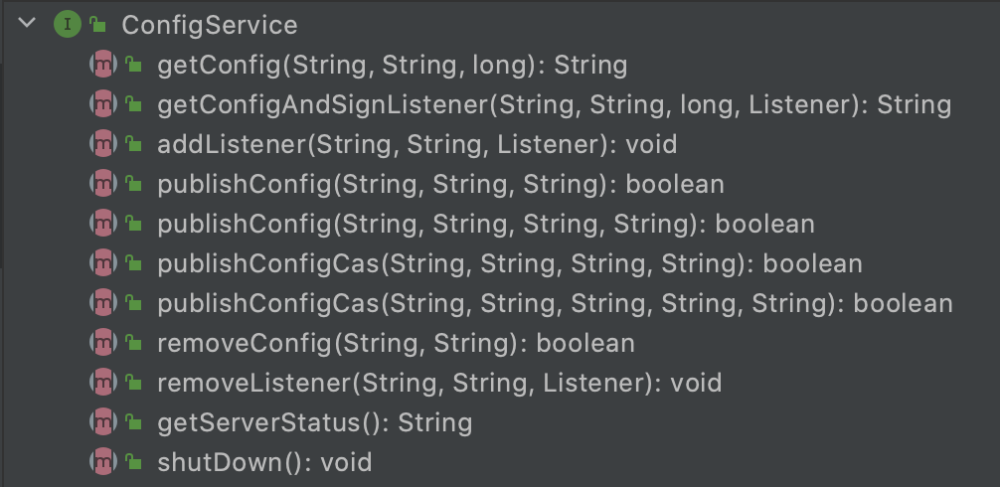
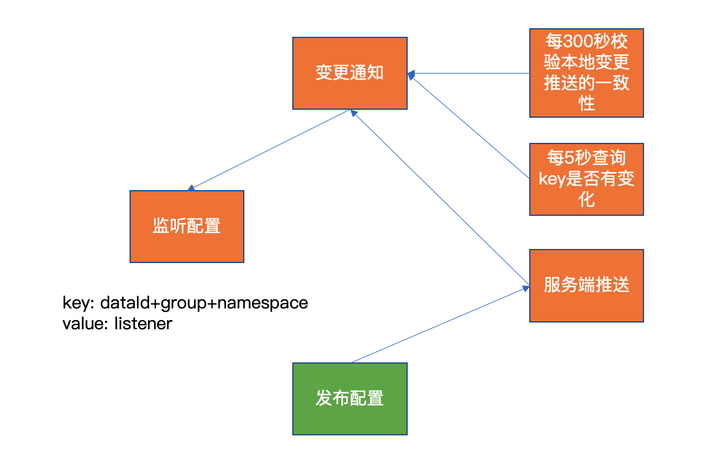
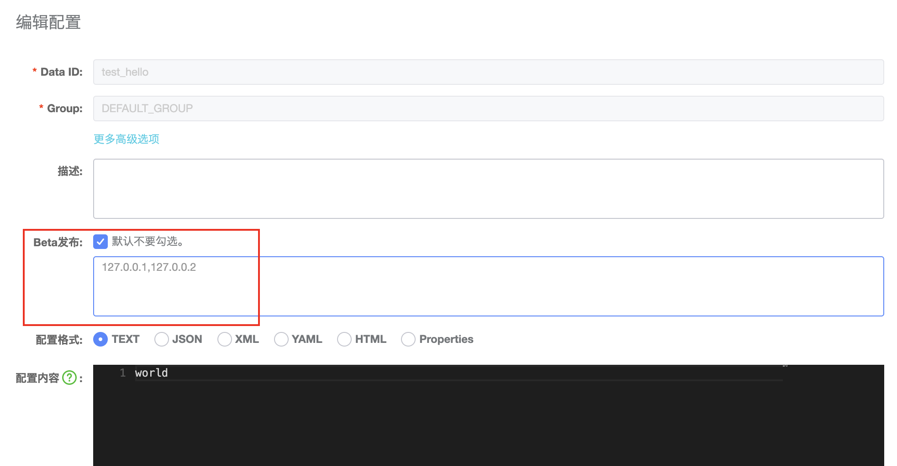
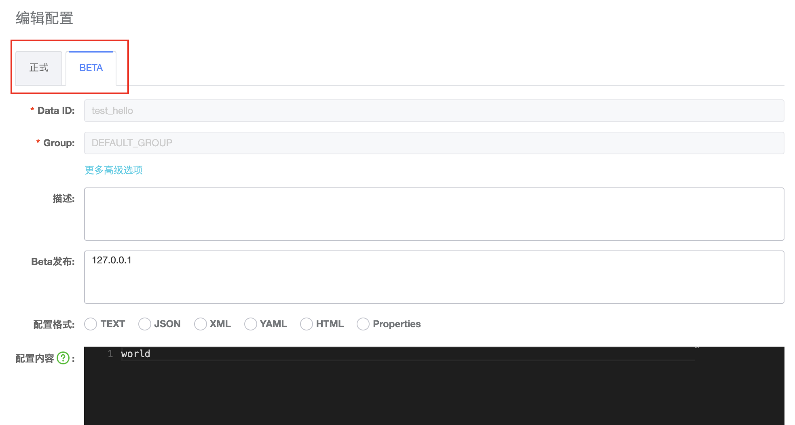
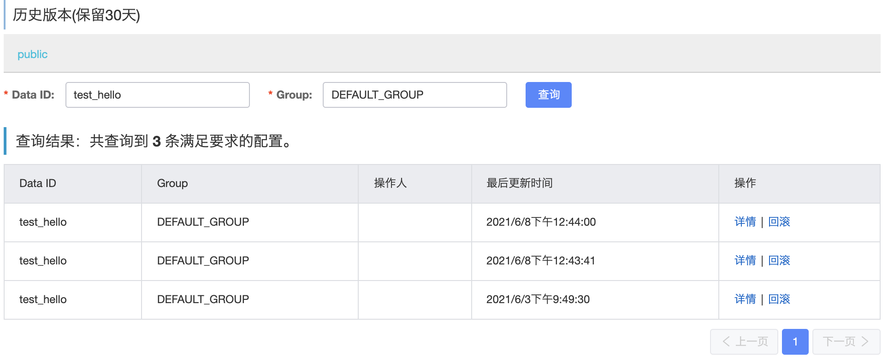

> 本文已收录 https://github.com/lkxiaolou/lkxiaolou 欢迎star。

## 配置中心
业务上的配置，功能开关，服务治理上对弱依赖的降级，甚至数据库的密码等，都可能用到动态配置中心。

在没有专门的配置中心组件时，我们使用硬编码、或配置文件、或数据库、缓存等方式来解决问题。

硬编码修改配置时需要重新编译打包，配置文件需要重启应用，数据库受限于性能，缓存丧失了及时性。

可能都不完美，但能从中总结出配置中心的需求，相对来说还是比较明确：

- 能够存储、获取并监听配置（必须）
- 配置变更时能及时推送给监听者（必须）
- 有一个可视化的查看变更配置的控制台（必须）
- 配置变更可灰度执行（加分）
- 配置变更可回滚（加分）

目前使用最多的配置中心可能是携程开源的Apollo，还有Spring Cloud Config、阿里开源的Nacos、百度的Disconf等。

## Nacos配置中心
`Nacos`是`Naming and Configuration Service`的缩写，从名字上能看出它重点关注的两个领域是`Naming`即注册中心和`Configuration`配置中心。

本文讲解nacos的配置中心的架构设计和实现原理，基于`2.0.0`版本（注：2.0.0版本与1.x版本区别较大）

## Nacos调试环境搭建

- 先从github上clone代码（网速比较慢，加上--depth=1参数）

```
git clone --depth=1 https://github.com/alibaba/nacos.git
```
- 导入IDE，看代码，调试更方便
- 启动Server端：运行console模块下的Nacos.main()，这个类扫描的路径最广，能启动所有的模块
  - JVM参数可带上`-Dnacos.standalone=true -Dnacos.functionMode=config`，指定单机模式，且只启动config模块
  - `--spring.config.additional-location=nacos/distribution/conf`，程序参数指定配置文件目录

  - 正常启动，console打印出Ncos控制台地址，进入Nacos控制台，输入用户名密码（默认均为nacos）即可登录



- 使用client进行测试，example模块下有configExample可进行config的测试，为了不动源代码，可copy一份configExample进行修改测试

## Nacos配置模型

namespace + group + dataId  唯一确定一个配置

- namespace：与client绑定，一个clinet对应到一个namespace，可用来隔离环境或区分租户
- group：分组，区分业务
- dataId：配置的id



## 客户端启动流程



- 参数准备时，如果配置了nacos服务端地址，则直接使用；如果配置了endpoint，则从endpoint中获取nacos服务端地址，这样有个好处是服务端地址变更，扩缩容都无需重启client，更详细可参考`https://nacos.io/en-us/blog/namespace-endpoint-best-practices.html`
- 在客户端第一次与服务端交互时创建GRPC连接，随机挑选一台server建立连接，后续都使用该连接，请求失败都会有重试，针对请求级别也有限流；重试失败或者服务端主动断开连接，则会重新挑选一台server进行建链

## 请求模型
从gRPC的proto文件能看出请求与返回的定义比较统一
```
message Metadata {
  string type = 3;
  string clientIp = 8;
  map<string, string> headers = 7;
}

message Payload {
  Metadata metadata = 2;
  google.protobuf.Any body = 3;
}

service Request {
  // Sends a commonRequest
  rpc request (Payload) returns (Payload) {
  }
}
```
- type是请求/返回类的类名
- clientIp是客户端ip
- headers是携带的header信息
- Playload中的body以json格式编码

在`com.alibaba.nacos.api.config.ConfigService`中可以找到所有配置中心能使用的接口



重点关注这几个接口：
- getConfig：读取配置
- publishConfig：发布配置
- publishConfigCas：原子的发布配置，若有被其他线程变更则发布失败，类似java中的CAS
- removeConfig：删除配置
- addListener：监听配置
- removeListener：移除配置的监听

## 变更推送



采取推拉结合的方式，既保证时效性，又保证数据一致性

## 数据存储
Nacos配置中心的数据存储支持内嵌的`derby`数据库，也支持外部数据库`mysql`，内嵌数据库主要是为了单机测试时使用。

其中上文提及的`publishConfigCas`的实现是利用了数据库`update ${table} set ${xx}=${zz} where md5=${old_md5}`来实现，如果已经这条数据被变更，则这次publish会失败。

## 灰度和回滚



当勾选灰度发布时可填写灰度的ip进行推送，不在灰度列表内的ip则不会接受到变更推送，并且灰度和正式是区分开的。





灰度的实现是记录下了每次的发布，回滚到指定版本即可。


## 结语
本文从背景出发，结合Nacos配置中心的各个重要模块进行了一一解释，能够从整体上对Nacos的配置中心有一个把握。期望后续能对Nacos注册中心进行分析介绍。

---
> 搜索关注微信公众号"捉虫大师"，后端技术分享，架构设计、性能优化、源码阅读、问题排查、踩坑实践。

