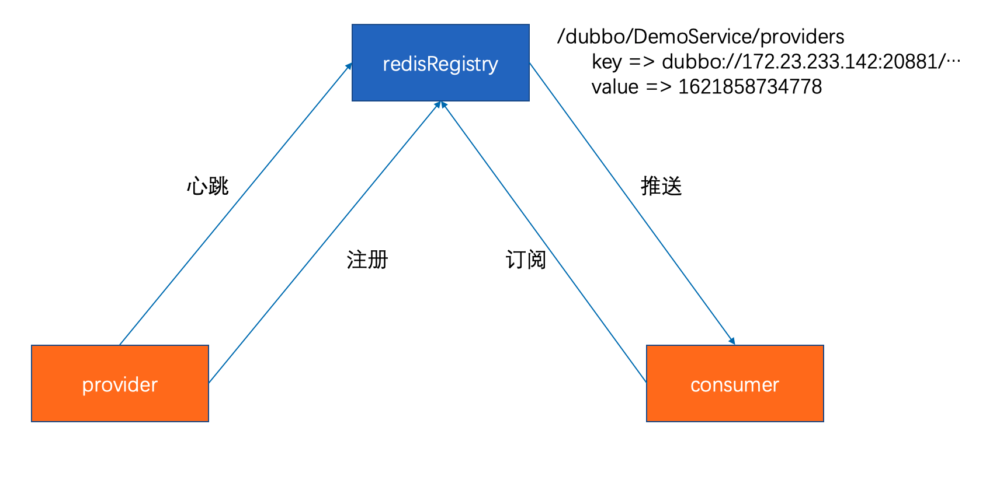
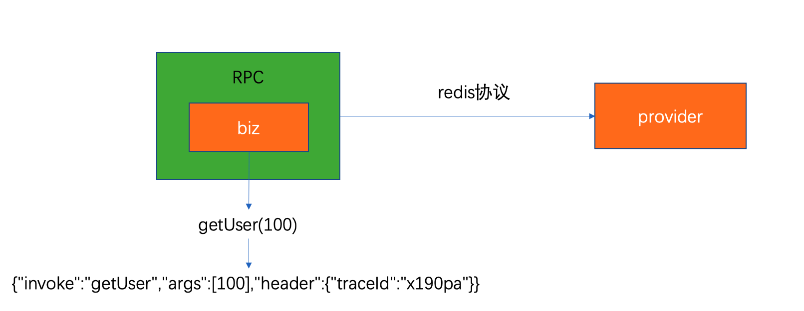

> 本文已收录 https://github.com/lkxiaolou/lkxiaolou 欢迎star。

## 前言

说到redis，可能大家的脑海中蹦出的关键词是：NoSQL、KV、高性能、缓存等。但今天的文章从另一个角度——微服务来展开。

这篇文章的起因也是源自一次面试经历，在面试一位来自陌陌的候选人（就是那个交友的陌陌）时，他提到一点让我觉得很有意思，他说redis在陌陌被使用的非常广泛，除了常规的缓存外，某些场景下也当NoSQL数据库来使用，还用redis作为微服务的注册中心，甚至连RPC的调用协议都用了redis协议。

## 注册中心

最早了解到redis可以作为注册中心是从dubbo的源码中看到，但一直也没有过多的了解，因为从没听说哪家公司使用redis来做服务发现。

在dubbo中使用redis来做服务发现还是挺简单的，引入jedis依赖，将注册中心地址改为redis地址即可：

```
<dependency>
	<groupId>redis.clients</groupId>
	<artifactId>jedis</artifactId>
	<version>2.9.0</version>
</dependency>
```

```java
dubbo.registry.address=redis://127.0.0.1:6379
```

注册上来的数据是这样，类型是hash

```
/dubbo/${service}/${category}
```

如

```
/dubbo/com.newboo.sample.api.DemoService/consumers
/dubbo/com.newboo.sample.api.DemoService/providers
```

hash数据结构下保存的key是注册上来的url，value是过期时间

```
127.0.0.1:6379> hgetall /dubbo/com.newboo.sample.api.DemoService/providers
1) "dubbo://172.23.233.142:20881/com.newboo.sample.api.DemoService?anyhost=true&application=boot-samples-dubbo&deprecated=false&dubbo=2.0.2&dynamic=true&generic=false&interface=com.newboo.sample.api.DemoService&metadata-type=remote&methods=sayHello&pid=19807&release=2.7.8&side=provider&timestamp=1621857955355"
2) "1621858734778"
```

从理论上来说，注册中心只要符合数据存储、监听推送变更、心跳检测这几个基本的功能即可。

以dubbo为例看下redis是如何利用自身特性来完成注册中心的功能（ 以dubbo 2.7.8版本为例）：

- 服务注册

  - provider在服务注册时，将服务提供方的url写入`/dubbo/${service}/providers`下，数据类型为hash，key为提供方url，value为key的过期时间，默认为60s，可配置
  - 写入完成后以`/dubbo/${service}/providers`为key调用`publish`命令发布一个register事件
  - provider在初始化时起一个单独的线程每隔`1/2过期时间`（默认30s）时对provider进行重新重新注册并发布register事件

- 服务发现

  - 获取匹配`/dubbo/${service}/*`的key（此处用到了`keys`命令），拿到的有这几种：`/dubbo/${service}/providers`、`/dubbo/${service}/routers`、`/dubbo/${service}/configuators`
  - 对`/dubbo/${service}/*`拿到的key进行`hgetall`，拿到真实的provider列表以及配置等数据，进行组装、匹配
  - 同时对每个subscribe的服务单独开一个线程，对`/dubbo/${service}`执行`psubscribe`命令阻塞等待有事件发生




从源码和测试来看，dubbo的redis注册中心不能直接用于生产环境，原因有如下两点：

  - 使用了`keys`命令，会阻塞单线程的redis，keys执行期间，其他命令都得排队
  - 没有心跳检测这个功能，我测试了provider被`kill -9`杀死后，consumer是无法感知的。但从实现上来看是想通过存储的过期时间来判断服务是否可用，即需要对比url对应的value与当前的时间，如果过期应被剔除，但这部分貌似没有实现完整

  虽然dubbo的redis注册中心生产不可用，但这并不影响他可以构建一个生产可用的注册中心，陌陌就是个很好的例子。

  ## RPC调用协议

  redis协议作为RPC调用协议也是陌陌同学告诉我的，当时我问了他两个问题：

  - 为什么选择redis协议作为RPC调用协议
  - redis协议如何透传类似header的`隐式参数`

  第一个问题的答案也比较出乎意料，他说是为了跨语言调用，当时觉得只有http、gRPC等协议做到了跨语言，redis协议跨语言也是第一次听说。但仔细一想，确实没毛病，现在哪个后端语言没有实现redis的客户端呢？

  之所以redis协议能够做到跨语言，这也全仰仗它的设计非常简洁，易于实现，详细协议内容可以参考这个链接：

  `http://redisdoc.com/topic/protocol.html`

  我就举一个例子来证明redis协议简洁到了什么程度，这是我很久之前就关注的一个项目

  `https://github.com/jdp/redisent`

  它是一个php实现的redis客户端，只有一个php文件，`共196行`，这196行包含了注释，变量定义，链接建立等，真正解析协议的代码非常少，请求的编码和发送只用了`17行代码`，解析返回的代码只有`58行`！正如项目的介绍那样：`simple, no-nonsense`

  第二个问题回答的和我的预期一致，从redis协议的层面暂时无法支持类似header的隐式参数，但陌陌的RPC框架是自研的，所以他们在框架层解决了这个问题，序列化他们选择了`json`，如果要透传header参数，框架将参数组装到传输体中去。



  遗憾的是dubbo中的redis协议实现并不完整，无法暴露redis协议，只能调用，所以测试也只能测试client连接到redis服务器进行get、set调用，意义不大。

## 总结

redis目前是个用途非常广泛的存储组件，虽然在微服务领域它不是主流，但这也给我们提供了一种思路，至少这条路是可以走通的。

---

> 搜索关注微信公众号"捉虫大师"，后端技术分享，架构设计、性能优化、源码阅读、问题排查、踩坑实践。

