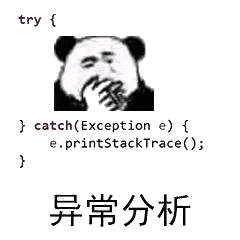
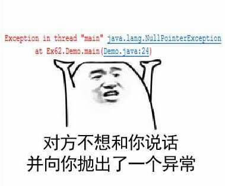
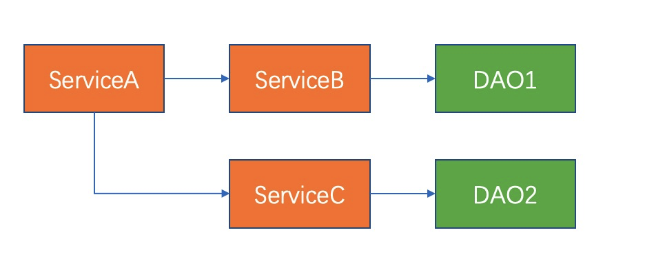
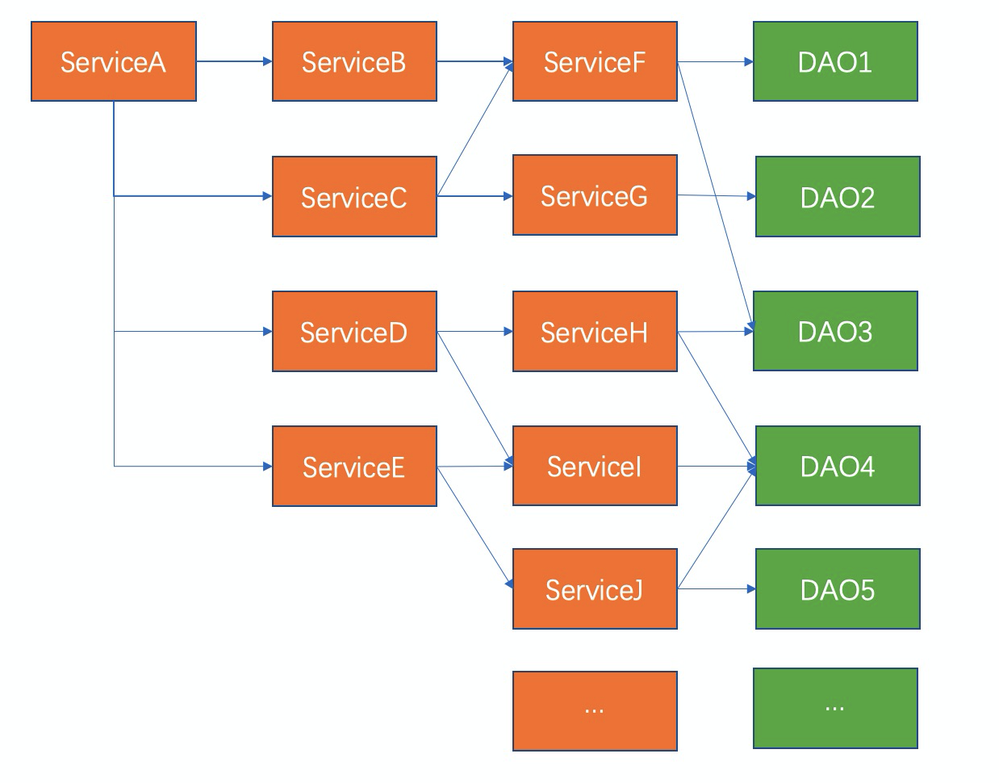
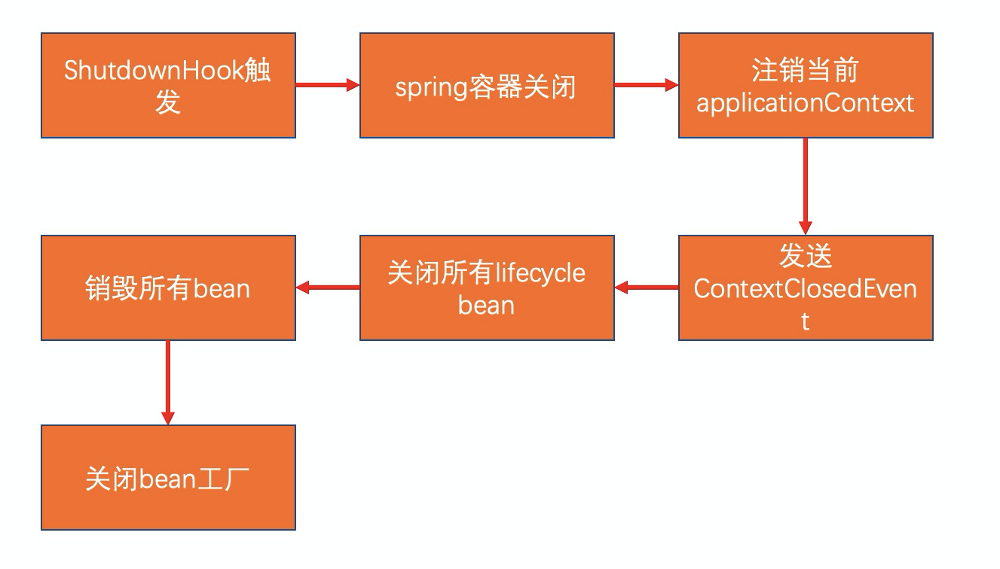

### 1

时间追溯到2018年12月的某一天夜晚，那天我正准备上线一个需求完就回家，刚点下发布按钮，告警就响起，我擦，难道回不了家了？看着报错量只有一两个，断定只是偶发，稳住不要慌。

把剩下的机器发完，又出现了几个同样的错误，作为一名优（咸）秀（鱼）程序员，这种问题必须追查到底。

### 2

娴熟地查询到报错日志

`
org.apache.ibatis.exceptions.PersistenceException: ### Error querying database. Cause: org.springframework.jdbc.CannotGetJdbcConnectionException: Could not get JDBC Connection; nested exception is com.alibaba.druid.pool.DataSourceClosedException: dataSource already closed
`

看着异常信息，陷入了沉思

- 表面上看报错是因为使用了已经关闭的数据源
- 数据源什么时候会关闭呢？只有进程被杀死的时候
- 莫非是应用关闭时不够平滑？发布时会先摘除流量的呀，应该不至于呀

天色已经很晚，漫无目的地拖动日志，疲惫地寻找新线索，突然报错日志中一个单词引入眼帘：**rocketmq**

精神抖擞，大概知道原因了，这应用中还有个兢兢业业的rocketmq consumer一直在消费消息，在应用关闭时，外部流量被摘除了，但没人通知rocketmq consumer，于是它抛异常了。

### 3

出于我对rocketmq不深刻甚至有点肤浅的理解，它的消费采用ack的方式，如果报错，消息稍后还会重试，不会丢消息，而且如果消费代码是幂等的，也不会有业务上的异常，总之这不重要，因为它也不是我写的代码。

瞅了一眼consumer的代码（这里就不贴代码了，反正贴了你也不会看），consumer注册了一个ShutdownHook，ShutdownHook里consumer执行了shutdown来优雅地退出，并且给这个shutdownThread设置了`最高优先级`，然而从实践看来，这个线程最高优先级并没有什么卵用。

而且从[《ShutdownHook原理》](https://mp.weixin.qq.com/s/M1ER1oZt8hkAPJsFLIaOTg)这篇文章中也知道ShutdownHook是并发执行的，spring容器关闭也是一个ShutdownHook，他们之前没有先后顺序。

了解原因后，第一时间想到了类似dubbo摘流的方案，吭哧吭哧写了个优雅关闭rocketmq cosnumer的接口，在应用关闭脚本的kill之前调用该接口，完美解决问题，赶紧下班回家，不然要猝死了。

### 4

夜里入睡，梦到老板让我把所有的系统都改造掉，吓得我一机灵。

于是第二天又重新思考这个问题，总觉得在应用里实现一个接口并在stop脚本中去调用是一件非常不优雅的事，更重要的是这也没法复制到其他项目，我又陷入了沉思。

既然是spring容器关闭时bean的销毁顺序导致的问题，那么能不能利用spring的depend-on把顺序理顺了？说干就干。

起初我遇到是这样的依赖关系：

手把手在xml的每个bean中把depend-on关系都配上，似乎也起到了作用。

但当我打开第二个项目时，它的bean之间的依赖关系大致如下：

好家伙，26个字母差点不够用，当时我的心情是这样的

所以我觉得以当前的速度，改造完所有项目可能都到9102年了。

### 5

又过了一段时间，在github交友网站上突然看到了rocketmq官方实现的spring-boot-starter，于是点进去看了它的实现。好家伙，看完直呼666。

官方starter实现了spring的`SmartLifecycle`接口，它的start方法能在所有bean初始化完成后被调用，stop方法会在bean被销毁前调用，对rocketmq consumer来说简直完美。

顺便还复习了一下spring容器的关闭，代码在AbstractApplicationContext的doClose方法，这里我总结成一幅图：

通过上图能看到，销毁bean之前，有关闭lifecycle bean和发送ContextClosedEvent两个动作，官方starter选择了实现LifeCycle接口的方式。

### 6

到这里我该给老板汇报去了，之所以rocketmq consumer发布时不平滑是我们的使用姿势问题，虽然对业务没影响，但不优雅，解决方案有两个，老板你选吧：

- 全都换成官方starter，依赖spring-boot，官方维护，改造成本很高，
- 监听ContextClosedEvent来实现优雅关闭，这块可以封装一下，让业务方引入依赖即可

---

> 都看到这了，不点个关注吗？

