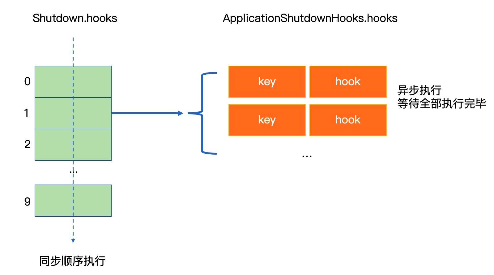

> 微信搜索“捉虫大师”，点赞、关注是对我最大的鼓励

# ShutdownHook介绍
在java程序中，很容易在进程结束时添加一个钩子，即`ShutdownHook`。通常在程序启动时加入以下代码即可
```java
Runtime.getRuntime().addShutdownHook(new Thread(){
    @Override
    public void run() {
        System.out.println("I'm shutdown hook...");
    }
});
```
有了ShutdownHook我们可以

- 在进程结束时做一些善后工作，例如释放占用的资源，保存程序状态等
- 为优雅（平滑）发布提供手段，在程序关闭前摘除流量

不少java中间件或框架都使用了ShutdownHook的能力，如dubbo、spring等。

spring中在application context被load时会注册一个ShutdownHook。
这个ShutdownHook会在进程退出前执行销毁bean，发出ContextClosedEvent等动作。
而dubbo在spring框架下正是监听了ContextClosedEvent，调用`dubboBootstrap.stop()`来实现清理现场和dubbo的优雅发布，spring的事件机制默认是同步的，所以能在publish事件时等待所有监听者执行完毕。

# ShutdownHook原理
### ShutdownHook的数据结构与执行顺序
- 当我们添加一个ShutdownHook时，会调用`ApplicationShutdownHooks.add(hook)`，往`ApplicationShutdownHooks`类下的静态变量`private static IdentityHashMap<Thread, Thread> hooks`添加一个hook，hook本身是一个thread对象
- `ApplicationShutdownHooks`类初始化时会把`hooks`添加到`Shutdown`的`hooks`中去，而`Shutdown`的`hooks`是系统级的ShutdownHook，并且系统级的ShutdownHook由一个数组构成，只能添加10个
- 系统级的ShutdownHook调用了thread类的`run`方法，所以系统级的ShutdownHook是同步有序执行的

```java
private static void runHooks() {
    for (int i=0; i < MAX_SYSTEM_HOOKS; i++) {
        try {
            Runnable hook;
            synchronized (lock) {
                // acquire the lock to make sure the hook registered during
                // shutdown is visible here.
                currentRunningHook = i;
                hook = hooks[i];
            }
            if (hook != null) hook.run();
        } catch(Throwable t) {
            if (t instanceof ThreadDeath) {
                ThreadDeath td = (ThreadDeath)t;
                throw td;
            }
        }
    }
}
```
- 系统级的ShutdownHook的`add`方法是包可见，即我们不能直接调用它
- `ApplicationShutdownHooks`位于下标`1`处，且应用级的hooks，执行时调用的是thread类的`start`方法，所以应用级的ShutdownHook是异步执行的，但会等所有hook执行完毕才会退出。

```java
static void runHooks() {
    Collection<Thread> threads;
    synchronized(ApplicationShutdownHooks.class) {
        threads = hooks.keySet();
        hooks = null;
    }

    for (Thread hook : threads) {
        hook.start();
    }
    for (Thread hook : threads) {
        while (true) {
            try {
                hook.join();
                break;
            } catch (InterruptedException ignored) {
            }
        }
    }
}
```
用一副图总结如下：


### ShutdownHook触发点
从`Shutdown`的`runHooks`顺藤摸瓜，我们得出以下这个调用路径


重点看`Shutdown.exit` 和 `Shutdown.shutdown`

#### Shutdown.exit
跟进`Shutdown.exit`的调用方，发现有 `Runtime.exit` 和 `Terminator.setup`

- `Runtime.exit` 是代码中主动结束进程的接口
- `Terminator.setup` 被 `initializeSystemClass` 调用，当第一个线程被初始化的时候被触发，触发后注册了一个信号监控函数，捕获`kill`发出的信号，调用`Shutdown.exit`结束进程

这样覆盖了代码中主动结束进程和被`kill`杀死进程的场景。

主动结束进程不必介绍，这里说一下信号捕获。在java中我们可以写出如下代码来捕获kill信号，只需要实现`SignalHandler`接口以及`handle`方法，程序入口处注册要监听的相应信号即可，当然不是每个信号都能捕获处理。

```java
public class SignalHandlerTest implements SignalHandler {

    public static void main(String[] args) {

        Runtime.getRuntime().addShutdownHook(new Thread() {
            @Override
            public void run() {
                System.out.println("I'm shutdown hook ");
            }
        });

        SignalHandler sh = new SignalHandlerTest();
        Signal.handle(new Signal("HUP"), sh);
        Signal.handle(new Signal("INT"), sh);
        //Signal.handle(new Signal("QUIT"), sh);// 该信号不能捕获
        Signal.handle(new Signal("ABRT"), sh);
        //Signal.handle(new Signal("KILL"), sh);// 该信号不能捕获
        Signal.handle(new Signal("ALRM"), sh);
        Signal.handle(new Signal("TERM"), sh);

        while (true) {
            System.out.println("main running");
            try {
                Thread.sleep(2000L);
            } catch (InterruptedException e) {
                e.printStackTrace();
            }
        }
    }

    @Override
    public void handle(Signal signal) {
        System.out.println("receive signal " + signal.getName() + "-" + signal.getNumber());
        System.exit(0);
    }
}
```

要注意的是通常来说，我们捕获信号，做了一些个性化的处理后需要主动调用`System.exit`，否则进程就不会退出了，这时只能使用`kill -9`来强制杀死进程了。

而且每次信号的捕获是在不同的线程中，所以他们之间的执行是异步的。

#### Shutdown.shutdown
这个方法可以看注释
>     /* Invoked by the JNI DestroyJavaVM procedure when the last non-daemon
>       * thread has finished.  Unlike the exit method, this method does not
>       * actually halt the VM.
>       */

翻译一下就是该方法会在最后一个非`daemon`线程（非守护线程）结束时被JNI的`DestroyJavaVM`方法调用。

java中有两类线程，用户线程和守护线程，守护线程是服务于用户线程，如GC线程，JVM判断是否结束的标志就是是否还有用户线程在工作。
当最后一个用户线程结束时，就会调用 `Shutdown.shutdown`。这是JVM这类虚拟机语言特有的"权利"，倘若是golang这类编译成可执行的二进制文件时，当全部用户线程结束时是不会执行`ShutdownHook`的。

举个例子，当java进程正常退出时，没有在代码中主动结束进程，也没有`kill`，就像这样
```java
public static void main(String[] args) {

    Runtime.getRuntime().addShutdownHook(new Thread() {
        @Override
        public void run() {
            super.run();
            System.out.println("I'm shutdown hook ");
        }
    });
}
```
当main线程运行完了后，也能打印出`I'm shutdown hook`，反观golang就做不到这一点（如果可以做到，可以私信告诉我，我是个golang新手）

通过如上两个调用的分析，我们概括出如下结论：


我们能看出java的ShutdownHook其实覆盖的非常全面了，只有一处无法覆盖，即当我们杀死进程时使用了`kill -9`时，由于程序无法捕获处理，进程被直接杀死，所以无法执行`ShutdownHook`。


# 总结

综上，我们得出一些结论

- 重写捕获信号需要注意主动退出进程，否则进程可能永远不会退出，捕获信号的执行是异步的
- 用户级的ShutdownHook是绑定在系统级的ShutdownHook之上，且用户级是异步执行，系统级是同步顺序执行，用户级处于系统级执行顺序的第二位
- ShutdownHook 覆盖的面比较广，不论是手动调用接口退出进程，还是捕获信号退出进程，抑或是用户线程执行完毕退出，都会执行ShutdownHook，唯一不会执行的就是kill -9

---
> 关于作者：公众号"捉虫大师"作者，专注后端的中间件开发，关注我，给推送你最纯粹的技术干货

