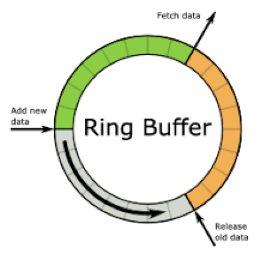

# 背景
在多线程下的`生产者-消费者`模型中，需求满足如下情况：

对生产者生产投递数据的性能要求非常高
多个生产者，单个（多个也可以，本文只介绍单个的情况）消费者
当消费者跟不上生产者速度时，可容忍少部分数据丢失
生产者是单条单条地生产数据
举个`日志采集`的例子，日志在不同的线程上生产，在日志生产速度远超消费者速度时，可以丢弃部分数据，要求打日志的性能损耗最小，这种情况下可采用本文提供的极致性能的缓冲队列。

# 实现细节
多个生产者向一个缓冲队列提交消息，说到底是线程安全问题，如果不考虑线程安全，性能必然是最高的，但出现的问题是，数据经常被覆盖。虽然可以容忍少部分数据丢失，但也是在消费者跟不上生产者速度时。缓冲区必然有界，无界可能导致内存泄露，如果缓冲区满，再生产新数据，可选的策略一般有如下几种：

- 阻塞直到被消费
- 覆盖旧数据
- 丢弃新数据
在要求对生产者性能损耗最小的情况下一般不选1，通常采取覆盖策略。

## 环形队列
有一种环形队列的数据结构（`ring buffer`）可以很好的解决解决上面提到的生产者-消费者模型、缓冲区有界、覆盖策略。通常用数组来实现ring buffer，只要保证生产者获取下标是线程安全的即可解决线程安全问题。而且数组内存预先分配加上连续内存索引更加快速的特点也保证了强悍的性能。



## AtomicInteger
在环形队列上如何保证线程安全地获取数组下标？线程安全地自增我们想到了`AtomicInteger`，很容易写出如下代码

```java
public class AtomicRangeInteger extends Number {

    private final AtomicInteger value;

    private final int startValue;
    private final int endValue;

    public AtomicRangeInteger(int startValue, int endValue) {
        this.startValue = startValue;
        this.endValue = endValue;
        this.value = new AtomicInteger(startValue);
    }

    public final int incrementAndGet() {
        int next;
        do {
            next = value.incrementAndGet();
            if (next > endValue && value.compareAndSet(next, startValue)) {
                return startValue;
            }
        } while (next > endValue);

        return next;
    }

    public final int get() {
        return value.intValue();
    }

    @Override
    public int intValue() {
        return value.intValue();
    }

    @Override
    public long longValue() {
        return value.intValue();
    }

    @Override
    public float floatValue() {
        return value.intValue();
    }

    @Override
    public double doubleValue() {
        return value.intValue();
    }
}
```
```java
public final class RingBuffer<T> {

    private int bufferSize;
    private AtomicRangeInteger index;
    private final T[] buffer;

    @SuppressWarnings("unchecked")
    public RingBuffer(int bufferSize) {
        this.bufferSize = bufferSize;
        this.index = new AtomicRangeInteger(0, bufferSize);
        this.buffer = (T[]) new Object[bufferSize];
    }

    public final void offer(final T data) {
        buffer[index.incrementAndGet()] = data;
    }

    public final T poll(int index) {
        T tmp = buffer[index];
        buffer[index] = null;
        return tmp;
    }

    public int getBufferSize() {
        return bufferSize;
    }
}
```
核心代码其实就是这一段
```java
public final int incrementAndGet() {
    int next;
    do {
        next = value.incrementAndGet();
        if (next > endValue && value.compareAndSet(next, startValue)) {
            return startValue;
        }
    } while (next > endValue);

    return next;
}
```
- 首选生产者获取下一个可用的index，直接在当前基础上调用incrementAndGet进行加1操作，该操作是原子的，故拿到的一定是没有被其他线程占用的index
- 获取上一步的返回值，该返回值有可能超过ring buffer的最大下标值，如果超过则将其置为startValue，这一步使用compareAndSet，可能会失败，如果失败说明有其他线程做了该操作，故可以再调用一次incrementAndGet获取下一个下标

# 为何是极致的性能
目前有一款开源ring buffer的实现——`disruptor`，关于它的介绍网上可以找到很多，这里简单介绍一下。它也是使用的数组来充当环形队列，但与上面的实现有一点差别，它可以批量插入，所以它使用的是compareAndSet，它在缓冲区填满以后的策略是阻塞，它的下标是不回溯，永远往后加，采用取模来映射到对应的index，为了性能使用位运算（&），所以它的容量只能是2的N次方。

主要的不同就在compareAndSet(v1)与incrementAndGet（v0），我们可以将原先的incrementAndGet实现改为compareAndSet测试一下性能差异（缓冲区大小为1000）：
```
Benchmark                    Mode  Cnt         Score   Error  Units
RingBufferBenchmark.testV0  thrpt    2  39969002.156          ops/s
RingBufferBenchmark.testV1  thrpt    2  15533576.961          ops/s
```
为什么会有三倍性能的差距？看一下incrementAndGet的实现：
```java
/**
 * Atomically increments by one the current value.
 *
 * @return the updated value
 */
public final int incrementAndGet() {
    return unsafe.getAndAddInt(this, valueOffset, 1) + 1;
}
```
```java
public final int getAndAddInt(Object var1, long var2, int var4) {
    int var5;
    do {
        var5 = this.getIntVolatile(var1, var2);
    } while(!this.compareAndSwapInt(var1, var2, var5, var5 + var4));

    return var5;
}
```
发现incrementAndGet底层也是CAS的实现。其实在JDK8之后对incrementAndGet做了优化：

> Unsafe是经过特殊处理的，不能理解成常规的java代码，在调用getAndAddInt的时候，如果系统底层支持fetch-and-add，那么它执行的就是native方法，使用的是fetch-and-add；如果不支持，就按照上面的所看到的getAndAddInt方法体那样，以java代码的方式去执行，使用的是compare-and-swap

CAS使用的是jdk层面的自旋锁，fetch-and-add是cpu指令，性能上fetch-and-add要强很多。所以如果拿上面的代码用jdk1.7来测试，会发现性能没有差别。

## 再优化空间
- 缓存行填充
AtomicRangeInteger对象中存在三个属性，value，startValue，endValue，value是经常变化的，startValue，endValue是不会变化，所以当value经常变化会导致读取startValue，endValue时不会命中cpu缓存，性能有所下降，我们使用jdk8的注解`@Contended`来填充value所在行的缓存。

```java
public class AtomicRangeIntegerV2 extends Number {

    @Contended
    protected final AtomicInteger value;

    protected final int startValue;
    protected final int endValue;
    ...
}
```
做一下benchmark(v2为加@Contended注解)：
```
Benchmark                    Mode  Cnt         Score   Error  Units
RingBufferBenchmark.testV2  thrpt    2  72095754.040          ops/s
RingBufferBenchmark.testV0  thrpt    2  44360926.943          ops/s
```
- 多个ring buffer分担冲突

这个优化就不做过多说明了，多线程中一般都采取分段的思想来降低冲突，ring buffer也可以，当一个ring buffer存在性能瓶颈时，可以利用多个ring buffer来分担，最佳状态是每个线程分配一个ring buffer，具体怎么分配，在之前的文章《实现一个比LongAdder更高性能的计数器有多难？》中有一个比较巧妙的办法，可以参考下。

# 彩蛋
这个ring buffer本来是借鉴skywalking中ring buffer的实现，但当时skywalking的实现也是使用CAS，性能不是很满意，于是我就做了这些优化，具体github的issue可以参考如下链接：

> https://github.com/apache/skywalking/pull/2874 
> https://github.com/apache/skywalking/pull/2930

现在skywalking中已经是我写的这个版本了，算得上是一个极致性能的缓冲队列了。

---

> 关于作者：专注后端的中间件开发，公众号"捉虫大师"作者，关注我，给你朴实无华的技术干货


- 原文链接: https://mp.weixin.qq.com/s/hmtx8BnUDp1onCJ99rdQ9g
- 发布时间: 2020.06.18


