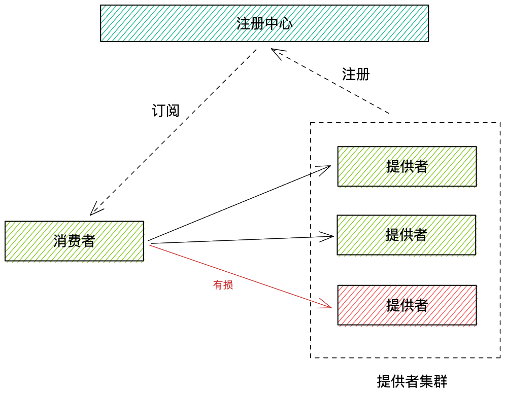
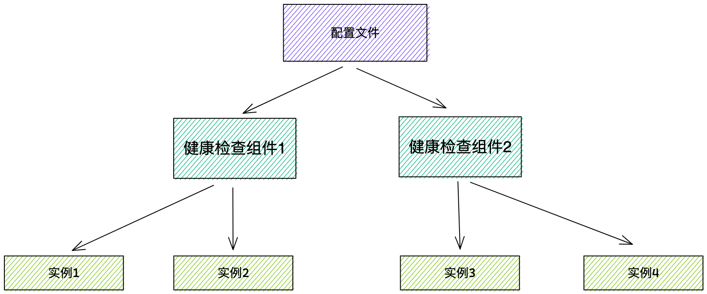
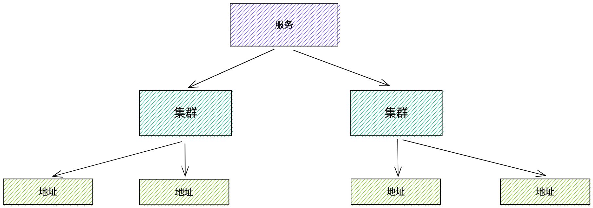
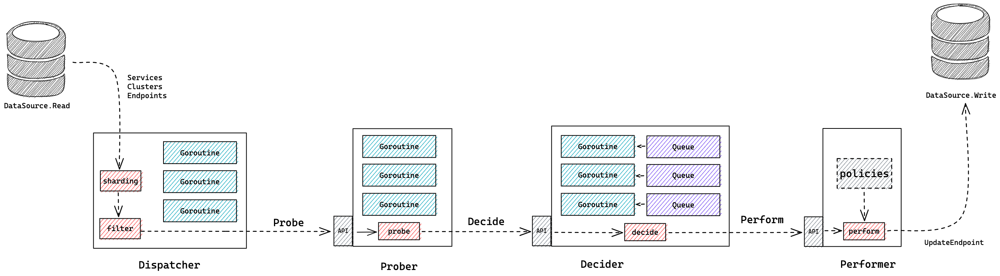
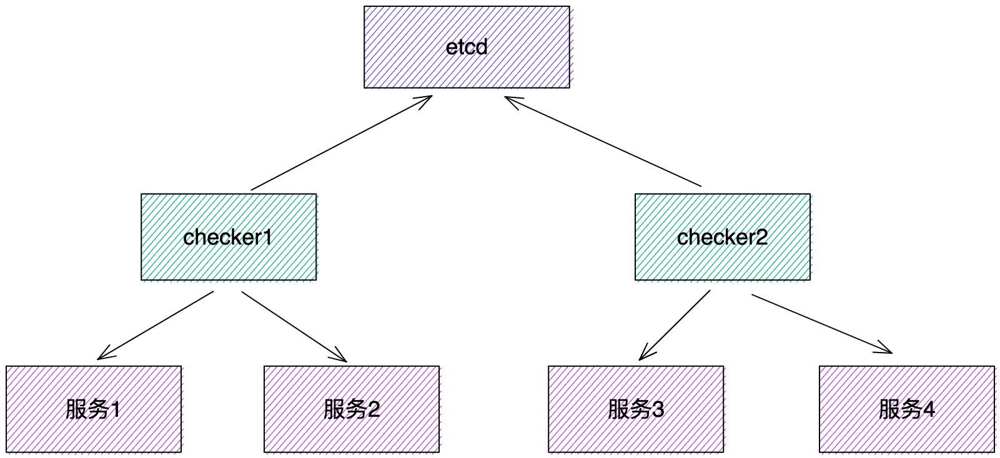
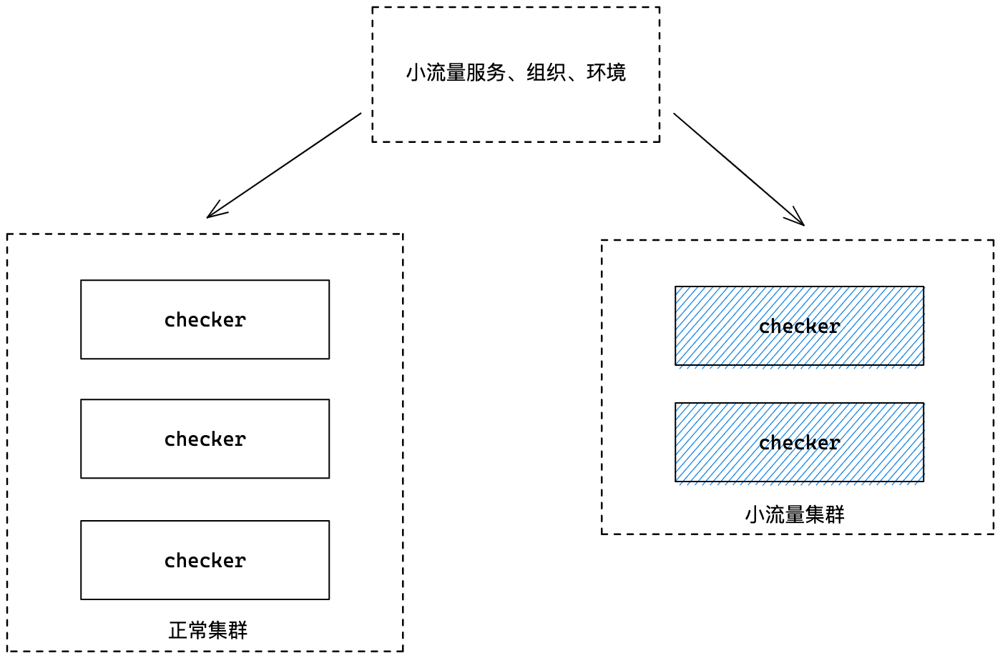

hello，大家好呀，我是小楼。

前段时间不是在忙么，忙的内容之一就是花了点时间重构了一个**服务的健康检查**组件，目前已经慢慢在灰度线上，本文就来分享下这次重构之旅，也算作个总结吧。

# 背景

## 服务健康检查简介

服务健康检查是应对分布式应用下某些服务节点不健康问题的一种解法。如下图，消费者调用提供方集群，通常通过注册中心获取提供方的地址，根据负载均衡算法选取某台具体机器发起调用。

假设某台机器意外宕机，服务消费方不能感知，就会导致流量有损，如果此时有一种检测服务节点健康状态并及时剔除的机制，就能大大增加线上服务的稳定性。

## 原服务健康检查实现原理

我们是自研的注册中心，健康检查也算注册中心的一部分，其原理很简单，可分为三个阶段：

- 从注册中心获取需要检查的实例（即地址，由ip、port组成）
- 对每个地址发起 TCP 建链请求，建链成功视为健康
- 对判定为不健康的实例进行摘除，对原不健康现在健康的实例进行恢复，摘除恢复通过调用注册中心提供的接口实现

当然这是大致流程，还有不少细节，例如获取探活实例时一些不需要探活的服务会被排除（如一些基础服务如MySQL、Redis）；为了防止网络抖动导致健康状态判定有误，会增加一些判定策略，如连续 N 次建连失败视为不健康；对不健康实例摘除时也计算了摘除阈值，如一个集群的机器都被判定为不健康，那也不能把它们全摘了，因为此时全摘和不摘差别不大（请求都会报错），甚至全摘还要承担风险，考虑集群容量问题，可以设个阈值，如最多只能摘三分之一的机器。

## 原服务健康检查存在的问题

### 1. 容量问题

原组件是物理机时代的产物，当时实例数量并不多，所以最初是单机设计，只部署在一台物理机上，随着公司业务发展，实例数量增多，单机达到瓶颈，于是做了一次升级，通过配置文件来指定每个节点的健康检查任务分片。

### 2. 容灾问题

单机就必然存在宕机风险，即使检查任务已经做了分片，但是写在配置中，无法动态调配，当某个节点宕机，则它负责的实例健康检查就会失效。

### 3.部署效率问题

部署在物理机且分片是写在配置中，无论是扩容还是机器过保置换，都要修改配置，人为操作效率太低，而且容易出错。

### 4. 新需求支持效率问题

随着云原生时代的迈进，对健康检查提出了一些新的需求，例如只探端口的联通性可能不能代表服务的健康程度，甚至公司内还有一些其他不在注册中心上的服务也想复用这个健康检查组件的能力，日益增长的需求同原组件沉重的历史包袱之间存在着不可调和的矛盾。

### 5. 迭代过程中的稳定性问题

原组件没有灰度机制，开发了新功能上线是一把梭，如果出问题，就是个大故障，影响面非常广。

需要解决这么多问题，如果在原基础上改，稳定性和效率都非常令人头疼，于是一个念头油然而生：重构！

# 技术方案调研

## 业界常见服务健康检查方案

在设计新方案前，我们看看业界对于健康检查都是怎么做的，从两个角度展开调研，注册中心的健康检查和非注册中心的健康检查

### 注册中心健康检查

| 方案             | 代表产品                                  | 优点               | 缺点           |
|----------------|---------------------------------------|------------------|--------------|
| SDK 心跳上报       | Nacos 1.x 临时实例                        |                  | 处理心跳消耗资源过多   |
| SDK 长连接 + 心跳保持 | Nacox 2.x 临时实例、SofaRegistry、Zookeeper | 感知快              | SDK 实现复杂     |
| 集中式主动健康检查      | Nacos 永久实例                            | 无需SDK参与，可实现语义级探活 | 集中式压力大时，时延增大 |

### 非注册中心健康检查

#### K8S 健康检查 — LivenessProbe

与集中式健康检查做对比

|          | LivenessProbe                            | 原健康检查组件              |
|----------|------------------------------------------|----------------------|
| 实现方式     | k8s原生，分布式（sidecar模式）                     | 自研，集中式               |
| 检查发起者    | kubelet，与业务容器在同一物理机                      | 集中部署的服务              |
| 适用范围     | k8s容器（弹性云）                               | 容器、物理机、虚拟机等          |
| 支持的检查方式  | tcp、http、exec、grpc                       | tcp、http             |
| 健康检查基本配置 | 容器启动延时探活时间、检查间隔时间、检查超时时间、最小连续成功数、最小连续失败数 | 探活超时时间、连续失败次数、最大摘除比例 |
| 检测不健康时动作 | 杀死容器，容器再根据重启策略决定是否重启                     | 从注册中心上摘除             |
| 兜底       | 无                                        | 有，可配摘除比例             |

## 结合公司背景进行选型

我们的大背景是技术栈不统一，编程语言有 Java、Go、PHP、C++等，基于成本考虑，我们更倾向`瘦SDK`的方案。

于是注册中心常见的 `SDK 长连接+心跳保持`方案被排除，SDK主动上报心跳也不考虑。

而 K8S 的健康检查方案仅仅使用于 K8S 体系，我们还有物理机，而且 K8S 的 LivenessProbe 并不能做到开箱即用，至少我们不想让节点不健康时被杀死，兜底策略也需要重新开发。

所以最终我们还是选择了与原健康检查组件相同的方案 — 集中式主动健康检查。

## 理想态

基于原健康检查组件在使用中的种种问题，我们总结出一个好的健康检查组件该有的样子：

- 故障自动转移
- 可水平扩容
- 快速支持丰富灵活的需求
- 新需求迭代，本身的稳定性需要有保障

# 设计开发

## 总体设计

组件由四大模块组成：

- Dispatcher：负责从数据源获取数据，生成并派发任务
- Prober：负责健康检查任务的执行
- Decider：根据健康检查结果决策是否需要变更健康状态
- Performer：根据决策结果执行相应动作

各模块对外暴露接口，隐藏内部实现。数据源面向接口编程，可替换。

## 服务发现模型

在详细介绍各个模块的设计之前，先简单介绍一下我们的服务发现模型，有助于后续的表述和理解。

一个服务名在公司内是唯一的，调用时需指定服务名，获取对应的地址。

一个服务又可以包含多个集群，集群可以是物理上的隔离集群，也可以是逻辑上的隔离集群，集群下再包含地址。

## 协程模型设计

编程语言我们选择的是 Go，原因有二：第一是健康检查这种 IO 密集型任务与 Go 的协程调度比较契合，开发速度，资源占用都还可以；第二是我们组一直用 Go，经验丰富，所以语言选择我们没有太多的考虑。

但在协程模型的设计上，我们做了一些思考。

数据源的获取，由于服务、集群信息不经常变化，所以缓存在内存中，每分钟进行一次同步，地址数据需要实时拉取。

Dispatcher 先获取所有的服务，然后根据服务获取集群，到这里都是在一个协程内完成，接下来获取地址有网络开销，所以开 N 个协程，每个协程负责一部分集群地址，每个地址都生成一个单独的任务，派发给 Prober。

Prober 负责健康检查，完全是 IO 操作，内部用一个队列存放派发来的任务，然后开很多协程从队列中取任务去做健康检查，检查完成后将结果交给 Decider 做决策。

Decider 决策时比较重要的是需要算出是否会被兜底，这里有两点需要考虑：

一是最初获取的实例状态可能不是最新了，需要重新获取一次；

二是对于同一个集群不能并发地去决策，决策应该串行才不会导致决策混乱，举个反例，如果一个集群3台机器，最多摘除1台，如果2台同时挂掉，并发决策时，2个协程各自以为能摘，最后结果是摘除了2台，和预期只摘1台不符。这个如何解决？我们最后搞了 N 个队列存放健康检查结果，按服务+集群的哈希值路由到队列，保证每个集群的检测结果都路由到同一个队列，再开 N 个协程，每个协程消费一个队列，这样就做到了顺序执行。

决策之后的动作执行就是调用更新接口，所以直接共用决策的协程。用一张大图来总结：

## 水平扩容 & 故障自动转移

水平扩容与故障自动转移只要能做到动态地数据分片即可，每个健康检查组件在启动时将自己注册到一个中心的协调器（可以是 etcd），并且监听其他节点的在线状态，派发任务时，按服务名哈希，判断该任务是否应该由自己调度，是则执行，否则丢弃。

当某个节点挂掉或者扩容时，每个节点都能感知到当前集群的变化，自动进行数据分片的重新划分。

## 小流量机制

小流量的实现采取部署两个集群的方式，一个正常集群，一个小流量集群，小流量集群负责部分不重要的服务，作为灰度，正常集群负责其他服务的健康检查任务。

只需要共享一个小流量的配置即可，我们按组织、服务、集群、环境等维度去设计这个配置，基本可以任意粒度配置。

## 可扩展性

可扩展性也是设计里非常重要的一环，可从数据源、检查方式扩展、过滤器等方面稍微一些。

### 数据源可插拔

面向接口编程，我们将数据源抽象为读数据源与写数据源，只要符合这两个接口的数据源，就能无缝对接。

### 检查方式易扩展

健康检查其实就是给定一个地址，再加一堆配置去进行检查，至于怎么检查可以自己实现，目前已实现的有TCP、HTTP方式，未来还可能会实现诸如Dubbo、gRPC、thrift等的语义级别的检查方式。

### 过滤器

在派发任务时，有一个可能会随时修改的逻辑是过滤掉一些不需要探活的服务、集群、实例，这块用责任链的模式就能很好地实现，后期想增删就只需要插拔链中的一环即可。

可扩展性是代码层面的内容，所以这里只列举了部分比较典型的例子。

# 灰度上线

由于我们是重写了一个组件来代替原组件，所以上线还挺麻烦，为此我们做了2方面的工作：

- 设计了一个可按组织、服务、集群、环境等维度的降级开关，降级分为3档，不降级、半降级、全降级。不降级很好理解，就是啥也不做，全降级就是不工作，相当于一键关停健康检查组件，半降级是只恢复健康但不摘除的一个工作模式。试想如果健康检查在上线过程中，误摘除，此时降级，岂不是无法恢复健康？所以我们让它保留恢复能力。
- 我们利用上述的小流量设计来逐步将服务迁移到新组件上来，灰度的服务新组件负责，非灰度的服务老组件负责，等全部灰度完成，停掉老组件，新组件的灰度集群再切换为正常集群。

## 踩坑调优

在灰度过程中，我们发现了一个问题，有的一个集群机器非常多，超过了1000台，而我们的决策是顺序执行，而且决策时还会去实时查询实例状态，假设每次查询10ms（已经很快了），1000台顺序决策完也得10s，我们期望每轮的检测要在3秒左右完成，光这一个集群就得10秒，显然不能接受。

为了我们做了第一次的优化：

我们当时在线上环境测试，一个集群有2000多台机器，但大部分机器是禁用的状态，也就是这部分机器其实做健康检查是个无用功，禁用的机器，无论是否健康都不会被消费，所以我们的第一个优化便是在派发任务时过滤掉禁用的机器，这样就解决了线下环境的问题。

但我们上到生产环境时仍然发现决策很慢，线上一个集群只有少量的机器被禁用，第一次的优化基本就没什么效果了，而且线上机器数量可能更多，任务堆积会很严重，我们发现其他的队列可能比较空闲，只有大集群所在的队列很忙。

所以我们进行了第二次优化：

从业务视角出发，其实需要顺序决策的只有不健康的实例，对于健康的实例决策时不需要考虑兜底，所以我们将按检查结果进行分类，健康的检查结果随机派发到任意队列处理，不健康的检查结果严格按服务+集群路由到特定队列处理，这样既保证了兜底决策时的顺序，也解决了队列负载不均衡的状况。

# 总结

本文从健康检查的背景，原组件存在的问题，以及我们的理想态出发，调研了业界的方案，结合实际情况，选择了适合的方案，并总结之前系统的问题，设计一个更加合理的新系统，从开发闭环到上线。

我觉得系统设计是一个取舍的过程，别人的方案不见得是最优的，适合的才是最好的，而且有时并不是纯技术解决问题，可能从业务角度去思考，可能更加豁然开朗。

# 推荐阅读
与本文相关的文章也顺便推荐给你，如果觉得还不错，记得`关注`、`点赞`、`在看`
- [《如何给注册中心锦上添花？》](https://mp.weixin.qq.com/s/aWiYswgsaoNvGmFvyrUg6w)
- [《如何组装一个注册中心？》](https://mp.weixin.qq.com/s/qGZona_9HTi8yZzCCvd3RQ)
- [《服务探活的五种方式》](https://mp.weixin.qq.com/s/tw4-BIUZqpJLLEd0n09GNg)
- [《4个实验，彻底搞懂TCP连接的断开》](https://mp.weixin.qq.com/s/7SvkHe3FiljxBWFkm8oAeA)