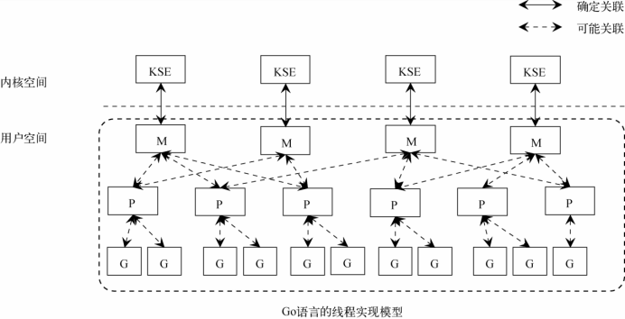
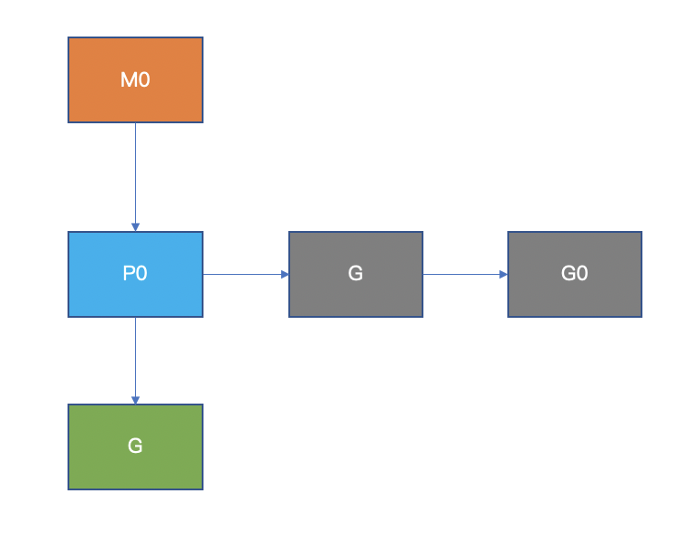
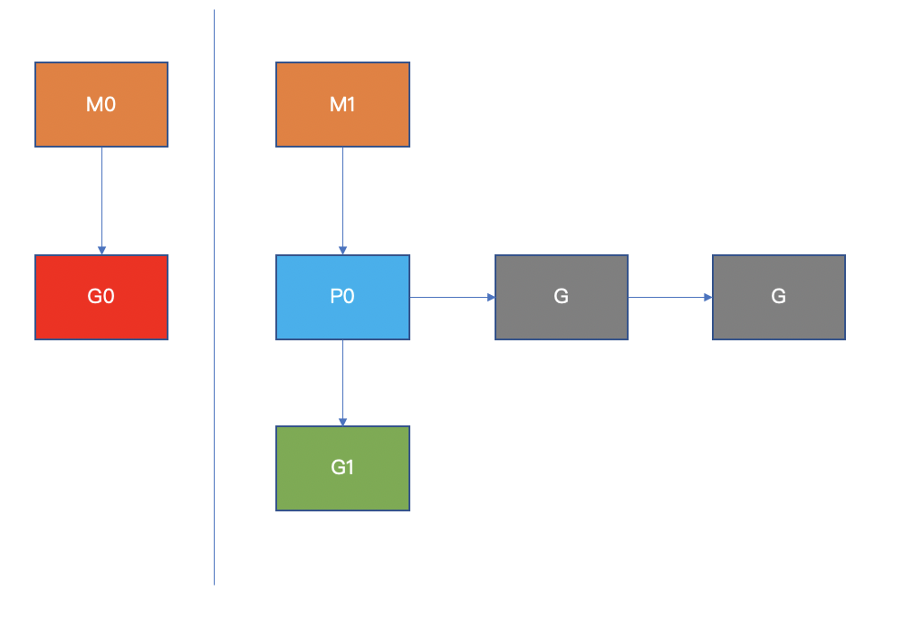

### 进程

在早期的单任务计算机中，用户一次只能提交一个作业，独享系统的全部资源，同时也只能干一件事情。进行计算时不能进行 IO 读写，但 CPU 与 IO 的速度存在巨大差异，一个作业在 CPU 上所花费的时间非常少，大部分时间在等待 IO。

为了更合理的利用 CPU 资源，把内存划分为多块，不同程序使用各自的内存空间互不干扰，这里单独的程序就是一个进程，CPU 可以在多个进程之间切换执行，让 CPU 的利用率变高。

为了实现 CPU 在多个进程之间切换，需要保存进程的上下文（如程序计数器、栈、内核数据结构等等），以便下次切换回来可以恢复执行。还需要一种调度算法，Linux 中采用了基于时间片和优先级的完全公平调度算法。

### 线程

多进程的出现是为了解决 CPU 利用率的问题，那为什么还需要线程？答案是为了`减少上下文切换时的开销`。

进程在如下两个时间点可能会让出 CPU，进行 CPU 切换：

- 进程阻塞，如网络阻塞、代码层面的阻塞（锁、sleep等）、系统调用等
- 进程时间片用完，让出 CPU

而进程切换 CPU 时需要进行这两步：

- 切换页目录以使用新的地址空间
- 切换内核栈和硬件上下文

进程和线程在 Linux 中没有本质区别，他们最大的不同就是进程有自己独立的内存空间，而线程（同进程中）是共享内存空间。

在进程切换时需要转换内存地址空间，而线程切换没有这个动作，所以线程切换比进程切换代价更小。

> 为什么内存地址空间转换这么慢？Linux 实现中，每个进程的地址空间都是虚拟的，虚拟地址空间转换到物理地址空间需要查页表，这个查询是很慢的过程，因此会用一种叫做 TLB 的 cache 来加速，当进程切换后，TLB 也随之失效了，所以会变慢。

综上，线程是为了降低进程切换过程中的开销。

### 协程

当我们的程序是 IO 密集型时（如 web 服务器、网关等），为了追求高吞吐，有两种思路：

1. 为每个请求开一个线程处理，为了降低线程的创建开销，可以使用线程池技术，理论上线程池越大，则吞吐越高，但线程池越大，CPU 花在切换上的开销也越大

> 线程的创建、销毁都需要调用系统调用，每次请求都创建，高并发下开销就显得很大，而且线程占用内存是 MB 级别，数量不能太多

> 为什么线程越多 cpu 切换越多？准确来说是可执行的线程越多，cpu 切换越多，因为操作系统的调度要保证绝对公平，有可执行线程时，一定是要雨露均沾，所以切换次数变多

2. 使用异步非阻塞的开发模型，用一个进程或线程接收请求，然后通过 IO 多路复用让进程或线程不阻塞，省去上下文切换的开销

这两个方案，优缺点都很明显，方案1实现简单，但性能不高；方案2性能非常好，但实现起来复杂。有没有介于这两者之间的方案？既要简单，又要性能高，协程就解决了这个问题。

协程是用户视角的一种抽象，操作系统并没有这个概念，其主要思想是在用户态实现调度算法，用少量线程完成大量任务的调度。

协程需要解决线程遇到的几个问题：
- 内存占用要小，且创建开销要小
- 减少上下文切换的开销

第一点好实现，用户态的协程，只是一个数据结构，无需系统调用，而且可以设计的很小，达到 KB 级别。

第二点只能减少上下文切换次数来解决，因为协程的本质还是线程，其切换开销在用户态是无法降低的，只能通过降低切换次数来达到总体上开销的减少，可以有如下手段：

1. 让可执行的线程尽量少，这样切换次数必然会少
2. 让线程尽可能的处于运行状态，而不是阻塞让出时间片

### Goroutine

goroutine 是 golang 实现的协程，其特点是在语言层面就支持，使用起来非常方便，它的核心是MPG调度模型：

- M：内核线程
- P：处理器，用来执行 goroutine，它维护了本地可运行队列 
- G：goroutine，代码和数据结构
- S：调度器，维护M和P的信息

除此之外还有一个全局可运行队列。

1. 在 golang 中使用 **go** 关键字启动一个 goroutine，它将会被挂到 P 的 runqueue 中，等待被调度

2. 当 M0 中正在运行的 G0 阻塞时（如执行了一个系统调用），此时 M0 会休眠，它将放弃挂载的 P0，以便被其他 M 调度到

3. 当 M0 系统调用结束后，会尝试“偷”一个 P，如果不成功，M0 将 G0 放到全局的 runqueue 中

4. P 会定期检查全局 runqueue，保证自己消化完 G 后有事可做，同时也会从其他 P 里“偷” G

从上述看来，MPG 模型似乎只限制了同时运行的线程数，但上下文切换只发生在可运行的线程上，应该是有一定的作用，当然这只是一部分。

golang 在 runtime 层面拦截了可能导致线程阻塞的情况，并针对性优化，他们可分为两类：

- 网络 IO、channel 操作、锁：只阻塞 G，M、P 可用，即线程不会让出时间片
- 系统调用：阻塞 M，P 需要切换，线程会让出时间片

所以综合来看，goroutine 会比线程切换开销少。

### 总结

从单进程到多进程提高了 CPU 利用率；从进程到线程，降低了上下文切换的开销；从线程到协程，进一步降低了上下文切换的开销，使得高并发的服务可以使用简单的代码写出来，技术的每一步发展都是为了解决实际问题。

---
> 搜索关注微信公众号"捉虫大师"，后端技术分享，架构设计、性能优化、源码阅读、问题排查、踩坑实践。

