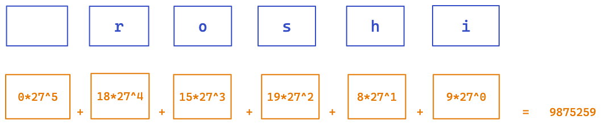

hello大家好呀，我是小楼。

上周参加了一个区的程序员技能比赛的初赛，其实就是算法比赛，虽然最后结果是过了初赛，但过程真是一言难尽啊。

这次的算法比赛和ACM非常类似，虽然我大学是数学专业，虽然大学也修过ACM这门课，但是我的算法是真的不行，很菜很菜的那种。


好在这次比赛是组（抱大腿）队模式，3人一组，3个小时时间，一共7道算法题，1入门，2简单，2中等，2困难。

# 10分钟写出入门题，但...

由于我知道我比较菜，所以比赛一开始，我就挑了一个看起来最简单的题目做，难题交给队友。

结果是3个小时过去，这个看起来最简单的题目，愣是没有做出来，下面就结合这道题讲讲我的心路历程。

这道题的描述是这样的：


看起来文字很多，其实要表达的很简单，就是输入一些成绩，每个成绩输进去时，如果超过全班最好成绩则输出prefect，如果超过自己的最好成绩则输出great，如果没超过自己最好成绩则输出bad。

是不是很简单？用一个max变量保存全班最好成绩，用一个map保存每个人的最好成绩，不就解决了吗？

不过这是我第一次用这个oj系统，连用户都是刚注册的，所以我还特地看了一会输入输出的demo，这次比赛只能使用ACM的输入输出模式，例如如果用的是Go语言，输入输出应该是这样：


学会了输入输出之后，一口气写入如下的解法：

```go
package main

import (
	"fmt"
)

func main() {
	var n int
	var name string
	var x float32
	var max float32
	scores := make(map[string]float32, n)

	fmt.Scan(&n)
	for i := 0; i < n; i++ {
		fmt.Scan(&name, &x)

		if x > max || i == 0 {
			fmt.Println("perfect")
			max = x
			scores[name] = x
		} else {
			if s, ok := scores[name]; ok {
				if x > s {
					fmt.Println("great")
					scores[name] = x
				} else {
					fmt.Println("bad")
				}
			} else {
				fmt.Println("great")
				scores[name] = x
			}
		}
	}
}
```

在我正得意，觉得这题10分钟就能解决的时候，提交上去的代码竟然超时了，在比赛时没有截图，提交后显示有少数用例超过了2秒，oj的判定原理是准备一堆测试用例，如果全部通过则判定为通过，当然这批测试用例肯定不是那么好通过的，设计者会出各种极端的case。

# 优化map性能

调转头去仔细审题，果然时间和空间都有限制：

> - 时间限制：C/C++ 1秒，其他语言2秒
> - 空间限制：C/C++ 262144K，其他语言524288K
> - 64bit IO Format: %lld

这题除了有map的读写，其他都是O(1)复杂度，性能不够难道是map性能不够？

如果是map的性能不够，不够在哪里呢？众所周知，map的原理一般是这样：


当一些key存入map时，会先对key计算hash值，在map中找到对应的hash槽，这个槽之后一般是个链表（有的语言也会做一些优化成树状，这里我们简化为链表），因为不同的key的hash值可能会重复（冲突），冲突了只能把key排成一个链表，每次查找时都要遍历链表。

所以有没有可能，设计者给出了一堆hash值重复的name，数量又多，导致每次插入、查找时都要遍历链表，性能下降，导致超时？

于是再仔细审题，我发现输入的姓名和成绩是有限制的：

> - name保证长度不超过6，仅由小写英文字母组成，每个名字代表唯一一个同学
> - x为1位小数，0≤x≤300

**name最长为6，且为小写字母**，这点给了我一点启发，能不能让查询map变成O(1)复杂度？

显然可以的，小写字母范围为**a~z**，如果看成数字就是1-26，也就是27进制，所以每个name可以表示为一个27进制的数，这样就可以把所有人的成绩放到一个大数组里去，按name的27进制进行O(1)的查找。

为什么是27进制而不是26，因为name没说是多少位，比如只有5位，那空出的一位怎么表示？只能用0表示了，a-z就是1-26，合起来是27进制。

参考10进制计算法则，27进制应该这样计算（以roshi为例）：



计算出的值即为数组的下标，那么这个数组的最大值是多少呢？

**26 * 27^5 + 26 * 27^4 + 26 * 27^3 + 26 * 27^2 + 26 * 27^1 + 26 * 27^0**

很容易算出来是：

**387420488**

需要这么大个数组，大概3亿多，输入成绩是个1位小数，可以转换为int，大概4个字节，掐指一算得 **1513361KB**，好像比要求的**524288K**多，先不管空间，写一版跑跑看，万一能过呢？

很简单写出代码：

```go
package main

import (
	"fmt"
)

func main() {
	var n int
	var name string
	var x int32

	fmt.Scan(&n)

	var scores [387420488]int32
	var exist [387420488]int32

	var max int32
	for i := 0; i < n; i++ {
		fmt.Scan(&name, &x)

		idx := mapIndex(name)

		if x > max || i == 0 {
			fmt.Printf("perfect\n")
			max = x
			scores[idx] = x
			exist[idx] = 1
		} else {
			if exist[idx] == 0 || x > scores[idx] {
				fmt.Printf("great\n")
				scores[idx] = x
				exist[idx] = 1
			} else {
				fmt.Printf("bad\n")
			}
		}
	}
}

var index27 = [6]int32{1, 27, 27 * 27, 27 * 27 * 27, 27 * 27 * 27 * 27}

func mapIndex(x string) int32 {
	var index int32
	for i := len(x) - 1; i >= 0; i-- {
		index = index + int32(x[i]-96)*index27[len(x)-1-i]
	}
	return index
}
```


结果竟然报错了，我当时不理解，事后理解了，我们暂且不说，后面会说到原因。

就是因为这个报错不明不白，明明能测试通过，到底哪里理解有偏差？亦或是内存超了？

# 优化内存占用

上面的代码用到了2个数组，一个存最大值，一个存值是否存在，一个数组是1513361KB，2个就是3026722KB，是最大内存限制的5.7倍

```go
var scores [387420488]int32
var exist [387420488]int32
```

exist数组可以用boolean类型，分数最大值0<=0<=300，int16足矣

|       | 大小  | 范围                     |
| ----- | :---- | ------------------------ |
| int8  | 1字节 | -128 ~ 127               |
| int16 | 2字节 | -32768 ~ 32767           |
| int32 | 4字节 | -2147483648 ~ 2147483647 |

如果是这个组合，将占用 **1135020KB**，是上限的2倍多，还是有点超，先试试：


还是一样，难道是我算法有问题？没道理啊。到这里我实在是没招了，3小时也耗尽了，比赛结束。

# 赛后思考

赛后，我拿着这道题去找了一位刚入职字节的朋友，想着刚去字节应该刷过不少题吧，果然大佬就是大佬，给出了一个有新意的思路，用前缀树做：


每一个name都构造出一个前缀树，查找时最多只需要查找6次，内存使用应该也不会太多，算是时间与空间的一个平衡。

大佬还补充了一句：比赛还是比较特殊的，可能就是某一个case卡主了，而你要做的就是如何能把这个特殊的case也ac掉。

大佬的话似乎很有道理，于是我写了一个前缀树的版本：

```go
package main

import (
	"fmt"
)

type treeNode struct {
	max  float32
	next [26]*treeNode
}

func main() {
	var n int
	var name string
	var x float32
	fmt.Scan(&n)

	var max float32
	tree := new(treeNode)
	for i := 0; i < n; i++ {
		fmt.Scan(&name, &x)

		if x > max || i == 0 {
			fmt.Println("perfect")
			max = x
			insert(tree, name, x)
		} else {
			if tmp := searchAndStoreMax(tree, name, x); tmp != -1 {
				if x > tmp {
					fmt.Println("great")
					insert(tree, name, x)
				} else {
					fmt.Println("bad")
				}
			} else {
				fmt.Println("great")
				insert(tree, name, x)
			}
		}
	}
}

func insert(node *treeNode, name string, x float32) {
	for i := 0; i < len(name); i++ {
		idx := int32(name[i] - 'a')
		if node.next[idx] == nil {
			node.next[idx] = new(treeNode)
		}
		node = node.next[idx]
	}
	node.max = x
}

func searchAndStoreMax(node *treeNode, name string, x float32) float32 {
	for i := 0; i < len(name); i++ {
		idx := int32(name[i] - 'a')
		if node.next[idx] == nil {
			return -1
		}
		node = node.next[idx]
	}
	if x > node.max {
		tmp := node.max
		node.max = x
		return tmp
	}
	return node.max
}
```

结果又又又是超时，我服了。

# 终于发现问题

后来我又尝试了很多方法都不行，比如怀疑是不是Go的map性能不行，换成Java试试，结果还是不行。

最后我在网上搜索牛客网时发现了一个突破口（对，没错，这次比赛是在牛客网上举办的）。


简单说，牛客网的ACM模式输入可能需要读入一行然后再自己处理成想要的数据。

抱着怀疑的态度我试了下，果然，淦！用最开始的map就能ac掉！虽然我也不知道这两种输入有什么区别。关键我还是用的网站上提示的输入方式，确实太坑了。

正确的输入方式如下：

```
package main

import (
	"bufio"
	"fmt"
	"os"
	"strconv"
	"strings"
)

func main() {
	var n int
	var name string
	var x float64
	input := bufio.NewScanner(os.Stdin)
	if input.Scan() {
		n, _ = strconv.Atoi(input.Text())
	}

	scores := make(map[string]float64, n)
	var max float64
	for i := 0; i < n; i++ {
		if input.Scan() {
			arr := strings.Split(input.Text(), " ")
			name = arr[0]
			x, _ = strconv.ParseFloat(arr[1], 32)
		}

		...
	}
}
```


之前的想法属于强行增加难度了~害！想了好几天的题竟然败在了输入上，真是一言难尽！

# 之前的方法能行吗

我把几个版本的输入改了之后，看看通过后的耗时和内存

| 版本     | 是否通过 | 耗时  | 内存    |
| -------- | -------- | ----- | ------- |
| map版    | 是       | 315ms | 10096KB |
| 27进制版 | 否       | -     | -       |
| 前缀树版 | 是       | 433ms | 43720KB |

其中27进制版本在改成正确的输入后，露出了庐山真面目：内存超了！


# 最后

过程虽然曲折，但最终还是解决了这个入门题，而且还尝试着用几种方法来解，虽然不尽如人意，但终究还是有点收获。

当然我们组的小伙伴也很给力，做出来3道题，我们最终的成绩是排名进了前10%，虽然我只贡献了一点点（没完全做出来也有得分，按通过的用例算，我这题大概拿到了90%的分），也算是可以了，而且还有一道题也可能是因为这个输入被卡了，所以如果这两道卡的题都做出来，估计排名能进前三。

初赛算是过了，接下来准备复赛，如果复赛还有好玩的事情，我再来写一篇文章，哈哈。

这一言难尽的比赛，大家给个赞鼓励下吧。