hello，大家好呀，我是小楼。

最近无聊（摸）闲逛（鱼）github时，发现了一个阿里开源项目可以贡献代码的地方。

不是写单测、改代码格式那种，而是比较有挑战的`性能优化`，最关键的是还不难，仔细看完本文后，有点基础就能写出来的那种，话不多说，发车！


相信大家在日常写代码获取时间戳时，会写出如下代码:

```java
long ts = System.currentTimeMillis();
```

读者中还有一些Gopher，我们用Go也写一遍：

```go
UnixTimeUnitOffset = uint64(time.Millisecond / time.Nanosecond)
ts := uint64(time.Now().UnixNano()) / UnixTimeUnitOffset
```

在一般情况下这么写，或者说在99%的情况下这么写一点问题都没有，但有位大佬研究了Java下时间戳的获取：

> http://pzemtsov.github.io/2017/07/23/the-slow-currenttimemillis.html

他得出了一个结论：并发越高，获取时间戳越慢！

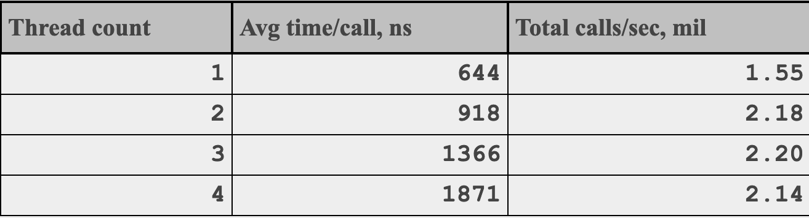


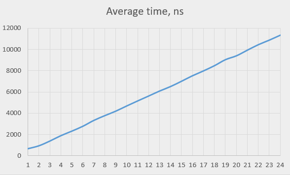


具体到细节咱也不是很懂，大概原因是由于只有一个全局时钟源，高并发或频繁访问会造成严重的争用。

### 缓存时间戳

我最早接触到用缓存时间戳的方式来优化是在Cobar这个项目中：

> https://github.com/alibaba/cobar

由于Cobar是一款数据库中间件，它的QPS可能会非常高，所以才有了这个优化，我们瞅一眼他的实现：

- 起一个单独的线程每隔20ms获取一次时间戳并缓存起来
- 使用时间戳时直接取缓存

> https://github.com/alibaba/cobar/blob/master/server/src/main/server/com/alibaba/cobar/util/TimeUtil.java

```java
/**
 * 弱精度的计时器，考虑性能不使用同步策略。
 * 
 * @author xianmao.hexm 2011-1-18 下午06:10:55
 */
public class TimeUtil {
    private static long CURRENT_TIME = System.currentTimeMillis();

    public static final long currentTimeMillis() {
        return CURRENT_TIME;
    }

    public static final void update() {
        CURRENT_TIME = System.currentTimeMillis();
    }
}
```

> https://github.com/alibaba/cobar/blob/master/server/src/main/server/com/alibaba/cobar/CobarServer.java

```java
timer.schedule(updateTime(), 0L, TIME_UPDATE_PERIOD); // TIME_UPDATE_PERIOD 是 20ms
...
// 系统时间定时更新任务
private TimerTask updateTime() {
    return new TimerTask() {
        @Override
        public void run() {
            TimeUtil.update();
        }
    };
}
```

Cobar之所以这么干，一是因为往往他的QPS非常高，这样可以减少获取时间戳的CPU消耗或者耗时；其次是这个时间戳在Cobar内部只做统计使用，就算不准确也并无大碍，从实现上看也确实是`弱精度`。

后来我也在其他的代码中看到了类似的实现，比如Sentinel（不是Redis的Sentinel，而是阿里开源的限流熔断利器Sentinel）。

Sentinel作为一款限流熔断的工具，自然是自身的开销越小越好，于是同样都是出自阿里的Sentinel也用了和Cobar类似的实现：`缓存时间戳`。

原因也很简单，尽可能减少对系统资源的消耗，获取时间戳的性能要更优秀，但又不能和Cobar那样搞个弱精度的时间戳，因为Sentinel获取到的时间戳很可能就决定了一次请求是否被限流、熔断。

所以解决办法也很简单，直接将缓存时间戳的间隔改成`1毫秒`

去年我还写过一篇文章[《低开销获取时间戳》](https://mp.weixin.qq.com/s/hs11xUNF7Vh-zO6zeaXXmw)，里面有Sentinel这段代码：

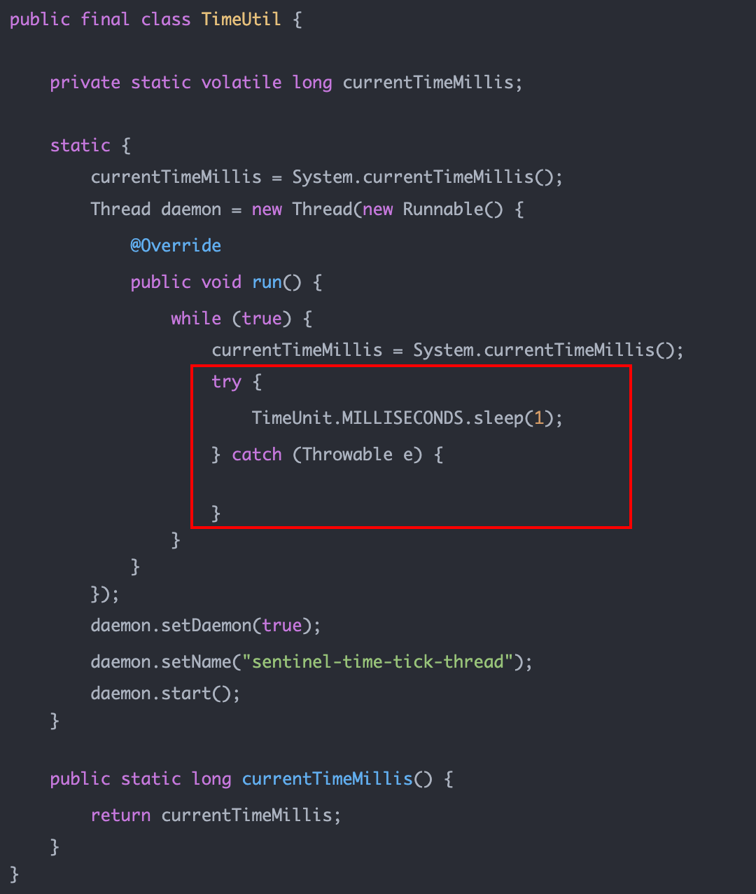

甚至后来的Sentinel-Go也采取了一模一样的逻辑：

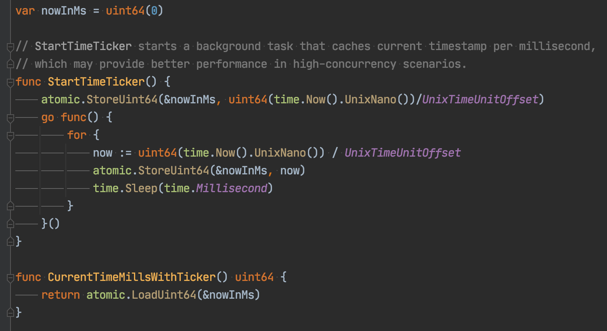

以前没有多想，认为这样并没有什么不妥。

直到前两天晚上，没事在Sentinel-Go社区中瞎逛，看到了一个issue，大受震撼：

> https://github.com/alibaba/sentinel-golang/issues/441

提出这位issue的大佬在第一段就给出了非常有见解的观点：

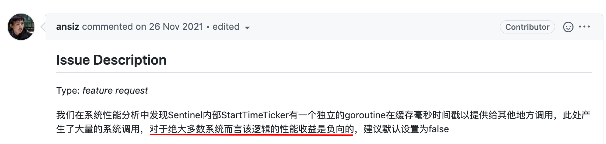

说的比较委婉，什么叫「负向收益」？

我又搜索了一下，找到了这个issue：

> https://github.com/alibaba/Sentinel/issues/1702

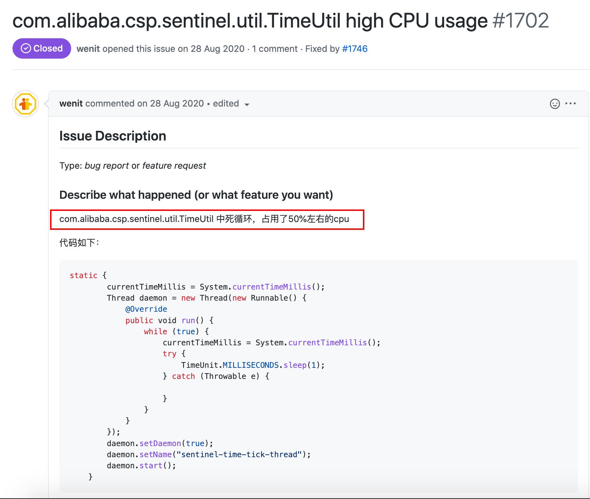

TimeUtil吃掉了50%的CPU，这就是「负向收益」，还是比较震惊的！


看到这个issue，我简单地想了下：

- 耗时：获取时间戳在一般情况下耗时几乎都不会影响到系统，尤其是我们常写的业务系统
- CPU：假设每毫秒缓存一次时间戳，抛开其他开销不说，每秒就有1000次获取时间戳的调用，如果每次请求中只有1次获取时间戳的操作，那么至少得有1000QPS的请求，才能填平缓存时间戳的开销，况且还有其他开销

但这只是我们的想当然，如果有数据支撑就又说服力了。为此前面提出「负向收益」的大佬做了一系列分析和测试，我们白嫖一下他的成果：

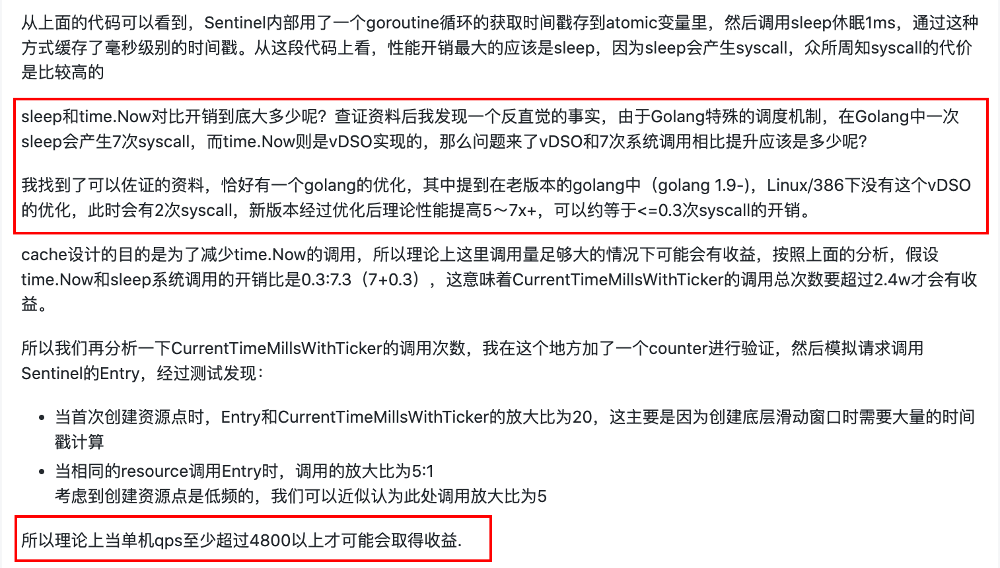

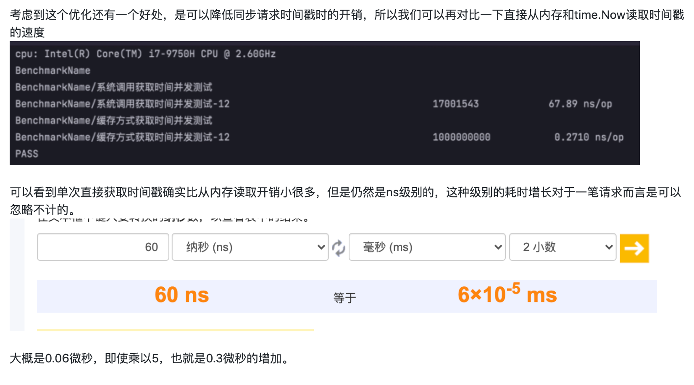

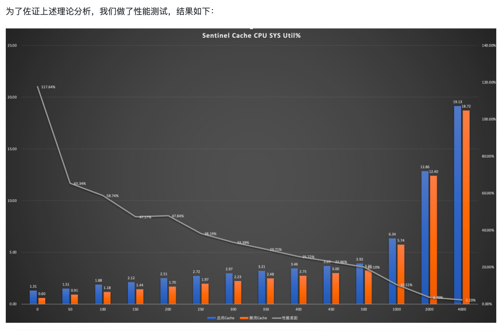


看完后我跪在原地，久久不能起身。


课代表来做个总结：

- 缓存时间戳开销最大的地方是sleep和获取时间戳
- 理论上来说单机QPS需要大于4800才会有正向收益，真实测试结果也是在4000QPS以内都没有正向收益
- 如果不要这个缓存时间戳，获取时间戳耗时会增加，但这在可接受范围内
- 鉴于常规情况下QPS很少会达到4K，所以最后结论是在Sentinel-Go中默认禁用这个特性

这一顿操作下来，连Sentinel社区的大佬也觉得很棒，竖起来大拇指：


然而做了这么多测试，最后的修改就只是把true改成false：

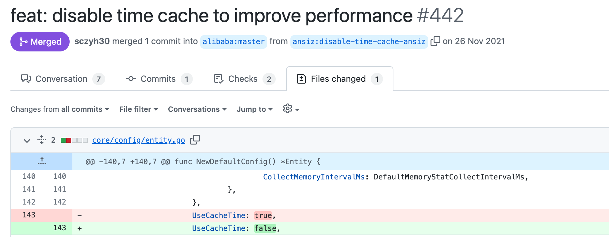

### 自适应算法

本来我以为看到这位大佬的测试已经是非常有收获了，没想到接下去的闲逛又让我发现了一个更了不得的东西。

既然上面分析出来，在QPS比较高的情况下，收益才能抵消被抵消，那么有没有可能实现一个自适应的算法，在QPS较低的时候直接从系统获取，QPS较高时，从缓存获取。

果不其然，Sentinel（Java版，版本>=1.8.2）已经实现了！

> issue参考：https://github.com/alibaba/Sentinel/pull/1746

我们捋一下它的实现：

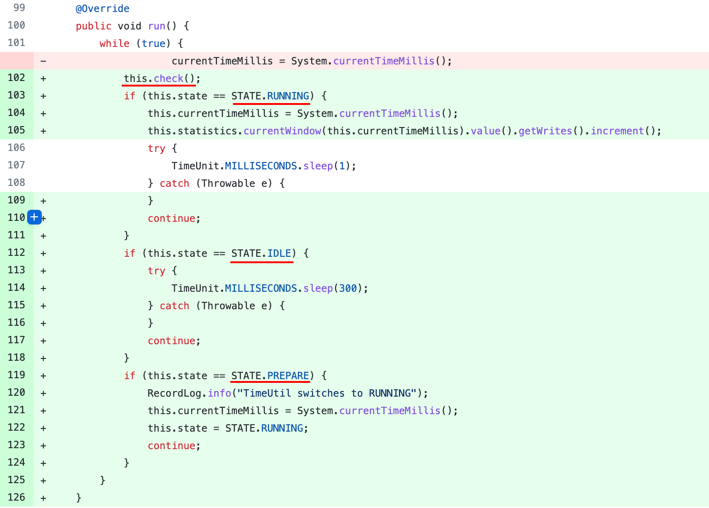

我们首先看最核心的缓存时间戳的循环（每毫秒执行1次），在这个循环中，它将缓存时间戳分成了三个状态：

- RUNNING：运行态，执行缓存时间戳策略，并统计写时间戳的QPS（把对缓存时间戳的读写QPS分开统计）
- IDLE：空闲态（初始状态），什么都不做，只休眠300毫秒
- PREPARE：准备态，缓存时间戳，但不统计QPS

这三个状态怎么流转呢？答案在开头调用的`check`方法中：

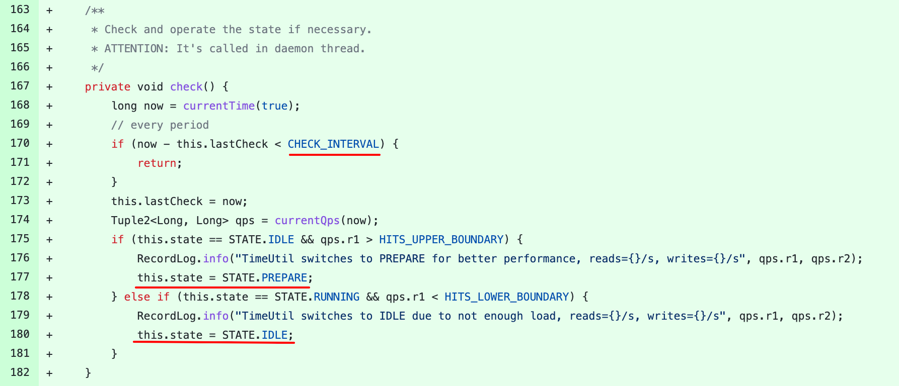

首先check逻辑有个间隔，也就是每隔一段时间（3秒）来做一次状态转换；

其次如果当前状态是`空闲态`并且读QPS大于`HITS_UPPER_BOUNDARY`（1200），则切换为`准备态`。

如果当前状态是`运行态`且读QPS小于`HITS_LOWER_BOUNDARY`（800），则切换为`空闲态`。

发现似乎少了切换到`运行态`的分支，看上面的循环中，第三个`准备态`的分支运行一次就将状态切换为`运行态`了。

这是为啥？其实`准备态`只是为了让程序从`空闲态`切换到`运行态`时过渡的更平滑，因为`空闲态`下缓存时间戳不再更新，如果没有过渡直接切换到`运行态`，那可能切换后获取的时间戳是有误差的。

文字可能不直观，我们画一个状态流转图：

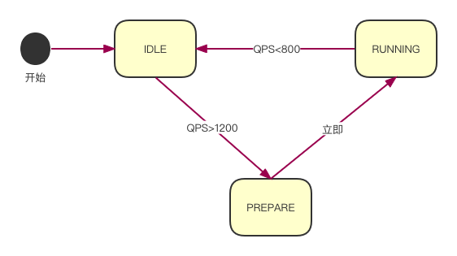

最后这些准备好了，获取时需要做两件事：一是统计读时间戳的QPS，二是获取时间戳；如果是`空闲态`或`准备态`则直接获取系统时间返回，如果是`运行态`则从缓存中拿时间戳。

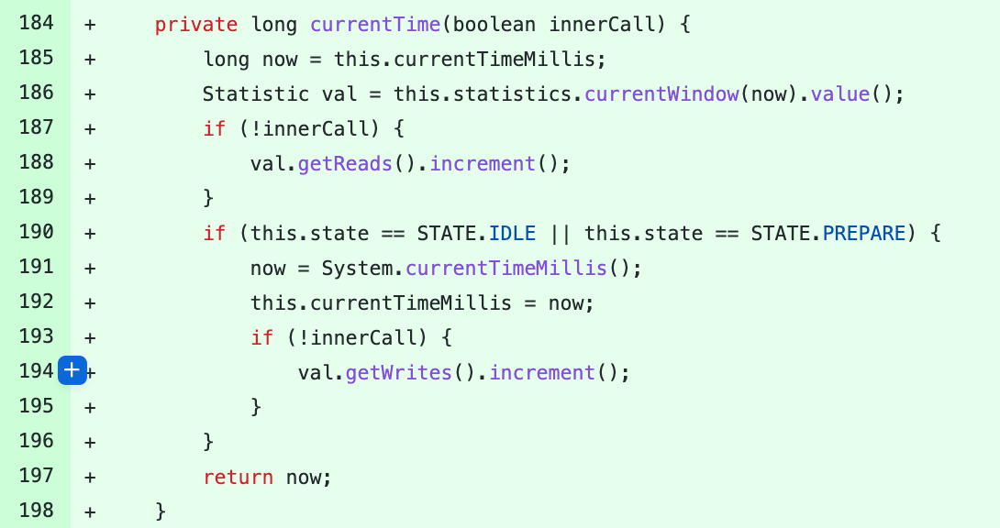

当程序比较空闲时，不会缓存时间戳，降低CPU的消耗，QPS较高时缓存时间戳，也能降低CPU的消耗，并且能降低获取时间戳的时延，可谓是一举两得。

但这中间我有个疑问，这里QPS的高低边界不知道是如何得出的，是拍脑袋还是压测出来的，不过这个数值似乎并不一定绝对准确，可能和机器的配置也有关系，所以我倾向这个值可以配置，而不是在代码中写死，关于这点，这段代码的作者也解释了原因：

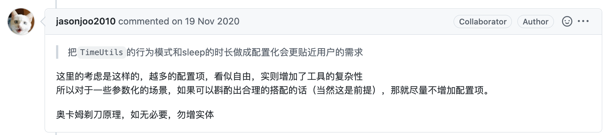

最后可能你会问，这QPS咋统计呀？

这可是Sentinel的强项，利用`LeapArray`统计，由于这不是本文重点，就不展开了，有兴趣可以参考我之前的文章[《Sentinel-Go 源码系列（三）滑动时间窗口算法的工程实现》](https://mp.weixin.qq.com/s/csBmNsAXu7GJXeFfXD8M0w)，虽然文章是Go的，但算法和Java的是一模一样，甚至实现都是照搬。

有没有测试数据支撑呢？有另一位大佬在评论区贴出了他的测试数据，我们看一下：

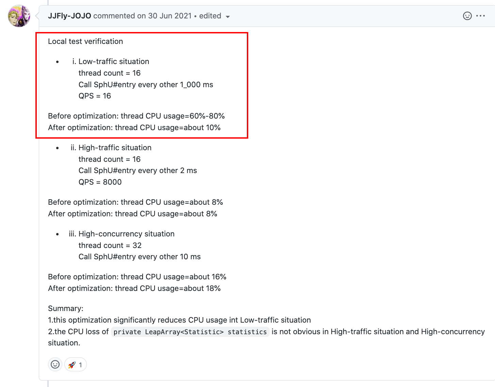

在低负载下，CPU消耗降低的特别明显，高负载则没什么变化，这也符合我们的预期。

看到这里你是不是觉得该点题了？没错，Sentinel-Go还没实现上述的自适应算法，这是个绝佳的机会，有技术含量，又有参考（Java版），是不是心动了？

社区中也有该issue：

> https://github.com/alibaba/sentinel-golang/issues/419

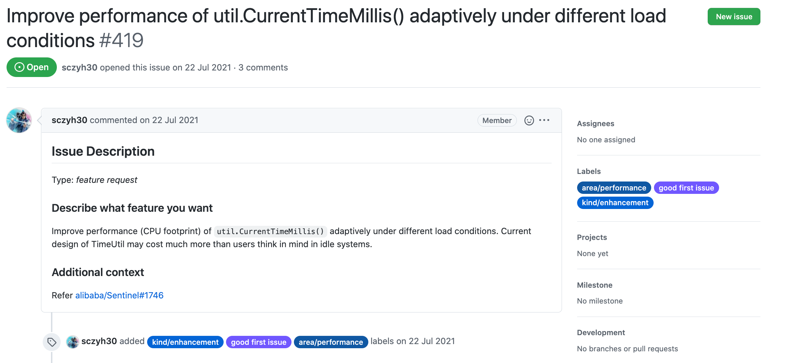

这个issue在2021年8月有个哥们认领了，但截止目前还没贡献代码，四舍五入等于他放弃了，所以你懂我意思吧？

### 最后说一句

如果你觉得文章还可以，麻烦动动小手，点个`关注`、`在看`、`赞`，你的鼓励是我持续创作的动力！

对了，如果觉得还不过瘾，可以再看看这些相关文章：

- [《参与开源项目很难吗？》](https://mp.weixin.qq.com/s/QHFHtglQ0rB-FBcjv6ML8Q)
- [《Sentinel-Go 源码系列（一）｜开篇》](https://mp.weixin.qq.com/s/JdJwlAZoVBHjh0Vwz7sxgw)
- [《Sentinel-Go 源码系列（二）｜初始化流程和责任链设计模式》](https://mp.weixin.qq.com/s/F54zAu2gnX4a0YUQXTnZdA)
- [《Sentinel-Go 源码系列（三）滑动时间窗口算法的工程实现》](https://mp.weixin.qq.com/s/csBmNsAXu7GJXeFfXD8M0w)
- [《Sentinel在docker中获取CPU利用率的一个BUG》](https://mp.weixin.qq.com/s/AHJKyIwwsRUy_SlIruZTiQ)
- [《低开销获取时间戳》](https://mp.weixin.qq.com/s/hs11xUNF7Vh-zO6zeaXXmw)

感谢阅读，我们下期再见~

---

> 搜索关注微信公众号"捉虫大师"，后端技术分享，架构设计、性能优化、源码阅读、问题排查、踩坑实践。