# 简介
基准测试是指通过设计科学的测试方法、测试工具和测试系统，实现对一类测试对象的某项性能指标进行定量的和可对比的测试。而JMH是一个用来构建，运行，分析Java或其他运行在JVM之上的语言的 纳秒/微秒/毫秒/宏观 级别基准测试的工具。

> JMH is a Java harness for building, running, and analysing nano/micro/milli/macro benchmarks written in Java and other languages targetting the JVM.

# 为什么需要

有人可能会说，我可以在代码的前后打点计算代码运行时间，为什么还需要JMH？下面着重介绍一下JMH的常用功能，都来源于官方提供的sample，相信看完这些例子，就能回答这个问题了，[官方sample地址点击查看](http://hg.openjdk.java.net/code-tools/jmh/file/tip/jmh-samples/src/main/java/org/openjdk/jmh/samples/)。

# 官方sample解读

## （1）JMHSample01HelloWorld
第一个例子教我们如何使用，在开始前，只需要引入依赖。类似单元测试，常放在test目录下运行。

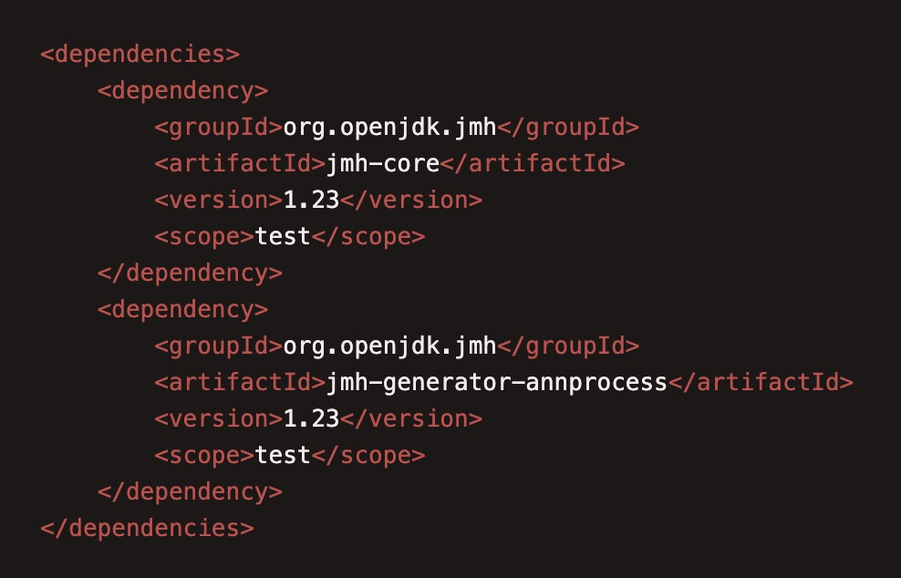

这里精简一下simple的代码，使用 @Benchmark 来标记需要基准测试的方法，然后需要写一个main方法来启动基准测试。

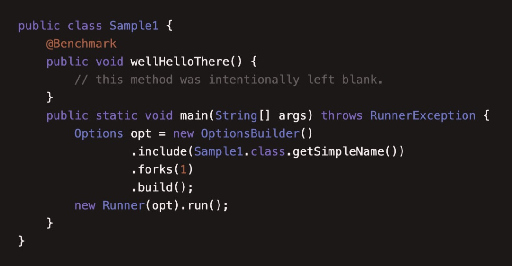

可以在IDE中直接运行main方法；如果是在服务器上可以打成jar包运行。运行后控制台输出如下格式的报告：报告的第一部分是此次运行的环境和配置，包括JDK、JMH版本，基准测试的配置（后面会详细介绍）等。第二部分则是每次运行的报告输出，第三部分是汇总的报告，包括最小值、平均值、最大值。最后一部分则是本次基准测试的最终报告。

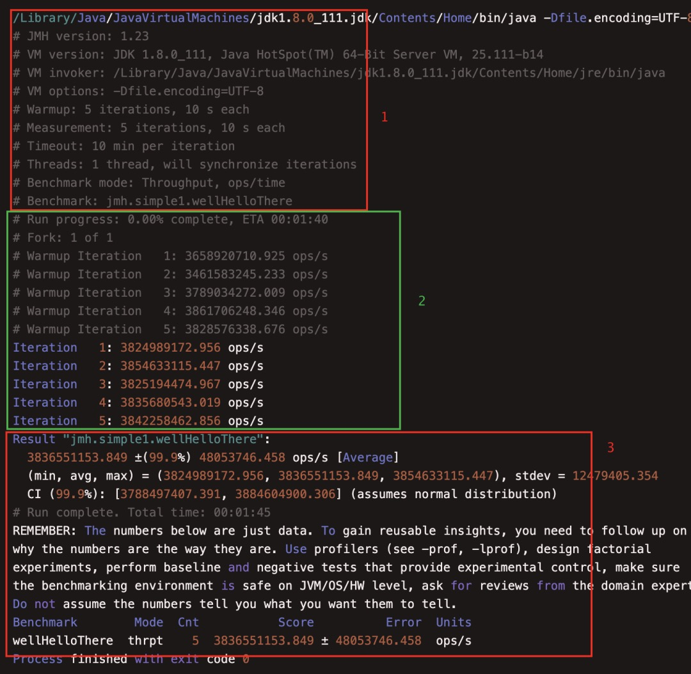

## （2）JMHSample02BenchmarkModes

本例介绍了注解 @OutputTimeUnit 和 @BenchmarkMode。

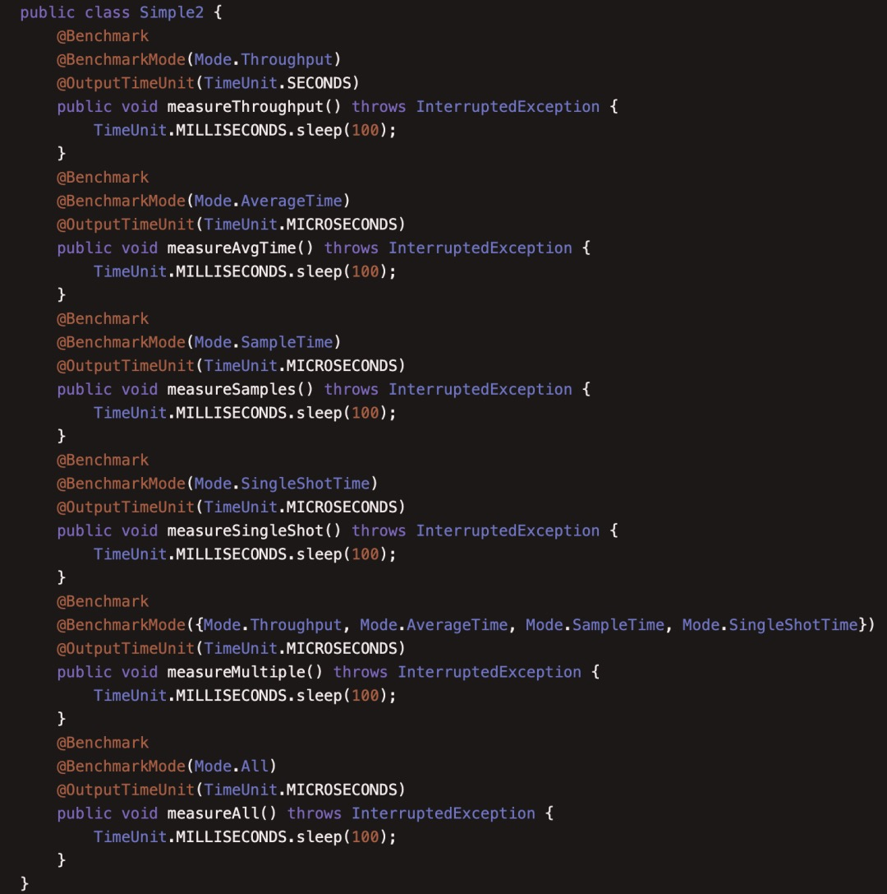

- @OutputTimeUnit 可以指定输出的时间单位，可以传入 java.util.concurrent.TimeUnit 中的时间单位，最小可以到纳秒级别；
- @BenchmarkMode 指明了基准测试的模式
- Mode.Throughput ：吞吐量，单位时间内执行的次数
- Mode.AverageTime：平均时间，一次执行需要的单位时间，其实是吞吐量的倒数
- Mode.SampleTime：是基于采样的执行时间，采样频率由JMH自动控制，同时结果中也会统计出p90、p95的时间
- Mode.SingleShotTime：单次执行时间，只执行一次，可用于冷启动的测试

这些模式可以自由组合，甚至可以使用全部。

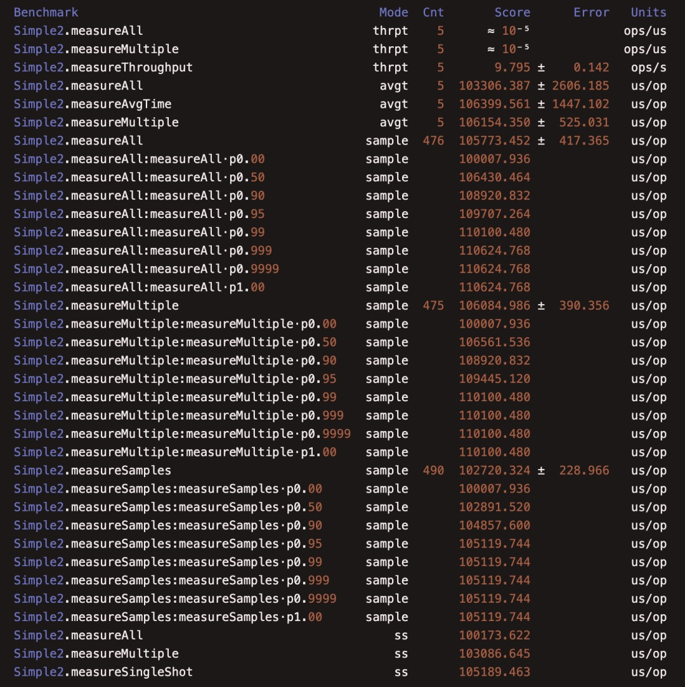

## （3）JMHSample03States

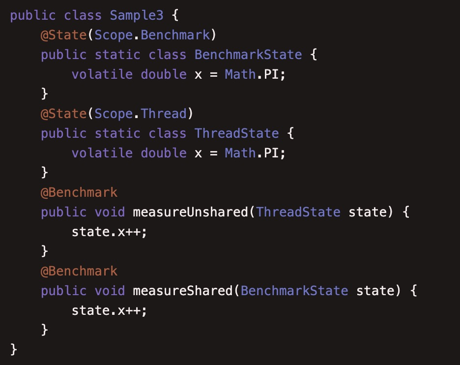
本例介绍了注解 @State 的用法，用于多线程的测试

- @State(Scope.Thread)：作用域为线程，可以理解为一个ThreadLocal变量
- @State(Scope.Benchmark)：作用域为本次JMH测试，线程共享
- @State(Scope.Group)：作用域为group，将在后文看到

而且JMH可以像spring一样自动注入这些变量。

## （4）JMHSample04DefaultState
   
本例介绍了 @State 注解可以直接写在 Benchmark 的测试类上，表明类的所有属性的作用域。 

## （5）JMHSample05StateFixtures

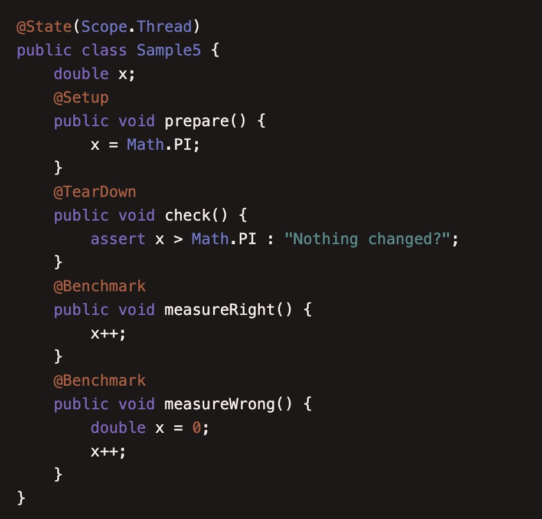

本例中介绍了两个注解 @Setup 和 @TearDown。 @Setup 用于基准测试前的初始化动作， @TearDown 用于基准测试后的动作

## （6）JMHSample06FixtureLevel

@Setup 和 @TearDown两个注解都可以传入 Level 参数，Level参数表明粒度，粒度从粗到细分别是

- Level.Trial：Benchmark级别
- Level.Iteration：执行迭代级别
- Level.Invocation：每次方法调用级别

## （7）JMHSample07FixtureLevelInvocation

本例中主要介绍了使用Level.Invocation达到每次方法执行完成后sleep一段时间，模拟在需要唤醒线程的情况下耗时更多。

## （8）JMHSample08DeadCode

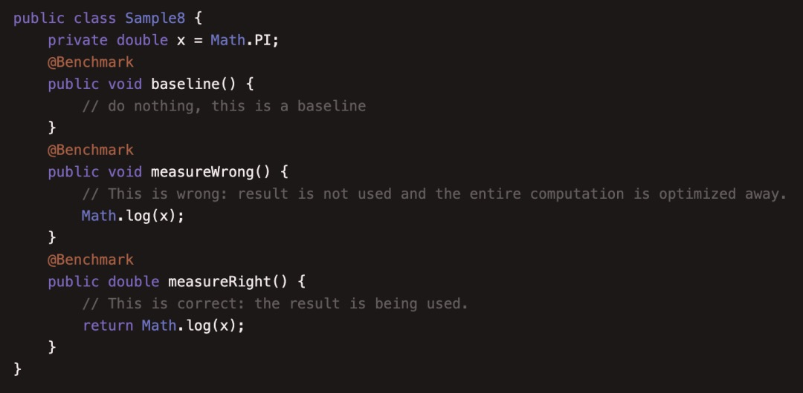

本例主要介绍了一个知识点：Dead-Code Elimination (DCE) ，即死码消除，文档上说编译器非常聪明，有的代码没啥用，就在编译器被消除了，但这给我做基准测试带了一些麻烦，比如上面的代码中，baseline 和 measureWrong 有着相同的性能，因为编译器觉得 measureWrong这段代码执行后没有任何影响，为了效率，就直接消除掉这段代码，但是如果加上return语句，就不会在编译期被去掉，这是我们在写基准测试时需要注意的点。

## （9）JMHSample09Blackholes

本例是为了解决（8）中死码消除问题，JMH提供了一个 Blackholes （黑洞），这样写就不会被编译器消除了。

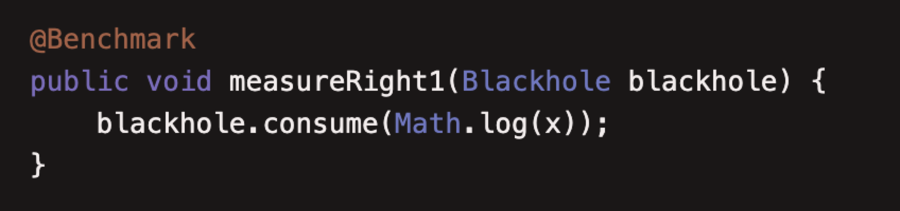

## （10）JMHSample10ConstantFold

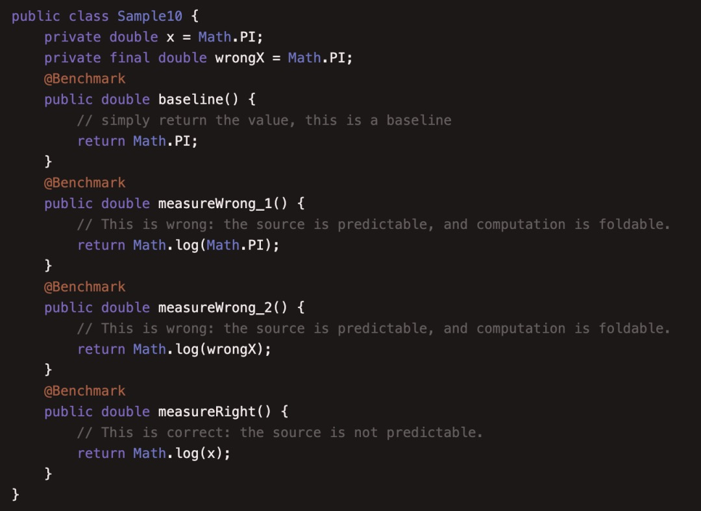

本例介绍了 constant-folding，即常量折叠，上述代码的 measureWrong1 和 measureWrong2 中的运算都是可以预测的值，所以也会在编译期直接替换为计算结果，从而导致基准测试失败，注意 final 修饰的变量也会被折叠。

## （11）JMHSample11Loops

本例直接给出一个结论，不要在基准测试的时候使用循环，使用循环就会导致测试结果不准确，原因很复杂，甚至可以单独写一篇文章来介绍。简单能理解的一点是如果使用循环，预热可能就会存在问题。

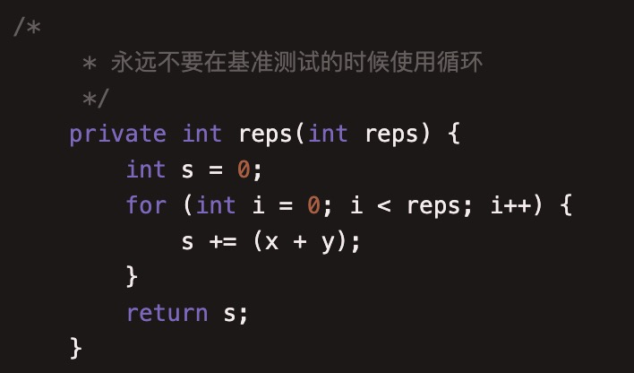

## （12）JMHSample12Forking
  
本例介绍了 @Fork 注解，@Fork 可以指定代码运行时是否需要 fork 出一个JVM进程，如果在同一个JVM中测试则会相互影响，一般fork进程设置为1。

## （13）JMHSample13RunToRun
  
由于JVM的复杂性，每次测试结果都有差异，可以使用 @Fork 注解启动多个 JVM 经过多次测试来消除这种差异。

## （15）JMHSample15Asymmetric

原来没有14，直接跳到了15

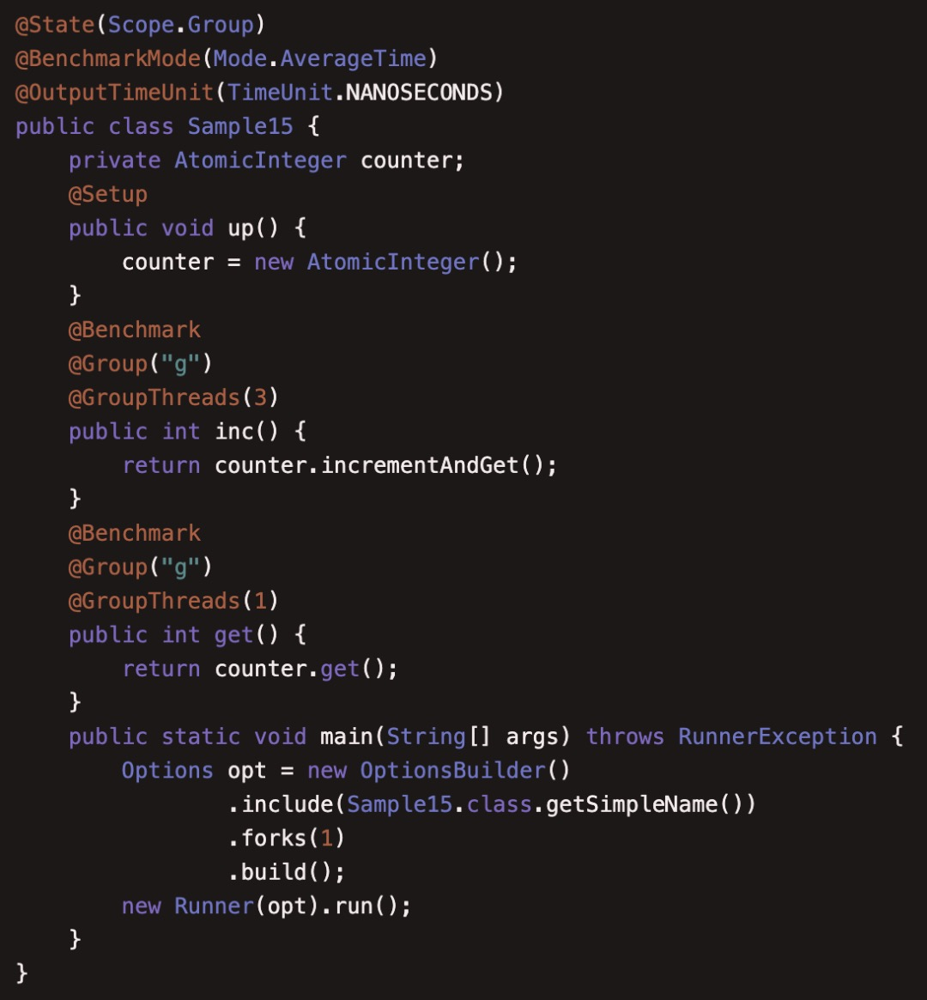

本例是对 @Group 和 @GroupThreads 使用的介绍，@Group 定义了一个线程组， @GroupThreads 可以分配线程给测试用例，可以测试线程执行不均衡的情况，比如三个线程写，一个线程读，这里用 @State(Scope.Group) 定义了counter 作用域是这个线程组。

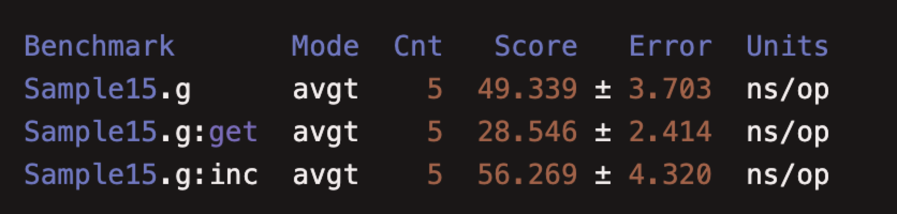

执行完的数据包含get、inc、和整个组的统计，这样数据更直观，更全面。

##  （16）JMHSample16CompilerControl
   
本例提到了JVM的方法内联，简单来说比较短但是执行频率又很高的方法，在执行多次后，JVM将该方法的调用替换为本身，以减少出栈入栈，从而减少性能的消耗。但是Java方法内联是无法人为控制的。

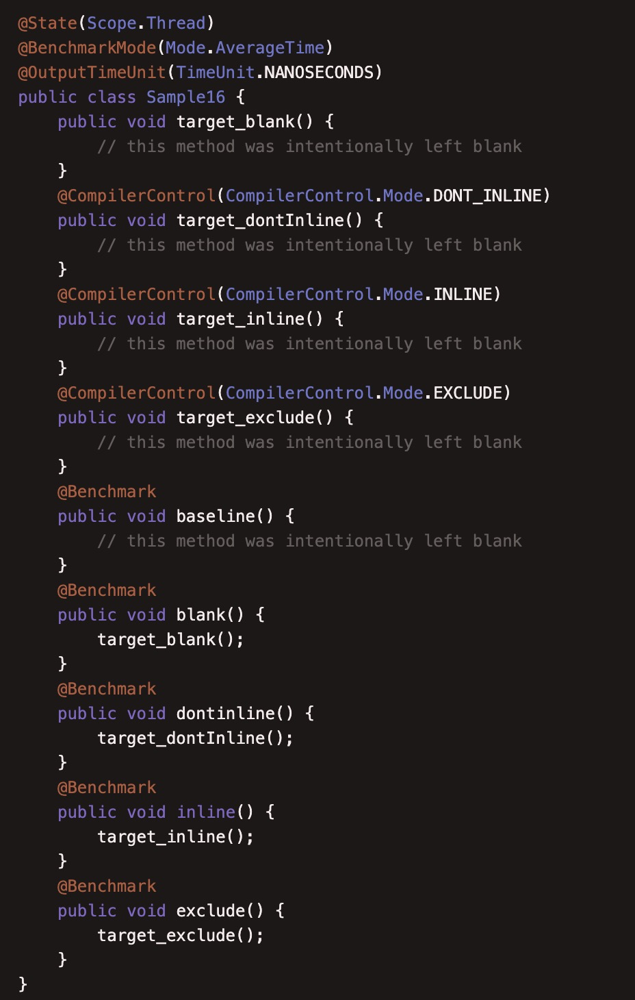

JMH提供了可以控制是否使用内联的注解 @CompilerControl ，它的参数有如下可选：

- CompilerControl.Mode.DONT_INLINE：不使用内联
- CompilerControl.Mode.INLINE：强制使用内联
- CompilerControl.Mode.EXCLUDE：不编译

从执行结果可以看到内联方法和空方法执行速度一样，不编译执行最慢。

## （17）JMHSample17SyncIterations
  
本例阐述了在多线程条件下，线程池的启动与销毁都会影响基准测试的准确性，如果自己来实现需要让线程同时开始启动工作，但这又比较难做到，如果在启动和关闭线程池时，无法做到同时，那么测量必定不准确，因为无法确定开始和结束时间；JMH提供了多线程基准测试的方法，先让线程池预热，都预热完成后让所有线程同时进行基准测试，测试完等待所有线程都结束再关闭线程池。

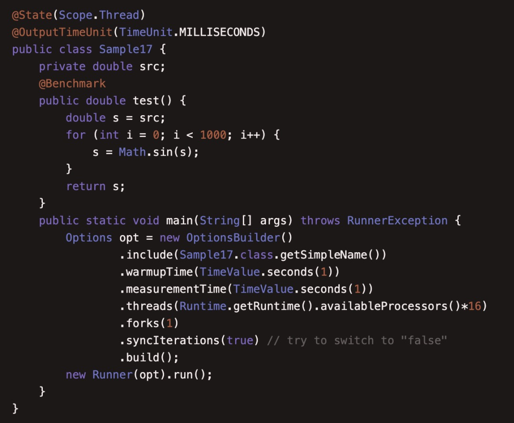

这里warmupTime是预热时间，measurementTime是测量时间，threads是线程数，forks之前说过，是fork出一个子进程进行测试，syncIterations是是否需要同步预热，前面几个参数好理解，看了下代码才知道syncIterations如果设置为true代表等所有线程预热完成，然后所有线程一起进入测量阶段，等所有线程执行完测试后，再一起进入关闭；看一下设置为false时跑出的结果：

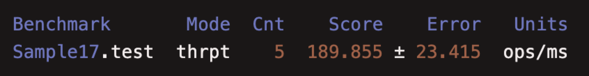

再看一下为true的结果：

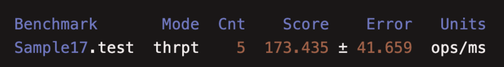

当syncIterations设置为true时更准确地反应了多线程下被测试方法的性能，这个参数默认为true，无需手动设置。

## （18）JMHSample18Control
  
本例介绍了使用 Control 的场景

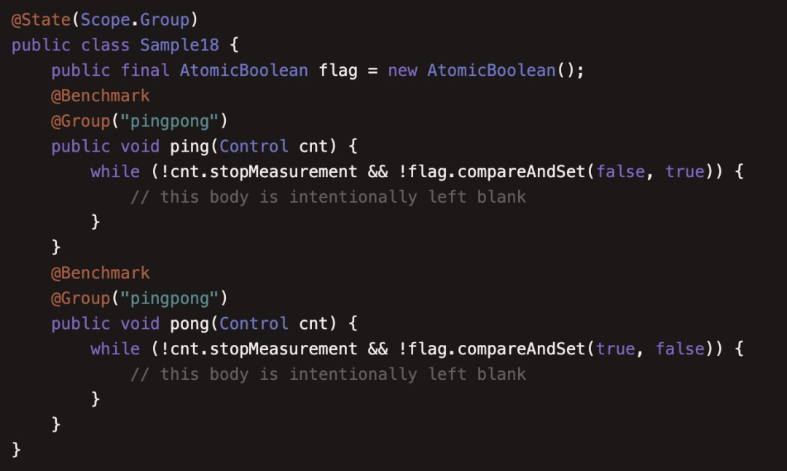

如果测试一个线程组对一个AtomicBoolean分别进行set true 和 set false操作，我们知道只有一个线程set true成功，另一个线程才能对其set false，否则另一个线程就陷入死锁，但我们的测试用例两个方法的执行不是均匀成对的，所以极大概率测试会陷入死锁，这时需要JMH提供的Control进行控制，当测量结束，双方都退出循环。

## （20）JMHSample20Annotations
  
19也不存在。本例介绍了所有在main方法中通过Options提供的参数都可以通过注解写在需要测试的方法上，这在编写大量需要不同运行环境的基准测试时显得非常方便，比如这样

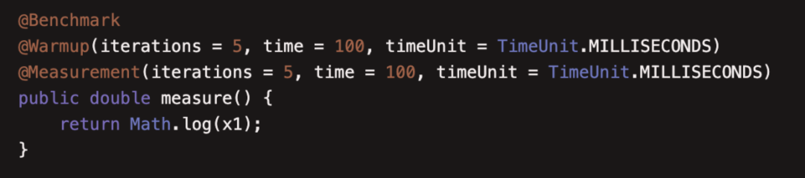

## （21）JMHSample21ConsumeCPU
  
本例介绍了Blackhole的另一种用法，前面提到的Blackhole可以用来干掉“死码消除”，同时Blackhole也可以“吞噬”cpu时间片（怪不得起这个名字）

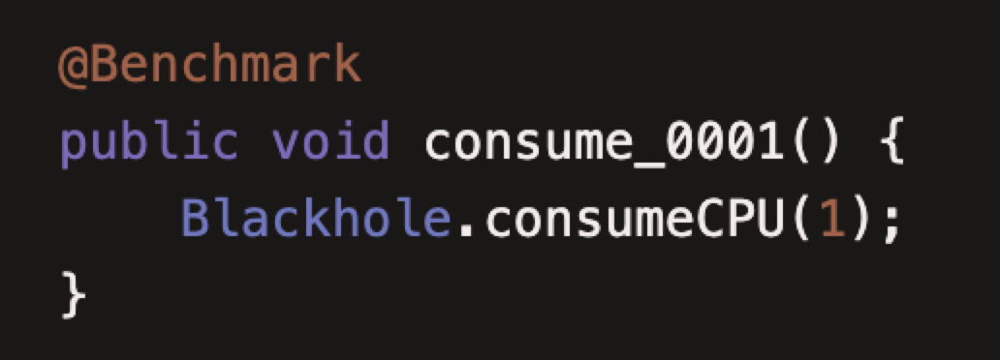

Blackhole.consumeCPU的参数是时间片的tokens，和时间片成线性关系。

## （22）JMHSample22FalseSharing
  
从名字可知本例是说false-sharing，即伪共享，关于伪共享这里就不再展开，后续会写一篇文章专门介绍伪共享。尽管JMH中提供的 @State 会自动填充缓存行，但是对于对象中特定的单个变量还是无法填充，所以本例介绍了4种方式来消除伪共享，需要我们自己注意。

## （23）JMHSample23AuxCounters
  
本例介绍了注解 @AuxCounters ，它是一个辅助计数器，可以统计 @State 修饰的对象中的 public 属性被执行的情况，它的参数有两个

- AuxCounters.Type.EVENTS： 统计发生的次数
- AuxCounters.Type.OPERATIONS：按我们指定的格式统计，如按吞吐量统计

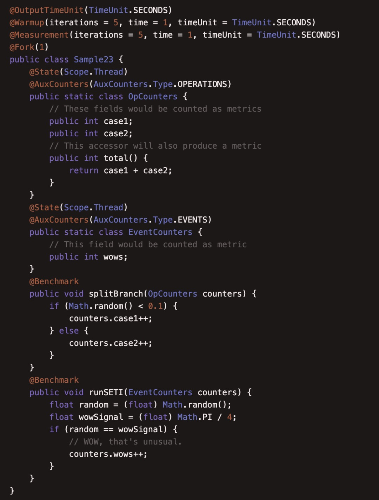

运行结果如下：

## （24）JMHSample24Inheritance
  
本例介绍了JMH在父类中定义了Benchmark，子类也会继承并合成自己的Benchmark，这是JMH在编译期完成的，如果不是由JMH来编译，就无法享受这种继承。

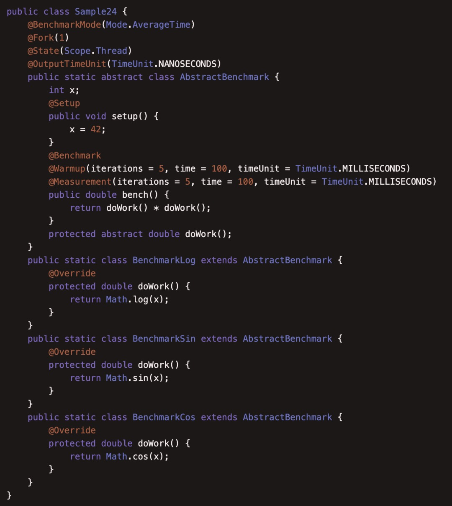

运行结果：

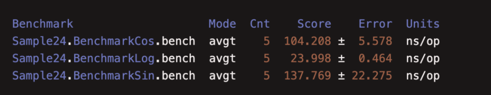

## （25）JMHSample25API_GA
  
本例介绍了如何用API的方式来写基准测试代码，比较复杂，个人觉得还是注解的方式简单。

## （26）JMHSample26BatchSize
本例介绍了 batchSize，指定一次迭代方法需要执行 batchSize 次

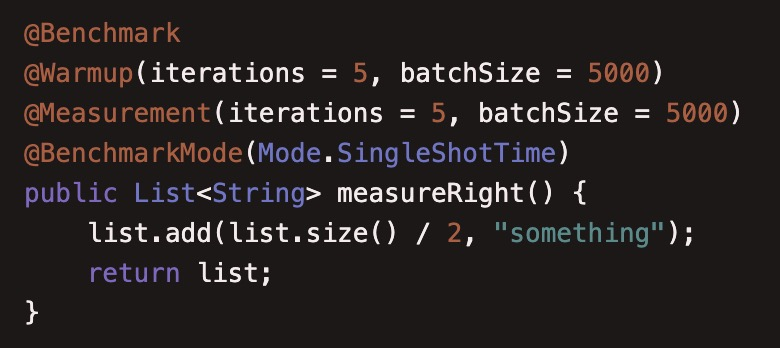

## （27）JMHSample27Params
  
本例介绍 @Param ，@Param 允许使用一份基准测试代码跑多组数据，特别适合测量方法性能和参数取值的关系

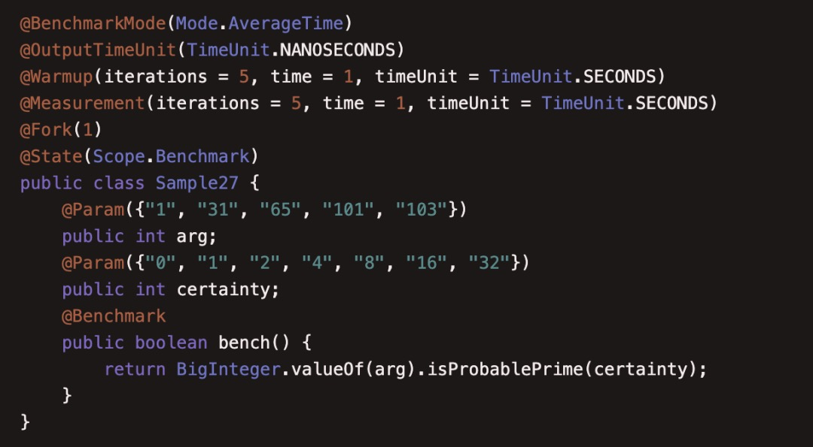

运行结果：

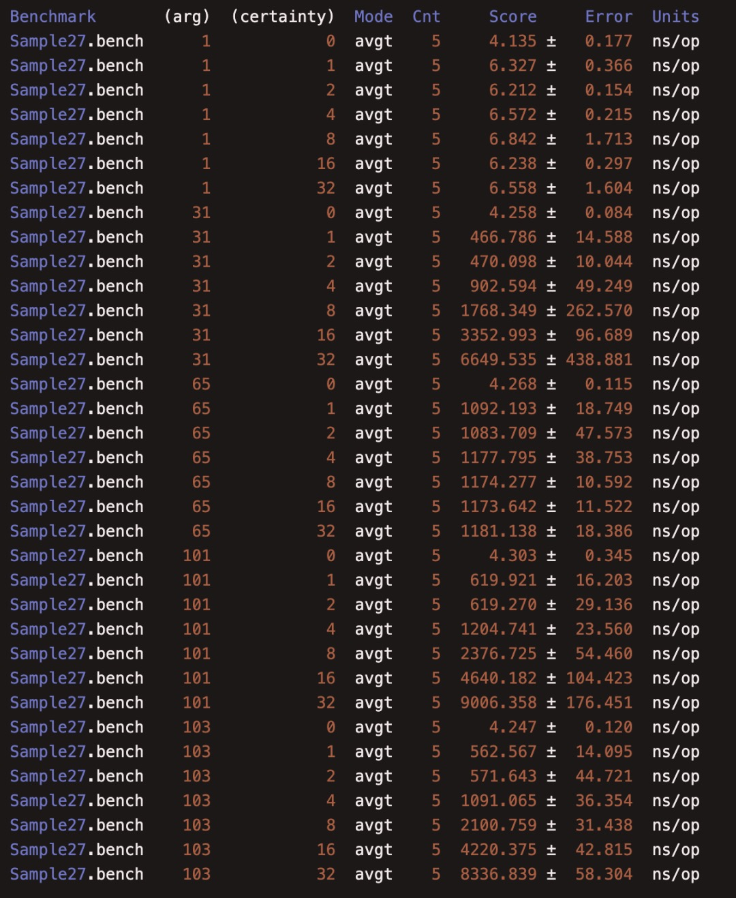

## （28）JMHSample28BlackholeHelpers
  
本例介绍了 Blackhole 不仅可以用在 Benchmark 修饰的方法上，也可以用在其他JMH提供的方法上，比如 @Setup 和 @TearDown 等等

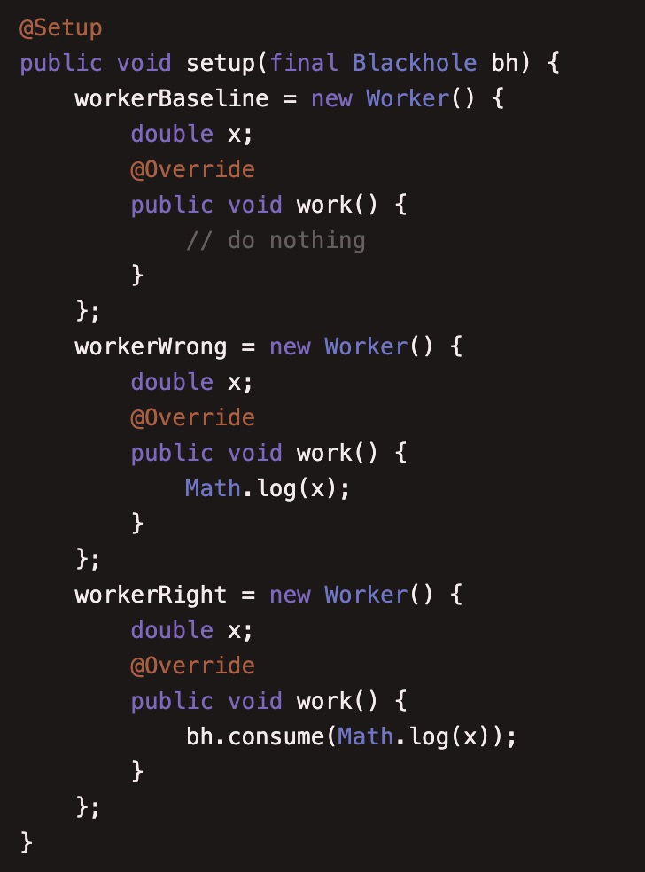

## （29）JMHSample29StatesDAG
  
本例展示了 @State 中嵌套 @State 的情况，不过想不出为啥需要这样做，例子中也说这是个实验性质的Feature。

## （30）JMHSample30Interrupts
  
本例类似（18），也是在测试时遇到死锁的情况，JMH可对能被Interrupt的超时动作发起Interrupt动作，让测试正常结束。如对一个BlockQueue进行put和take操作，如果put和get不对称，就会死锁，此时JMH会自行打断。

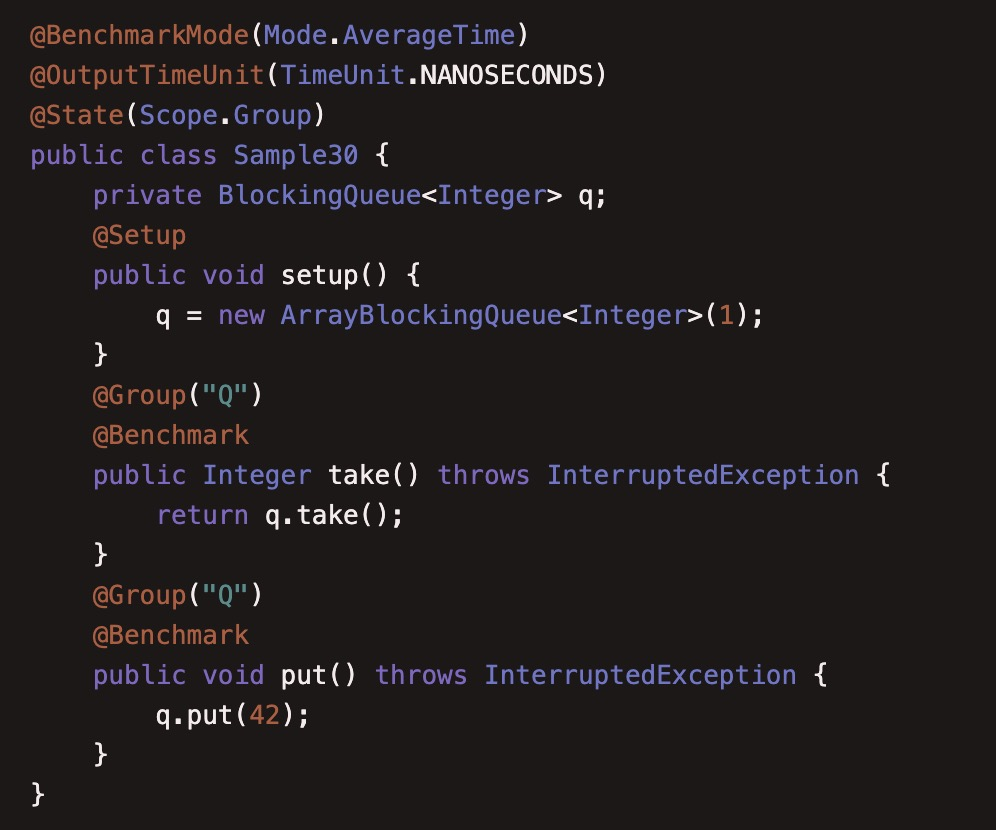

运行时会提示被Interrupt：

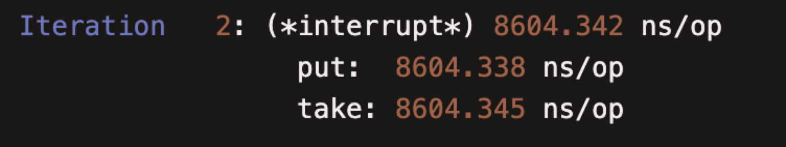

## （31）JMHSample31InfraParams
  
本例介绍了在方法中可覆盖的三种参数，这给在测试时获取配置以及动态修改配置提供了可能

- BenchmarkParams：基准测试级别
- IterationParams：迭代级别
- ThreadParams：线程级别

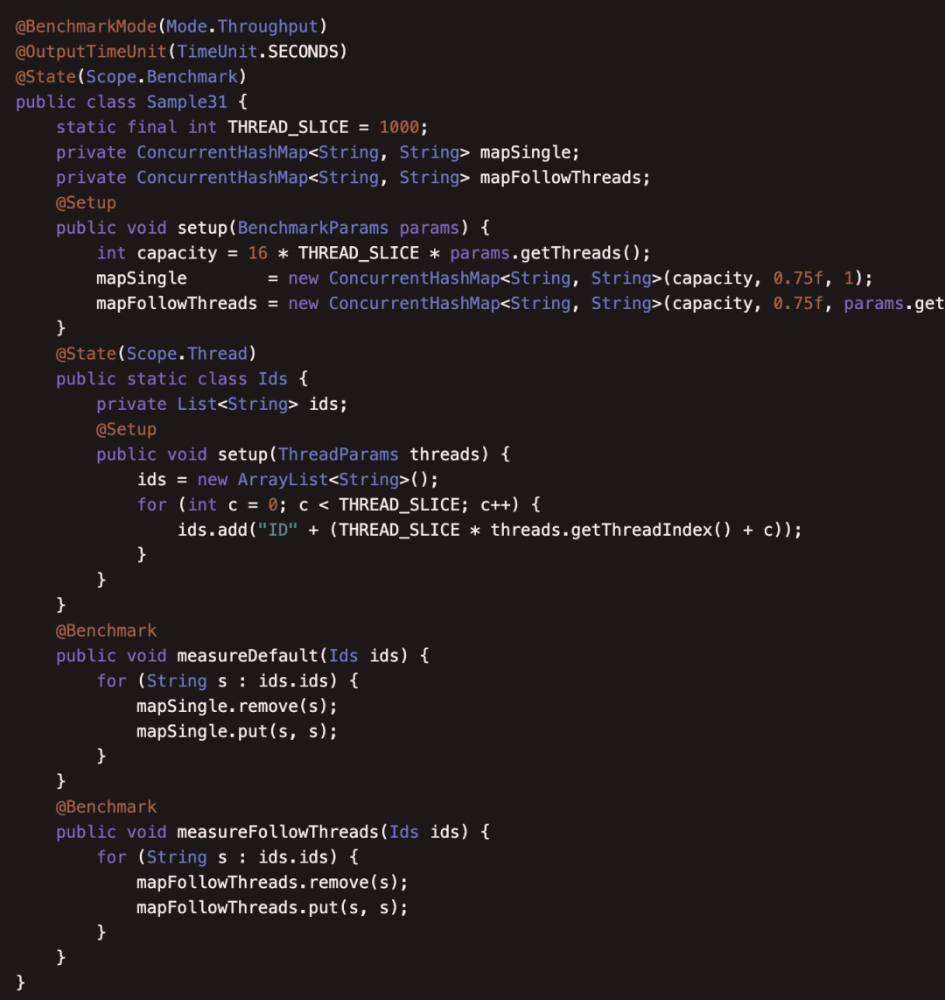

## （32）JMHSample32BulkWarmup
  
本例介绍了三种预热方式：

- WarmupMode.INDI：每个Benchmark单独预热
- WarmupMode.BULK：在每个Benchmark执行前都预热所有的Benchmark
- WarmupMode.BULK_INDI：在每个Benchmark执行前都预热所有的Benchmark，且需要再预热本次执行的Benchmark

## （33）JMHSample33SecurityManager
  
关于 SecurityManager ，可以通过注入的方式来修改 SecurityManager，用处不大。

## （34）JMHSample34SafeLooping
  
这节专门讲如何构造安全的循环，和前面的内容稍有重复

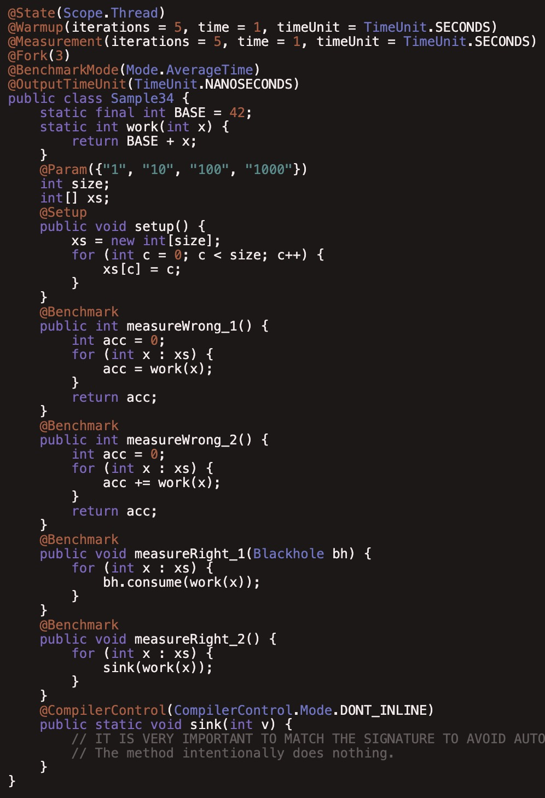

measureWrong1和measureWrong2都可能在编译时被展开，后面两种正确的方式在前面都提过。

## （35）JMHSample35Profilers
  
本例讲解了如何使用JMH内置的性能剖析工具查看基准测试消耗在什么地方，具体的剖析方式内置的有如下几种：

- ClassloaderProfiler：类加载剖析
- CompilerProfiler：JIT编译剖析
- GCProfiler：GC剖析
- StackProfiler：栈剖析
- PausesProfiler：停顿剖析
- HotspotThreadProfiler：Hotspot线程剖析
- HotspotRuntimeProfiler：Hotspot运行时剖析
- HotspotMemoryProfiler：Hotspot内存剖析
- HotspotCompilationProfiler：Hotspot编译剖析
- HotspotClassloadingProfiler：Hotspot 类加载剖析

用法

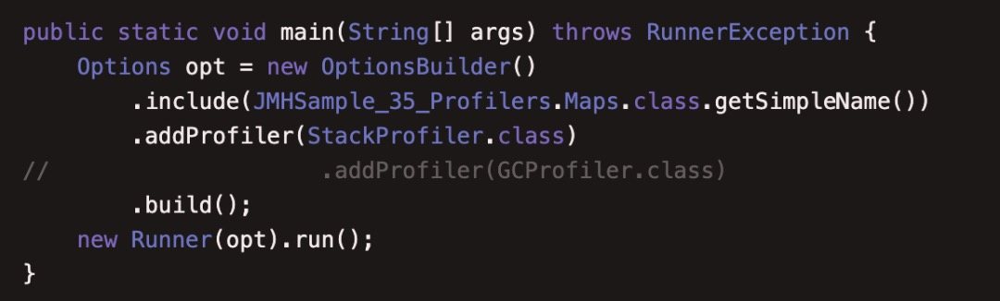

## （36）JMHSample36BranchPrediction

本例提醒我们要注意“分支预测”，简单来说，分支预测是CPU在处理有规律的数据比没有规律的数据要快，CPU可以“预测”这种规律。我们在基准测试时需要注意样本数据的规律性对结果也会产生影响。

## （37）JMHSample37CacheAccess
  
本例提醒我们对内存的顺序访问与非顺序访问会对测试结果产生影响，这点也是因为CPU存在缓存行的缘故，与之前提到的伪共享类似。

## （38）JMHSample38PerInvokeSetup
  
本例也是之前提到过的在每次调用前执行Setup，使用它可以测量排序性能，如果Setup不在每次执行排序时执行，那么只有第一次排序是执行了排序，后面每次排序的都是相同顺序的数据。

# 总结

通过这么多例子我们概括出为什么需要JMH

- 方便：使用方便，配置一些注解即可测试，且测量维度全面，内置的工具丰富；
- 专业：JMH自动地帮我们避免了一些基准测试上的“坑”；
- 准确：预热、fork隔离、避免方法内联、避免常量折叠等很多方法可以提高测量的准确性。

---

> 关于作者：专注后端的中间件开发，公众号"捉虫大师"作者，关注我，给你朴实无华的技术干货

- 原文链接: https://mp.weixin.qq.com/s/3mMhybfKjAQbZFK5kyMl5Q
- 发布时间: 2020.05.14