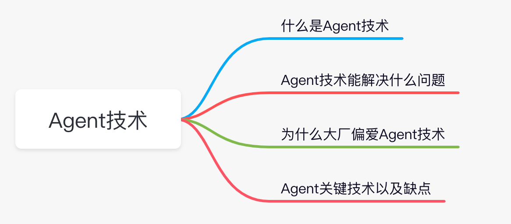
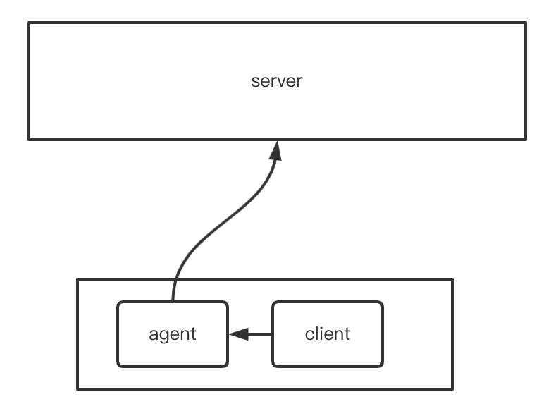
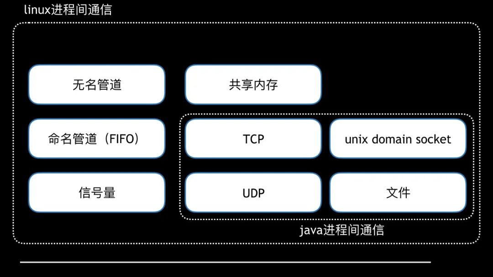

hello大家好，我是小楼，今天给大家分享一个关于Agent技术的话题，也是`后端启示录`的第3篇文章。

通过本文你可以了解到如下内容：

### 什么是Agent技术

为了解释什么是Agent技术，我在网上搜了一圈，但没有找到想要的结果。反倒是搜到了不少`Java Agent技术`，要注意`Java Agent技术`指的是一种Java字节码修改技术，和本文要说的完全是**两码事**。

既然搜不到，我就说下自己的理解吧。Agent技术是在「客户端」机器上部署一个Agent进程，「客户端」与「服务端」的交互通过这个Agent进行`代理`，其中Agent与Client通常在同一主机，即可通过「localhost」进行访问。

看到这里，相信你能想到不少类似的架构，例如当前大热的Service Mesh，又如Flume Agent等等。

在我所在的公司，Agent技术也被非常广泛的使用，涉及了日志处理、配置下发、服务注册发现、监控数据收集、流量代理等方面。

### Agent技术能解决什么问题

既然Agent技术被如此广泛的运用，那么它主要是为了解决什么问题呢？

要充分理解它，我们需要从Agent的特点去考虑。

1. 进程级资源隔离

这点可以参考之前我写的文章[《Cobar SQL审计的设计与实现》](https://mp.weixin.qq.com/s/OEuZIfbKba8sq_rect809w)，为了在Cobar中新增SQL审计的功能，第一考虑的是稳定性，不想因为引入了新的组件（Kafka）导致Cobar不可用，所以将SQL收集存储部分独立为一个Agent。

如果将逻辑放在业务进程中，首先资源（Cpu、内存等）消耗不可控，其次也极易有可能引入Bug导致原进程崩溃。

2. 语言框架无关

举个日志切割的例子，如果大家都用Java，并用了Log4J日志框架，那么完全可以使用一个配置来把日志按时间进行切割和保留。

但如果有人使用了一个小众的语言，或者用了一个不具备日志切割能力的日志框架，这时想拥有Log4J同样的日志切割能力怎么办呢？

你可能会说怎么会有这样的日志框架，可能大家用Log4J或Logback这样的日志框架都太过于强大了，事实上其他语言真的有这样的，而且日志框架也有很多轮子，质量参差不齐。

不能要求每个日志框架都具备同等的能力，只能通过一个Agent进程来处理。

看到这里，你可能已经发现这个Agent已经超出文章开头的定义了，Agent所在的机器不一定是Client，他们也不一定会通信，Agent这时更像一个「辅助进程」。

3. 存算分离

这个概念在数据库和消息队列使用的比较多，这里我借用一下，如果表述不准确还请见谅。

在没有Agent之前，服务端负责数据的存储和计算，在有了Agent后，服务端的部分计算可以交给Agent，这样不仅可以减少服务端的压力，也能大幅度降低服务端代码的复杂度。

4. 基础组件与业务解耦

这点用Service Mesh的例子讲解恰到好处，对于流量的治理，比如限流、熔断、切流，原先实现在RPC框架，每一次改动升级都需要业务方修改依赖升级并发布，而使用Agent技术后，将原先RPC具有的能力下沉到Agent，变更也只需要升级Agent，业务与基础组件的研发互不相干，效率得到极大地提升。

### 为什么大厂偏爱Agent技术

大厂的特点是人多，人多必然带来一些效率上的问题，所以大厂在工程效率上的探索往往走的比较靠前，他们会把基础架构和业务研发分开，大家的边界很清晰，各司其职。

但这也带来了很严重的问题，如果基础组件和业务耦合比较严重，那就导致架构的演进受到阻碍。

举个例子，某一天基础架构部新增了一个维度的限流能力，升级推广需要业务方操作，这时刚好业务紧急，那基础组件的升级势必会搁置。

于是基础组件与业务解耦的Agent技术受到大厂的偏爱。

大厂同样有个问题是技术栈众多，有时候为了跨语言、跨框架地解决问题，只能采用Agent技术。

### Agent关键技术和缺点

Agent关键技术有很多，看起来不难，但要做好，确实得下很多功夫：

- 资源隔离，这点通常使用cgroups技术
- Agent生命周期管理，包括Agent的上线、升级、灰度、下线等等的管理，需要有统一的管控平台，否则Agent的管理将会非常头疼
- 进程间通信，这点不是必须，但大多数Agent需要考虑这点，一般可选项有如下可选，结合实际情况进行选择即可

- 稳定性，Agent随时会挂，要带着这个去设计实现Agent
- 资源消耗问题
  - Agent毕竟只是个附属品，不能占用过多的内存、CPU，启动速度也得快，从这点来看Go是个不错的选择
  - 在容器的环境下，Agent独立为一个容器和业务容器组成Pod，这就导致了一台物理机上装了很多Agent容器，资源浪费严重，同理，虚拟机也是如此。所以省资源的玩法是一台物理机只装一个Agent，做好租户隔离即可。

技术没有银弹，Agent也有它的缺点：
- 架构复杂，管理困难使多小厂望而却步
- 性能问题，如果是直接代理流量，性能问题会很严重，毕竟在网络通信上多了一跳，这也是Service Mesh的问题之一，甚至还演进出了`proxyless Mesh`

### 最后说一句

虽然看完本文你也不知道怎么实现一个Agent，但通过本文你能了解到Agent技术是什么，有什么好处，大厂为什么偏爱这项技术，以及要实现一个Agent的技术关键点和缺点各是什么。

这也是`后端启示录`系列文章的出发点，「为什么」比「怎么做」更重要。如果你也喜欢这类文章，读完有那么一点收获，希望你能帮我点个`赞`、`在看`、`关注`，当然能`分享`出去就更好了，我会继续加油写这个系列~我们下期再见！

---

### 后端启示录系列

- [《Dubbo为什么用Go重写？》](https://mp.weixin.qq.com/s/7pS9KfJsj3u9Ufg4gZ1VhA)
- [《服务探活的五种方式》](https://mp.weixin.qq.com/s/tw4-BIUZqpJLLEd0n09GNg)