hello，大家好呀，我是小楼。

之前遇到个文件监听变更的问题，刚好这周末有空研究了一番，整理出来分享给大家。

### 从一次故障说起

我们还是从故障说起，这样更加贴近实际，也能让大家更快速理解背景。

有一个下发配置的服务，这个配置服务的实现有点特殊，服务端下发配置到各个服务的本地文件，当然中间经过了一个agent，如果没有agent也就无法写本地文件，然后由client端的程序监听这个配置文件，一旦文件有变更，就重新加载配置，画个架构图大概是这样：
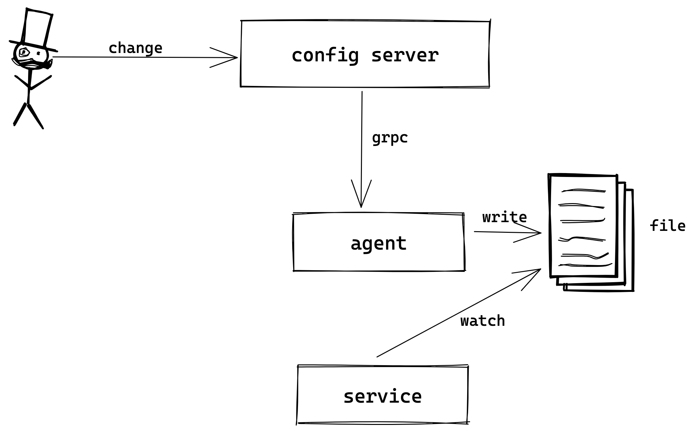

今天的重点是文件的变更该如何监听（watch），我们当时的实现非常简单：

- 单独起个线程，定时去获取文件的最后更新时间戳（毫秒级）
- 记录每个文件的最后更新时间戳，根据这个时间戳是否变化来判断文件是否有变更

从上述简单的描述，我们能看出这样实现有一些缺点：

- 无法实时感知文件的变更，感知误差在于轮询文件最后更新时间的间隔
- 精确到毫秒级，如果同一毫秒内发生2次变更，且轮询时刚好落在这2次变更的中间时，后一次变更将无法感知，但这概率很小

还好，上述两个缺点几乎没有什么大的影响。

但后来还是发生了一次比较严重的线上故障，这是为什么呢？因为一个JDK的BUG，这里直接贴出罪魁祸首：
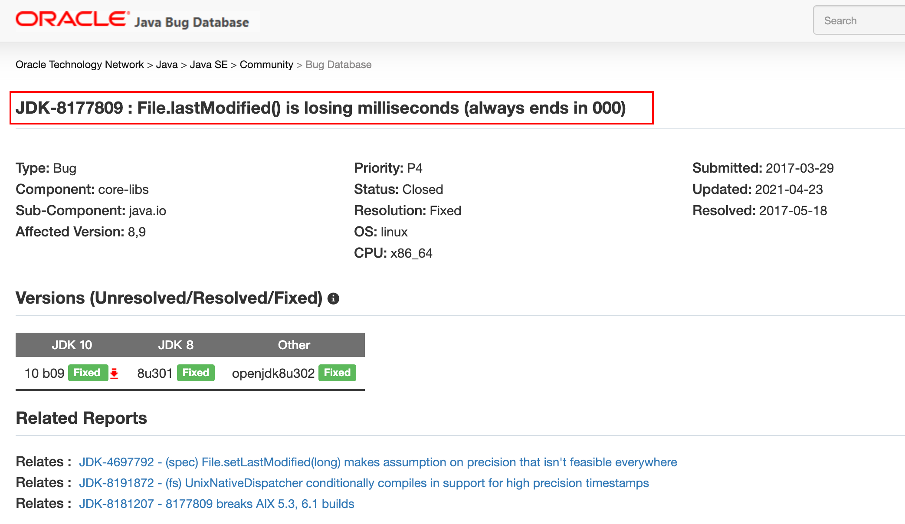

> BUG详见：https://bugs.java.com/bugdatabase/view_bug.do?bug_id=8177809

在某些JDK版本下，获取文件的最后更新时间戳会丢失毫秒精度，总是返回整秒的时间戳，为了直观感受，写了个demo分别在`jdk1.8.0_261`和`jdk_11.0.6`测试（均为MacOs）：

- jdk_1.8.0_261
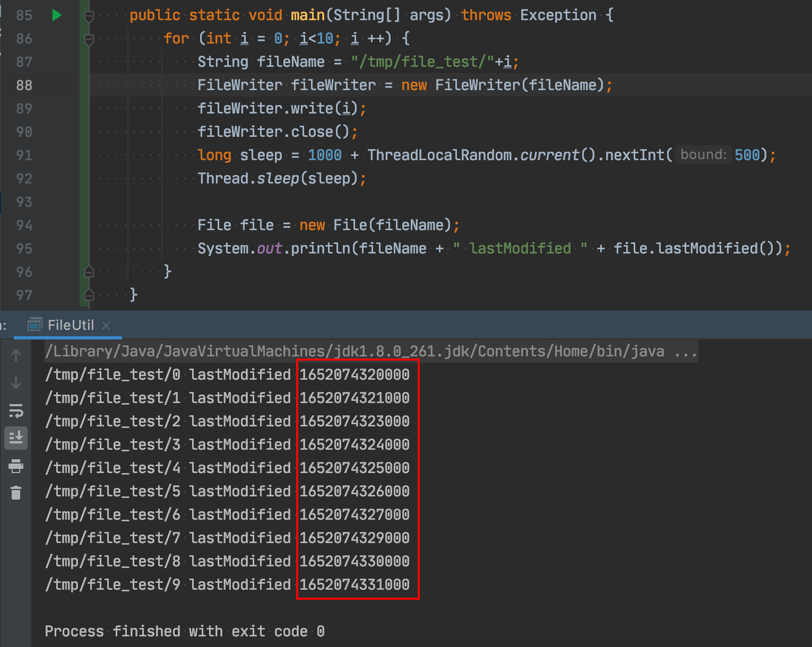
- jdk_11.0.6
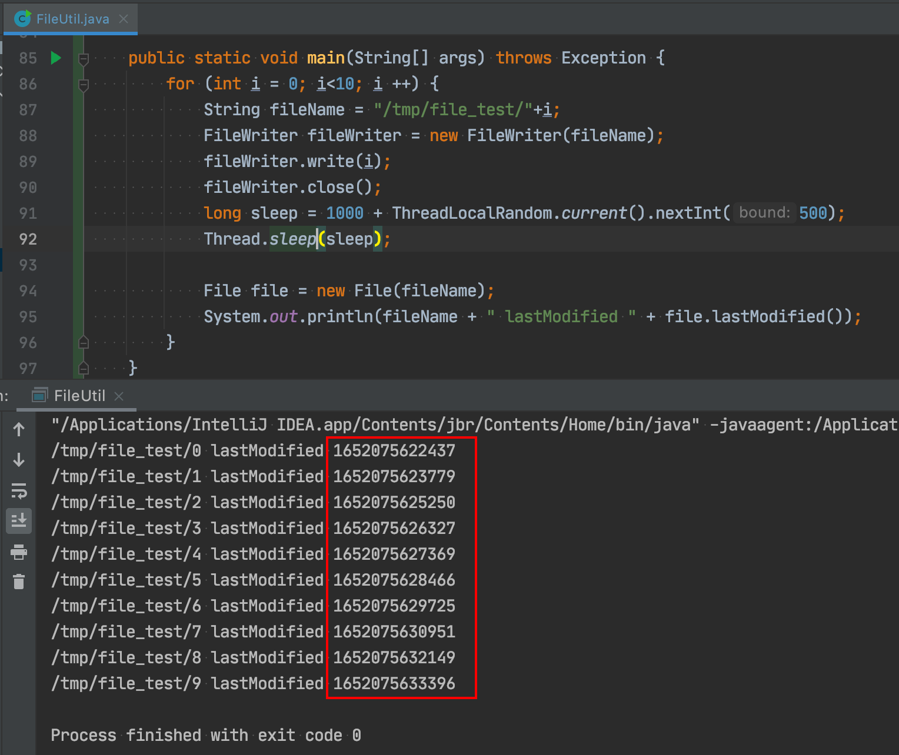

如果是在这个BUG的影响下，只要同一秒内有2次变更，且读取文件最后时间戳位于这2次变更之间的时间，第2次变更就无法被程序感知了，同1秒这个概率比同一毫秒大的多的多，所以当然就被触发了，导致了一次线上故障。

这就好比之前是沧海一粟，现在变成了大海里摸到某条鱼的概率。这也能被我们碰到，真是有点极限~


### WatchService—JDK内置的文件变更监听

当了解到之前的实现存在BUG后，我就去搜了一下Java下如何监听文件变更，果然被我找到了`WatchService`。
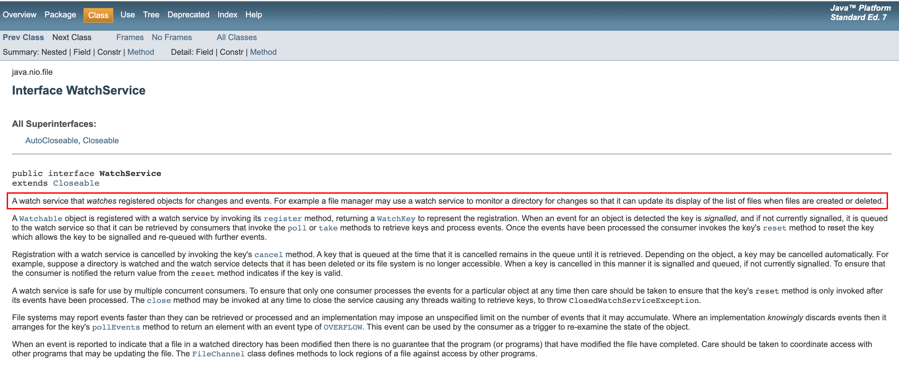

说是WatchService可以监听一个目录，对目录下的文件新增、变更、删除进行监听。于是我很快就写了个demo进行测试：

```java
public static void watchDir(String dir) {
    Path path = Paths.get(dir);
    try (WatchService watchService = FileSystems.getDefault().newWatchService()) {
        path.register(watchService, StandardWatchEventKinds.ENTRY_CREATE, StandardWatchEventKinds.ENTRY_MODIFY, StandardWatchEventKinds.ENTRY_DELETE, StandardWatchEventKinds.OVERFLOW);
        while (true) {
            WatchKey key = watchService.take();
            for (WatchEvent<?> watchEvent : key.pollEvents()) {
                if (watchEvent.kind() == StandardWatchEventKinds.ENTRY_CREATE) {
                    System.out.println("create..." + System.currentTimeMillis());
                } else if (watchEvent.kind() == StandardWatchEventKinds.ENTRY_MODIFY) {
                    System.out.println("modify..." + System.currentTimeMillis());
                } else if (watchEvent.kind() == StandardWatchEventKinds.ENTRY_DELETE) {
                    System.out.println("delete..." + System.currentTimeMillis());
                } else if (watchEvent.kind() == StandardWatchEventKinds.OVERFLOW) {
                    System.out.println("overflow..." + System.currentTimeMillis());
                }
            }
            if (!key.reset()) {
                System.out.println("reset false");
                return;
            }
        }
    } catch (Exception e) {
        e.printStackTrace();
    }
}
```
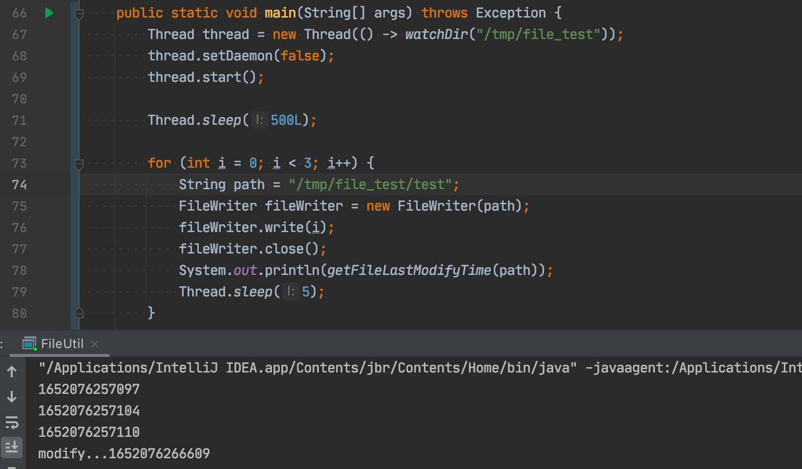

先对`/tmp/file_test`目录进行监听，然后每隔5毫秒往文件写数据，理论上来说，应该能收到3次事件，但实际上很奇怪，仔细看接收到`modify`事件的时间大概是第一次文件修改后的`9.5s`左右，很奇怪，先记着，我们读一下WatchService源码

```
>>> 1652076266609 - 1652076257097
9512
```

### WatchService原理

```java
WatchService watchService = FileSystems.getDefault().newWatchService()
```

通过debug发现，这里的watchService实际上是PollingWatchService的实例，直接看PollingWatchService的实现：
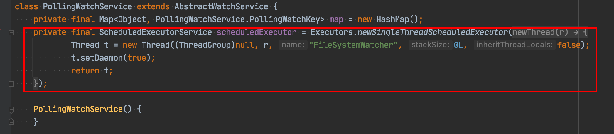

PollingWatchService上来就起了个线程，这让我隐隐不安。再找一下这个scheduledExecutor在哪里用到：
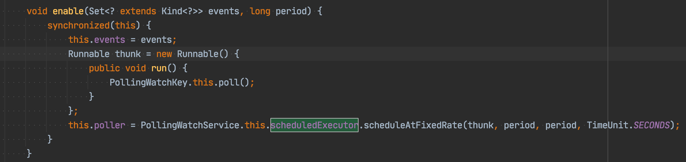

每隔一段时间（默认为10s）去poll下，这个poll干了什么？代码太长，我截出关键部分：
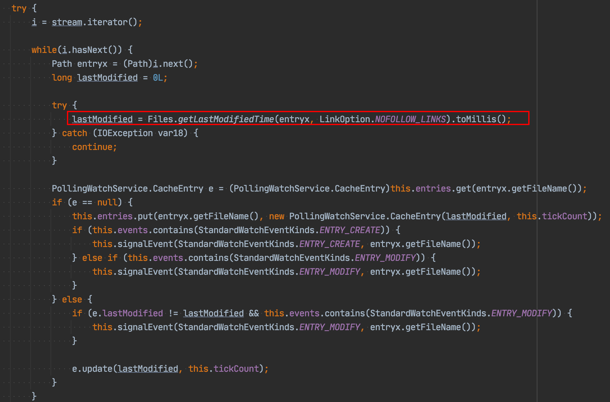

果然，和我们的实现类似，也是去读文件的最后更新时间，根据时间的变化来发出变更事件。

换句话说，在某些JDK版本下，他也是有BUG的！


这也就解释了上文提到的事件监听为什么是在第一个9.5s之后才发出，因为监听注册后，sleep了500ms后修改文件，10s轮询，刚好9.5s后拿到第一轮事件。

### inotify—Linux内核提供的文件监听机制

至此，我想起了linux上的`tail`命令，tail 是在文件有变更的情况下输出文件的末尾，理论上也是监听了文件变更，这块刚好在很久之前听过一个技术大佬分享如何自己实现`tail`命令，用到的底层技术就是`inotify`
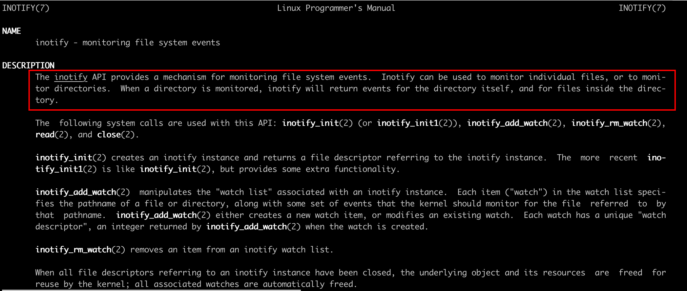

简单来说，inotify是linux内核提供的一种监控文件变更事件的系统调用。如果基于此来实现，不就可以规避JDK的BUG了吗？

但奇怪的是为什么Java没有用这个来实现呢？于是我又搜了搜，发现谷歌似乎有一个库，但被删了，看不到代码:
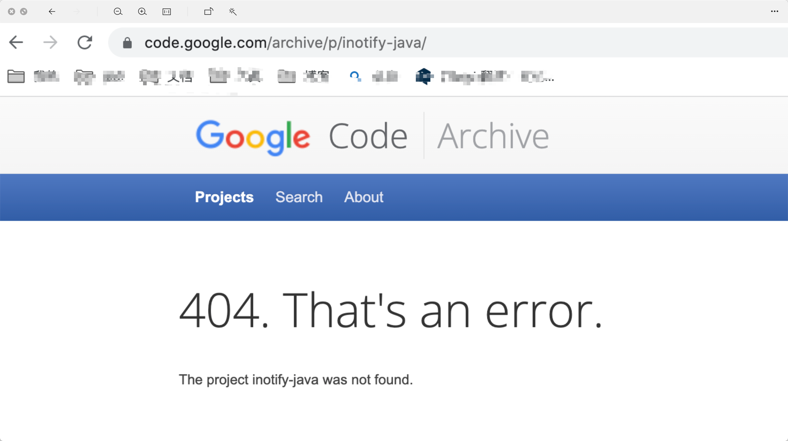

github上又搜到一个：https://github.com/sunmingshi/Jinotify
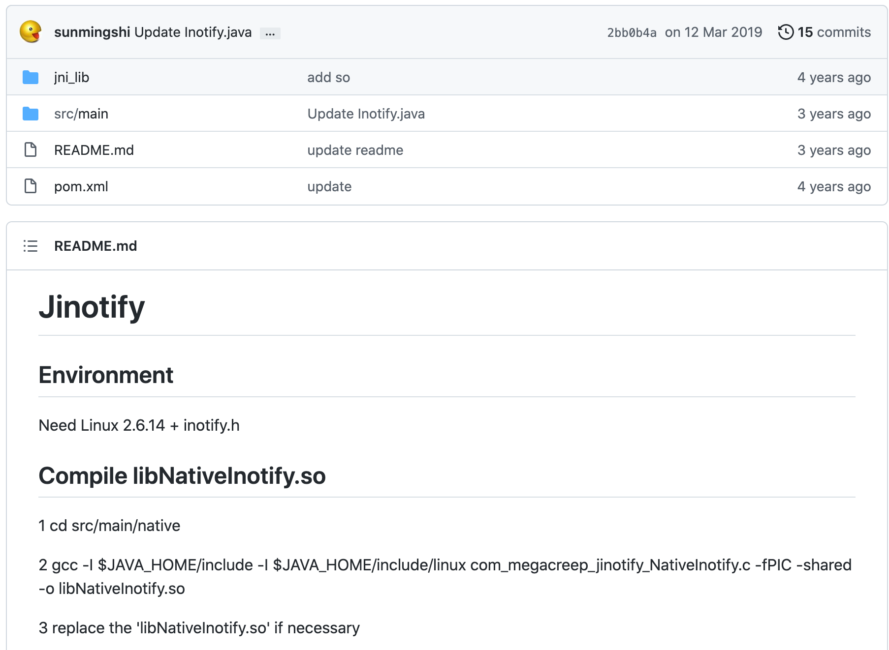

看起来是一个native的实现，需要自己编译.so文件，这样就比较蛋疼了。

记得上次这么蛋疼还是在折腾Java的unix domain socket，也是找到了一个google的库，测试没问题，放到线上就崩了~不得不说google还是厉害，JDK提供不了的库，我们来提供~


于是我带着这个疑问去问了一个搞JVM开发的朋友，结果他告诉我，Java也可以使用inotify！

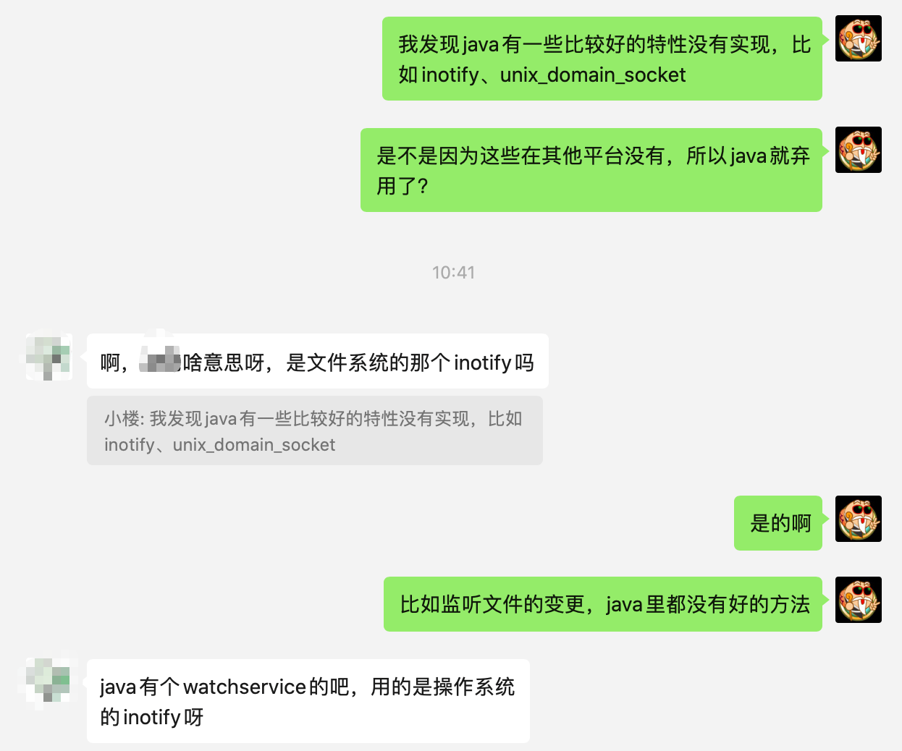

瞬间斗志来了，难道是我测试的姿势不对？

我又去翻了一遍Java文档，发现在角落隐藏了这么一段话：
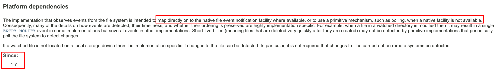

也就是说，不同的平台下会使用不同的实现，PollingWatchService是在系统不支持inotify的情况下使用的兜底策略。

于是将watchService的类型打印出来，在Mac上打印为：

```
class sun.nio.fs.PollingWatchService
```

在Linux上是：

```
class sun.nio.fs.LinuxWatchService
```

LinuxWatchService在Mac上是找不到这个类，我猜测应该是Mac版的JDK压根没把这块代码打包进来。

原来我本地测试都走了兜底策略，看来是测了个寂寞。


于是我写了个demo再测试一把：

```java
public static void main(String[] args) throws Exception {
    Thread thread = new Thread(() -> watchDir("/tmp/file_test"));
    thread.setDaemon(false);
    thread.start();

    Thread.sleep(500L);

    for (int i = 0; i < 3; i++) {
        String path = "/tmp/file_test/test";
        FileWriter fileWriter = new FileWriter(path);
        fileWriter.write(i);
        fileWriter.close();
        File file = new File(path);
        System.out.println(file.lastModified());
        Thread.sleep(5);
    }
}
```

- 本地Mac
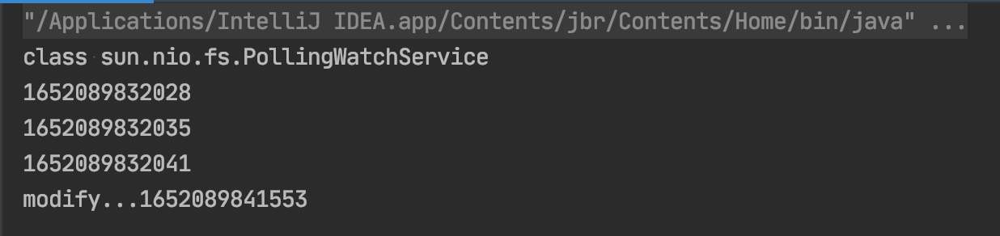

- Linux
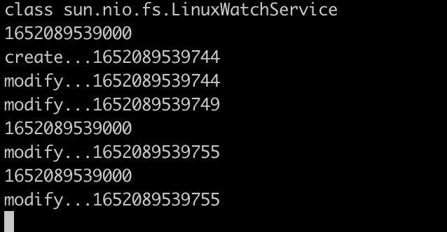

可以看出，Linux上能收到的事件比本地多的多，而且接收事件的时间明显实时多了。

为了更加准确的验证是inotify，用`strace`抓一下系统调用，由于JVM fork出的子进程较多，所以要加`-f`命令，输出太多可以存入文件再分析：

```
strace -f -o s.txt java FileTime
```

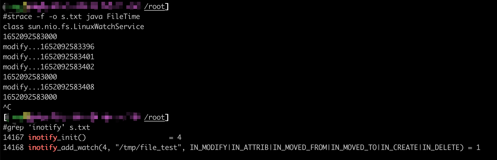

果然是用到了inotify系统调用的，再次验证了我们的猜想。

### 故障是如何修复的？

再次回到开头的故障，我们是如何修复的呢？由于下发的文件和读取文件的程序都是我们可控的，所以我们绕过了这个BUG，给每个文件写一个`version`，可以用文件内容md5值作为version，写入一个特殊文件，读取时先读version，当version变化时再重新载入文件。

可能你要问了，为什么不用WatchService呢？

我也问了负责人，据说inotify在docker上运行的不是很好，经常会丢失事件，不是Java的问题，所有语言都存在这个问题，所以一直没有使用。不过这块找不到相关的资料，也无法证明，所以暂时搁置。

### 最后说几句

有些BUG，不踩过就很难避免，代码只要存在BUG的可能性，就一定会暴露出来，只是时间问题。

我们要在技术上深入探究，小心求证，但产品上不必执着，可另辟蹊径。

另外解决不了的问题时可以找这个领域的资深人士，所以平时没事认识几个大牛很有必要。我们今天的分析到此结束，我是小楼，下期再见~

---

> 搜索关注微信公众号"捉虫大师"，后端技术分享，架构设计、性能优化、源码阅读、问题排查、踩坑实践。