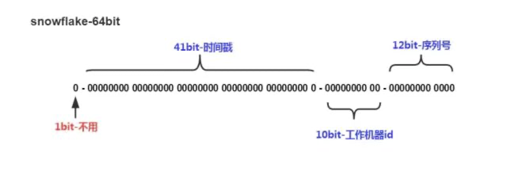

# 背景
在分布式场景中，很多地方需要生成全局唯一的id，如数据库分库分表后需要用唯一id代替单机版本的自增id。发号器的基本要求是

- 全局唯一，无论如何都不能重复

某些场景下还要求单调递增，如排序需求等。

网上有很多介绍发号器的文章，比如美团的《Leaf——美团点评分布式ID生成系统》，有赞的《如何做一个靠谱的发号器》等。本文聚焦`高可用，高性能`

- 高可用：不会因为系统故障导致服务不可用或发号重复
- 高性能：发号器通常是一个非常高并发的系统，性能足够的同时也可以水平扩容
在基本的要求下，常见的解决方案有哪些？他们是否是`高可用，高性能`的呢？

# snowflake方案
`snowflake` 采用41位时间戳加10位机器id加12位序列号的方式生成，序列号在单一进程内可使用AtomicLong来生成，10位机器号可支持1024台机器

该算法优点是：

- 算法简单，易于实现，不依赖任何第三方系统，性能非常高；
- 集群无状态，可随意扩缩容，可认为是高可用系统。

缺点是：

- 高10位的时间戳和低位自增序列号可保证单调增，但机器号无法保证，如机器号为2在某一时刻先生成id，机器号为1在同一时刻后生成id，则不能保证单调性；
- 依赖时间戳，如果时钟回拨，可能会生成重复的id。

综合来看，snowflake方案符合基本要求，性能非常高，但其存在时钟回拨问题，因而是`高性能`但`不是高可用`的方案。

# 基于数据库方案

利用数据库的自增id特性实现，该方案优点：

实现比较简单，只依赖数据库;
- 没有时钟回拨问题;
- 生成的id单调递增。

缺点：

- 性能被数据库限制，数据库的单机写入性能有限，也无法扩缩容；
- 数据库存在单点故障，如果是主从架构，取决于是异步复制、半同步复制、全同步复制配置，只有全同步复制才能保证可用性，其他配置无法保证主从数据的一致性，一旦主库发生故障，主库的变更还未应用到从库，则主从切换后可能会存在发号重复的问题。

同理，这里的数据库也可以替换为redis，利用redis的incr来实现，但redis只有异步复制，更加无法保证数据一致性。

综合来看，基于数据库的方案如果不开启全同步复制，就不是高可用方案，如果开启全同步复制，则性能一定会有问题（就算不开启全同步复制也会有性能问题）。

# 基于数据库的号段方案

本方案是对数据库方案的一种性能优化，每次从数据库取回的不是一个id，而是一个号段，在单独进程内通过锁保证每次发放一个唯一的id，甚至可以在系统快要发放完号码时异步地去获取下一个号段，该方案性能明显高于数据库方案，但也失去了id单调递增的特性，如果开启全同步复制，则可认为是一个高可用的方案，通过调大号段的长度，可以达到高性能的要求。

# 基于多主库的数据库方案

本方案也是对数据库号方案的一种优化，采用多台数据库，假设3台主库设置自增id起始分别为1，2，3，步长都设置为3，这样1号数据库获取的自增id为1，4，7...，2号数据库获取的自增id为2，5，8...，3号数据库获取的自增id为3，6，9...，他们永远不会重复。系统每次取号段时采取轮询策略，如果有一台数据库获取失败，则继续从下一个数据库获取。该方案解决了数据库的高可用问题，个别数据库宕机不影响系统正常运行。高性能也是通过号段的方式来解决，如果运行过程中对数据库进行水平扩容则比较困难。

# 基于一致性协议的方案

上面数据库的高可用问题主要来源于主从数据不一致，如果使用一致性协议来保证数据的一致性，就可以解决高可用问题，目前最常使用的raft算法，可以保证数据复制到半数以上机器。在我们每获取一个号段后，已发出的号段都被持久化到半数以上机器，并且最终复制到所有机器，当master挂掉后raft重新选举。有赞的《如何做一个靠谱的发号器》就是采取这种办法，他们使用的组件是etcd。甚至可以基于开源的raft库来自己实现一个发号器，如果要自己来实现一个靠谱的raft协议，还是比较困难的，开源的raft库可选用蚂蚁开源的SOFAJRaft。

# 总结

- 发号器的高性能主要依靠号段的方式来解决；
- 发号器的高可用可以依靠数据库的高可用、多主库、一致性协议来实现。

---

欢迎关注我的公众号

- 原文链接: https://mp.weixin.qq.com/s/LbEZEdmq34JQZ1rSwx2_oA
- 发布时间: 2020.05.17