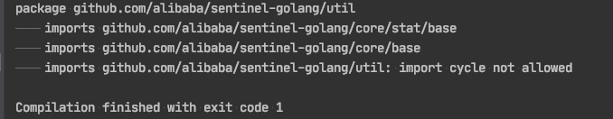
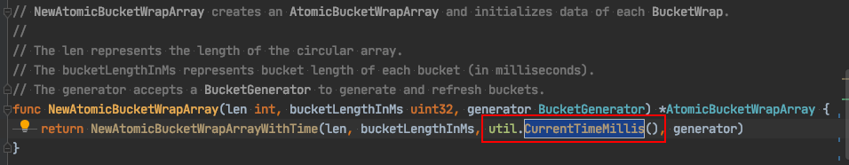
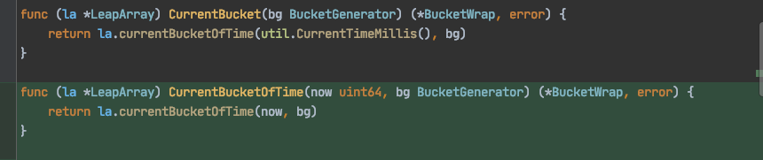
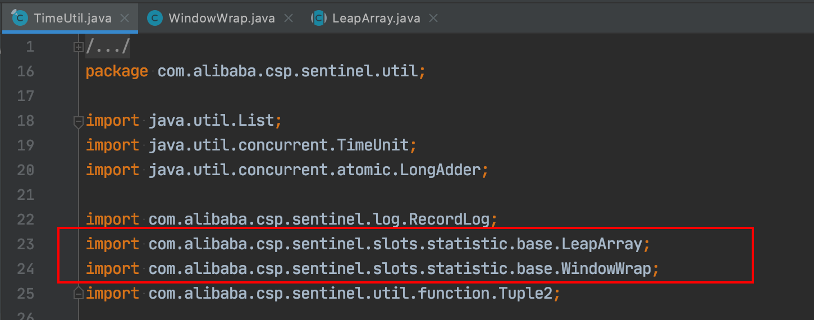
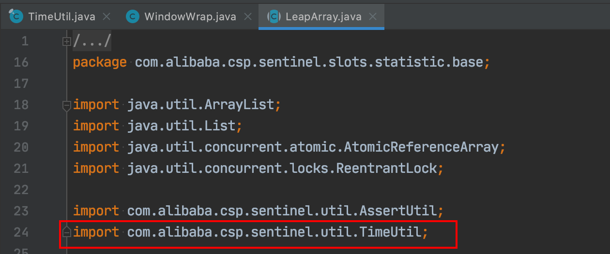
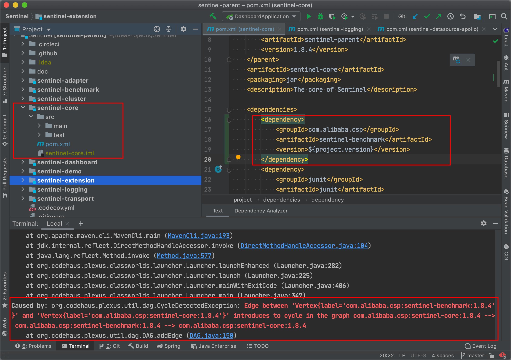
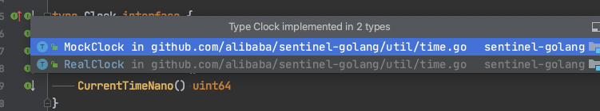
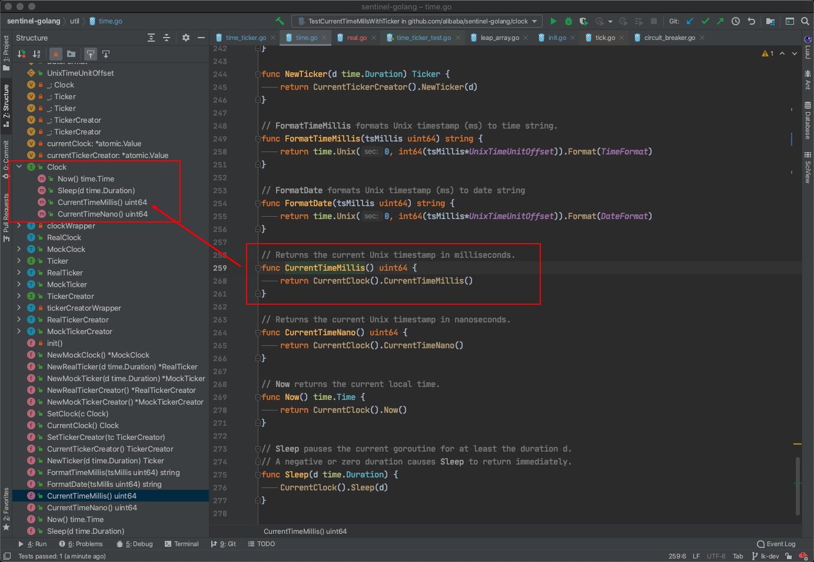
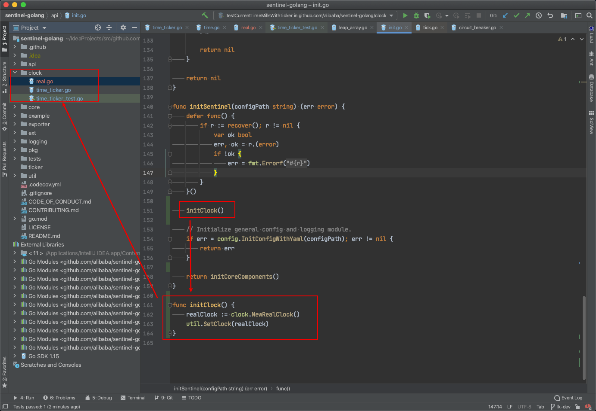

hello，大家好呀，我是小楼。

前几天不是写了这篇文章[《发现一个开源项目优化点，点进来就是你的了》](https://mp.weixin.qq.com/s/IJOFhLezjMgZc_v5p2MP5A)嘛。

文章介绍了Sentinl的自适应缓存时间戳算法，从原理到实现都手把手解读了，而且还发现Sentinel-Go还未实现这个自适应算法，于是我就觉得，这简单啊，把Java代码翻译成Go不就可以混个PR？

甚至在文章初稿中把这个描述为：「有手就可以」，感觉不太妥当，后来被我删掉了。

过了几天，我想去看看有没有人看了我的文章真的去提了个PR，发现仍然是没有，心想，可能是大家太忙（懒）了吧。

于是准备自己来实现一遍，周末我拿出电脑试着写一下这段代码，结果被当头一棒敲醒，原来这代码不好写啊。


### 如何实现

先简单介绍一下我当时是如何实现的。

首先，定义了系统的四种状态：

```go
const (
	UNINITIALIZED = iota
	IDLE
	PREPARE
	RUNNING
)
```

这里为了让代码更加贴近Go的习惯，用了`iota`。

用了4种状态，第一个状态`UNINITIALIZED`是Java版里没有的，因为Java在系统初始化时默认就启动了定时缓存时间戳线程。

但Go版本不是这样的，它有个开关，当开关开启时，会调用`StartTimeTicker`来启动缓存时间戳的协程，所以当没有初始化时是需要直接返回系统时间戳，所以这里多了一个`UNINITIALIZED`状态。

然后我们需要能够统计QPS的方法，这块直接抄Java的实现，由于不是重点，但又怕你不理解，所以直接贴一点代码，不想看可以往下划。

定义我们需要的BucketWrap：

```go
type statistic struct {
	reads  uint64
	writes uint64
}

func (s *statistic) NewEmptyBucket() interface{} {
	return statistic{
		reads:  0,
		writes: 0,
	}
}

func (s *statistic) ResetBucketTo(bucket *base.BucketWrap, startTime uint64) *base.BucketWrap {
	atomic.StoreUint64(&bucket.BucketStart, startTime)
	bucket.Value.Store(statistic{
		reads:  0,
		writes: 0,
	})
	return bucket
}
```

获取当前的Bucket：

```go
func currentCounter(now uint64) (*statistic, error) {
	if statistics == nil {
		return nil, fmt.Errorf("statistics is nil")
	}

	bk, err := statistics.CurrentBucketOfTime(now, bucketGenerator)
	if err != nil {
		return nil, err
	}
	if bk == nil {
		return nil, fmt.Errorf("current bucket is nil")
	}

	v := bk.Value.Load()
	if v == nil {
		return nil, fmt.Errorf("current bucket value is nil")
	}
	counter, ok := v.(*statistic)
	if !ok {
		return nil, fmt.Errorf("bucket fail to do type assert, expect: *statistic, in fact: %s", reflect.TypeOf(v).Name())
	}

	return counter, nil
}
```

获取当前的QPS：

```go
func currentQps(now uint64) (uint64, uint64) {
	if statistics == nil {
		return 0, 0
	}

	list := statistics.ValuesConditional(now, func(ws uint64) bool {
		return ws <= now && now < ws+uint64(bucketLengthInMs)
	})

	var reads, writes, cnt uint64
	for _, w := range list {
		if w == nil {
			continue
		}

		v := w.Value.Load()
		if v == nil {
			continue
		}

		s, ok := v.(*statistic)
		if !ok {
			continue
		}

		cnt++
		reads += s.reads
		writes += s.writes
	}

	if cnt < 1 {
		return 0, 0
	}

	return reads / cnt, writes / cnt
}
```

当我们有了这些准备后，来写核心的check逻辑：

```go
func check() {
	now := CurrentTimeMillsWithTicker(true)
	if now-lastCheck < checkInterval {
		return
	}

	lastCheck = now
	qps, tps := currentQps(now)
	if state == IDLE && qps > hitsUpperBoundary {
		logging.Warn("[time_ticker check] switches to PREPARE for better performance", "reads", qps, "writes", tps)
		state = PREPARE
	} else if state == RUNNING && qps < hitsLowerBoundary {
		logging.Warn("[time_ticker check] switches to IDLE due to not enough load", "reads", qps, "writes", tps)
		state = IDLE
	}
}
```

最后是调用check的地方：

```go
func StartTimeTicker() {
	var err error
	statistics, err = base.NewLeapArray(sampleCount, intervalInMs, bucketGenerator)
	if err != nil {
		logging.Warn("[time_ticker StartTimeTicker] new leap array failed", "error", err.Error())
	}

	atomic.StoreUint64(&nowInMs, uint64(time.Now().UnixNano())/unixTimeUnitOffset)
	state = IDLE
	go func() {
		for {
			check()
			if state == RUNNING {
				now := uint64(time.Now().UnixNano()) / unixTimeUnitOffset
				atomic.StoreUint64(&nowInMs, now)
				counter, err := currentCounter(now)
				if err != nil && counter != nil {
					atomic.AddUint64(&counter.writes, 1)
				}
				time.Sleep(time.Millisecond)
				continue
			}
			if state == IDLE {
				time.Sleep(300 * time.Millisecond)
				continue
			}
			if state == PREPARE {
				now := uint64(time.Now().UnixNano()) / unixTimeUnitOffset
				atomic.StoreUint64(&nowInMs, now)
				state = RUNNING
				continue
			}
		}
	}()
}
```

自此，我们就实（抄）现（完）了自适应的缓存时间戳算法。

### 测试一下

先编译一下，咚，报错了：import cycle not allowed！



啥意思呢？循环依赖了！

我们的时间戳获取方法在包`util`中，然后我们使用的统计QPS相关的实现在`base`包中，util包依赖了base包，这个很好理解，反之，base包也依赖了util包，base包主要也使用了`CurrentTimeMillis`方法来获取当前时间戳，我这里截个图，但不止这些，有好几个地方都使用到了：



但我写代码时是特地绕开了循环依赖，也就是util中调用base包中的方法是不会反向依赖回来形成环的，为此还单独写了个方法：




使用新方法，就不会形成依赖环。但实际上编译还是通过不了，这是因为Go在编译时就直接禁止了循环依赖。

那我就好奇了啊，Java是怎么实现的？

这是`com.alibaba.csp.sentinel.util`包




这是`com.alibaba.csp.sentinel.slots.statistic.base`包



Java也出现了循环依赖，但它没事！

这瞬间勾起了我的兴趣，如果我让它运行时形成依赖环，会怎么样呢？

简单做个测试，搞两个包，互相调用，比如`pk1`和`pk2`的`code`方法都调用对方：

```java
package org.newboo.pk1;

import org.newboo.pk2.Test2;

public class Test1 {
    public static int code() {
        return Test2.code();
    }

    public static void main(String[] args) {
        System.out.println(code());
    }
}
```
编译可以通过，但运行报错栈溢出了：
```java
Exception in thread "main" java.lang.StackOverflowError
	at org.newboo.pk1.Test1.code(Test1.java:7)
	at org.newboo.pk2.Test2.code(Test2.java:7)
	...
```

这么看来是Go编译器做了校验，强制不允许循环依赖。

说到这里，其实Java里也有循环依赖校验，比如：`Maven`不允许循环依赖，比如我在sentinel-core模块中依赖sentinel-benchmark，编译时就直接报错。



再比如SpringBoot2.6.x默认禁用循环依赖，如果想用，还得手动打开才行。

Java中强制禁止的只有maven，语言层面、框架层面基本都没有赶尽杀绝，但Go却在语言层面强制不让使用。

这让我想起了之前在写Go代码时，Go的锁不允许重入，经常写出死锁代码。这搁Java上一点问题都没有，当时我就没想通，为啥Go不支持锁的重入。

现在看来可能的原因：一是Go的设计者有代码洁癖，想强制约束大家都有良好的代码风格；二是由于Go有循环依赖的强制检测，导致锁重入的概率变小。

但这终究是理想状态，往往在实施起来的时候令人痛苦。

反观Java，一开始没有强制禁用循环依赖，导致后面基本不可避免地写出循环依赖的代码，SpringBoot认为这是不好的，但又不能强制，只能默认禁止，但如果你真的需要，也还是可以打开的。

但话又说回来，循环依赖真的「丑陋」吗？我看不一定，仁者见仁，智者见智。

### 如何解决

问题是这么个问题，可能大家都有不同的观点，或是吐槽Go，或是批判Java，这都不是重点，重点是我们还得在Go的规则下解决问题。

如何解决Go的循环依赖问题呢？稍微查了一下资料，大概有这么几种方法：

#### 方法一 

将两个包合成一个，这是最简单的方法，但这里肯定不行，合成一个这个PR铁定过不了。

#### 方法二

抽取公共底层方法，双方都依赖这个底层方法。比如这里，我们把底层方法抽出来作为common，util和base同时依赖它，这样util和base就不互相依赖了。

```
---- util
---- ---- common
---- base
---- ---- common
```

这个方法也是最常见，最正规的方法。

但在这里，似乎也不好操作。因为获取时间戳这个方法已经非常底层了，没办法抽出一个和统计QPS共用的方法，反正我是没能想出来，如果有读者朋友可以做到，欢迎私聊我，真心求教。

花了很多时间，还是没能搞定。当时的感觉是，这下翻车了，这题可没那么简单啊！

#### 方法三

这个方法比较难想到，我也是在前两个方法怎么都搞不定的情况下咨询了组里的Go大佬才知道。

仔细看获取时间戳的代码：

```go
// Returns the current Unix timestamp in milliseconds.
func CurrentTimeMillis() uint64 {
	return CurrentClock().CurrentTimeMillis()
}
```

这里的`CurrentClock()`是什么？其实是返回了一个`Clock`接口的实现

```go
type Clock interface {
	Now() time.Time
	Sleep(d time.Duration)
	CurrentTimeMillis() uint64
	CurrentTimeNano() uint64
}
```

作者这么写的目的是为了在测试的时候，可以灵活地替换真实实现




实际使用时RealClock，也就是调用了我们正在调优的时间戳获取；MockClock则是测试时使用的。

这个实现是什么时候注入的呢？

```go
func init() {
	realClock := NewRealClock()
	currentClock = new(atomic.Value)
	SetClock(realClock)

	realTickerCreator := NewRealTickerCreator()
	currentTickerCreator = new(atomic.Value)
	SetTickerCreator(realTickerCreator)
}
```

在util初始化时，就写死注入了realClock。

这么一细说，是不是对循环依赖的解决有点眉目了？

我们的realClock实际上依赖了base，但这个realClock可以放在util包外，util包内只留一个接口。



注入真实的realClock的地方也不能放在util的初始化中，也得放在util包外（比如Sentinel初始化的地方），这样一来，util就不再直接依赖base了。



这样一改造，编译就能通过了，当然这代码只是个示意，还需要精雕细琢。

### 最后

我们发现就算给你现成的代码，抄起来也是比较难的，有点类似「脑子会了，但手不会」的尴尬境地。

同时每个编程语言都有自己的风格，也就是我们通常说的，Go代码要写得更「Go」一点，所以语言不止是一个工具这么简单，它的背后也存在着自己的思考方式。

本文其实是从一个案例分享了如何解决Go的循环依赖问题，以及一些和Java对比的思考，更偏向代码工程。

如果你觉得还不过瘾，也可以看看这篇文章，也是关于代码工程的：

- [《惨，给Go提的代码被批麻了》](https://mp.weixin.qq.com/s/5kxj9B7mwmTDIYPflAVZbQ)

看完，记得点个`关注`、`赞`、`在看`哦，这样我才有动力持续输出优质技术文章 ~ 我们下期再见吧。