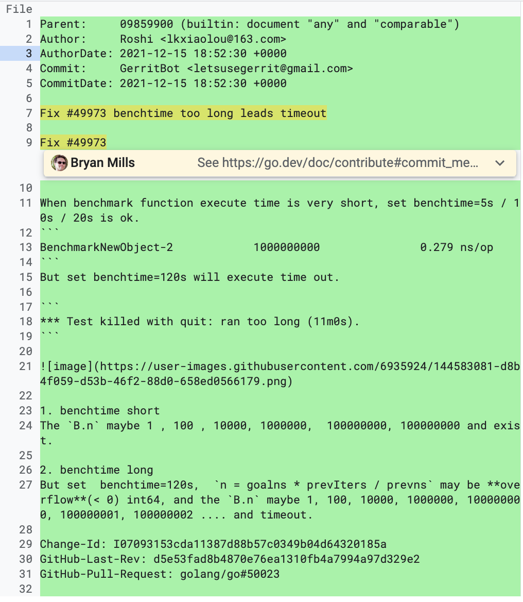

hello大家好，我是小楼。

不知道大家还记不记得我上次找到了一个Go的Benchmark执行会超时的Bug？就是这篇文章[《我好像发现了一个Go的Bug？》](https://mp.weixin.qq.com/s/G4WXEk0oVcHqNMwICYcc5Q)。

之后我就向Go提交了一个PR进行修复，本想等着代码被Merge进去，以后也可以吹牛说自己是个Go的Contributor，但事情并不顺利，今天就来分享一下这次失败的代码提交。

## 第一次提交

在我意识到Bug时，就迫不及待想去修复，于是有了这一次提交。

在说代码前，先说点关于Go仓库的问题，Go并没有直接托管在github，而是自建的Gerrit Code Review，github上只是个镜像仓库，所有在github上提交的issue和代码都会被一个机器人搬运到Gerrit上。

而且Go对提交代码的要求是必须关联一个issue，于是我就提了一个，自问自答了属于是。


描述了一下遇到的问题，但隔天被一位大佬认为是重复问题，并且关闭了这个issue


但我点进去仔细看了下，和我说的应该没有关系，他们讨论的是单测超时不生效的问题，于是我狡辩了一下。


果然狡辩是有用的，另一位大佬同意我的观点，于是我给他点了个赞，但他也指出我的代码存在问题。

下面进入今天的正题，为了便于讲解，我先把有问题的代码段摘出来：

```go
func (b *B) launch() {
   ...
    // n（int64）可能会溢出
   n = goalns * prevIters / prevns
   ...
}
```
既然知道n会溢出，还不简单？加个判断就完了。


### 溢出考虑不全

这位大佬说我的代码在防止int64溢出时不够安全，难道溢出不是这样判断吗？


不过还好，大佬给了一点点指导


同时也发来一段演示代码


果然 「show me the code」 最好使，简单点来说就是正数溢出成了负数，再溢出就又是正数，只要溢出足够多，结果可正可负。

### 得有测试

大佬还指出了另一个问题，兄弟，你写的代码得有有测试啊！


虽然我给开源项目提交代码不多，但也知道这点，为什么这次没写呢？主要是我觉得单测不太好写，既然大佬提出来，硬着头皮也得写了。

## 第二次提交

第二次提交，改掉了之前判断int64溢出的方法，用逆运算还原回去和原值做对比来看是否溢出，这个方法上次用到还是在大学的C语言课程中


还附加了一个单元测试


这个单元测试稍微解释下：

设置了150s的单测时间，每次试探单测时，次数都加1，如果试探次数超过6次，就说明有问题，终止单测。


这段代码在上述溢出判断加之前执行，一定是失败的，溢出判断加了之后，则可正常执行。

接下来就是等待回复，等了很久很久，Go的研发周期是以半年记，等得我都差点忘了这件事了，直到一天邮件提醒我。

前方高能，来看看另一位大佬是如何review我的代码的。

### commit message不规范

首先，commit message不规范，我的commit message是这样的，我是在github上提交的，被机器人搬运过去。



给出的意见是


原来Go的commit message是有一个文档专门介绍的，之前没注意到，点进去看了下


翻译下就是commit message的第一行应该是简短的摘要，并且要指出影响了哪些包，第一行后得有一个空行。

commit message的主要内容应该详细说明变更的上下文，并解释其作用，语句完整、标点正确，不要使用HTML、Markdown等标记语言。相关的信息，如基准测试数据等也需要写进来。

最后需要有关联的issue，如果是修复某问题，需要用`Fixes #12345`来关联12345号问题，如果只是解决部分问题，使用`Updates #12345`，如果修复的是golang.org/x/库，使用`Fixes golang/go#159`。

一个好的例子如下：

> math: improve Sin, Cos and Tan precision for very large arguments
>
> The existing implementation has poor numerical properties for
> large arguments, so use the McGillicutty algorithm to improve
> accuracy above 1e10.
>
> The algorithm is described at https://wikipedia.org/wiki/McGillicutty_Algorithm
> Fixes #159

看来我得好好改下commit message。

### 可以考虑集成测试

单测提了不少问题，首先是这个


我把Benchmark的单测包名改了，改这个是为了能调用包内未导出的方法，确实不太好，但当时没想到别的方案。

接着是不应该直接调用未暴露的`cleanups`和内部的一些变量，和上面呼应。


可以用`flag.Lookup`来set flag，这点没用过，所以不知道。

或者可以考虑使用集成测试来代替单元测试，Go的集成测试在`cmd/go/testdata/script`，这个之前也没接触过，所以也不知道，这个集成测试具体怎么用可以看`cmd/go/testdata/script/README`

这点可以看出我真是个Go新手，需要多看多学，测试不光只有单测，Go还支持集成测试。

### 缺少注释

再接着看


这里模拟150s的单测，大佬就提问了，这个单测真的会跑150s吗？如果是的话，那也太长了！

如果不是，也没给我解释清楚啊~

还有这个


你咋知道执行次数一定小于6呢？Go可没保证这个。

对于这两点的疑问，核心问题在于没写注释，别人不知道你的想法呀，如果开源的代码里面充斥着这种看不懂的玩意，那不是要命。

首先对于第一个，模拟150s，实际上不会真的跑那么久，因为后面有试探次数的限制，如果超过6次，就终止了，这个6次是怎么得到的呢？答案其实在《我好像发现了一个Go的Bug》中。

Benchmark在一个方法上跑的最多的次数是1e9次，也就是1000000000次，如果待测试方法执行时间非常短，且在Benchmark时间比较长的情况下，计算需要执行多少次一定会溢出，所以试探的执行次数会是这个增长序列：

100、10000、1000000、100000000、100000001、100000002......

实际可能>4就完事了，可能是我之前测试的有问题，emm...

### 溢出需要重新考虑


别判断n是否溢出，如果判断上一层，即goalns是否大于等于 `int64最大值 * prevIters`是否更合理呢？

> `n = goalns * prevIters / prevns`，goalns 是设置的执行时间（单位纳秒）

看来是我格局小了，别急，还有


怎么知道`100 * last`是不是也溢出了呢？所以我们是不是全程的计算都用float64更合理呢？

测试了下，float64范围大的离谱，感兴趣可以试试，就不贴数据了，太长！
## 最后说一句

虽然这次提交比较失败，但还是有点收获，等我忙完这阵，抽空出来再改改，说不定就被Merge了，大家祝我好运吧，今天的分享到这，我们下期再见！对了，文中的issue参考

- https://github.com/golang/go/pull/50023